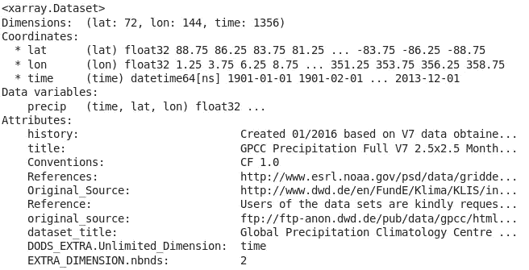
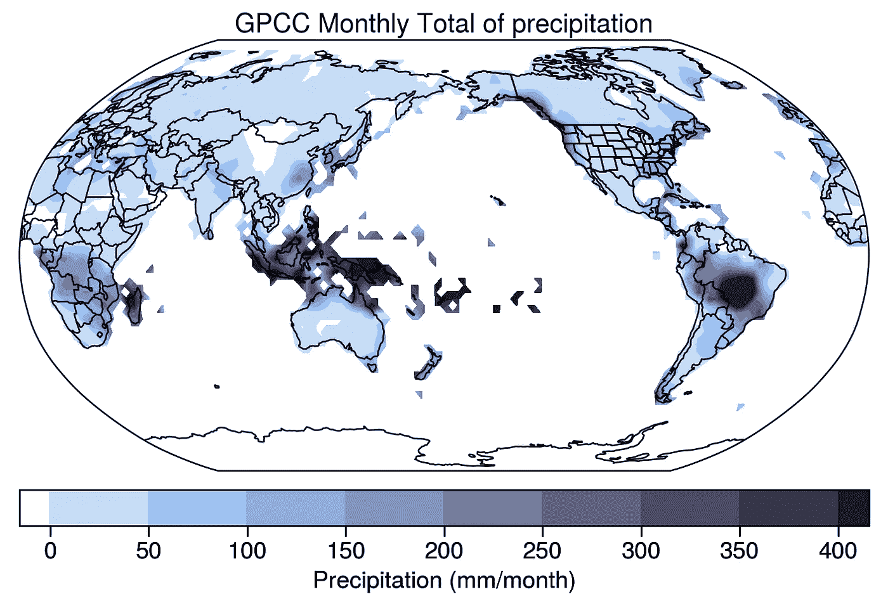
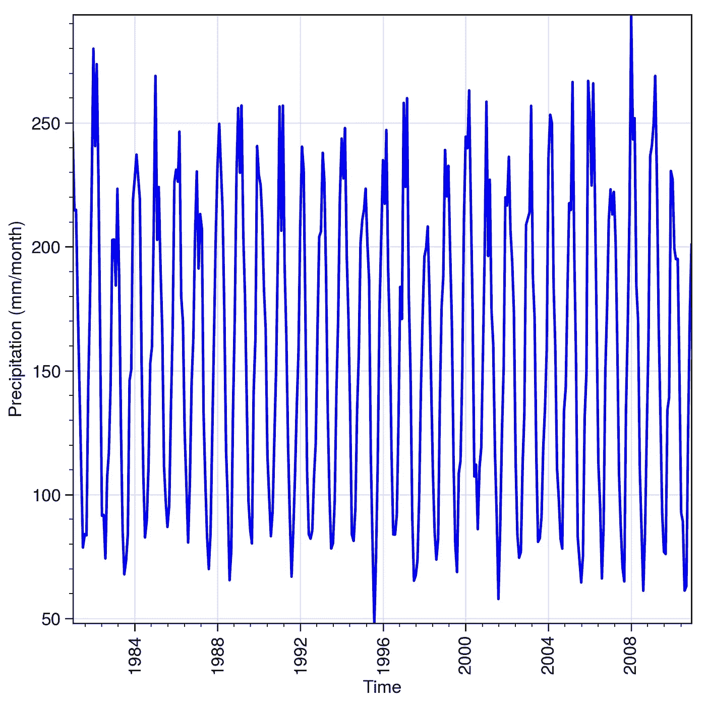
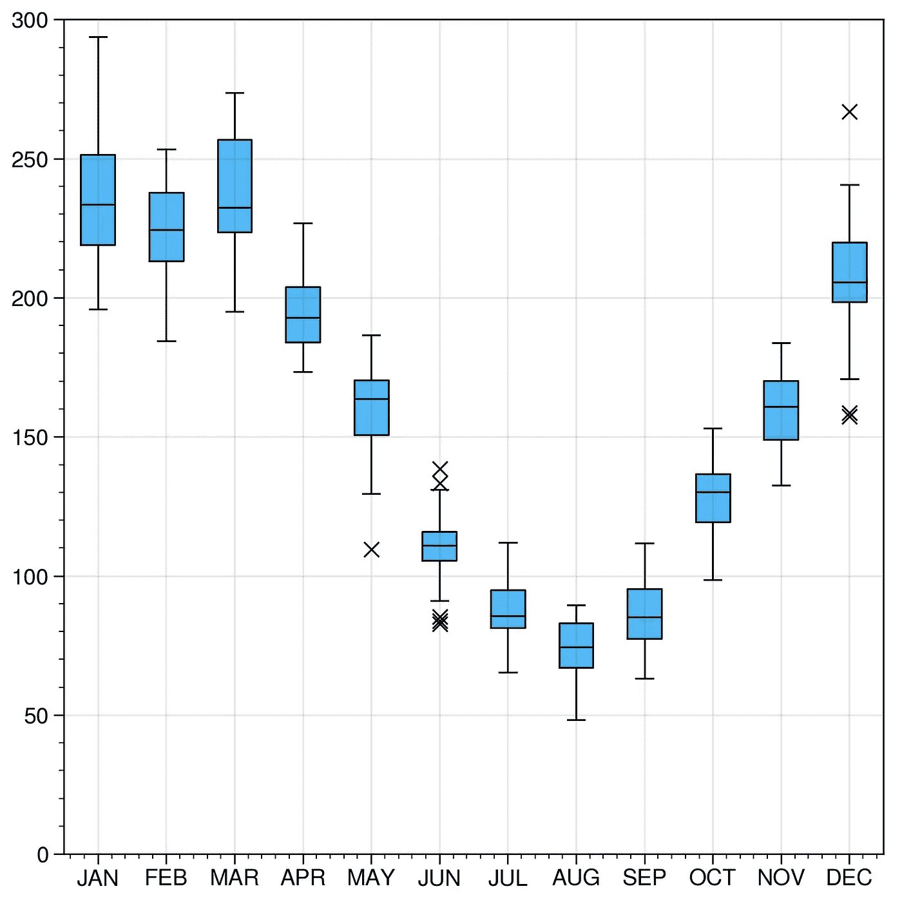

# 气候是你所期待的

> 原文：<https://towardsdatascience.com/climate-is-what-you-expect-20c57da1ac24?source=collection_archive---------32----------------------->

## 气候数据科学

## 研究气候系统的规律

气候系统是其组成部分——大气圈、生物圈、冰冻圈、水圈和岩石圈——之间复杂相互作用的产物，由相当多的强迫机制驱动，如太阳辐射和温室气体浓度。尽管混沌是这个系统的固有特征，但在气候变量的行为中有几个规律和组织层次。


亚马逊的典型景观。 [Rodrigo Kugnharski](https://unsplash.com/@kugnharski?utm_source=unsplash&utm_medium=referral&utm_content=creditCopyText) 在 [Unsplash](https://unsplash.com/?utm_source=unsplash&utm_medium=referral&utm_content=creditCopyText) 上的照片

以一年中的季节为例。如果你住在北半球，你肯定会希望看到冬天下雪，夏天阳光明媚。在热带地区，气温波动不那么剧烈，夏季多雨寒冷，冬季干燥炎热。所有这些都可以用马克·吐温说过的一句话来概括:

> 气候是你所期待的，天气是你所得到的。

一个简单的短语，但足以让你深刻理解气候系统中的事情是如何运作的。你认为亚马逊雨林中部会有大雪吗？在这个世界上没有。描述气候的一种分析方法是表达其变量的[平均条件，如降雨量和温度，至少在 30 年内。这些是著名的**气候平均值，**，它们告诉你许多关于你应该期待的气候的重要事情。](https://library.wmo.int/doc_num.php?explnum_id=4166)

# 一年三月的降水

本教程着重于你可以采取的步骤，做你自己的任何感兴趣的特定地区的气候正常。为此，您将使用来自**全球降水气候学中心** (GPCC)的[网格降水数据集](https://www.esrl.noaa.gov/psd/data/gridded/data.gpcc.html)，该数据集由气候学研究中非常常见的全球数据集组成，因为其质量高且时间跨度长，从 1901 年 1 月到 2013 年 12 月。

首先，像往常一样，您需要导入包:

```
import xarray as xr 
import proplot as plot 
import matplotlib.pyplot as pltfrom esmtools.stats import*
```

你已经知道`Matplotlib`是每一个 Python 程序员的可视化软件包的黄金标准，自从[*cmip 6*](/a-quick-introduction-to-cmip6-e017127a49d3)*快速介绍以来，你已经接触了用于 n 维网格数据的`Xarray`和数据可视化的下一件大事`Proplot`。新成员是`Esmtools`，这是一个[软件包，主要用于复杂气候模型](https://esmtools.readthedocs.io/en/latest/)的统计分析。最简单的安装方法是使用`Pip`:*

```
*pip install esmtools*
```

*`Xarray`的许多优秀功能之一是可以直接加载大量数据集，而无需通过 [**OPeNDAP**](https://www.opendap.org/) 下载。由于 NOAA/PSD 目录中的所有数据都可以通过 OpenDAP 访问，因此您可以轻松获得本教程的 GPCC 产品。*

```
*# OPEenDAP url
url = 'http://www.esrl.noaa.gov/psd/thredds/dodsC/Datasets/gpcc/full_v7/precip.mon.total.2.5x2.5.v7.nc'
# load dataset
dset = xr.open_dataset(url)
>>> dset*
```

**

*GPCC 月降水网格数据集元数据。*

*这种降水在地图上看起来怎么样？*

```
*fig, ax = plot.subplots(axwidth=4.5, tight=True,
                        proj='robin', proj_kw={'lon_0': 180},)
# format options
ax.format(land=False, coast=True, innerborders=True, borders=True,
          labels=True, geogridlinewidth=0,)map1 = ax.contourf(dset['lon'], dset['lat'],
                   dset['precip'][0, :, :],
                   cmap='Dusk',
                   levels=plot.arange(0, 400, 50),
                   extend='both')ax.colorbar(map1, loc='b', shrink=0.5, extendrect=True)plt.show()*
```

**

*GPCC 数据集的第一个全球降水场。*

# *设置感兴趣的区域(和时间)*

*在本教程中，您将调查亚马逊流域的年降雨量。这一循环受南美季风系统(SAMS)的起伏影响，表现为两个截然不同的雨季和旱季。为了关注这个特定的区域，`Xarray`允许使用灵活的`.sel()`方法。你可以在盆地周围设置一个方框区域，选择 1981 年到 2010 年这一特定时期的纬度和经度，根据世界气象组织(WMO)的说法，这是最近的气候时期。*

```
*amazon_area = dset.sel(lat=slice(5, -22), lon=slice(285, 315),
                       time=slice('1981-01-01', '2010-12-01'))*
```

*对于您在路上找到的每一个数据集，您必须格外小心地知道维度在其中是如何描述的。例如，如果 GPCC 数据集将经度维度命名为`longitude`而不是`lon`，那么您必须将维度命名为`sel`而不是`lon`。所有这些小细节都与您的代码密切相关，所以如果您不熟悉特定的数据集，请务必检查元数据。*

*气候学研究中的一个常见做法是创建一个*指数*，这是一个时间序列，用于描述特定地区特定现象或变量的行为。由于您已经选择了亚马逊盆地周围的区域，`Esmtools`允许您通过对规则网格进行余弦加权，以最严格的方式从网格数据中创建一个索引。抛开气候学的措辞，用以下公式计算降水指数:*

```
*amazon_index = cos_weight(amazon_area['precip'])
>>> amazon_index.dims
('time',)*
```

*亚马逊的年降雨周期是怎样的？*

```
*fig, ax = plot.subplots(figsize=(5, 5), tight=True)
ax.plot(amazon_index['time'], amazon_index, color='Blue')# format options
ax.format(xlabel='Time', ylabel='Precipitation (mm/month)')plt.show()*
```

**

*亚马逊地区降水周期的起伏。*

*虽然这很好地反映了年周期应该是什么样子，但它没有反映亚马逊地区降雨行为的一些重要细节。改善它的一个好方法是做一个简单的月图或者更精细的东西，比如箱线图。好消息是,`Proplot`环绕着`Matplotlib`,让你可以很容易地做出一个箱线图:*

```
*# numpy trick: transform from a row vector to a matrix
amazon_index = np.reshape(np.array(amazon_index), (30, 12),
                          order='C')fig, ax = plot.subplots(figsize=(5, 5), tight=True, sharex=False)
# format options
ax.format(ylim=(0, 300))ax[0].boxplot(amazon_index, marker='x', fillcolor='azure',
              labels= months)plt.show()*
```

**

*一年一度的三月降雨，清晰可见。*

*箱线图可以让你看到亚马逊盆地降雨的真实情况。从 1 月到 5 月中旬，整个盆地有一个大范围的雨季，主要受 SAMS 活跃期和热带辐合带(ITCZ)向南迁移的驱动。然而，令大多数人惊讶的是，雨林经历了正常的降雨缺乏期，因为它有非常明显的旱季，从六月到九月中旬。在这个明显的旱季，火灾季节也开始了，随着时间的推移，农业边界向亚马逊河推进了一点。*

# *最后的话*

*在大多数情况下，任何感兴趣的气候变量的年周期都是更详细和更深入研究的第一步。然而，这个有点简单的行为已经足以让你很好地了解温度、降水和其他因素的自然行为。在不断变化的气候中，了解特定地区甚至全球的气候如何波动变得格外重要。*

*一件好事是大量可靠的数据集可供快速下载，而且`Xarray`甚至允许基于云的访问。其他优秀的软件包，如`Proplot`和新的`Esmtools`，促进了这些通常复杂的网格数据集的可视化和统计分析。通常，本教程的 Jupyter 笔记本可以在我的 [**气候数据科学**](https://github.com/willyhagi/climate-data-science) 资源库中免费获得。*