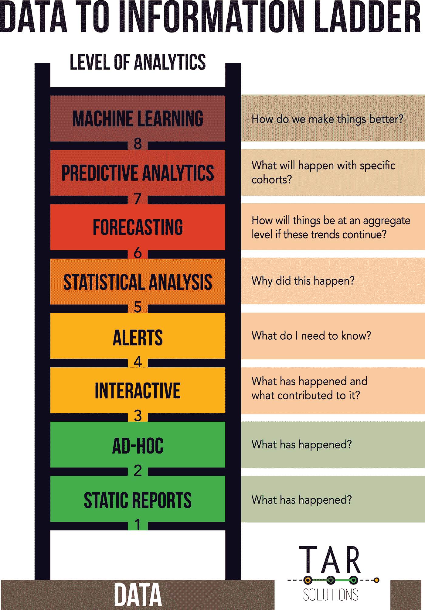

# 攀登信息阶梯

> 原文：<https://towardsdatascience.com/climb-the-information-ladder-960da82f62b9?source=collection_archive---------39----------------------->

## 将您的数据转化为有用的信息

# 如何将数据转化为信息

许多组织拥有大量数据，却不知道如何处理这些数据。数据科学(泛指商业智能、数据可视化、机器学习等)是一个相对较新的行业，旨在找出如何从这些数据中提取价值。

这篇文章展示了从众多数据源中提取越来越多信息的渐进学习过程。

将这些数据转换成有用的信息是一个旅程。

信息阶梯显示了这个旅程，从简单开始，一直到复杂的机器学习。

# 数据和信息的区别

在工作场所，我经常听到“数据”和“信息”这两个词被错误地使用。这是两件截然不同的事情，经常会被混淆为同一件事情。

在一个许多组织都在努力变得更加数据驱动的世界里，理解其中的区别很重要。

数据是用来产生信息的原材料。

信息是数据的产物；没有数据，就不会有信息。

数据有多种形式和大小。有些数据经常变化，有些是静态的。

频繁变化的数据包括网站数据；有些网站每秒钟有很多点击量。货币汇率是另一个很好的例子，它们整天都在波动。

静态数据包括一个国家的首都或债券的期限。

数据示例包括:

*   单击网站上的数据
*   你的电子邮件的书面内容
*   一本书的静态属性
*   带有国家代码的国家列表
*   事件参与者的姓名
*   电子邮件收件人是否参与了电子邮件
*   投资账户的持有量
*   固定收益产品的静态属性

互联网的爆炸式增长导致了数据的大幅增长。我甚至不会试图量化有多少数据，([别人有](https://blog.microfocus.com/how-much-data-is-created-on-the-internet-each-day/))，但网上发生的一切都是另一个数据点。每封电子邮件、网络点击、点赞、视频浏览、推文等都存储在某个地方。

从数据中获取价值是一项重大挑战。组织成为数据驱动型组织需要时间。理解数据需要时间，解决如何处理数据也需要时间。

因此，当开始让一个组织更加数据驱动的旅程时，管理期望可能会很困难。

[信息阶梯](https://tarsolutions.co.uk/blog/data-to-information-ladder/)由[焦油解决](https://tarsolutions.co.uk/)

# 信息阶梯代表了数据到有用信息的转换。

攀登信息阶梯是一个旅程。

在每一个阶段学到的经验教训能够帮助你进入下一个阶段。

每一级都导致对数据更深入的理解。在阶梯的底部，数据工作通常更简单。向上移动通常会导致更高级的数据工作和更大量的数据源。在高层，数据工作变得更加复杂。

# 从数据到信息的阶梯是什么？

## 静态报告

图片来自[焦油溶液](https://tarsolutions.co.uk/)

这些通常是任何商业信息的起点。通常是表格形式的报告，经常有人获取数据，将其放入 Excel/Powerpoint 中并四处发送。通常，这将是一个或两个数据源的组合，保持在基本 Excel 的限制范围内。有时，数据分布在大的 Excel 文件中，查找信息可能需要接收者做一些工作，要么扫描整个表，要么构建数据透视表，等等。

## 临时报告

图片来自[焦油解决方案](https://tarsolutions.co.uk/)

如上所述，只是这一次用户可以拖放有限的数据源来自己查找信息。或者，他们可能要求他们的“数据团队”在特定的基础上提供信息。这个一般是 Excel 的形式。可用的数据往往是有限的。这也很容易出错，因为并非所有用户都知道要应用的正确过滤器/数据的特点/等等，以便有效地使用。对用户来说，积极的一面是，只要数据可用，就能很快得到答案。

## 交互式仪表盘

图片来自[焦油解决方案](https://tarsolutions.co.uk/)

一个设计良好的仪表板应该能够回答许多业务问题。仪表板应该为用户提供回答他们最初的标准问题的方法(例如，销售和预算如何？)并回答后续问题(例如，哪些产品最畅销？哪些销售人员表现好/差？).通常，这些都是自动化的和基于网络的，把信息放在那些需要它的人的指尖。

仪表板应该回答成熟的商业智能环境中的大多数标准业务问题。

## 警报

图片来自[焦油溶液](https://tarsolutions.co.uk/)

如果有什么事情需要用户注意，用户会在这里得到主动通知。业务规则驱动警报。有些警报需要多个数据源，有些警报只需要一个数据源。它通知某人他们需要了解一些信息，并可能采取一些行动。示例包括:

*   CRM 系统中的一些可疑数据需要清理
*   交易者违反了交易限额；交易者和他们的管理层需要知道
*   基金投资组合中的一个项目变动超过了正常水平，基金/投资组合经理应该知道

## 统计分析

图片来自[焦油溶液](https://tarsolutions.co.uk/)

这就是数据复杂性开始增加的地方。为了使统计分析有意义，基础数据必须是好的。阶梯的前几级应该确保数据的高质量。如果人们正在使用来自以前的梯级的信息，任何现有的数据问题应该已经被纠正。

这是数据被用来尝试和更好地理解一些东西的地方。例如，在订阅业务中，哪些因素会导致订阅续订？对于 PPI 索赔，贷款的哪些特征会导致赔偿？在资产管理领域，是什么导致了资金外流？

## 预测

图片来自[焦油解决方案](https://tarsolutions.co.uk/)

根据我们在统计分析中了解到的情况，什么是可能的**总**结果？例如，我们认为订阅续订率会是多少？有多少 PPI 索赔需要人工调查？在接下来的 12 个月里，AUM 可能会损失多少？

## 预测分析

图片来自[焦油溶液](https://tarsolutions.co.uk/)

这就是我们试图在个人层面上预测未来会发生什么的地方。

预测分析在金融服务领域已经广泛使用了很长时间。例如:

*   您的信用评分用于计算贷款违约风险，然后用于决定 a)是否提供贷款和 b)提供贷款的价格(利率)
*   汽车保险——你过去的索赔历史、年龄、汽车类型等。分担你的保险费用；他们根据同类人群的事故历史分析事故发生的概率，然后根据索赔的可能性给你的保险定价
*   人寿保险——在为您的人寿保险定价之前，会收集有关您的年龄、健康和生活方式的数据；利用过去的数据，保险公司正在计算你在投保时死亡的概率。因此，一个 50 多岁的超重吸烟者将比一个 20 多岁的健康运动者付出更多

## 机器学习

图片来自[焦油溶液](https://tarsolutions.co.uk/)

这很容易成为一个单独的话题。机器学习是人工智能的一个子集，[这篇文章很好地解释了](https://medium.com/towards-artificial-intelligence/differences-between-ai-and-machine-learning-and-why-it-matters-1255b182fc6)。它应该有助于更好地理解客户，从而使他们的体验更适合他们的需求。它可以进一步细分为:

*   情景建模——在假设情景下的预测
*   决策支持—扩展场景建模，目标是优化决策
*   机器人和推荐系统——使用机器学习来影响客户行为。一些领先的组织在这方面表现出色，比如亚马逊的推荐引擎。例如，这个顾客/客户想要什么？基于相似客户的行为，我们能影响决策过程吗？我们能赢得更多业务/维持他们的业务吗？

# 信息阶梯的现实

在现实世界中，梯级之间可能存在明显的交叉。此外，没有必要踩在梯子的每个梯级上。例如，许多数据项目从梯级 3“交互式”开始。梯级 4，“警报”，通常是“互动”的副产品。

同样，“预测分析”和“机器学习”也可以非常相似。

然而，真实的情况是，随着一个人在阶梯上的进步，对数据的理解和数据源的数量确实增加了。

不爬下面的梯级，从梯子的顶端开始根本不可能。

# 攀登信息阶梯

数据到信息项目通常从简单的数据集开始。所有的组织都是不同的，有些是数据驱动的，有些则不然。

然而，一旦这些项目开始获得牵引力，并开始证明其价值，它们可以导致重大的文化变革。

对数据的兴趣往往会在各种规模的组织中迅速蔓延。

扩展到更多数据并以不同方式使用现有数据是一个自然的过程。

仅仅回答一个问题很可能会引出更多的问题。

例如:

*   哪些交易者最赚钱？
*   他们和谁交易？
*   他们在交易哪些产品？
*   是否有外部事件导致这些交易——例如，通货膨胀率上升？
*   我们能够预测哪些事件会增加某些产品的活动吗？
*   哪些客户会从这些产品中受益？
*   等等

一旦一个组织转向更加数据驱动的道路，业务问题就会变得没完没了。