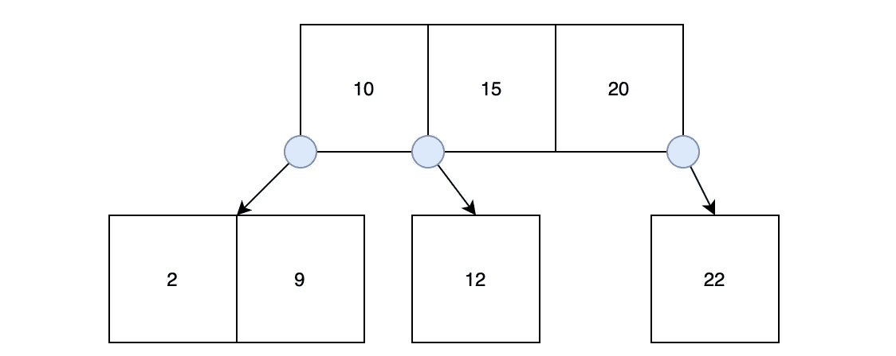
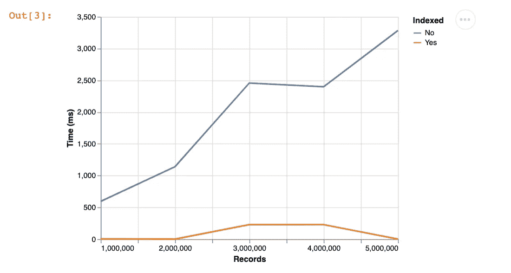
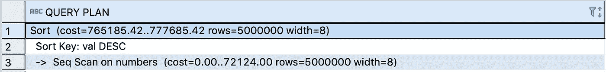
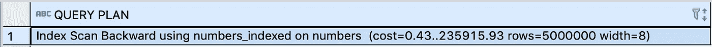
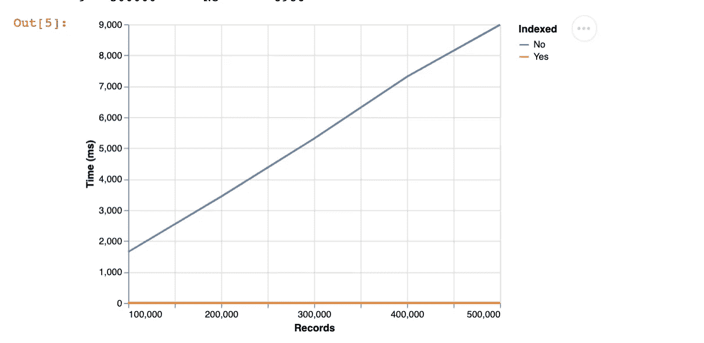
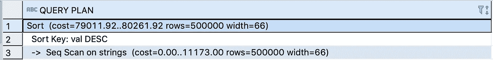
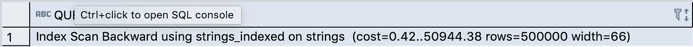
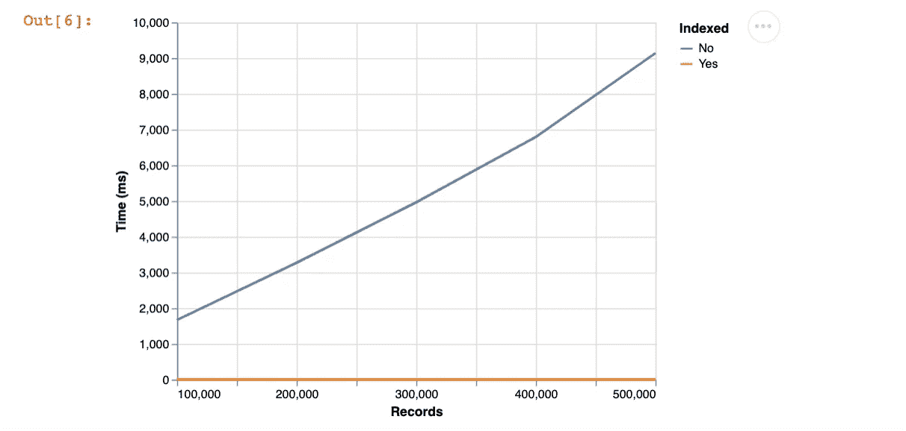
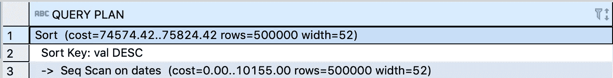
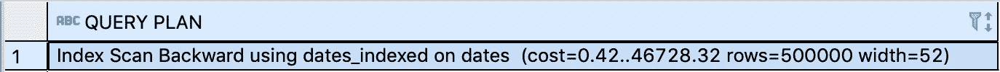

# 在 Postgres 中攀爬 B 树索引

> 原文：<https://towardsdatascience.com/climbing-b-tree-indexes-in-postgres-b67a7e596db?source=collection_archive---------27----------------------->

## 理解并应用 Postgres 中的定位索引进行排序和匹配



您的查询很慢，所以您决定通过添加索引来加快速度。它是什么类型的指数？可能是 B 树。

Postgres 有几种索引类型，但是 B 树是最常见的。它们有利于分类和匹配；一旦你理解了它们在引擎盖下的样子，原因就显而易见了。

我们将深入探究 Postgres 中 B 树实现的内部机制，然后做一些 SQL 示例来展示它们的效果。我已经提供了查询，所以你可以自己运行相同的实验。

这篇文章假设你已经对索引是什么和做什么有了一个大致的概念。如果不是，通常提供的抽象是教科书中的术语表。你可以在词汇表中按字母顺序查找，然后跳到它所在的页面，而不是阅读书中的每一行来找到一个单词/主题。我们很快就会看到现实稍微复杂一些。

# 什么是 B 树？

b 树代表平衡树。

它不是一个[二叉树](https://en.wikipedia.org/wiki/Binary_tree)，它允许每个父节点最多 2 个子节点，并且是为内存搜索而设计的。

来自[维基百科](https://en.wikipedia.org/wiki/B-tree)，

> 在[计算机科学](https://en.wikipedia.org/wiki/Computer_science)中， **B 树**是一种自平衡[树数据结构](https://en.wikipedia.org/wiki/Tree_data_structure)，它维护分类数据并允许在[对数时间](https://en.wikipedia.org/wiki/Logarithmic_time)内进行搜索、顺序访问、插入和删除。B 树概括了[二叉查找树](https://en.wikipedia.org/wiki/Binary_search_tree)，允许节点有两个以上的子节点。[【2】](https://en.wikipedia.org/wiki/B-tree#cite_note-Comer-2)与其他[自平衡二分搜索法树](https://en.wikipedia.org/wiki/Self-balancing_binary_search_tree)不同，B 树非常适合读写相对较大数据块的存储系统，比如磁盘。常用于[数据库](https://en.wikipedia.org/wiki/Database)和[文件系统](https://en.wikipedia.org/wiki/File_system)。

这是一个非常好的非技术性介绍。要获得真正的技术解释，请参见由 Lehman 和 Yao 撰写的论文，Postgres 的实现就是基于该论文。

## B 树的结构

b 树是“平衡的”，因为从根到任何叶节点的距离都是相同的。叶节点是没有子节点的节点。根节点是位于顶部的节点。

一个节点有键。在我们下面的根节点中，[10，15，20]是键。键映射到数据库中的值，但也映射到子节点中的绑定键。


第一个子节点[2，9]的值小于 10，因此指针位于 10 的左侧。

第二个子节点[12]的值介于 10 和 15 之间，因此指针从那里开始。

第三个子节点[22]大于 20，因此指针位于 20 的右侧。

现在，如果我们想查找键 12，我们将 12 与根节点中的值进行比较，看到它在 10 和 15 之间。所以我们使用 10 和 15 之间的指针来查找包含 12 的节点。

这是对 Postgres 实现的抽象，但是你可以想象为什么这比遍历表中的每个数字并检查它是否等于 12 要快。

这就是为什么 B 树可以在 O(logN)时间内进行搜索、插入和删除。

*B 树每个节点也有最小和最大数量的键。在插入和删除时连接和拆分节点，以保持节点在范围内。*

# 数字、文本和日期的 b 树

我们将通过三个例子来研究 B 树的巨大影响力:数字、文本和日期。

## 设置

为每种数据类型创建一个表。每个表有两列，但我们只索引其中一列。

```
create table numbers(
  val integer,
  val_indexed integer
);
CREATE INDEX numbers_indexed ON numbers using btree (val_indexed); create table strings(
  val varchar,
  val_indexed varchar
);
CREATE INDEX strings_indexed ON strings using btree (val_indexed); create table dates(
  val varchar,
  val_indexed varchar
);
CREATE INDEX dates_indexed ON dates using btree (val_indexed);
```

## 数字

我们来生成 1 到~1M 之间的 1M 个随机整数。

```
**insert** **into** numbers
**select** (**random**()*1000000 +1)::**int**,
  (**random**()*1000000 +1)::**int
from** (**SELECT** * **FROM** **generate_series**(1,1000000)) ser;
```

我们将重复运行下面的查询，记录查询时间，然后再添加额外的 100 万条记录。

```
**select** * **from** numbers **order** **by** val **desc**;
**select** * **from** numbers **order** **by** val_indexed **desc**;
```

我们看到的是，在对索引列和非索引列进行排序时，查询时间存在巨大差异。



500 万条记录对于 Postgres 来说微不足道，但我们已经可以看到效率上的巨大差异。

为什么不同？让我们使用 Postgres 中的`explain`函数来深入研究一下。

```
explain select * from numbers order by val desc;
explain select * from numbers order by val_indexed desc;
```



无索引的



编入索引的

我们看到非索引搜索使用顺序扫描，而索引搜索使用索引扫描。给定上面讨论的 B 树结构，很容易理解为什么搜索索引会比搜索表快得多。

## 文本

让我们用字符串做同样的比较。不过这次我们将一次增加 100k 行。

```
**insert** **into** strings
**SELECT
  md5**(**random**()::**text**),
  **md5**(**random**()::**text**)
**from** (
  **SELECT** * **FROM** **generate_series**(1,100000) **AS** id
) **AS** ser;
```

现在对这些行进行排序。

```
**select** * **from** strings **order** **by** val **desc**;
**select** * **from** strings **order** **by** val_indexed **desc**;
```

我们看到了什么？与索引搜索击败非索引搜索的模式完全相同。



偷看`explain`，我们看到的是同样的原因。

```
explain select * from strings order by val desc;
explain select * from strings order by val_indexed desc;
```



## 日期

让我们用日期再做一次。同样，我们一次只生成 100k 行。

```
with cte as (
select 
  timestamp '1900-01-10 20:00:00' +
  random() * (
    timestamp '2000-01-20 20:00:00'-timestamp '1900-01-10 10:00:00'
  ) rdate
  from (SELECT * FROM generate_series(1,100000) AS id) ser
)
insert into dates
select 
  rdate,
  rdate
from cte;
```

查询日期并记录查询时间。

```
select * from dates order by val desc;
select * from dates order by val_indexed desc;
```

比较一下区别。



我们已经可以猜到`explain`将会展示什么，但还是让我们来看看吧。

```
explain select * from dates order by val desc;
explain select * from dates order by val_indexed desc;
```



同样，通过索引扫描对行进行排序比顺序扫描快几个数量级。

# 结论

我的目的是让您对索引的结构有一个大致的了解，这样您就可以直观地理解为什么它们会缩短查询时间。

然后我们讨论了一些例子，在这些例子中，添加一个索引会产生昼夜差异。

我们只讨论了对行进行排序，但是调查查询时间并查看其他类型的查询(如`where`或`exists`)会很有趣。