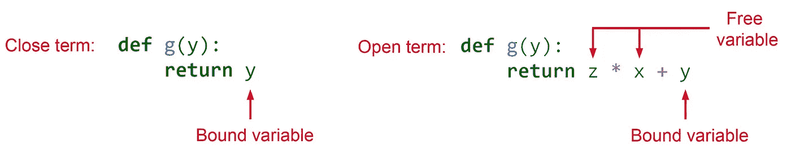

# Python 中的闭包和装饰器

> 原文：<https://towardsdatascience.com/closures-and-decorators-in-python-2551abbc6eb6?source=collection_archive---------1----------------------->

## 你将最终理解什么是闭包和装饰器


闭包是函数式编程中的一个重要工具，一些重要的概念如*curring*和 *partial application* 可以使用它们来实现。装饰器也是 Python 中一个强大的工具，它使用闭包来实现，允许程序员修改函数的行为，而不用永久地修改它。在本文中，我将首先解释闭包和它们的一些应用程序，然后介绍装饰器。

**变量范围**

为了更好地理解闭包，我们首先需要了解 Python 中变量的作用域。变量的*作用域*是指可以看到或访问变量的区域。变量不能在其作用域之外被访问。变量的范围由它在源代码中的赋值位置决定。通常，变量可以在三个不同的地方赋值，对应三个不同的作用域:

*全局作用域*:当一个变量在所有函数之外被定义时。文件中的所有函数都可以访问全局变量。

*局部作用域*:当一个变量被定义在一个函数内部时，它是这个函数的局部变量。局部变量只能在定义它的函数内部访问。

*非局部作用域*:当一个变量在封闭函数中赋值时，它对其嵌套函数来说是非局部的。定义非局部变量的函数及其所有嵌套函数都可以访问非局部变量。

如果你在一个函数内部重新分配一个全局变量，一个新的同名局部变量将被创建，这个全局变量被称为被这个局部变量*遮蔽*。在函数内部对这个局部变量的任何改变都不会影响全局变量。所以如果你想在函数中改变一个全局值，你必须在 Python 中使用`global`关键字。

例如在清单 1 中，最初，我们定义了两个全局变量`x`和`y`。当我们在函数`f()`内部重新赋值`x`时，定义了一个新的同名局部变量，它并不影响全局变量`x`。然而，通过使用`global`关键字，我们可以访问`f()`中的全局变量`y`。`z`是`f()`的局部变量，不能在外部访问。退出`f()`后，该变量不在内存中，因此不能再访问。

```
# Listing 1x = 1 # x is a global variable  
y = 5 # y is a global variable 
def f():
    global y 
    x = 2   # x is a local variable
    y += 1  # Reassigning the global variable y
    z = 10   # z is a local variable
    print("Local variable x =", x)
    print("Global variable y =", y)
    print("Local variable z =", z)
f()
print("Global variable  x =", x)
print("Global variable y =", y)
```

输出:

```
Local variable x = 2
Global variable y = 6
Local variable z = 10
Global variable  x = 1
Global variable y = 6
```

在 Python 中，一切都是对象，变量是对这些对象的引用。当你将一个变量传递给一个函数时，Python 会将一个引用的副本传递给该变量所引用的对象。它不发送对象或对函数的原始引用。因此，函数作为参数接收的原始引用和复制引用都引用同一个对象。现在，如果我们传递一个不可变的全局对象(比如一个整数或一个字符串)，函数就不能使用它的参数来修改它。然而，如果对象是可变的(比如一个列表)，函数可以修改它。这里有一个例子:

```
Listing 2a = [1, 2, 3]
b = 5
def func(x, y):
    x.append(4)
    y = y + 1func(a, b)
print("a=", a)  #  Output is a=[1, 2, 3, 4]
print("b=", b)  #  Output is b=5
```

我们将两个变量`a`和`b`传递给`func`。`a`是对可变对象列表的引用，而`b`是对不可变整数的引用。`func`接收作为`x`的`a`的副本和作为`y`的`b`的副本。向`x`添加新元素将改变`a`引用的原始对象。但是在`func`里面给`y`加 1 并不影响`b`所引用的对象。它只创建了一个包含 6 的新整数对象，现在`y`将引用它(图 1)。


图 1

**内部函数**

*内部函数*(或*嵌套函数*)是定义在另一个函数(外部函数)内部的函数。外部函数的局部变量对其内部函数来说是非局部的。内部函数可以访问非局部变量，但不能改变它们。重新分配它们只是在内部函数中创建一个同名的新局部变量，而不会影响非局部变量。所以如果你想在一个嵌套函数中改变一个非局部变量，你必须使用`nonlocal`关键字。

在本文中，我们可以简单地称外部函数的变量为非局部变量，但这意味着它相对于内部函数是非局部的。如果删除内部函数，它将只是外部函数的一个局部变量。此外，内部函数应该以某种方式访问这个变量或者声明它为`nonlocal`来调用它作为一个非局部变量。如果内部函数不接触外部函数的局部变量，它就不是内部函数的非局部变量。

在本文中，我们从不试图改变函数参数。因此，只要知道外部函数参数的行为类似于非局部变量，并且也可以被内部函数访问(或读取)就足够了。

在清单 3 中，函数参数`x`，变量`y`、`z`和`t`是`f()`的局部变量。

```
# Listing 3def f(x):
    y = 5
    z = 10
    t = 10
    def g():
        nonlocal y
        y += 1
        z = 20
        print("Nonlocal variable x =", x)
        print("Local variable z =", z) 
    print("Local variable t =", t)    
    g()
    print("Nonlocal variable x =", x)
    print("Nonlocal variable y =", y)
    print("Local variable z =", z)
f(5)
# This does not work:
# g()
```

输出:

```
Local variable t = 10
Nonlocal variable x = 5
Local variable z = 20 
Nonlocal variable x = 5
Nonlocal variable y = 6
Local variable z = 10
```

`x`，和`y`也是其内部函数`g()`的非局部变量。它们在`g()`内部被访问。当你重新赋值`z`时，在`g()`内部会创建一个新的同名局部变量，它不会影响`f()`中的局部变量`z`，所以`z`不是一个非局部变量(到`g`)。然而，通过使用关键字`nonlocal`你可以改变`y`，它仍然是一个非局部变量。变量`t`根本不被`g`访问，所以它不是一个非局部变量。

变量`y`和`z`属于`f()`的局部范围，不能在`f()`之外访问。内部函数`g()`也被定义在`f()`内部，只能在那里被调用。事实上，如果您试图运行清单 3 并在`f()`之外调用`g()`，Python 会给出一个错误。

但是如果我们能找到一种方法在`g()`之外调用它呢？那么我们会有第二个问题。退出外部函数后，其局部变量(不属于`g()`的局部变量)不再存在于内存中。在这种情况下，内部函数不能再访问它们。闭包使得在外部函数之外调用内部函数并访问其非局部变量成为可能。

**关闭**

首先，我们需要找到一种在外部函数之外调用内部函数的方法。记住函数总是可以返回值的。在清单 4 中，`x`和`y`是`f()`的局部变量:

```
# Listing 4def f():
    x = 5
    y = 10
    return x
h=f()
```

所以在运行`h=f()`之后，`f()`的所有局部变量都消失了，你再也不能访问`x`和`y`了。但是我们仍然有`x`的值，它被返回并存储在`h`中。所以也许我们可以让外层函数返回内层函数。这在 Python 中是可能的，因为 Python 函数是第一类。这意味着 Python 将函数视为值，因此您可以将函数赋给变量，将其作为函数参数传递或由另一个函数返回。在清单 5 中，外部函数`f(x)`返回其内部函数`g`。

```
# Listing 5def f(x):
    def g(y):
        return y
    return g
a = 5
b = 1
h=f(a)
h(b)  # Output is 1
```

现在`f(x)`返回函数`g`。所以当我们写`h=f(a)`时，我们将`g`赋给`h`，现在`h`可以像`g`一样被对待，并接受`g`的参数。结果`h(b)`就像调用`g(b)`。

函数的`__name__`属性存储定义函数的名称。如果我们写:

```
h.__name__ 
```

它回来了

```
'g'
```

也就是说`h`现在指的是函数`g`。

你应该注意到`f(x)`返回的是函数`g`而不是一个特定的值。比如说。如果我们写下如下内容:

```
# Listing 6def f(x):
    def g(y):
        return y
    return g(y)
a = 5
b = 1
h=f(a) 
# This does not work:
# h(b)
```

然后我们得到一个错误。原因是我们是由`f(x)`(也就是 1)返回`g(y)`的值，所以`h=1`，不能用它来调用函数。

我们不需要将`f(a)`存储在`h`中。而是可以直接调用`f(a)(b)`。

```
# Listing 7def f(x):
    def g(y):
        return y
    return g
a = 5
b = 1
f(a)(b)  # Output is 1
```

需要注意的是，要区分`f(a, b)`和`f(a)(b)`。函数`f(a, b)`有两个参数。然而，`f(a)(b)`是一系列嵌套函数，每个函数都有一个参数。只有一个参数的函数叫做一元函数。所以`f(a)(b)`是两个嵌套的一元函数的序列。如图 2 所示，Python 从左到右计算这些嵌套函数。所以首先对`f(a)`进行评估。为了能够链接这些函数，`f(a)`应该返回另一个函数。这里它返回内部函数`g`。所以`f(a)(b)=g(b)`


图 2

我们可以很容易地扩展这个方法，得到一个更长的一元函数序列。清单 8 展示了我们如何拥有三个嵌套的一元函数。第一个函数`f(x)`具有内部函数`g(y)`并且 `g(y)`具有内部函数`h(z)`。每个外部函数返回其内部函数。

```
# Listing 8def f(x):
    def g(y):
        def h(z):
            return z
        return h
    return g
a = 5
b = 2
c = 1
f(a)(b)(c)  # Output is 1
```

但是如果外层函数有一些非局部变量会怎么样呢？这里有一个例子:

```
# Listing 9def f(x):
    z = 2
    def g(y):
        return z*x + y
    return g
a = 5
b = 1
h = f(a)
h(b)  # Output is 11
```

如果我们运行它，我们可以看到它工作正常，并且`g(y)`可以访问变量`x`和`z`。但这怎么可能呢？运行`f(x)`后，我们不再在`f(x)`的范围内，变量`x`和`z`应该是不可访问的。为什么`g(y)`仍然可以访问它们？那是因为内部函数`g(y)`现在是一个*闭包*。

闭包是具有扩展范围的内部函数，它包含外部函数的非局部变量。所以它记住了封闭范围中的非局部变量，即使它们不在内存中。像`y`这样在内部函数`g(y)`局部范围内的变量称为*绑定变量*。只有有界变量的函数称为*闭项*。另一方面，像`z`这样的非局部变量被称为*自由变量*，因为它可以在`g(y)`之外自由定义，而包含自由变量的函数被称为*开项*。



图 3

“闭包”这个名字来源于这样一个事实，即它捕获其自由(非局部)变量的绑定，并且是*关闭*一个开放项的结果。

所以闭包是一个开放项，它通过捕获自由(非局部)变量的绑定而被封闭。在清单 9 中，只要内部函数`g(y)`有一个尚未绑定的自由变量(`x`和`z`)，它就不是闭包。一旦我们对`h=f(a)`求值，封闭函数`f(x)`也被求值，自由变量`x`和`z`分别被绑定到 5 和 2。所以由`f(a)`返回的`g(y)`变成了一个闭包，并且`h`现在引用了一个闭包(图 4)。


图 4

Python 可以跟踪每个函数的自由变量。我们可以简单地使用`__code__.co_freevars`属性来查看内部函数捕获了哪些自由变量。例如，对于清单 9 中定义的闭包，我们可以写:

```
h.__code__.co_freevars
```

输出将是:

```
('x', 'z')
```

您还可以使用`closure`属性获得这些自由变量的值:

```
print(h.__code__.co_freevars[0], "=",
      h.__closure__[0].cell_contents) 
print(h.__code__.co_freevars[1], "=",
      h.__closure__[1].cell_contents)
```

输出将是

```
x = 5
z = 2
```

重要的是要注意，为了有一个闭包，内部函数应该*访问*外部函数的非局部变量。当内部函数中没有自由变量被访问时，它不会捕获它们，因为它已经是一个封闭项，不需要被封闭。例如，如果我们将清单 9 中的内部函数改为:

```
# Listing 10def f(x):
    z = 2
    def g(y):
        return y
    return g
a = 5
b = 1
h = f(a)
h(b)  # Output is 1
```

那就不能再认为这是一个终结了。原因是非局部变量`x`和`z`在`g(y)`内部没有被访问，不需要`g(y)`去捕获它们。我们可以很容易地通过写下:

```
h.__code__.co_freevars
```

输出将是:

```
()
```

此外，`h.__closure`返回`None`，这意味着`h`不再是闭包。如果您没有访问一个非局部变量，而是在内部函数中将它定义为`nonlocal`,它仍然会被闭包捕获。所以在清单 11 中，`g(y)`是一个闭包，因为它捕获了`t`。

```
# Listing 11def f(x):
    z = 2
    t = 3
    def g(y):
        nonlocal t
        return y
    return g
a = 5
b = 1
h = f(a)
h(b)  
h.__code__.co_freevars  # Output is ('t',)
```

另一个例子有点复杂:

```
# Listing 12def f(x):
    def g(y = x):
        return y
    return g
a = 5
b = 1
h = f(a)
h()  # Output is 5
```

这里`g(y)`也不是一个闭包，因为`x`的值只是用来初始化`y`，而`g`不需要捕获`x`。

当您有多个嵌套函数时，每个闭包都能够捕获更高层的所有非局部变量。例如，如果我们有三个嵌套函数:

```
# Listing 13def f(x):
    def g(y):
        def h(z):
            return x * y * z
        return h
    return g
a = 5
b = 2
c = 1
f(a)(b)(c)  # Output is 10
```

然后`h(z)`正在访问`f`和`g`的非局部变量，所以它将捕获这两个变量，所以

```
# f(a)(b) refers to h
f(a)(b).__code__.co_freevars
```

将会是:

```
('x', 'y')
```

此外，`g(y)`也是一个闭包，它捕获`x`作为一个非局部变量。我们可以很容易的检查出来(记住`f(a)`指的是`g(y)`):

```
f(a).__code__.co_freevars  # Output is ('x',)
```

但是`g(y)`不访问`x`。为什么`g(y)`要变成关闭并捕获`x`？原因是它的内在功能是访问它。`h(z)`需要捕获`x`，但是一个闭包只能捕获其外部函数的自由变量，在本例中是`g(y)`。所以首先`g(y)`应该扩展其范围并捕获`x`，然后`h(z)`可以扩展其范围并捕获`x`作为`g(y)`的自由变量。如果我们将清单 13 替换为:

```
# Listing 14def f(x):
    def g(y):
        def h(z):
            return y * z
        return h
    return g
a = 5
b = 2
c = 1
f(a).__code__.co_freevars  # Output is ()
```

我们可以看到`g(y)`不再是一个闭包。那是因为`h(z)`不需要捕捉`x`。结果，`g(y)`也没有捕捉到，没有成为闭包。

您可能已经注意到，为了调用闭包，我们不使用内部函数的名称。我们只使用外部函数的名称。所以如果我们只有一个表达式，我们也可以用 lambda 函数代替内部函数。例如，我们可以用一个匿名函数替换清单 10 中的内部函数`g`:

```
# Listing 15def f(x):
    z = 2
    return lambda y: z*x+y
a = 5
b = 1
f(a)(b)  # Output is 11
```

至此，我想总结一下到目前为止我们学到的关于闭包的知识。为了定义闭包，我们需要一个内部函数:

1-它应该由外部函数返回。

2-它应该捕获外部函数的一些非局部变量。这可以通过访问这些变量，或者将它们定义为非局部变量，或者使用需要捕获它们的嵌套闭包来实现。

在定义闭包之后，为了初始化它，您必须调用外部函数来返回闭包。

在函数式编程中，闭包可以将数据绑定到函数，而不需要将它们作为参数传递。这类似于面向对象编程中的类。在清单 16 中，我们比较了这些范例。我们首先创建一个类来计算一个数的 n 次方根。

```
# Listing 16class NthRoot:
    def __init__(self, n=2):
        self.n = n
    def set_root(n):
        self.n = n
    def calc(self, x):
        return x ** (1/self.n)

thirdRoot = NthRoot(3)
print(thirdRoot.calc(27))  # Output is 3def nth_root(n=2):
    def calc(x):
        return x ** (1/n)
    return calcthird_root = nth_root(3)
print(third_root(27))  # Output is 3
```

如你所见，外部函数在这里可以为我们扮演一个构造函数的角色。它初始化内部函数将使用的非局部变量。然而，也有一些不同之处。`NthRoot`类可以有更多可以被对象`thirdRoot`调用的方法。然而，`nth_root`返回的是一个函数本身。所以这个方法比类能做的更有限。既然我们已经熟悉了闭包，我们可以看看它们的一些应用。

**构图**

如果我们有两个函数 *f* 和 *g* ，我们可以以这样的方式组合它们，使得 *f* 的输出成为 *g* 的输入。在数学上，这种运算叫做*合成*。因此合成操作采用两个函数 *f* 和 *g* 并产生一个函数 *h* ，使得*h*(*x*)=*g*(*f*(*x*)。我们可以使用闭包轻松实现它:

```
# Listing 17def compose(g, f):
    def h(*args, **kwargs):
        return g(f(*args, **kwargs))
    return h
```

这里的`h`是一个闭包，因为它捕获了非局部变量`f`和`g`。这些非局部变量本身就是函数。这个闭包返回的是`f`和`g`的组合，也就是`g(f(*args, **kwargs))`。我们使用了`*args`和`**kwargs`来传递多个参数或关键字参数给`h`，

这是一个简单的应用程序。假设我们有一些转换单位的函数。例如，假设我们有两个函数，分别将*英寸*转换为*英尺*和*英尺*转换为*米*。现在我们可以使用我们的`compose()`函数将它们合并成一个函数，将*英寸*转换成*米*:

```
# Listing 18inch_to_foot= lambda x: x/12
foot_meter= lambda x: x * 0.3048inch_to_meter = compose(foot_meter, inch_to_foot)
inch_to_meter(12)   # Output 0.3048
```

**局部应用**

在数学中，一个函数接受的参数数量被称为该函数的 arity。部分应用是减少函数的 arity 的操作。这意味着它允许你固定一些参数的值，并冻结它们来得到一个参数更少的函数。所以它在某种程度上简化了功能。

比如 *f* ( *x，y，z)* 的 arity 是 3。我们可以将自变量 *x* 的值固定在 *a* 处，得到 *f(x=a，y，z) = g(y，z)* 。现在 *g(y，z)* 的 arity 为 2，是 *f(x，y，z)* 部分应用的结果。所以偏(*f*)=>g。我们可以使用闭包来实现部分应用程序:

```
# Listing 19def partial(f, *f_args, **f_keywords):
    def g(*args, **keywords):
        new_keywords = f_keywords.copy()
        new_keywords.update(keywords)
        return f(*(f_args + args), **new_keywords)
    return g
```

这里，外部函数接收需要修复的`f`和`f`的位置和关键字参数。内部函数`g`将这些固定参数添加到`f`的剩余参数中，稍后它将接收这些参数作为部分函数。最后，它用所有收集到的参数调用`f`。清单 20 给出了一个使用部分函数的例子:

```
# Listing 20func = lambda x,y,z: x**2 + 2*y + zpfunc = partial(func, 1)
pfunc(2, 3)  # Output is 8
```

这里我们将`x`的值固定为 1，并将`func`转换为`pfunc`，现在它有两个参数`y`和`z`。

**阿谀奉承**

在数学中，currying 意味着将一个具有多个参数的函数转换成一系列嵌套的一元函数。如前所述，一元函数是一个只有一个参数的函数。例如，如果我们有一个函数 *f(x，y，z)* 。Currying 将其转换为*g(x)(y)(z)*=*((g(x))(y))(z)*。清单 21 展示了我们如何用 Python 实现它:

```
# Listing 21def curry(f):
    argc = f.__code__.co_argcount
    f_args = []
    f_kwargs = {}
    def g(*args, **kwargs):
        nonlocal f_args, f_kwargs
        f_args += args
        f_kwargs.update(kwargs)
        if len(f_args)+len(f_kwargs) == argc:
            return f(*f_args, **f_kwargs)
        else:
            return g          
    return g
```

现在我们可以将它应用于清单 20 中定义的函数:

```
cfunc = curry(func)
cfunc(1)(2)# Output:
# <function __main__.curry.<locals>.g(*args, **kwargs)>
```

和

```
cfunc(3)  # Output is 8
```

我们再次使用了闭包。但是这个闭包`g`是一个递归函数。图 5 显示了这个函数是如何工作的。首先，外部函数`curry`接收`f`作为参数。`f`是应该进行 currying 的函数。我们使用`co_argcount`属性获得`f`接受的参数数量(即`f`的 arity)并将其存储在`argc`中。在本例中`args` =3。我们有两个非局部变量`f_args`和`f_kwargs`，它们用于存储`g`接受的参数。`curry`返回闭包`g`并将其分配给`cfunc`。所以当我们调用`cfunc(1)(2)` 时，我们是在调用`g(1)(2)`。首先将对`g(1)`进行评估。


图 5

`g`将其参数添加到`f_args`列表中，由于它没有捕获`func`的所有参数，因此它递归地返回自身。所以`g(1)`的结果是`g`，`g(1)(2)`变成了`g(2)`。现在`g(2)`评估。再次`g`将其参数添加到`f_args`列表中，并且`f_args` =[1，2]。`g`再次返回自身，但此时它没有要计算的参数。因此，`cfunc(1)(2)`的最终输出是`g`，在 Python 中显示为`<function __main__.curry.<locals>.g(*args, **kwargs)>`。然后我们运行`cfunc(3)`。这次对`g(3)`求值，给`f_args`加 3，就等于[1，2，3]。现在`len(f_args)`等于`argc`，已经捕获了`func`的所有原始参数，所以最后`func(1,2,3)`会被`g`求值并返回。

您应该知道清单 21 中的`curry`函数不仅仅可以做数学运算。这个函数的输出并不局限于嵌套的一元函数，我们可以有更高 arity 的嵌套函数。例如，我们也可以写:

```
cfunc = curry(func)
cfunc(1, 2)
cfunc(3) # Output is 8
```

得到同样的结果。这就好比把 *f(x，y，z)* 转换成 *g(x，y)(z)* 。

# **装修和装饰工**

在谈论 decorators 之前，我需要提一下 Python 中的函数。当您在 Python 中定义函数时，该函数的名称只是对函数体(函数定义)的引用。所以通过给它赋一个新值，你可以强制它引用另一个函数定义。清单 22 给出了一个简单的例子:

```
# Listing 22def f():
    return("f definition")
def g():
    return("g definition")print("f is referring to ", f())
print("g is referring to ", g())print("Swapping f and g")
temp = f
f = g
g = tempprint("f is referring to ", f())
print("g is referring to ", g())
```

输出:

```
f is referring to  f definition
g is referring to  g definition
Swapping f and g
f is referring to  g definition
g is referring to  f definition
```

到目前为止，我们已经通过将外部函数的结果赋给一个新变量创建了一个闭包:

```
h=f(a)
```

现在假设我们有一个名为`deco(f)`的外部函数，它在清单 23 中定义:

```
# Listing 23def deco(f):
    def g(*args, **kwargs):
        return f(*args, **kwargs)
    return gdef func(x):
     return 2*xfunc = deco(func)
func(2)  # Output is 4
```

这里，外部函数是`deco(f)`，它将函数`f`作为参数，内部函数`g`被定义为闭包。我们定义另一个函数`func`并对其应用`deco`。但是为了初始化闭包，我们将`deco`的结果赋给`func`。所以`deco`将`func`作为参数，并再次将其闭包赋给`func`。在这种情况下，我们说`func`是由`deco`修饰，`deco`是*的修饰者*。


图 6

需要注意的是，在将装饰器的结果赋给`func`之后，`func`指的是闭包`g`。所以叫`func(a)`就像叫`g(a)`。如果我们写:

```
func.__name__
```

输出将是`'g'`。实际上，变量`func`只是对函数定义的引用。最初指`func(x)`定义，装修后指`g(*args, **kwargs)`。

但是对于原始函数`func(x)`会发生什么呢？我们会失去它吗？记住装饰器接收`func`作为它的参数。所以它有一个引用`func`的副本作为它的局部变量`f`。如果原引用发生变化，并不影响这个局部变量，所以在`g`内部，`f`仍然引用`func(x)`定义(我说的函数定义，是指如图 7 所示的函数`func(x)`的实际体)。


图 7

所以总结一下，修饰后变量`func`指闭包`g`，内部`g`，`f`指`func(x)`定义。事实上，`g`现在充当了被修饰的原始函数`func(x)`的接口。我们不能在`g`之外直接调用`func(x)`。而是先调用`func`调用`g`，然后在`g`内部可以调用`f`调用原函数`func(x)`。所以我们使用闭包`g`调用原始函数`func(x)`。

现在使用这个闭包，我们可以添加更多的代码在调用`func(x)`之前或之后运行。我举个简单的例子。假设我们想调试清单 23 中的代码。我们想知道`func(x)`是什么时候被调用的。我们可以简单地在`func(x)`中放置一个打印语句，让我们知道它何时运行:

```
def func(x):
    print("func is called") 
    return 2*x
```

但是它改变了功能，我们必须记得稍后删除它。更好的解决方案是定义一个装饰器来包装函数，并将 print 语句添加到闭包中。

```
# Listing 24def deco(f):
    def g(*args, **kwargs):
        print("Calling ", f.__name__)
        return f(*args, **kwargs)
    return gdef func(x):
    return 2*xfunc = deco(func)
func(2) 
```

输出是:

```
Calling  func
4
```

这个例子显示了装饰器有多有用。现在我们可以看到亵渎的更多应用:

**记忆**

内存优化是一种用来加速程序的编程技术。它源自拉丁语*备忘录*，意思是“被记住”。顾名思义，它是基于记忆或缓存昂贵的函数调用的结果。如果使用相同的输入或具有相同参数的函数调用，则之前缓存的结果将用于避免不必要的计算。在 Python 中，我们可以使用闭包和装饰器自动记忆函数。

清单 25 展示了一个计算斐波那契数列的函数。斐波那契数列是递归定义的。每个数字都是前面两个数字的和，从 0 和 1 开始:

```
# Listing 25def fib(n):
    if n == 0:
        return 0
    elif n == 1:
        return 1
    else:
        return fib(n-1) + fib(n-2)
for i in range(6):
    print(fib(i), end=" ")# Output
# 0 1 1 2 3 5
```

现在我们定义一个新函数，它可以记忆另一个函数:

```
# Listing 26def memoize(f):
    memo = {}
    def memoized_func(n):
        if n not in memo:            
            memo[n] = f(n)
        return memo[n]
    return memoized_func
```

要使用`memoize`函数，我们可以将其用作`fib`的装饰器:

```
fib = memoize(fib)
fib(30) # Output is 832040
```

所以功能`fib`现在由`memoize()`修饰。现在`fib`指的是关闭`memoized_func`，所以当我们叫`fib(30)`的时候，就像叫`memoized_func(30)`。装饰器接收原始的`fib`作为它的参数`f`，所以`f`引用`memoized_func`中的`fib(n)`定义。闭包`memoized_func`首先检查`n`是否在备忘录字典中。如果在里面，就简单的返回`memo[n]`，不调用原来的`fib(n)`。如果`n`不在 memo 字典中，它首先调用引用原始`fib(n).`的`f(n)`,然后将结果存储在`memo`字典中，最后将其作为最终结果返回。

**追踪递归函数**

假设我们想调试清单 25 中定义的递归 Fibonacci 函数。我们想看看这个函数是如何调用自己来计算最终结果的。我们可以定义一个装饰器来跟踪函数调用:

```
# Listing 27def trace(f):
    level = 1
    def helper(*arg):
        nonlocal level
        print((level-1)*"  │",  "  ┌",  f.__name__,
              "(", ",".join(map(str, arg)), ")", sep="")
        level += 1
        result = f(*arg)
        level -= 1
        print((level-1)*"  │", "  └",  result, sep="")
        return result
    return helper
```

现在我们可以写:

```
def fib(n):
    if n == 0:
        return 0
    elif n == 1:
        return 1
    else:
        return fib(n-1) + fib(n-2)
fib = trace(fib)
fib(4)
```

输出是:

```
 ┌fib(4)
  │  ┌fib(3)
  │  │  ┌fib(2)
  │  │  │  ┌fib(1)
  │  │  │  └1
  │  │  │  ┌fib(0)
  │  │  │  └0
  │  │  └1
  │  │  ┌fib(1)
  │  │  └1
  │  └2
  │  ┌fib(2)
  │  │  ┌fib(1)
  │  │  └1
  │  │  ┌fib(0)
  │  │  └0
  │  └1
  └33
```

装饰函数`trace`接收`fib`作为它的参数。在调用装饰者之后，`fib`指的是关闭`helper`。`trace`有一个名为`level`的非局部变量，显示递归深度，初始设置为 1。`helper`首先打印一些填充字符，包括`│`、`┌`，并显示递归树结构。`│`字符的数量与`level`的数值成正比。

随着递归深度的增加，更多的`│`被打印。对于第一次调用，因为`level-1`等于零，所以`|`不打印。然后打印函数名及其参数的当前值。之后`level`加 1 以显示下一级递归。然后评估函数`f`(指传递给装饰器的原始函数)。因此对`fib(n)`定义进行评估。由于`fib`是递归定义的，它会在某个时候调用自己。记住装修后 fib 指的是封闭`helper`。所以递归调用会再次调用`helper`，下一级递归会被打印出来。

递归继续，直到我们到达递归基本情况，并且函数定义`fib(n)`返回 1。然后`level`减一，将返回的结果与返回它的函数名联系起来。返回值被一个接一个地打印出来，直到我们回到第一个调用。

**句法糖**

语法糖是编程语言中的语法，它使事情更容易阅读或表达。使用语法糖，你可以更清楚或更简洁地编写代码。例如，在 Python 中，`+=`操作符是语法糖。所以不用写`a=a+1`，你可以简单地写`a+=1`。

在清单 24 中，我们编写了`func = deco(func)`来修饰函数`func`。实际上，我们可以用更简单的方法来做，最终结果是一样的:

```
# Listing 28def deco(f):
    def g(*args, **kwargs):
        print("Calling ", f.__name__)
        return f(*args, **kwargs)
    return g@deco
def func(x):
    return 2*xfunc(2)
```

这里我们简单地在应该由`deco(f)`修饰的函数上写`@deco`，而不是写`func = deco(func)`。这是修饰函数的语法糖，有时被称为*派*派*语法*。


图 8

关于这个语法的一些注意事项。`@deco`不能在其他地方，并且在`@deco`和`func(x)`的定义之间不允许有更多的语句。你不应该在`@deco`后面写`deco`的参数。语法假设`deco`只接受一个参数，这个参数是应该被修饰的函数。稍后我会解释如果装饰函数有更多的参数该怎么做。

在清单 24 中，一旦编写了`func = deco(func)`，装饰就开始了。但是在清单 28 中什么时候会发生呢？用 pie 语法定义的 decorators 的一个关键特性是它们在被修饰的函数被定义后立即运行。这通常是在 Python 加载模块时的导入时间。

**堆叠装饰者**

在清单 29 中，我们定义了两个装饰器:

```
# Listing 29def deco1(f):
    def g1(*args, **kwargs):
        print("Calling ", f.__name__, "using deco1")
        return f(*args, **kwargs)
    return g1def deco2(f):
    def g2(*args, **kwargs):
        print("Calling ", f.__name__, "using deco2")
        return f(*args, **kwargs)
    return g2def func(x):
    return 2*xfunc = deco2(deco1(func))
func(2)
```

这里我们首先将`deco1`应用于`func`，然后将`deco2`应用于`deco1`返回的闭包。所以我们有两个堆叠的装饰者。我们先用`deco1`装饰`func`，再用`deco2`装饰。输出是:

```
Calling  g1 using deco2
Calling  func using deco1
4
```

事实上`g2`和`g1`现在充当被修饰的原始函数`func(x)`的接口。为了达到最初的功能`func(x)`，我们首先调用`func`，它指的是`g2`。在`g2`内部，参数`f`指的是`g1`。所以通过调用`f`，我们在调用`g1`，然后在`g1`内部我们可以调用`f`来调用原来的函数`func(x)`。


图 9

我们还可以使用 pie 语法将堆栈装饰器应用到函数中。为此，我们可以写:

```
# Listing 30def deco1(f):
    def g1(*args, **kwargs):
        print("Calling ", f.__name__, "using deco1")
        return f(*args, **kwargs)
    return g1def deco2(f):
    def g2(*args, **kwargs):
        print("Calling ", f.__name__, "using deco2")
        return f(*args, **kwargs)
    return g2@deco2
@deco1
def func(x):
    return 2*xfunc(2)
```

在这里，装饰者按照包装函数的顺序堆叠在函数定义的顶部。


图 10

我们还可以使用清单 17 中引入的函数`compose`来组合这两个装饰器，然后将它们应用到目标函数。合成操作可以采用两个函数`deco1(f)`和`deco2(f)`，并产生一个函数`deco`，使得`deco(f) = deco2(deco1(f))`。这如清单 31 所示。

```
# Listing 31def deco1(f):
    def g1(*args, **kwargs):
        print("Calling ", f.__name__, "using deco1")
        return f(*args, **kwargs)
    return g1
def deco2(f):
    def g2(*args, **kwargs):
        print("Calling ", f.__name__, "using deco2")
        return f(*args, **kwargs)
    return g2deco = compose(deco2, deco1) 
@deco
def func(x):
    return 2*x
func(2)
```

现在我们可以看到一个堆叠装饰器的例子。记得我们为记忆定义了一个装饰器。我们还定义了一个装饰器来跟踪递归函数。现在我们可以把它们结合起来，用记忆来追踪一个递归函数。我们首先用清单 26 中给出的`memoize`装饰器装饰 Fibonacci 函数，然后用清单 27 中给出的`trace`装饰器。我们先试着算一下`fib(5)`。

```
# Listing 32@trace
@memoize
def fib(n):
    if n == 0:
        return 0
    elif n == 1:
        return 1
    else:
        return fib(n-1) + fib(n-2)fib(5)
```

输出是:

```
 ┌memoized_func(5)
  │  ┌memoized_func(4)
  │  │  ┌memoized_func(3)
  │  │  │  ┌memoized_func(2)
  │  │  │  │  ┌memoized_func(1)
  │  │  │  │  └1
  │  │  │  │  ┌memoized_func(0)
  │  │  │  │  └0
  │  │  │  └1
  │  │  │  ┌memoized_func(1)
  │  │  │  └1
  │  │  └2
  │  │  ┌memoized_func(2)
  │  │  └1
  │  └3
  │  ┌memoized_func(3)
  │  └2
  └55
```

由于 memo 字典最初是空的，它将执行所有的递归调用来计算结果。现在，如果我们尝试`fib(6)`，我们会得到:

```
 ┌memoized_func(6)
  │  ┌memoized_func(5)
  │  └5
  │  ┌memoized_func(4)
  │  └3
  └8
8
```

这次`fib(5)`和`fib(4)`的结果已经存储在`memo`字典中。所以它只需要检索它们来计算结果，不需要更多的递归。你可能已经注意到了，函数`fib`的名字没有打印在递归树中。相反，我们看到了闭包的名字`memoized_func`。原因是我们有两个堆叠的装饰器，并且`trace`装饰器接收`memoized_func`作为它的参数，而不是函数`fib`。所以在`trace`里面现在`f`是指`memoized_func`，`f.__name__`返回`memoized_func`。在下一节中，我将向您展示我们如何解决这个问题。

**装饰者附加参数**

到目前为止，我们讨论的装饰器只接受一个参数，即被装饰的函数，然而，我们可以有额外的参数。还记得我们在清单 24 中看到的装饰器吗？它在调用之前打印一条消息，加上被修饰函数的名称。现在我们想创建一个装饰器，它将消息作为一个附加参数。事实上，我们希望向装饰器传递两个额外的参数。一个是在调用修饰函数之前将被打印的消息，另一个是在调用它之后将被打印的消息。

```
# Listing 33def deco(msg_before, msg_after):
    def original_deco(f):
        def g(*args, **kwargs):
            print(msg_before + " " + f.__name__)
            result =  f(*args, **kwargs)
            print(msg_after + " " + f.__name__)
            return result
        return g
    return original_deco
def func(x):
    return 2*x
func = deco("Starting", "Finished")(func)
func(2)
```

输出是:

```
Starting func
Finished func
4
```

正如您所看到的，要将附加参数传递给装饰器，我们需要用另一个接受这些附加参数的函数来包装原来的装饰器函数。现在，这个函数将是装饰器，而最初的装饰器将是它内部的一个嵌套闭包。为了调用装饰器，我们需要首先将附加参数传递给`deco`，然后被装饰的函数`f`将被传递给它返回的闭包(这是最初的装饰器)。我们还可以使用清单 34 和图 11 所示的饼图语法。

```
# Listing 34def deco(msg_before, msg_after):
    def original_deco(f):
        def g(*args, **kwargs):
            print(msg_before + " " + f.__name__)
            result =  f(*args, **kwargs)
            print(msg_after + " " + f.__name__)
            return result
        return g
    return original_deco@deco("Starting", "Finished")
def func(x):
    return 2*xfunc(2)
```

然后我们只需要将附加参数传递给`@deco`。


图 11

你可能会问为什么我们不能把额外的参数传递给最初的装饰者？实际上我们可以:

```
# Listing 35def deco(msg_before, msg_after, f):
    def g(*args, **kwargs):
        print(msg_before + " " + f.__name__)
        result =  f(*args, **kwargs)
        print(msg_after + " " + f.__name__)
        return result
    return g

def func(x):
    return 2*x
func = deco("Starting", "Finished", func)
func(2)
sds
```

这里我们简单地传递附加参数和函数名。问题是如果你这样定义，你就不能使用 pie 语法。所以如果你写:

```
# This does not work:
@deco("Starting", "Finished")
def func(x):
    return 2*x
#func = deco("Starting", "Finished")
func(2)
```

Python 给出一个错误。也可以使用我们在清单 21 中定义的函数`curry`来简化装饰函数。`curry`函数将另一个函数作为它的参数，并返回一个闭包，因此它可以用来装饰我们的装饰器。所以我们可以用下面的代码替换清单 34:

```
# Listing 36@curry
def deco(msg_before, msg_after, f):
    def g(*args, **kwargs):
        print(msg_before + " " + f.__name__)
        result =  f(*args, **kwargs)
        print(msg_after + " " + f.__name__)
        return result
    return g

@deco("Starting", "Finished")
def func(x):
    return 2*xfunc(2)
```

运行函数`deco`后，可以单独获取其参数。因此，通过编写`@deco(“Starting”, “Finished”)`，我们提供了`deco`的前两个参数，现在它只需要一个参数，即修饰函数。所以我们可以使用 pie 语法，我们不需要定义另一个函数来获取额外的参数。

我们现在可以回到上一节中的问题。我们希望在修饰后保留被修饰函数的签名。我们可以为此定义一个新的装饰器:

```
# Listing 37def wraps(f):
    def decorator(g):
        def helper(*args, **kwargs):
            return g(*args, **kwargs)
        attributes = ('__module__', '__name__', '__qualname__',
                      '__doc__', '__annotations__')         
        for attr in attributes:
            try:
                value = getattr(f, attr)
            except AttributeError:
                pass
            else:
                setattr(helper, attr, value)
        return helper
    return decorator
```

为了理解这个装饰器，假设我们有一个名为`f`的函数，我们想用另一个函数`g`来装饰它。但是我们也希望`g`(也就是`helper`)返回的闭包有`f`的相同签名，这样我们可以在装修后保留`f`的签名。`wraps`是一个装饰器，它接收`f`作为附加参数，并装饰传递给其嵌套闭包`decorate`的函数`g`。然后，它使用`getattr()`获取`f`的所有属性，并将它们分配给闭包`helper`，闭包最终作为修饰的结果返回。现在`helper`有了`f`的签名。

我们将这个装饰器添加到清单 26 中定义的 memoize 函数中。这里`wraps`保存了应该被记忆的函数`f`的签名。

```
# Listing 38def memoize(f):
    memo = {}
    @wraps(f)
    def memoized_func(n):
        if n not in memo:            
            memo[n] = f(n)
        return memo[n]
    return memoized_func
```

功能`trace`保持不变，我们可以和`memoize`一起使用来正确跟踪`fib`:

```
# Listing 39@trace
@memoize
def fib(n):
    if n == 0:
        return 0
    elif n == 1:
        return 1
    else:
        return fib(n-1) + fib(n-2)fib(5)
```

现在输出显示了正确的函数名:

```
 ┌fib(5)
  │  ┌fib(4)
  │  │  ┌fib(3)
  │  │  │  ┌fib(2)
  │  │  │  │  ┌fib(1)
  │  │  │  │  └1
  │  │  │  │  ┌fib(0)
  │  │  │  │  └0
  │  │  │  └1
  │  │  │  ┌fib(1)
  │  │  │  └1
  │  │  └2
  │  │  ┌fib(2)
  │  │  └1
  │  └3
  │  ┌fib(3)
  │  └2
  └55
```

我们可以通过评估`fib(6)`来检查记忆。输出是:

```
 ┌fib(6)
  │  ┌fib(5)
  │  └5
  │  ┌fib(4)
  │  └3
  └8
8
```

这个例子展示了不同类型的装饰器如何组合在一起产生期望的输出。

装饰器是 Python 中元编程的有用工具。元编程是关于创建以操作代码为主要目标的函数。本文中的例子展示了如何通过用不同的装饰器包装它们来改变函数的行为。我希望你喜欢阅读这篇文章。如果您有任何问题或建议，请告诉我。本文中的所有代码清单都可以作为 Jupyter 笔记本从 GitHub 下载，网址是:【https://github.com/reza-bagheri/Closures-and-decorators 