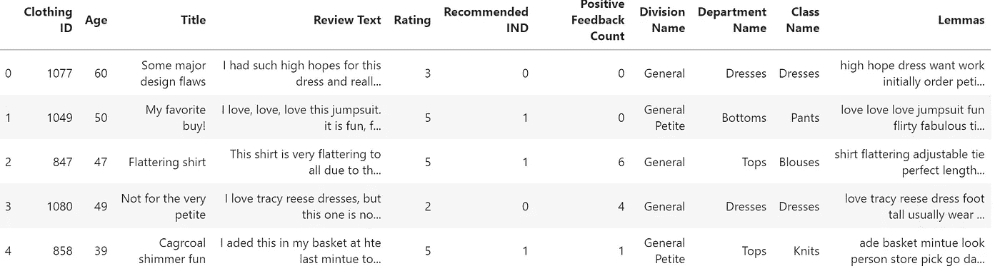
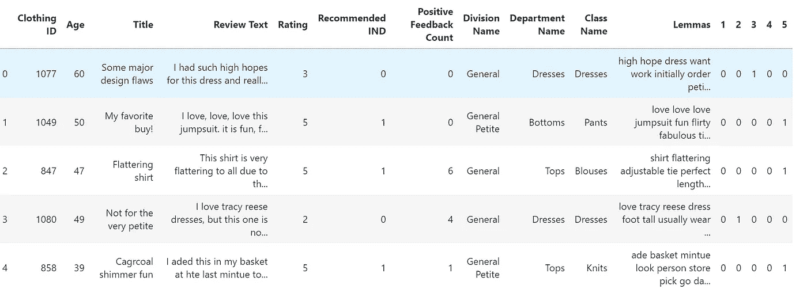
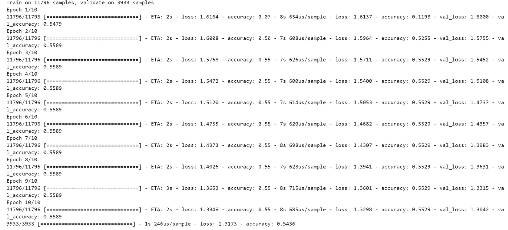
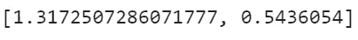
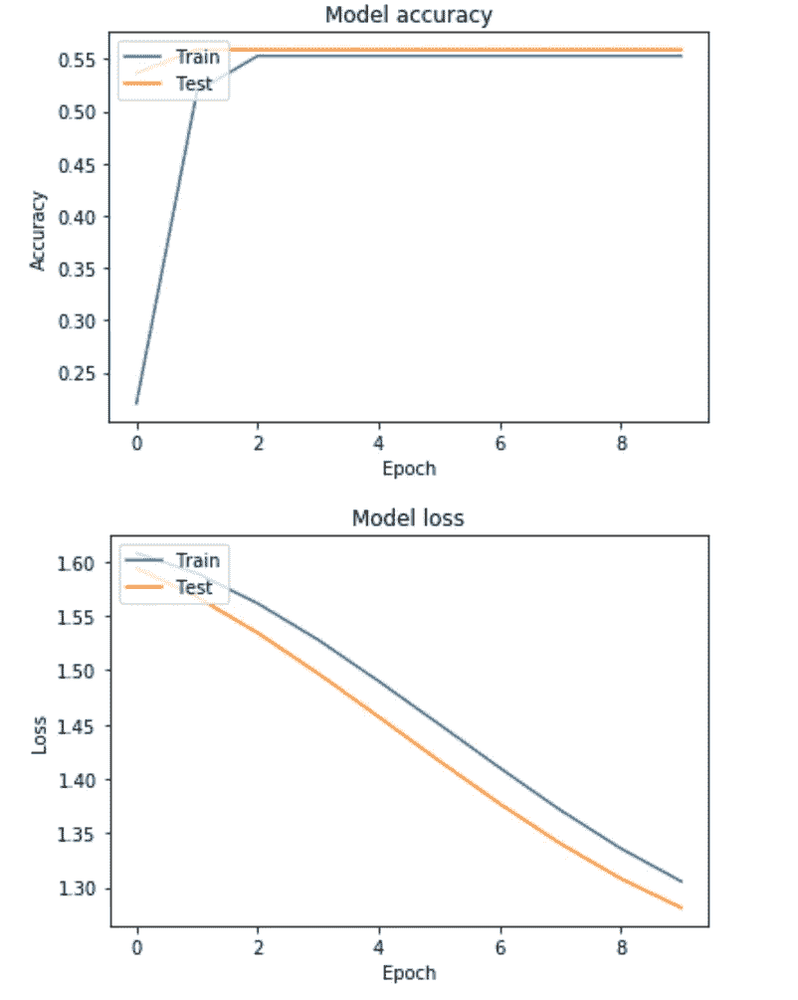

# 用自然语言处理分析服装评论—第二部分

> 原文：<https://towardsdatascience.com/clothes-reviews-analysis-with-nlp-part-1-bfb8a3a2c4bd?source=collection_archive---------34----------------------->


[https://www.klaviyo.com/blog/fashion-apparel-best-practices](https://www.klaviyo.com/blog/fashion-apparel-best-practices)

## 从文本评论分析预测项目评分

在我之前的[文章](https://medium.com/@valentinaalto/clothes-reviews-analysis-with-nlp-part-1-d81bdfa14d97#d345-9525ff891c8d)中，我一直在分析网上购买女装的文字评论，以推断顾客的情绪。这个想法是调查情绪是否与购买建议一致。

在本文中，我将继续分析文本评论，但现在将重点放在评级列上，该列显示该商品的得分从 1(最差)到 5(最好)。

让我们刷新一下我们正在谈论的数据集(你可以在 [Kaggle](https://www.kaggle.com/nicapotato/womens-ecommerce-clothing-reviews/version/1#) 上找到它):

```
import pandas as pd
df = pd.read_csv('Womens Clothing E-Commerce Reviews.csv')#data cleaningdf.dropna(inplace=True)
df.reset_index(drop=True, inplace=True)
import re
for i in range(len(df)):
    #print(i)
    df['Review Text'][i] = df['Review Text'][i].replace("'s", " is").replace("'ll", " will").replace("'ve", " have").replace("'m", " am").replace("\'", "'")

df['Review Text'][1]
df = df.drop('Unnamed: 0', 1)#data preprocessingimport nltk
import en_core_web_sm
import spacy
nlp = spacy.load("en_core_web_sm")
from nltk.corpus import stopwords
def lemmatization(df):
    df["Lemmas"] = [" ".join([token.lemma_ if token.lemma_ != "-    
    PRON-" else token.text.lower() 
    for sentence in nlp(speech).sents for token in sentence if 
    token.pos_ in {"NOUN", "VERB", "ADJ", "ADV", "X"} and  
    token.is_stop == False]) for speech in df.text]

df["Lemmas"] = [" ".join([token.lemma_ if token.lemma_ != "-PRON-" 
                else token.text.lower() for sentence in 
                nlp(speech).sents for token in sentence if 
                token.pos_ in {"NOUN", "VERB", "ADJ", "ADV", "X"} 
                and token.is_stop == False]) for speech in 
                df['Review Text']]df.head()df.head()
```



(如果您不熟悉代码，请务必查看本系列的[第 1 部分](https://medium.com/@valentinaalto/clothes-reviews-analysis-with-nlp-part-1-d81bdfa14d97#d345-9525ff891c8d)，其中解释了代码的每个块！)

为此，我们将使用 [Keras](https://keras.io/) (内嵌 Tensorflow)构建一个神经网络。在开始之前，我们需要对数据集做一些进一步的预处理。事实上，由于它是一个多类分类(5 个类组成评级列)，我们首先需要对该列进行一次性编码(一旦将其从整数转换为字符串):

```
from sklearn.preprocessing import MultiLabelBinarizermlb = MultiLabelBinarizer()df_factor = df.join(pd.DataFrame(mlb.fit_transform(df['Rating']),
                          columns=mlb.classes_,
                          index=df.index))
df_factor.head() 
```



很好，现在让我们导入必要的库，并将数据集分成训练(80%)和测试(20%)集。这对于我们模型的稳健性至关重要:事实上，由于任何机器学习模型的主要目标都是对新的、前所未见的数据进行准确预测，因此根据算法在测试集而不是训练集上的性能来调整算法的参数是至关重要的，以避免过度拟合。

```
import tensorflow as tf
from tensorflow.python.keras.models import Sequential
from tensorflow.python.keras.layers import InputLayer, Input
from tensorflow.python.keras.layers import Reshape, MaxPooling2D
from tensorflow.python.keras.layers import Conv2D, Dense, Flatten, Activation, Dropout
from tensorflow.python.keras.optimizers import SGD#diseabling eager execution
from tensorflow.python.framework.ops import disable_eager_execution
disable_eager_execution()import pandas as pd
from sklearn.model_selection import train_test_splittrain, test = train_test_split(df_factor, test_size=0.2)vectorizer_nn = TfidfVectorizer(ngram_range = (1, 2), min_df = 0.001, max_df = 0.25, stop_words = 'english')X_train_nn = vectorizer_nn.fit_transform(train.Lemmas)
X_test_nn = vectorizer_nn.transform(test.Lemmas)y_train = train.drop(["Clothing ID", "Age", "Title", "Review Text", "Rating", "Recommended IND", "Lemmas", "Positive Feedback Count", "Division Name", "Department Name", "Class Name"], axis = 1)
y_test = test.drop(["Clothing ID", "Age", "Title", "Review Text", "Rating", "Recommended IND", "Lemmas", "Positive Feedback Count", "Division Name", "Department Name", "Class Name"], axis = 1)
```

注意:在导入必要的模块时，我编写了“tensorflow.python.keras.models”代码，因为这是存储模块的路径。在输入之前，请确保检索 TensorFlow 模块的正确路径。

现在让我们建立我们的模型。这个想法是初始化一个空模型，用 Sequential()，然后添加许多隐藏层，用 dropout 选项来避免过度拟合，最后，用 softmax 函数激活层。

(注:如果你有兴趣了解更多关于神经网络的参数和超参数，可以在这里阅读我以前的文章[。)](/neural-networks-parameters-hyperparameters-and-optimization-strategies-3f0842fac0a5)

```
model = Sequential()
model.add(Dense(5000, activation='relu', input_dim = X_train_nn.shape[1]))
model.add(Dropout(0.1))
model.add(Dense(600, activation='relu'))
model.add(Dropout(0.1))
model.add(Dense(200, activation='relu'))
model.add(Dropout(0.1))
model.add(Dense(y_train.shape[1], activation='softmax'))sgd = SGD(lr=0.01, decay=1e-6, momentum=0.9, nesterov=True)
model.compile(loss='categorical_crossentropy',
              optimizer=sgd,
              metrics=['accuracy',])score = model.evaluate(X_test_nn, y_test, batch_size = 7000)
score
```



正如你所看到的，我们最终得到了一个准确率为 54.36%的模型，这并不是那么糟糕，但仍然太低，不能作为一个可靠的预测指标。我们能做得比这更好吗？好吧，如果我们让病人用我们的神经网络玩一点甜菜，我们可以尝试不同的组合，看看结果。

令人欣慰的是，Keras 是一个强大的工具，因为它提供了一个简单的界面。我们还可以绘制培训和测试过程的历史，如下所示:

```
import matplotlib.pyplot as plthistory = model.fit(X_train_nn, y_train, validation_split=0.25, epochs = 10, batch_size = 7000, verbose=1)# Plot training & validation accuracy values
plt.plot(history.history['accuracy'])
plt.plot(history.history['val_accuracy'])
plt.title('Model accuracy')
plt.ylabel('Accuracy')
plt.xlabel('Epoch')
plt.legend(['Train', 'Test'], loc='upper left')
plt.show()# Plot training & validation loss values
plt.plot(history.history['loss'])
plt.plot(history.history['val_loss'])
plt.title('Model loss')
plt.ylabel('Loss')
plt.xlabel('Epoch')
plt.legend(['Train', 'Test'], loc='upper left')
plt.show()
```



本文并不是关于 Keras 的详尽指南，但它是一个例子，说明了如何轻松实现 Keras 模块来完成这种任务。

如果你有兴趣了解更多关于 Keras 和神经网络的知识，我推荐以下读物:

*   [https://keras.io/getting-started/sequential-model-guide/](https://keras.io/getting-started/sequential-model-guide/)
*   https://www.tensorflow.org/api_docs/python/tf
*   【https://pathmind.com/wiki/neural-network 
*   [https://medium . com/data series/understanding-the-maths-behind-neural-networks-108 a4 ad 4d db](https://medium.com/dataseries/understanding-the-maths-behind-neural-networks-108a4ad4d4db)