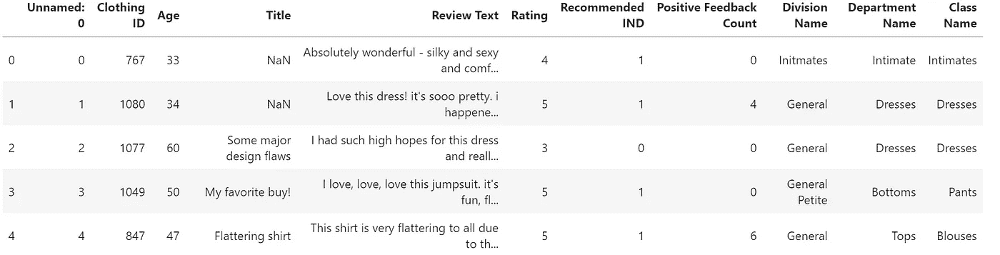
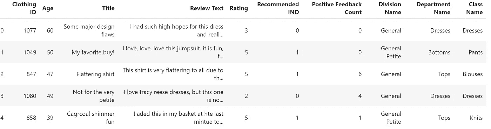
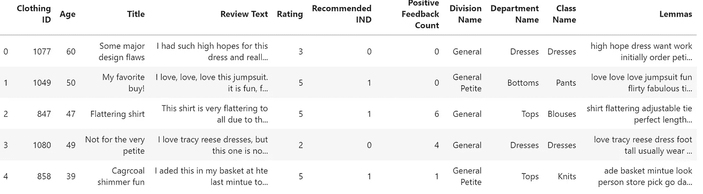
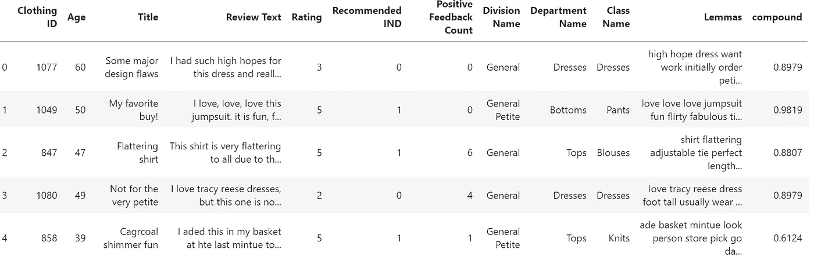
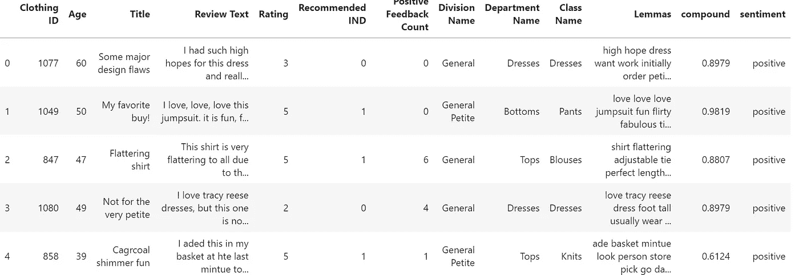
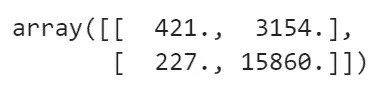
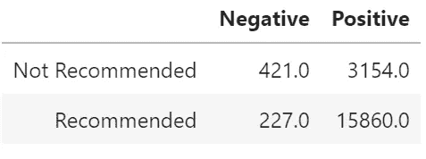

# 用 NLP 分析服装评论—第 1 部分

> 原文：<https://towardsdatascience.com/clothes-reviews-analysis-with-nlp-part-1-d81bdfa14d97?source=collection_archive---------15----------------------->


[https://www.klaviyo.com/blog/fashion-apparel-best-practices](https://www.klaviyo.com/blog/fashion-apparel-best-practices)

## 如何推断顾客评论的情绪

自然语言处理(NPL)是人工智能的一个领域，其目的是找到计算方法来解释人类语言的口语或书面语。NLP 的思想超越了可以由 ML 算法或深度学习神经网络进行的简单分类任务。的确，NLP 是关于*解释*的:你想训练你的模型不仅要检测频繁出现的单词，还要统计它们或者消除一些嘈杂的标点符号；你希望它告诉你谈话的情绪是积极的还是消极的，电子邮件的内容是纯粹的宣传还是重要的事情，过去几年关于惊悚小说的评论是好是坏。

好消息是，对于 NLP，我们提供了有趣的 Python 库，它提供了一个预先训练好的模型，能够查询书面文本。其中，我将使用[空间](https://spacy.io/)和 [NLTK](https://www.nltk.org/) 。

在本文中，我将分析女装电子商务数据集，其中包含客户撰写的文本评论(此处[可用](https://www.kaggle.com/nicapotato/womens-ecommerce-clothing-reviews/version/1#))。

以下是数据集的描述:

```
This dataset includes 23486 rows and 10 feature variables. Each row corresponds to a customer review, and includes the variables:Clothing ID: Integer Categorical variable that refers to the specific piece being reviewed.Age: Positive Integer variable of the reviewers age.Title: String variable for the title of the review.Review Text: String variable for the review body.Rating: Positive Ordinal Integer variable for the product score granted by the customer from 1 Worst, to 5 Best.Recommended IND: Binary variable stating where the customer recommends the product where 1 is recommended, 0 is not recommended.Positive Feedback Count: Positive Integer documenting the number of other customers who found this review positive.Division Name: Categorical name of the product high level division.Department Name: Categorical name of the product department name.Class Name: Categorical name of the product class name.
```

因此，让我们导入并检查我们的数据集:

```
import pandas as pd
df = pd.read_csv('Womens Clothing E-Commerce Reviews.csv')
df.head()
```



现在让我们清理它，删除 NaN 值和无用的列，以及清理文本。

```
df.dropna(inplace=True)
df.reset_index(drop=True, inplace=True)
import re
for i in range(len(df)):
    #print(i)
    df['Review Text'][i] = df['Review Text'][i].replace("'s", " is").replace("'ll", " will").replace("'ve", " have").replace("'m", " am").replace("\'", "'")

df['Review Text'][1]
df = df.drop('Unnamed: 0', 1)
df.head()
```



这个想法是提取每个评论的情感，看它是否与推荐指标一致(如果评论推荐该项目，则为 1，否则为 0)。

为此，我们将使用 NLTK 包中可用的 Vader 模块(您可以在这里找到官方文档)。但是首先，让我们预处理我们的文本并提取词条:

```
#importing necessary librariesimport nltk
import en_core_web_sm
import spacy
nlp = spacy.load("en_core_web_sm")
from nltk.corpus import stopwords def lemmatization(df):
    df["Lemmas"] = [" ".join([token.lemma_ if token.lemma_ != "-    
    PRON-" else token.text.lower() 
    for sentence in nlp(speech).sents for token in sentence if 
    token.pos_ in {"NOUN", "VERB", "ADJ", "ADV", "X"} and  
    token.is_stop == False]) for speech in df.text] df["Lemmas"] = [" ".join([token.lemma_ if token.lemma_ != "-PRON-" 
                else token.text.lower() for sentence in 
                nlp(speech).sents for token in sentence if 
                token.pos_ in {"NOUN", "VERB", "ADJ", "ADV", "X"} 
                and token.is_stop == False]) for speech in 
                df['Review Text']]df.head()
```



现在让我们对 Lemmas 列进行情感分析:

```
from nltk.sentiment.vader import SentimentIntensityAnalyzersid = SentimentIntensityAnalyzer()
sentiment=[]
for i in range(len(df)):
     ss = sid.polarity_scores(df.Lemmas[i])
     sentiment.append(ss)

compound=[sentiment[i]['compound'] for i in range(len(sentiment))]
df['compound']=compound
df.head()
```



复合列包含范围从-1(非常负)到 1(非常正)的分数。一般来说，如果一篇文章的分数大于 0.05，我们就给它贴上“正面”标签；如果分数小于-0.05，我们就贴上“负面”标签；如果分数在-0.05 到 0.05 之间，我们就贴上“中性”标签。但是，为了这个研究问题的目的，我们将只区分积极和消极，使用分数=0 作为阈值。

```
sent=[]
for i in compound:
    if i<0:
        sent.append('negative')
    else:
        sent.append('positive')df['sentiment']=sent
df.head()
```



第一眼看到情感专栏，似乎大多数评论都是积极的，但它与推荐项目的数量一致:在 19661 篇评论中，有 16087 篇最终得到了推荐。

现在我们来看看有多少推荐商品符合点评的情绪。让我借用假阳性/阴性和真阳性/阴性的统计学术语来完成这个任务:当商品被推荐购买时，我谈论假阳性，然而文本评论却带有负面情绪。

```
#initializing a 2x2 matrix populated with zerosmat = np.zeros(4).reshape(2,2)
true_neg=0
true_pos=0
false_neg=0
false_pos=0for i in range(len(df)):
    if df['sentiment'][i]=='negative' and df['Recommended IND'][i]==0:
        true_neg+=1
    elif df['sentiment'][i]=='positive' and df['Recommended IND'][i]==1:
        true_pos+=1
    elif df['sentiment'][i]=='positive' and df['Recommended IND'][i]==0:
        false_neg+=1
    elif df['sentiment'][i]=='negative' and df['Recommended IND'][i]==1:
        false_pos+=1

mat[0][0]=true_neg
mat[0][1]=false_neg
mat[1][0]=false_pos
mat[1][1]=true_pos
mat
```



让我们把它变得漂亮一点:

```
from pandas import DataFrameIndex= ['Not Recommended', 'Recommended']
Cols = ['Negative', 'Positive']
d = DataFrame(mat, index=Index, columns=Cols)
```



所以在 16087 个推荐条目中，只有 227 个不符合文本的情感。另一方面，我们并不推荐 3154 个实际上已经获得正面评价的项目。这种结果可能暗示了推荐系统的不同方法，因为如果我们观察评论者的情绪，可能会购买更多的项目。

情感分析在市场研究和类似领域中起着举足轻重的作用。事实上，跟踪顾客的满意度，最重要的是，隔离那些决定他们对商品的情绪的驱动因素，可能会导致赢得营销活动和销售策略。

在这篇文章中，我将我的研究局限于情感分析，但是这个数据集提供了多个研究问题，这将在我的下一篇文章中涉及，所以请继续关注！

## 参考资料:

*   [https://www.nltk.org/](https://www.nltk.org/)
*   https://spacy.io/
*   【https://medium.com/r/? URL = https % 3A % 2F %2Fwww . ka ggle . com % 2Fnicapotato % 2f 预兆-电子商务-服装-评论% 2f 版本%2F1%23