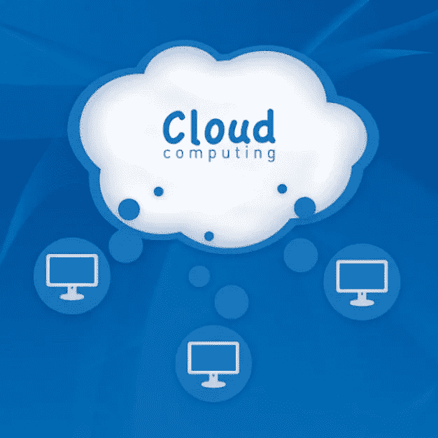

# 云采用—企业有选择吗？

> 原文：<https://towardsdatascience.com/cloud-adoption-do-enterprises-have-a-choice-a83656bba8ac?source=collection_archive---------25----------------------->

来源: [Freepik](https://image.freepik.com/free-vector/cloud-computing_826014.jpg) 网站

在我们讨论为什么要云这个更大的问题之前，让我们先了解云计算的一些基础知识:

## **什么是云计算？**

简而言之，云计算是指使用通过互联网提供的按需 IT 资源，采用按需付费的定价模式。与购买基础设施的传统模式相比，关键区别在于，提供商(比如谷歌、亚马逊、微软、IBM、阿里巴巴或任何其他提供商)为您维护相同的硬件，而不是购买您自己的硬件。

云提供商提供核心 IT 基础设施服务(例如计算、存储、网络、数据库)以及基于核心基础设施的解决方案(大数据和分析、IOT、SaaS 应用等)。).

## **对于企业来说，采用云是一种选择还是一种必需？**

在回答这个问题之前，我们先来看看采用云技术相对于购买和维护传统 IT 基础设施有什么好处

1.  ***收益提升导向效益***

**a)灵活快速地管理不断增长的客户群:**随着业务的增长，您需要更多的 IT 基础设施来管理不断增长的客户需求(例如，更高的计算能力、更多的数据存储、更快的响应时间)。你是怎么做到的？

*   选择 1(传统):每次现有硬件无法管理工作负载时，购买更多硬件。这更像是一个阶跃函数，您要么购买刚好满足新工作负载的量(并随着需求的增加继续购买)，要么购买足以满足未来几个月/几年的峰值需求的量(这意味着浪费了大量容量)。如果您对此管理不当，将会对收入产生影响(例如，由于响应时间短、网站无法加载等原因导致客户不满意。)
*   选择 2(基于云):借助云的力量，您无需在需求发生变化时购买/销售物理硬件—扩展/缩减可以动态自动发生

**b)有效利用数据获得/保留客户/交叉销售/追加销售:**利用您周围不同来源的大量数据(企业应用程序、社交媒体、交易数据、IOT 数据等)。)，作为一个组织，您有两种选择:

*   选择 1(传统):使用固定容量的 IT 基础架构，仅处理基础架构允许的数据量
*   选择 2(基于云):挖掘所有可用的数据，使用云弹性容量将它们存储(或有意识地丢弃)在基于云的数据湖/数据仓库中，并创建真正的 360 度客户视图，以推动客户增长相关的分析用例

c) **以敏捷的方式应对变化:**面对如此众多的市场竞争对手和不断变化的客户环境，您需要不断发展以保持相关性。环境要求推出新产品/新功能，并前所未有地挑战客户/员工体验的极限。你如何解决这个问题？

*   选择 1(传统):在现有硬件和软件解决方案的限制下开发和部署新产品(或者等待很长时间来购买和集成任何新的外部解决方案)。
*   选择 2(云原生):利用云上可用的大量解决方案来快速开发/部署新产品/功能；利用数据和分析平台，无需从头构建；使用现有的客户服务解决方案(例如支持人工智能的聊天机器人)

**d)支持地域增长:**您需要扩展到一个新的地域，您会怎么做？

*   选择 1(传统):在新的地理位置设置整个技术基础设施，并在那里部署您的应用程序
*   选择 2(基于云):立即在云中为新的地理位置配置基础架构，在新的地理位置部署您的应用程序并投入使用！

**2*。成本降低导向效益***

**a)将资本支出转变为运营支出，降低单位运营成本**(按使用付费；不需要为未使用的部分付费，这是在传统模式中容量固定的情况下)。

**b)避免成本:**消除硬件更新、维护、升级等成本。

**c)提高生产率:**降低停电管理成本；使用云上可用的自动化解决方案提高工作效率

**d)提高弹性:**减少硬件故障导致的停机时间

考虑到云影响核心业务和关键 KPI(业务收入和利润)的多种方式，说采用云只是众多可用 it 选择之一是不明智的。如果处理得当，它可以为企业带来一些真正的核心业务利益。

一个有趣的例子是网飞，以及它如何使用云来推动其核心业务。详细信息可在 AWS 网站上找到:

[https://AWS . Amazon . com/solutions/case-studies/网飞案例研究/](https://aws.amazon.com/solutions/case-studies/netflix-case-study/)

## **有哪些不同的云迁移策略？**

一旦您决定要开始向云迁移，那么在将您的技术环境向云迁移时，您有哪些不同的选择？(请注意，以下策略是从应用程序组合的角度来看的，它最终会影响对运行应用程序的底层基础架构的选择)

a) **保留:**一些应用程序可能过于复杂，无法迁移到云(esp。在短期到中期内)，所以最好不要碰它。在大型遗留应用程序的情况下，这是最真实的

**b)丢弃/整合:**一些应用程序可能不再需要(例如，另一个应用程序已经提供的功能)。这些应该从应用程序组合中丢弃

**c)主机转移(提升和转移):**在大型传统迁移场景中，组织希望快速扩展其迁移以满足业务需求，大多数应用程序都需要进行主机转移。借助工具，可以极大地自动化重新托管，并带来一些立竿见影的效果(但是，不具备云原生应用所具备的长期优势)

**d)重新平台:**这种方法进行了一些云(或其他)优化，以获得一些切实的好处，但您不会改变应用程序的核心架构。

**e)重新架构(云原生):**这是由增加功能、规模或性能的强烈业务需求所驱动的，否则在应用的现有环境中很难实现这些功能、规模或性能

f) **回购**:这意味着完全放弃你内部应用程序，从其他提供商那里转移到 SaaS 模式

任何云迁移策略都不必只是其中之一。根据产品组合中不同应用的不同需求，可以采用这些策略的组合。

## **典型云迁移计划的执行阶段有哪些？**

如果您决定迁移，您如何计划迁移，涉及哪些不同的阶段？

**a)根据您试图通过云迁移计划实现的目标，评估上一节所述的各种迁移策略**。

**b)评估迁移准备情况:**此包括查看您的投资组合中的所有应用程序，并针对不同的策略对它们进行评估(例如，重组评估包括查看不同应用程序的代码级别细节，以了解与其他应用程序的依赖性、接口数量等。).

**c)确定机会:**任何迁移都应该包括在进行实际迁移之前创建业务案例，以确定潜在收益(和所需投资)。

**d)迁移:**一旦业务案例建立，根据最终确定的策略进行实际的迁移。

**e)验证:**进行迁移后测试/检查，以验证迁移已按计划完成，没有中断用户旅程，达到了预期的性能水平等。

**f)优化:**确保云成本得到优化，以最大限度地从您的迁移计划中获益，这一点非常重要。通常对于新的云采纳者来说，这可能是一个很大的挑战，因为他们关注的是保持一段时间的正常运行，并确保云迁移后业务正常运行。然后，他们开始考虑成本合理化(例如，评估计算实例、存储实例等的数量。)用于现有的云设置。

## **组织面临的典型挑战是什么？他们如何克服这些挑战？**

描述了采用云的所有优势、不同的战略和阶段后，同样重要的是要认识到这不是一项简单的任务(尤其是对于那些多年来一直在使用大量传统设置的大型企业)。企业在采用云的过程中面临一些常见的挑战，例如

*   **正确的云知识:**理解云的细微差别是最大的障碍之一。通常我们会尽量避免做我们不理解的事情——这是基本的人性。因此，不管云能给企业带来多大的上升潜力，都有一种继续照常经营的趋势。
*   对变化的恐惧:人们通常害怕变化——“如果事情停止运转了怎么办？”、“实现的收益不如预期怎么办？”。
*   **理解执行之路:**像“我从哪里开始？”这样的问题，“路线图是什么？”“时间框架是什么？”、“我以什么顺序移动应用程序”、“我从哪个提供商选择？”等等。在决策者的头脑中是很常见的。

好消息是，在生态系统中可用人才的正确组合的帮助下，可以解决大多数这些挑战，以支持组织的转型之旅。人才组合通常是以下因素的组合

*   **内部人才:**您组织中了解云并帮助定义云采用战略的人员。
*   云提供商:比如亚马逊(Amazon)、谷歌(Google)、微软(Microsoft)。
*   **IT 服务提供商**他们带来急需的公正观点和客观性(例如选择合适的云提供商)，并帮助组织规划/执行云采用计划的不同阶段。

## 那么，您应该何时开始您的云采用之旅呢？

用马克·吐温*的话来说——“二十年后，你会因为你没有做的事情而比因为你做了的事情更失望，所以扔掉缆绳，远离安全的港湾，在你的帆上抓住信风。探索，梦想，发现。”*

我也写关于财务规划和投资的话题。在我的网站上查找更多信息 [**Getmoneyinsights**](https://getmoneyinsights.com/)