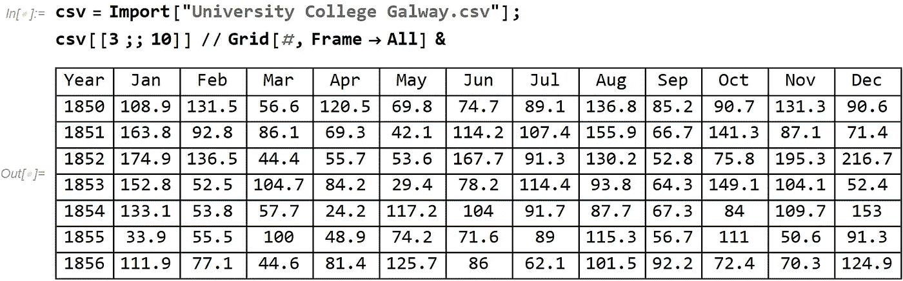
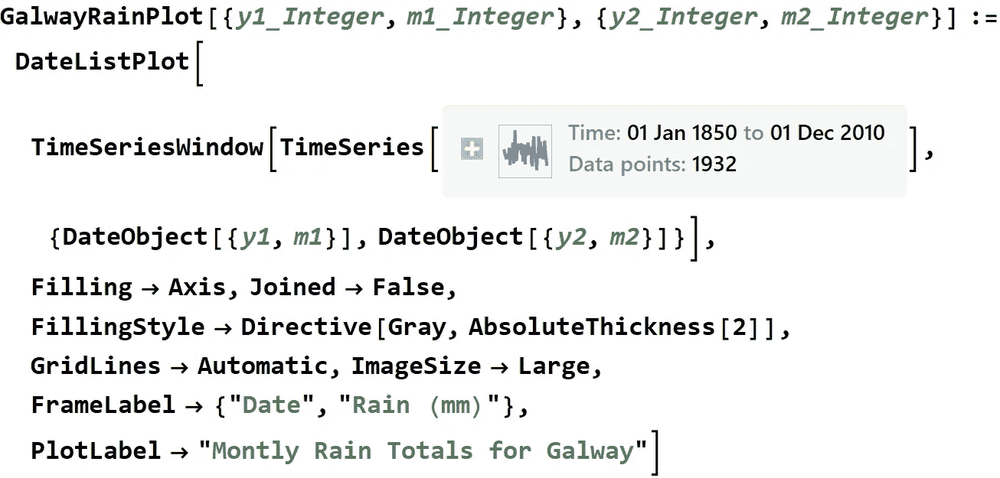
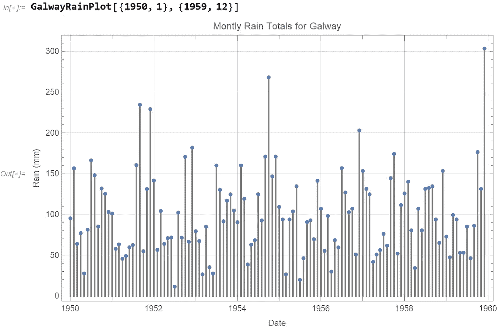
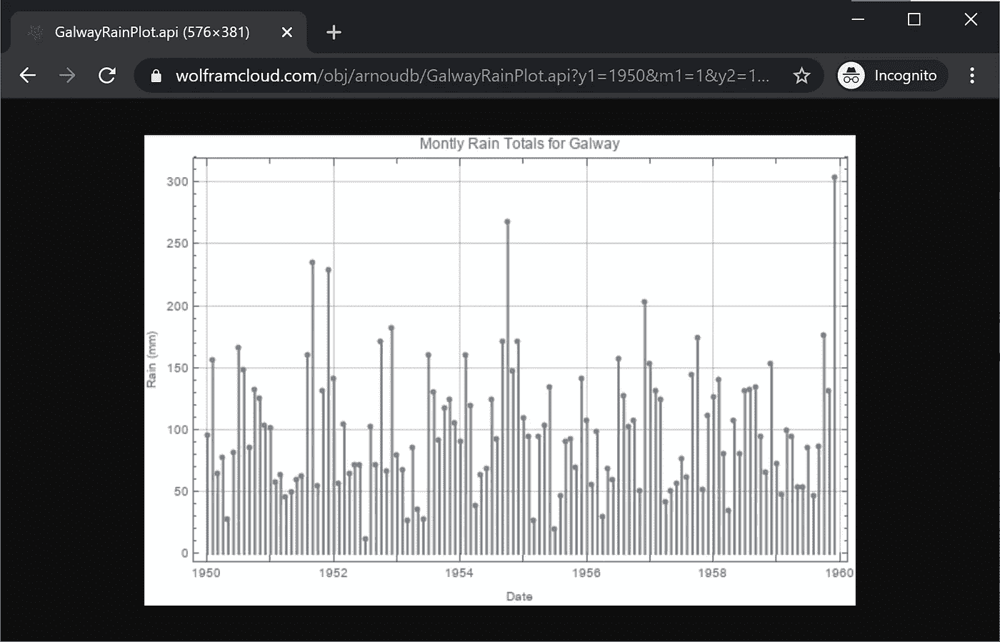

# 未雨绸缪的云 API

> 原文：<https://towardsdatascience.com/cloud-apis-for-a-rainy-day-f4f06468346?source=collection_archive---------41----------------------->

## 使用 Wolfram 语言编写、部署和共享计算从未如此简单


尼克·舍尔巴特在 [Unsplash](https://unsplash.com/s/photos/rain?utm_source=unsplash&utm_medium=referral&utm_content=creditCopyText) 上的照片

很久以前，我有幸徒步旅行到爱尔兰西部，靠近戈尔韦，穿过康尼马拉国家公园。景色非常壮观，但真正吸引我注意的是不断变化的天气模式。在一天的徒步旅行中，出现多次晴雨循环并不罕见，很多天还会出现午后彩虹。

位于大西洋附近，一股来自墨西哥湾和加勒比海的暖流。这使得爱尔兰的气候比基于纬度的预期要温和，也限制了全年的极端温度波动。但是爱尔兰经常下雨。

为了了解爱尔兰的降雨量，我访问了爱尔兰气象局的网站。他们提供当前的天气信息和历史数据。从历史数据页面，我下载了一个包含 1850 年至 2010 年时间序列数据的[数据集。该数据集包括爱尔兰全国 25 个气象站的降雨量。](https://www.met.ie/climate/available-data/long-term-data-sets)

在这个故事中，我将讨论如何使用这些数据并创建一个可调用的 API 来可视化这些数据。

每个工作站都有自己的 CSV 文件。这是戈尔韦大学学院电视台的一个样本:



(图片由作者提供)

这个原始数据最好用 Wolfram 语言中的一个 [TimeSeries](https://reference.wolfram.com/language/ref/TimeSeries.html) 对象来表示。我们从 **cvs** 表达式中获取数据字段，用 **DateRange** 生成每月日期，并构造**时间序列**(快速注意:在本文结尾提供了一个包含完整代码的笔记本):

```
rain = Flatten[csv[[4 ;;, 2 ;;]]];dates = DateRange[
 DateObject[{1850, 1}, "Month"],
 DateObject[{2010, 12}, "Month"]];ts = TimeSeries[Thread[{dates, rain}]]
```

使用这个时间序列对象，我们可以创建一个可视化函数:



(图片由作者提供)

这使得我们可以绘制任何时间范围的图，例如，20 世纪 50 年代:



(图片由作者提供)

此时，将该功能部署为 API 是非常容易的。我们定义了一个 [APIFunction](https://reference.wolfram.com/language/ref/APIFunction.html) ，它定义了 URL 参数和函数参数之间的联系:

```
api = APIFunction[{
 "y1" -> "Integer", "m1" -> "Integer", 
 "y2" -> "Integer", "m2" -> "Integer"},
 ExportForm[GalwayRainPlot[{#y1, #m1}, {#y2, #m2}], "PNG"] &
];
```

接下来，我们使用 [CloudDeploy](https://reference.wolfram.com/language/ref/CloudDeploy.html) 将这个 APIFunction 部署到一个 CloudObject:

```
CloudDeploy[api, CloudObject["GalwayRainPlot.api"], Permissions -> "Public"]
```

此时，API 是公开可用的。您可以更改权限设置，使您的 API 更加私密。这里有一个[的例子，称之为 20 世纪 60 年代高威降雨量的 API](https://www.wolframcloud.com/obj/arnoudb/GalwayRainPlot.api?y1=1950&m1=1&y2=1959&m2=12)。



(图片由作者提供)

当然，你可以按照这个工作流程，与云中的其他人共享任何计算。只用几行代码就可以将任何计算部署到 Wolfram 云的概念非常强大。有关更多信息，请查看以下指南页面:

[](https://reference.wolfram.com/language/guide/CreatingAnInstantAPI.html) [## 创建即时 API-Wolfram 语言文档

### Wolfram 语言具有在 web 和其他地方创建和部署 API 的内置功能…

reference.wolfram.com](https://reference.wolfram.com/language/guide/CreatingAnInstantAPI.html) 

至于在爱尔兰徒步旅行，我希望有一天能再去一次。但是如果你打算去，一定要带一件雨衣和多一双干袜子！


由康纳无法无天——【https://www.flickr.com/photos/conchur/28657824895/】T4，CC 由 2.0，[https://commons.wikimedia.org/w/index.php?curid=86922866](https://commons.wikimedia.org/w/index.php?curid=86922866)

这款笔记本的完整代码可从以下网址获得:

[](https://www.wolframcloud.com/obj/arnoudb/Published/GalwayRainPlot-01.nb) [## 戈尔韦雨图

### 用 Wolfram 语言进行计算思维

www.wolframcloud.com](https://www.wolframcloud.com/obj/arnoudb/Published/GalwayRainPlot-01.nb)