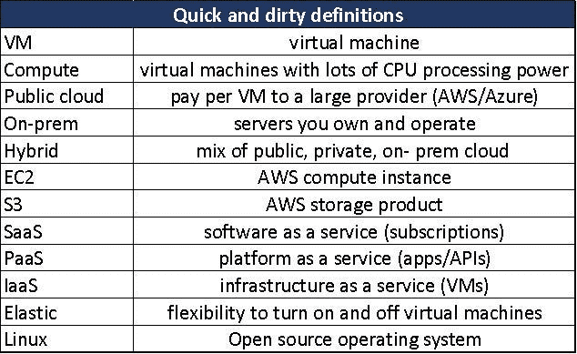

# 云金融面试准备和技巧

> 原文：<https://towardsdatascience.com/cloud-finance-interview-prep-and-tips-8fe2d6f6b017?source=collection_archive---------39----------------------->

克里斯蒂娜@ wocintechchat.com 在 [Unsplash](https://unsplash.com/s/photos/interview?utm_source=unsplash&utm_medium=referral&utm_content=creditCopyText) 上的照片

在云金融工作，经常会遇到这样的问题:“面试要做哪些准备？”。这个问题对我来说很难回答，因为在云金融领域工作与我接触过的其他金融角色非常不同。然而，本文旨在为有兴趣申请云财务经理职位的人提供一些重要的学习资源和技巧。

首先，有很多“云”要覆盖，因为空间非常大，无所不包。清单包括:技术技能、行业趋势、云经济、硬件细节、工程管理/合作伙伴关系、核心财务技能以及许多其他主题。幸运的是，所有这些话题都非常有趣，关于它们的数据可以通过 YouTube 或免费培训网站公开获得，如 EdX、Linkedin Learning 或 AWS/Azure 培训网站。

第二，把这些新话题看作是一个增长和展示你认知灵活性的绝佳机会，而不是把它们看作进入的障碍。今天，云金融行业的许多人都没有预装这方面的知识，而云是如此之大，以至于我们都在不断地学习它。这是令人兴奋的挑战！

## 为什么分享面试准备对我很重要

鉴于这一小型(但快速增长的)行业所需的知识/技能相对小众，可能会偏向于具有云计算/科技金融背景的候选人，他们有在职经验，回答问题时更具技术性。总的来说，我认为这是不公平的，因为它可能会对已经处于孤立网络中的人产生偏见。这种偏见可以通过改变面试官问的问题来应对和纠正，更多地关注行为问题，鼓励更多的通用财务技能，以及从不同的部门/背景招聘员工。

在消除面试偏见的同时，我相信通过提供更多的面试准备资源并使其易于获取，也有助于提升技能水平。为此，我分享了一些我最喜欢的云金融面试准备，以帮助最大限度地减少群体偏见的影响，并让你跟上速度。

*警告*:我不是招聘经理，我的信念不能反映我的公司。这些是我从非科技金融工作转向云计算工作时使用的有用培训和技巧。除了这些培训和良好的经历，我还有幸进入了这个行业。

# 第一:要学习、准备和准备的关键技术主题

**数据中心如何工作** —云金融的核心是支持运行“云”并提供基于云的产品和服务的数据中心的扩展、运营和优化。因此，了解什么是数据中心以及它是如何工作的，可以为您的工作提供很多信息。每封电子邮件、每台机器、API 调用、面部识别和 SaaS 订阅都可以追溯到 DC(数据中心)中的一台物理机器。深刻理解基础设施成本将有助于理解下游成本。因此，浏览数据中心是我用来学习的最有用的工具之一。我最喜欢的是谷歌数据中心内的视频漫步[——YouTube](https://www.youtube.com/watch?v=XZmGGAbHqa0)(5 分钟)。

**什么是虚拟机**——如今云提供商销售的最大产品是虚拟机。这是在理解数据中心和物理成本的基础上更上一层楼，对于掌握云经济学至关重要。以下是我最喜欢的教程，按深度递增排序。

*   [什么是](https://www.youtube.com/watch?v=N5gworNCJuY) (1 分钟)中的虚拟机
*   [虚拟化基础知识](https://www.youtube.com/watch?v=2v_3f_jjLL4) (2 分钟)
*   [在白板上解释虚拟化](https://www.youtube.com/watch?v=FZR0rG3HKIk&t=257s) (5 分钟)

**云经济学基础知识** —您应该能够回答“迁移到云有什么财务好处？”为你的立场辩护。虽然答案可以很清楚地列出来，但这是你将与客户、合作伙伴和同事讨论的更有趣、更深奥的话题之一。

*   简单的答案=将资本支出转化为运营支出在[云经济学— YouTube](https://www.youtube.com/watch?v=kUNBx1MTwxw) (5 分钟)中有清晰的总结
*   明智的答案=一些硬成本节约+灵活性、安全性和创新的无形价值。这些在 IBM 关于云迁移的[快速文章](https://cloudacademy.com/blog/financial-benefits-of-cloud-migration/) (2 分钟)和[视频](https://www.youtube.com/watch?v=yWByEVB0VJE)中得到强调。(5 分钟)
*   超级深度探索= [云经济学——YouTube](https://www.youtube.com/watch?v=kUNBx1MTwxw)(50 分钟)

**观看云主题演讲** —这对于把握行业热点话题和趋势非常重要。类似于苹果的开发者大会，这些主题活动是云首席执行官发布闪亮新产品并强调他们在业务增长部分的成功的地方。这些是更长的事件，所以请随意快进，以 1.5 倍观看。*注意:每次有人说 AI 时，喝一杯饮料来玩这个游戏。*

*   [AWS re:Invent 2019——Andy Jassy 的主题演讲——YouTube](https://www.youtube.com/watch?v=7-31KgImGgU)(2 小时)
*   [塞特亚·纳德拉的视觉主题演讲|微软 Ignite 2019—YouTube](https://www.youtube.com/watch?v=jnUiJi4hts4)(1 小时)
*   此外，如果你了解你申请的群体，观看关于该行业的分组会议，了解关键术语，并观看产品演示。

**上网站** —最后，花点时间浏览公司网站，了解他们的产品和服务。这些都是公开信息，所以招聘经理可能会不小心使用一些行话或产品名称(EC2、计算、认知服务、容器、S3、红移)，这些可能是常见的行业知识，但不是常见的你的知识。一次快速的现场参观会帮助你用一个会意的点头代替困惑的畏缩。

*   [云计算服务|微软 Azure](https://azure.microsoft.com/en-us/)
*   [亚马逊网络服务(AWS)——云计算服务](https://aws.amazon.com/)
*   如果你正在制作抽认卡，下面包括一些关键术语和速记定义的列表(没有必要)，但是查看更多的词汇表中的[一个。](https://solutionsreview.com/cloud-platforms/glossary/)

# 接下来:面试技巧和行为问题

**展示你的学习能力** —云是一个快速增长的空间，你将要做的许多工作都是新的(对你和这个世界来说)。你需要展示一些处理模糊任务的能力，并成为一个无所不知的人。

*   分享你以前的学习和发展潜力的例子是一个加分。
*   关于这里的背景，下载 [LIBBY app](https://libbyapp.com/welcome) 并阅读 Carol Dweck 的*增长思维*，这是过去几年的热门商业书籍，也是 Satya 的书*的灵感来源。*

关注你不同的经历 —你独特的背景和思维方式是一笔财富！技术和云可能会有很多狭隘的想法，所以让外界的人加入进来带来新的视角总是很重要的。

*   例如，云投资是非常资本密集型的，云产品有许多不同的产品 COGS 模型。这与标准软件或 SaaS 公司有着显著的不同，因此在雇佣有资本管理经验或产品知识背景的人时会给予额外的奖励。即使产品体验来自于卖肥皂，产品成本就是产品成本。

**温习你的技术技能** — Excel power pivot、Power BI 和基本的数据库技能不是必需的，但它们确实有所帮助。能够用技术来管理技术是未来的技能。在快速发展的企业中，运营工作不断增加，这意味着自动化、简化或消除任务的技术技能具有巨大的价值。如果你把这些技能或其他技能带到聚会上，一定要强调它们帮助你产生的影响。如果没有，可以参加一些免费的在线课程和 youtube 培训，继续充实你的简历。

*   [在 excel 中可视化数据](https://www.edx.org/course/analyzing-and-visualizing-data-with-excel-2) —来自 edX
*   [Power BI](https://www.linkedin.com/learning/power-bi-essential-training-3/create-rich-interactive-reports-with-power-bi?autoplay=true&trk=learning-course_table-of-contents_video&upsellOrderOrigin=aff_src.aff-lilpar_c.partners_pkw.1238999_plc.Digital%20Defynd%20-%20LinkedIn%20Learning_pcrid.449670_learning) via linkedin 学习！
*   [超越权力中枢](https://www.youtube.com/watch?v=CjSm5sI3z8o)——这可能有些矫枉过正

**人际技能非常重要** —这里有很多工程师，所以展示影响有技术头脑的人的能力会有所帮助。这通常表现为成为一名优秀的沟通者，或者能够简单地总结复杂的话题。

*   准备一些你帮助商业伙伴进行清晰分析的例子，或者你如何影响他们的想法。
*   读《如何赢得朋友和影响他人》从来没有不好的时候。([还是听听吧](https://www.youtube.com/watch?v=63oDXrAtWtU))

____

感谢阅读，更多 AI 财经内容，在 Linkedin 上关注或添加我 [David Hall | LinkedIn](https://www.linkedin.com/in/david-hall-19160218/)