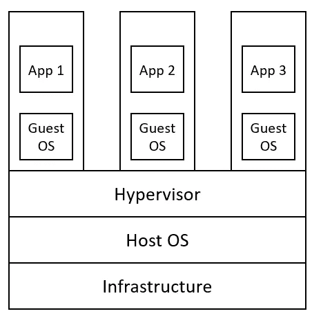
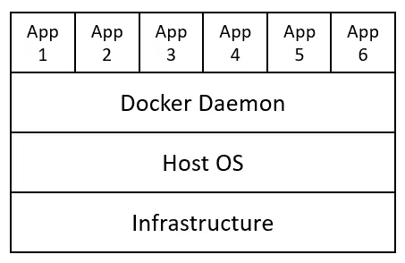

# 数据科学家的云基础

> 原文：<https://towardsdatascience.com/cloud-foundations-for-data-scientists-e9d0c14fc98a?source=collection_archive---------38----------------------->

## 云技术基础及其在数据科学中的应用指南

在 [Unsplash](https://unsplash.com?utm_source=medium&utm_medium=referral) 上由 [C Dustin](https://unsplash.com/@dianamia?utm_source=medium&utm_medium=referral) 拍摄的照片

# 介绍

如今，越来越多的公司开始在基于云的环境中开发和部署应用程序。云计算的主要动机之一是，它消除了与设置和管理所用硬件和软件相关的所有问题。这是通过远程租用云提供商维护的数据中心的计算机资源来实现的。

通过这种方式，公司和个人可以远程使用不同云提供商提供的硬件和软件设置以及工作流，而不必担心购买设备、设置不同的环境以及长期维护它们。因此，使用这种方法，用户可以专注于开发和部署他们的服务(如网站、数据库、应用、数据分析)，而不必考虑任何可能的开销。最终，这可以导致更快的/持续的开发和提高的客户满意度，符合共同的 DevOps(开发-操作)原则。

云服务背后的主要思想非常类似于过去开发的任何其他类型的实用程序和基于订阅的系统。例如，在这些日子里，我们每个人都使用公用设施，如电/水/气，而不必担心这些系统是如何工作的，并交付给我们。我们关心的是我们的提供商能给我们一个可靠的服务，我们必须为我们使用多少或不使用所有这些服务付费。

正在使用的一些主要云提供商包括:

*   [***微软 Azure***](https://azure.microsoft.com/en-gb/)
*   [***【亚马逊网络服务(AWS)***](https://aws.amazon.com/)
*   [***谷歌云平台(GCP)***](https://cloud.google.com/)

所有这些不同的提供者，对于所提供的服务都有他们自己的术语，但是他们都共享本文中概述的相同原则。

# 云概念

每个不同的云提供商都能够提供各种各样的服务和应用，这些服务和应用可以分为四种主要类型:

*   ***计算:*** 虚拟机、容器等…
*   ***联网:*** 安全服务使不同的服务相互交互。
*   ***存储:*** 为应用程序存储任何类型的文件或数据库的空间。
*   ***分析:*** 数据处理和可视化工具，用于从存储的数据中分析和创建洞察。

为了降低资源租用成本并充分利用可用硬件，云服务严重依赖虚拟化技术，如虚拟机和容器。

## 虚拟机(VM)

虚拟机是为了模拟计算机硬件而创建的(图 1)。可以创建虚拟机的不同实例来同时在一台计算机上运行，每个实例都有一个首选的操作系统、内存和存储分配。一旦创建了虚拟机，就可以使用桌面客户端远程访问，并像任何其他物理计算机一样使用(例如，安装程序、运行应用程序等)。这样，通过将单台计算机用作不同计算机的集合，可以最大限度地利用硬件。

图 1:虚拟机基础设施

在云中使用虚拟机的另一个巨大优势是我们的系统可以变得易于扩展。因此，如果需要比计划更多的资源来完成项目，云提供商可以即时提供额外的内存和存储能力(从而减少部署中任何可能的停机时间)。

此外，如果我们希望确保我们的服务始终运行，也可以创建一个备份虚拟机，在原始虚拟机出现任何问题时自动运行。当在网站或应用程序等服务上添加新功能时，这可能特别有用，我们希望首先向一部分受众提供服务的新版本，以便获得某种反馈，了解变化是否会给服务带来积极影响(A/B 测试)。

## 容器

虚拟机的一个问题是每个虚拟机都有自己的操作系统。例如，如果我们有一个复杂的应用程序，它的一些操作需要 Windows，而另一些操作需要 Linux，那么我们就需要运行两个独立的虚拟机，并使这两个虚拟机相互通信。因此，这导致了可以避免的资源开销。此外，当在团队中开发一个应用程序时，当从不同的环境转移时，也可能会出现一些包依赖冲突(例如，“它在我的机器上工作”)。

为了避免这些类型的问题，已经构思了容器。容器，将应用程序及其依赖项打包在一起，并将它们部署到容器主机上(容器主机充当抽象操作系统的服务)。通过这种方式，现在可以避免由于拥有多个操作系统而产生的内存开销，并且与使用虚拟机在单台机器上运行相比，可以在单台机器上运行更多的容器。此外，现在我们的应用程序可以轻松地在不同的操作系统之间移动，而不必考虑管理底层的依赖关系。

> 虚拟机虚拟化硬件，而容器虚拟化操作系统[1]。

为了创建容器，最常用的服务之一是 [Docker](https://www.docker.com/) (图 2)。

图 2:容器基础设施

创建复杂系统的最有效方法之一是将它们分成不同的容器应用程序，每个应用程序都有不同的角色。例如，如果我们正在做一个网站，将网站分成三个主要容器是一个好主意:前端、后端和数据库。每当我们想要引入新的特性时，我们可以更新我们感兴趣的容器，而不必接触其他的容器。随着我们向应用程序添加更多的组件，应用程序的复杂性增加，可能需要更多的容器。为了有效地维护和组织集装箱，Kubernetes 等服务应运而生。

Kubernetes 的开发是为了使基于容器的应用程序能够在基于云的环境中轻松伸缩。Kubernetes 可以提供的服务包括:

*   优化容器之间的工作负载，并根据需求扩展所需的资源数量。
*   如果容器中有任何错误，可以创建一个新实例来替换它。
*   如果在一个新特性发布后，出现了一些问题，可以很容易地回到我们应用程序的前一个版本。

利用 Kubernetes 来编排我们的应用程序，可以让我们遵循 DevOps 实践，例如 ***【持续集成】*** 和 ***持续交付(CD)*** 。持续集成的主要焦点是确保代码变更与当前的代码信息结构完美集成，而持续交付的焦点是使代码库始终准备好进行部署(能够自动通过任何适当的构建和测试机制)。

# 云部署和服务类型

一旦在云中创建了应用程序，就可以使用三种不同的云部署方法进行部署:

*   ***公有云:*** 在这种场景下，所有使用的资源都由云提供商管理和维护。这是目前最具成本效益和最常见的云部署方法。
*   ***私有云:*** 常用于需要高安全性和严格法律合规性的工作任务。在这种情况下，企业可以创建本地云信息结构，从而减少对云提供商的控制(该选项要求企业预先购买自己的硬件设备)。
*   ***混合云:*** 在本例中，应用程序的一部分可能由我们的云提供商管理，而其他部分则由私有企业管理(混合了公共云和私有云部署方法)。

最后，云上有三种不同类型的服务可用:

*   ***信息架构即服务(IaaS):*** 在 IaaS 类型的服务中，我们租用一些硬件并自行配置，以便完成不同的任务。
*   ***平台即服务(PaaS):*** 在 PaaS 类型的服务中，我们租用一些预配置的硬件，并使用它来测试和开发一些应用程序或存储业务数据。
*   ***软件即服务(SaaS):*** 在 SaaS，云提供商开发并维护一些软件应用程序，然后使用订阅模式进行分发。SaaS 程序的两个例子是 Skype 和 Office 365。

利用这种基础设施，就有可能轻松地将任何类型的基于软件的业务迁移到云中。

希望你喜欢这篇文章，谢谢你的阅读！

# 联系人

如果你想了解我最新的文章和项目[，请通过媒体](https://medium.com/@pierpaoloippolito28?source=post_page---------------------------)关注我，并订阅我的[邮件列表](http://eepurl.com/gwO-Dr?source=post_page---------------------------)。以下是我的一些联系人详细信息:

*   [领英](https://uk.linkedin.com/in/pier-paolo-ippolito-202917146?source=post_page---------------------------)
*   [个人网站](https://pierpaolo28.github.io/?source=post_page---------------------------)
*   [中等轮廓](https://towardsdatascience.com/@pierpaoloippolito28?source=post_page---------------------------)
*   [GitHub](https://github.com/pierpaolo28?source=post_page---------------------------)
*   [卡格尔](https://www.kaggle.com/pierpaolo28?source=post_page---------------------------)

# 文献学

[1]微软学习，Azure 基础。访问:[https://docs . Microsoft . com/en-GB/learn/paths/azure-fundamentals/](https://docs.microsoft.com/en-gb/learn/paths/azure-fundamentals/)