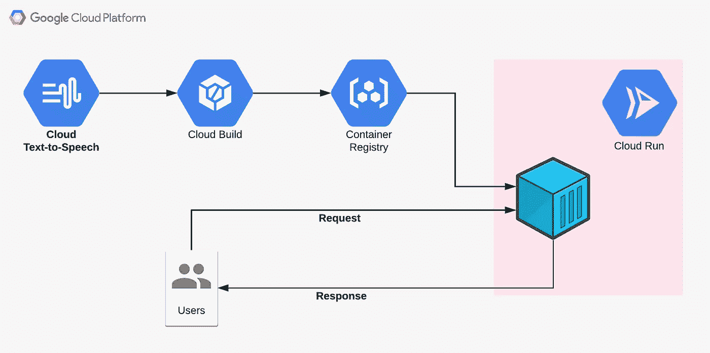
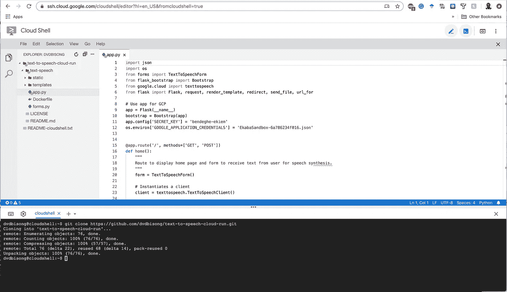
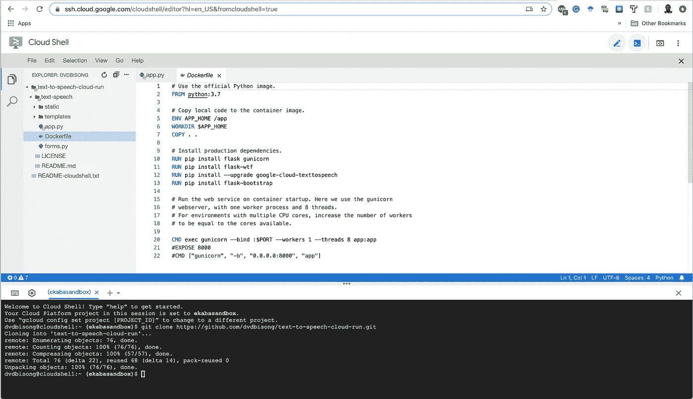
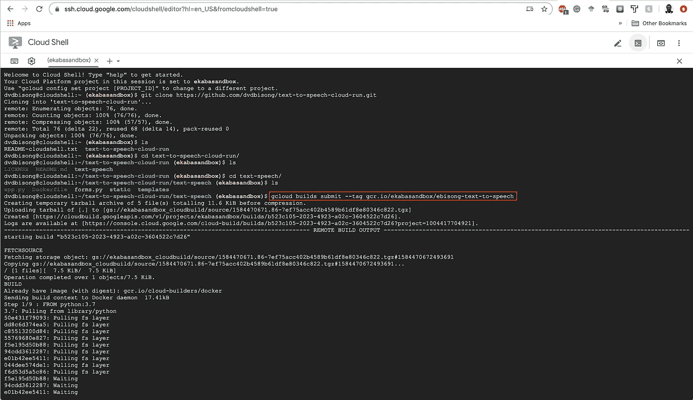
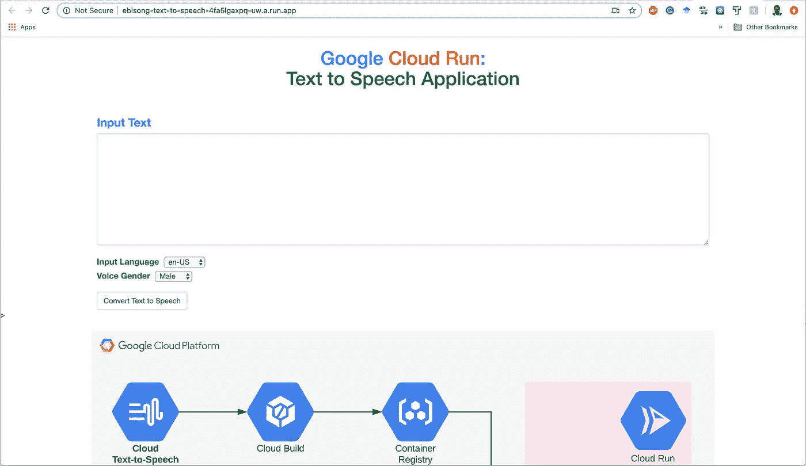

# 云运行:谷歌云文本到语音 API

> 原文：<https://towardsdatascience.com/cloud-run-google-cloud-text-to-speech-api-dff308665c70?source=collection_archive---------33----------------------->

## 使用 Google Cloud Run 提供智能 API



Google 文本到语音转换 API 服务于**云运行**。

# 目录

*   [在谷歌云上运行](#05ab)
*   [在谷歌云文本到语音转换 API 上](#78c8)
*   [申请代码](#3194)
*   [docker file](#6acb)
*   [使用云构建构建映像，并上传到容器注册表](#a1a5)
*   [使用云运行部署容器](#245c)
*   [结论](#1978)

# 在谷歌云上运行

Google Cloud Run 于 2019 年 11 月左右正式发布。它提供了一个完全托管的无服务器执行平台，通过 HTTP 驱动的容器来抽象无状态代码部署的基础设施。Cloud Run 是一个 Knative 服务，利用相同的 API 和运行时环境，可以构建基于容器的应用程序，这些应用程序可以在任何地方运行，无论是在 Google cloud 或 Anthos 上部署，还是在云上。作为一个“无服务器执行环境”，Cloud Run 可以根据正在运行的应用程序的计算需求进行扩展。应用代码的即时执行、可扩展性和可移植性是 Cloud Run 的核心特性。

# 关于谷歌云文本到语音转换 API

Google Cloud Text-to-Speech 公开了一个 API 来从文本合成听起来自然的语音。文本及其相应的语音输出可以是不同的语言，包括英语、法语、俄语和阿拉伯语，仅举几例。这种最先进的 API 为将逼真的高保真文本到语音交互集成到最终用户应用程序中提供了多种机会。


**图 1:** 谷歌云文本到语音转换 API。

## 用于身份验证的服务帐户

要使用 Google Cloud 文本到语音转换 API，我们必须创建一个**服务帐户密钥**用于身份验证。服务帐户对应用程序或虚拟机(VM)进行身份验证，以在 Google 云平台上进行授权的 API 调用。

使用以下链接为云文本到语音转换 API 创建服务帐户。-> [云语音合成服务账号](https://console.cloud.google.com/apis/credentials/serviceaccountkey?_ga=2.228131353.560260692.1584281699-246233217.1575482579&_gac=1.128859262.1582203091.Cj0KCQiA-bjyBRCcARIsAFboWg3ZXsO3kRXR_6ptPfIz4J0NJC6GlKoZTiQblYf4wcSyxL80xKX1xtMaAhwoEALw_wcB)。


**图 2:** 为文本到语音 API 创建一个服务账户。

使用以下参数:
- **服务账号:**新服务账号。
**-服务账户名称:**【指定名称】。
**-角色:**不需要角色。
点击`Create without role`，将包含密钥的 JSON 文件下载到您的电脑。

在创建并下载您的安全服务帐户密钥之后，将环境变量`GOOGLE_APPLICATION_CREDENTIALS`设置为包含您的服务帐户密钥的 JSON 文件的路径(参见图 3)。

# 应用程序代码

这个项目的代码托管在一个 Github 库中，链接为[https://github.com/dvdbisong/text-to-speech-cloud-run](https://github.com/dvdbisong/text-to-speech-cloud-run)。Python 文件`app.py`包含了通过 HTTP 访问容器化应用程序的逻辑。代码在`text-speech`目录下，可以在**谷歌代码编辑器(云壳的一个组件)**上查看。代码有注释，容易理解。



**图 3:**Python 文件 app.py 中的应用代码。

**将服务账户密钥上传至应用程序**

上传服务帐户密钥以验证调用文本到语音转换 API 的应用程序。上传后，将密钥放在`text-speech`文件夹中。


**图 4:** 上传服务账号密钥。

# 文档文件

docker 文件概述了创建容器映像的方法。这个项目的 Dockerfile 文件基于官方的 Python 图像。Dockerfile 指定了构建映像时将安装在容器上的相关包。Flask 应用程序使用`gunicorn`包来公开访问容器内应用程序的端口。**在谷歌代码编辑器上，**导航至`text-speech`查看 docker 文件。



**图 5:** Dockerfile 为应用程序容器构建映像。

为了完整起见，下表总结了 Dockerfile 文件中使用的命令。

```
+------------+-----------------------------------------------------+
| **Command**    | **Description** |
+------------+-----------------------------------------------------+
| **FROM**       | The base Docker image for the Dockerfile.           |
| **RUN**        | It executes commands on top of the current image as | |              new layers.                                         |
| **COPY**       | Copies files from the local machine to the          |
|              container filesystem.                               |
| **CMD**        | Specifies the command to execute when running the   |   |              container. This command is overridden if another    |   |              command is specified at runtime.                    |
| **WORKDIR**    | Sets the working directory of the container.        |
| **ENV**        | Set Environment variable as a key-value pair that   | |              will be available in the container after building.  |
+------------+-----------------------------------------------------+
```

# 使用云构建构建映像，并上传到容器注册中心

Cloud Build 是一项 GCP 服务，用于自动化代码工件的部署，作为 CI/CD 管道的一部分。这里，Cloud Build 用于构建 Docker 映像，作为一系列构建步骤，完成的映像被推送到 Google 容器注册表。

以下代码使用云构建构建映像，并将映像上传到容器注册。从目录`text-speech`运行这段代码。

```
gcloud builds submit — tag gcr.io/ekabasandbox/ebisong-text-to-speech
```

其中，
- `ekabasandbox`为 GCP 项目 ID，
- `ebisong-text-to-speech`为图像名称。
**确保根据需要修改这些参数。**



**图 6:** 使用云构建构建映像。

# 使用云运行部署容器

要将存储在 **Google 容器注册表**上的容器部署到**云运行**，请执行以下代码:

```
gcloud run deploy --image gcr.io/ekabasandbox/ebisong-text-to-speech --platform managed
```

选择要部署托管云运行计算的地区(例如美国中心 1)。当提示输入服务名时，按`Enter`接受缺省值，并在询问是否允许未认证调用时响应`y` (yes)。

当容器部署到云运行时，点击 URL 查看正在运行的应用。
[](https://ebisong-text-to-speech-4fa5lgaxpq-uw.a.run.app/)**你可以继续探索应用了。**

****

****图 7:** 云 Run 上托管的文本到语音应用。**

# **结论**

**本文提供了一个在 Cloud Run 上部署进行 API 调用的应用程序的示例。它提供了使用 Google Cloud 文本到语音转换 API 和使用 Flask 运行简单 web 应用程序的示例代码，Flask 被打包成一个容器并部署在 Cloud Run 上。整个应用程序在 https://github.com/dvdbisong/text-to-speech-cloud-run 是开源的。最后，确保删除云运行服务，以及云容器注册表中不再需要的图像。**