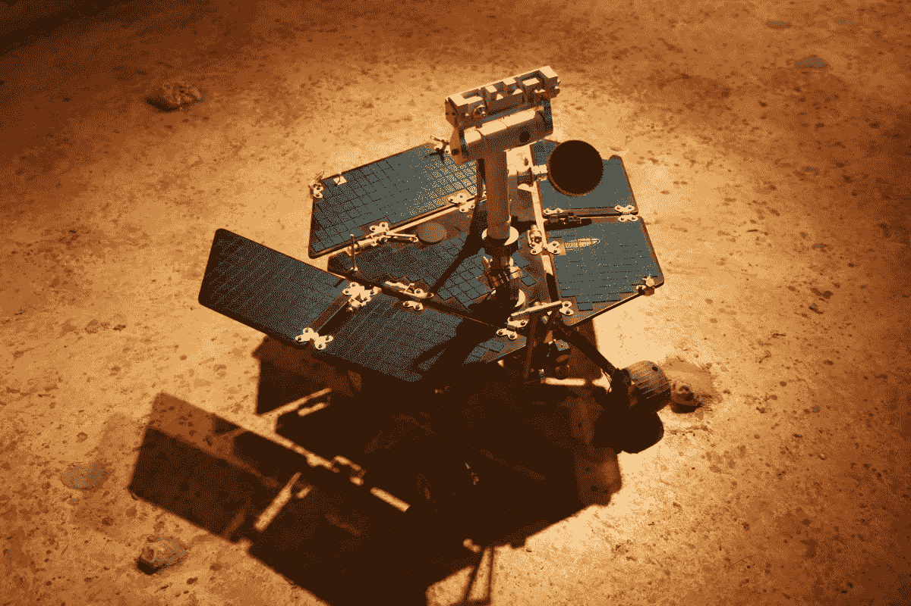
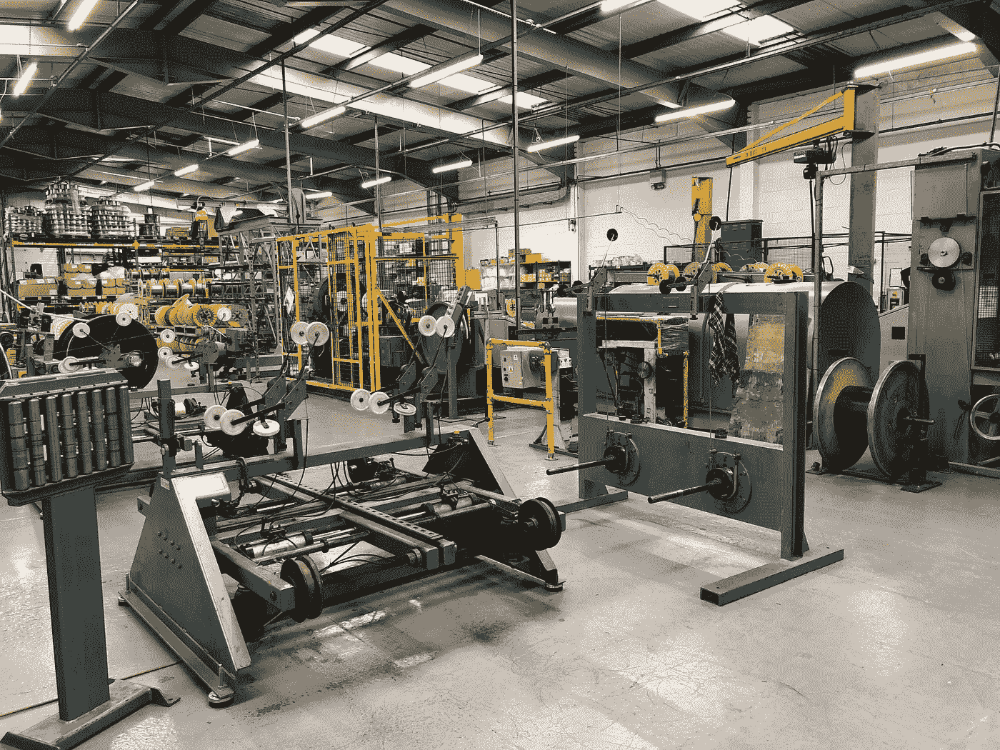

# 云 vs 边缘:工业制造的困境

> 原文：<https://towardsdatascience.com/cloud-vs-edge-an-industrial-manufacturing-dilemma-44472f01cf45?source=collection_archive---------37----------------------->

## 当涉及到为应用程序部署人工智能时，制造商不仅需要深入思考开发什么，还需要思考设想的人工智能系统的物理化身。

图片由 [Flickr](https://www.flickr.com/photos/168786394@N05/48079451462/in/photolist-2gfBKRG-dEybcd-8TDFhb-7SSLkM-7SW3xh-2gr2nDx-Rz1B7a-dXTCJe-RmHB5S-R8zbfQ-7ktd1u-7kpiAt-7ktcPJ-Myw1w2-dWzCUp-efhrzk-MML2Cp-2h5ARhQ-9zALPj-9aXgpG-ZgGx5o-fbNckF-b8aoSH-b8arkc-9GvMhf-efwZLM-b8atnM-fvTRW2-29k3oWh-91z6Eo-6pABZ8-2h8dMVL-Wrr2UG-aNxVLK-4z3omV-4z7CQJ-aS8oqx-ekXUoo-Rf9aM7-9aU3wz-9aXjnw-aS8HTZ-2htjpWP-pQ6Ken-LPgq61-b8ayve-b8awer-dZwwJ7-e1dGQz-2h6JfeX) 提供

通常，深度学习是人工智能应用的子种类，由于在大规模部署现实世界工作人工智能方面的成功，在过去几年中获得了关注，它是作为云支持的软件即服务(SaaS)平台提供的。

这对于许多制造商来说是行不通的，他们倾向于避免依赖云的软件带来的安全性和延迟问题，以管理日常复杂的工作流程。

幸运的是，技术在不断发展，在 2020 年，这个行业将面临挑战，深度学习和人工智能的范式变革将有利于制造业的需求。

但首先，让我们理解我们所说的深度学习是什么意思，以及硬件——云和边缘——如何发挥如此重要的作用。

# 引擎盖下:艾

人工智能的通用名称隐藏了各种方法，从在分布式云基础设施上处理数据的巨大人工智能模型，到在小型处理器上分析和挖掘数据的小型边缘友好人工智能。

让我们简化一下，把人工智能分成两个主要的类别，重型和轻型。重型人工智能需要大型计算基板来运行，而轻型人工智能可以在小型计算足迹上做重型人工智能能够做的事情。

GPU 等商用处理器的引入，以及后来它们的便携性，使得将人工智能/深度学习/DNN/神经网络算法带到边缘在技术上和经济上都是可行的。

从直觉上来说，边缘人工智能计算是一个伟大的想法:通过将一些生物计算转移到外围，从我们的传感器(例如，眼睛，耳朵，皮肤)到我们的器官和肌肉，大自然母亲已经在亿万年的进化时间里发现了这一点，世界上的大部分“数据”都是在有机体探索他们的世界时产生的。

同样，制造商利用这一特性也很有意义。以工业机器中的质量控制摄像机为例，典型的机器每秒可以处理几十帧，每小时可以处理数百个产品。对于这些相机来说，将所有捕捉到的帧运送到一个中央云进行人工智能处理将是极其浪费和低效的。相反，更智能的策略是在边缘处理它们，并偶尔将相关的、非常重要的帧(例如，具有可能的产品缺陷的帧)发送到中央位置或人工分析师。

带宽、延迟和成本等问题决定了边缘处理的需求。

不过有一个重要的警告:在小型计算边缘运行人工智能——行话中称为推理或“预测”(例如，我看到一个正常的产品与一个有缺陷的产品)不同于在边缘学习。也就是说，使用获得的信息来改变、改进、校正和提炼边缘人工智能不仅困难，而且对于制造商来说，能够快速定制他们的人工智能以实现灵活性是极其重要的

# 边缘(与云)学习:现实

图片由 [Flickr](https://www.flickr.com/photos/animenut/3490769436/in/photolist-6jt78W-jviUpU-jv952P-jvgWtC-jvjKbS-jvgC4i-6joW12-jvfnv3-jvg6wY-jvgDyn-jvaT4F-jvgvtV-jvcVvU-jvcXmB-jveYGP-jviKsW-M6oUsY-42oyZs-jvhBYY-jvbvCH-jvjj1b-jvcjdM-25RED8U-CAo6qH-jvgimE-jvdPSg-23rqh8X-jvcHzj-2jpp5Nw-XwPhCb-jvh65U-jveGei-jvfJ4Y-jveQ5P-jvciF6-jvgg5Y-jvcXii-jvhXBW-jvdUJ9-jvdywL-jvcS6A-jvgR9E-jvfnhg-29XQ5rG-jvgGn9-jviccy-jv9HwD-2askcLq-HSYgaJ-2icnMm5) 提供

我第一次意识到[与 NASA](https://www.nasa.gov/directorates/spacetech/spinoff/feature/Brain_for_Cars_Tested_for_Mars/) 的巨大差异是在 2010 年，当时我和我的同事实施了一个小型大脑仿真来控制一个类似火星漫游车的人工智能设备，该设备需要能够在边缘运行和学习。

对于美国宇航局来说，机器人能够完全独立于地球上任何可用的计算能力来学习“新事物”是非常重要的。数据瓶颈、延迟和大量其他问题使得探索自那时以来开发的不同种类的人工智能变得至关重要。能够消化和学习的算法——即，根据可用数据调整人工智能的行为——不需要大量的计算能力、数据和时间。传统的深度神经网络(DNN)模型无法做到这一点。

我们建立了这样的人工智能，我们称之为终身深度神经网络([终身-DNN](https://www.enterpriseai.news/2019/06/11/deep-learning-that-keeps-learning-near-time-training-at-the-edge/) )，因为它有能力在一生中学习(而传统的 DNN 只能在部署前学习一次)。

我们不知道这个人工智能在地球上会比在火星上更有用。

# 工业制造商边缘学习的力量

图片由 [Flickr](https://www.flickr.com/photos/156999189@N04/30237300687/in/photolist-N4Y53t-2hbzGyQ-7zRkM9-7zMzQ2-7zMzE2-7zRkAY-7zMzHt-wkYEUW-wkZsdJ-wkYbXW-wCAhMi-wCBXp6-vFAyry-wBUAih-2b7ecKE-25jG1mQ-7zMzKv-PG5JqL-N4XZZZ-N4Y2wM-PG5F6u-azMtHt-5FVZ4b-2bQ2BvB-2ebRe1s-N4Y3XH-e2KEdK-bM1ThD-2aJdmoY-PG5MeG-f7jy3a-PG5NTo-2i29yDT-fvyNKy-2dRD7My-by7cAs-bM1TeR-dMqrDV-2aJdkJw-8vLt41-naVyy8-nqnhEq-ns97mZ-nssiuC-2aJdmfS-dMqrfH-nuavSK-2bQ2t6F-nsrFbf-9tqhP4) 提供

边缘学习解决了当今人工智能实现的一个燃眉之急:它的不灵活性和缺乏适应性。当可用时，人工智能算法可以在大量数据上进行训练，如果所有数据都被事先捕获用于训练，则人工智能算法相当健壮。不幸的是，这并不是制造业的工作方式，因为在生产线上不可预测地出现少数不良产品之前，数据(例如不良产品)通常是不可用的。人工智能需要能够快速利用这些不同的、罕见的数据来适应，但传统的 DNNs 无法在这些现实条件下工作。

诸如 lifetime-DNN(一种能够在计算边缘(如 CPU)进行学习的深度学习范式)等新方法使人工智能相机不仅能够理解向它们提供的数据，而且能够适应和学习。例如，在上述工业机器中，边缘学习将使其数十个摄像机能够学习新产品类型和缺陷，在现实世界的场景中，新产品一直在引入，新的、以前看不到的缺陷出现在生产车间。

不可能存在可以在新创造的产品上预先训练的人工智能。数据根本不存在:AI 需要现场训练！

通过边缘学习，人工智能可以学习识别新的缺陷，而不必从头开始对人工智能进行“重新编程”，直接在需要的边缘进行。

在边缘学习的人工智能是一种范式转变技术，最终将使人工智能真正服务于其目的:将智能转移到需要的计算边缘，其速度、延迟和成本使每个设备都可以负担得起。

这将使制造商能够廉价、快速、直接地在关键位置(边缘)构建其工业 4.0 战略的基石。