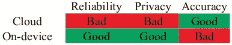
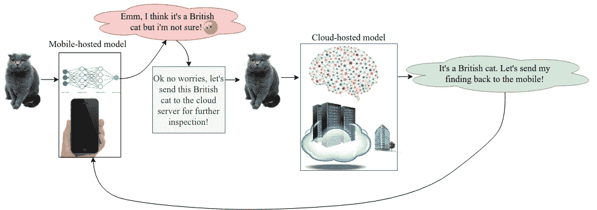
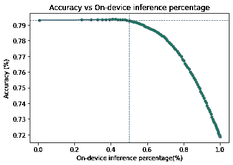

# 云 vs 设备上 AI？也许介于两者之间！

> 原文：<https://towardsdatascience.com/cloud-vs-on-device-ai-maybe-something-in-between-4242af8d3b5c?source=collection_archive---------48----------------------->

## 只有在需要放在云上的时候，才把你的 AI 放在云上。

云还是设备智能？或者介于两者之间？在这篇短文中，我们展示了一种简单的移动设备和云之间的协作方法如何帮助您将 50%的宝贵数据卸载到云中，同时实现相同的云级准确性。

# 云与设备上人工智能:利弊

让我们回顾一下云与设备上人工智能的利弊。设备上的人工智能通过提供更好的隐私和独立于远程资源而使我们受益，但由于缺乏强大的计算资源，该模型可能不是非常准确。另一方面，云人工智能通过提供比移动设备上托管的模型更准确的模型而使我们受益，但需要持久的网络连接，这可能使其不可靠。

云与设备上人工智能的利弊。作者照片。

# **只在需要使用云 AI 的时候使用云 AI**

该方法基于对神经网络的置信度设置阈值。如果网络对它的预测有信心，那么我们就没事了，如果没有，我们需要向更智能的云托管模型寻求帮助！假设您想要对 [ImageNet 数据集](http://www.image-net.org/)的 1000 个对象进行分类。假设我们使用 MobileNetV2 作为移动设备上的轻量级模型，使用 ResNext101 作为我们最精确的(但是很大！)云上的模型。方法很简单:

> 嘿手机！如果你对自己的预测不确定，就把推理卸载到云上吧！

如果你对自己的预测不确定，就把推理卸载到云上吧！作者照片。

我们将 softmax 概率视为预测的置信水平，并在移动预测的置信水平上设置阈值。我们在 ImageNet 上使用 [torchvision 预训练模型](https://pytorch.org/docs/stable/torchvision/models.html)，对于 MobileNetV2 和 ResNext101 分别有 71.88%和 79.31%的准确率。

该曲线示出了分类准确度相对于决定在移动设备上推断的测试输入的百分比。作者照片。

**曲线解读:**如果所有推理案例都在云服务器上进行，那么准确率将为 79.31%，这是 ResNext101 的准确率。如果所有的推理案例都在移动设备上进行，那么准确率将是 71.88%。如果 49.88%的推理案例在移动设备上执行，其余的在云上执行，那么我们仍然可以实现 79.31%的云级准确率。

简而言之，我们并不总是需要云服务器来为我们的应用程序添加人工智能。我们可以在弱设备上托管小模型，并在预测不确定的情况下调用云服务器。校准神经网络的置信水平可以进一步增加本地执行的推理案例的百分比。

作者要感谢 Mohammad Saeed Abrishami 在这篇博文中的帮助。