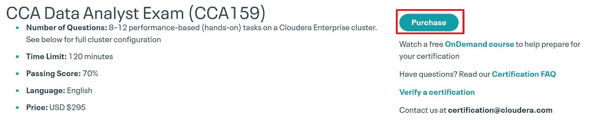
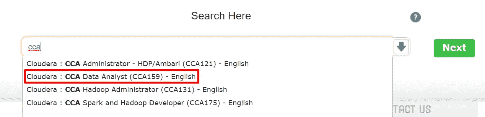
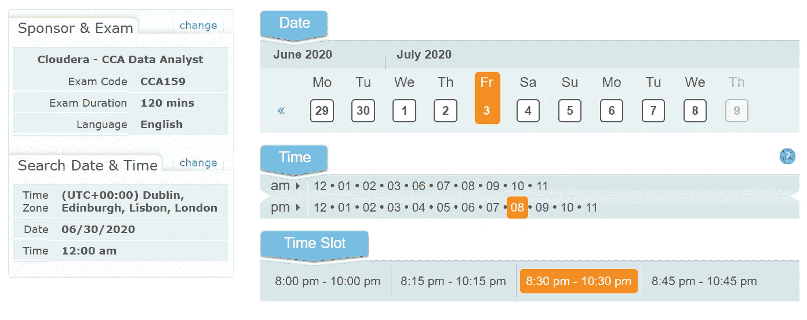

# Cloudera 认证数据分析师(CCA 159)-指南

> 原文：<https://towardsdatascience.com/cloudera-certified-data-analyst-cca-159-a-guide-cf6fe686e0e6?source=collection_archive---------32----------------------->

照片由[威廉·布特](https://unsplash.com/@williambout?utm_source=medium&utm_medium=referral)在 [Unsplash](https://unsplash.com?utm_source=medium&utm_medium=referral) 拍摄

Cloudera 是数据分析领域最知名的公司之一。他们提供服务，尤其是在大数据领域，被认为是主要参与者之一。几乎所有的职业都有各自领域的相关证书。认证本质上是证明你是该领域的专家。来自最高权威的认证在简历上很重要，招聘人员总是试图找到有认证的人。像所有其他科技公司一样，Cloudera 提供了一系列大数据分析相关技术的认证。他们的考试都是全动手，在业内口碑极好。

Cloudera 认证数据分析师(CCA 159)是主流大数据工具(如 Apache Hive 和 Apache Impala)的基础考试。本指南适用于任何准备注册 CCA 159 考试的人。我假设您已经对 Cloudera 的生态系统有了一些经验。如果没有，我会鼓励你练习使用 [Cloudera 的 quickstart VM](http://www.cloudera.com/content/support/en/downloads/quickstart_vms.html) ，可以在他们的网站上下载。最后我会写下一些免费的资源做准备。我按照我认为最适合准备的顺序写下这些步骤。

为了了解你将要进入的领域，请访问 Cloudera 网站上的 CCA 主页并仔细阅读。你将了解教学大纲、考试时间等。需要记住的一些重要事项是:

*   考试代金券价格 **$295** (自购买之日起一年内有效)。
*   持续时间为 **120 分钟**，您将在 Cloudera 提供的实时集群上解决**8–12**动手操作问题。
*   通过标准为 **70 %** ，CCA 证书的有效期为两年。

Cloudera 创建了一个[免费视频课程](https://ondemand.cloudera.com/courses/course-v1:Cloudera+CertPrep+101/course/)，告诉你所有关于各种 Cloudera 考试的信息，并提供备考技巧。在这些视频中也有一些简单的问题场景。只需在 Cloudera 大学注册，然后[在 Cloudera: CertPrep 101 注册](https://ondemand.cloudera.com/courses/course-v1:Cloudera+CertPrep+101/course/)

请务必阅读 CCA 主页上的[常见问题部分。你会得到任何问题的答案。如果您有任何进一步的问题，也可以发电子邮件至 certification@cloudera.com](https://www.cloudera.com/about/training/certification/faq.html)**[。](mailto:certification@cloudera.com)**

**我会建议在这个时候选择一个考试日期。这样你就会知道你有多少时间准备；所以，可以更好的规划。考试券可以用信用卡直接从 [CCA 主页](https://www.cloudera.com/about/training/certification/cca-data-analyst.html)购买。只需点击购买按钮，将其添加到购物车并继续付款。**

****

**Cloudera 已经与[examples local](https://www.examslocal.com/)合作进行考试。所以，你也必须报名参加。很简单:你从 Cloudera 购买考试券，然后在[exam local](https://www.examslocal.com/)的监督下参加考试。记住你想。使用您在 Cloudera 网站上注册时使用的同一电子邮件地址。**

**通过 examslocal 选择考试的确切日期非常简单。搜索 CCA 认证，从下拉列表中选择 CCA 159，并选择所需的日期和时间。**

********

**CCA 考试是在线的，也就是说，你可以在任何地方使用带有网络摄像头和互联网连接的笔记本电脑参加考试。浏览 examslocal 上的[FAQ](https://www.psionline.com/en-gb/certification/faq/cloudera/)和[兼容性检查工具](https://www.examslocal.com/ScheduleExam/Home/CompatibilityCheck)来检查您的笔记本电脑的兼容性。**

# ****备考****

**CCA 考试是实践性的，即你将执行考试中的任务，而不是回答多项选择题。对于 CCA 159，您必须拥有 Cloudera 生态系统的实际知识，特别是 Hive (HQL)、Impala (impala SQL)。你应该非常熟悉数据定义(DDL)、数据查询(DQL)、窗口函数、文件格式等概念。截止到教学大纲的最新变化，Cloudera 已经将 Sqoop 排除在 CCA 159 之外。考试相关信息可以在 [CCA 159 主页](https://www.cloudera.com/about/training/certification/cca-data-analyst.html)找到。以下是一些免费的准备资源，供您参考:**

*   **itversity' s [YouTube 播放列表(CCA 159——数据分析师)](https://www.youtube.com/playlist?list=PLf0swTFhTI8ot9JViW0_QLDEp71Q0PUNI)这是基于他们的 [Udemy 课程。](https://www.udemy.com/course/cca-159-data-analyst-using-sqoop-hive-and-impala/)您可以免费观看视频，并使用 Cloudera 的 VM 进行练习。**
*   **Packt 还有一个 [CCA 159 课程](https://www.oreilly.com/library/view/cca-159-expert/9781839218934/)，可以通过 Oreilly 获得。虽然 Oreilly 是一个付费服务，但你可以从他们的免费试用中受益。**
*   **样题可以看这个 [YouTube 播放列表](https://www.youtube.com/playlist?list=PLnQL3JwXMDv1l58Y52d8gakt4pYrdApOb)由 Hadoop pass。**
*   **考试时只能从[蜂巢](https://cwiki.apache.org/confluence/display/Hive/LanguageManual)和[黑斑羚](https://docs.cloudera.com/documentation/enterprise/5-10-x/topics/impala.html)的官方文档中获得帮助。强烈建议了解如何使用该文档。所以，你必须练习使用它。**
*   **Cloudera 不为任何考试提供模拟考试设施。但是，有第三方网站提供模拟考试。这些都是付费服务，你应该在继续之前检查其真实性。**

**像这样的考试，时间管理是最重要的。大多数问题都很简单，但是你没有时间了，所以，请记住这一点。在考试期间把自己隔离起来，这样就没有外界的干扰，你可以真正集中注意力。参加考试后，您将在 3 天内通过电子邮件收到报告。成功完成后，将在一周内通过电子邮件收到数字证书和许可证号。**

**我希望这本指南能成为一个很好的资源。快乐学习！**