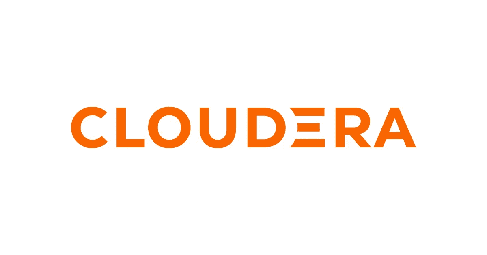

# Cloudera 的 CCA 175—2020 年更新:什么改变了，什么没有改变，以及如何准备考试

> 原文：<https://towardsdatascience.com/clouderas-cca-175-the-2020-update-what-changed-what-didn-t-and-how-to-prepare-for-the-exam-716413ff1f15?source=collection_archive---------19----------------------->

## Cloudera 的 CCA-175 认证的新版本删除了所有的遗留工具，并将重点完全放在 Apache Spark 上

Cloudera 的标志

几周前，Cloudera 重新推出了他们的 Spark 和 Hadoop 开发人员考试(CCA 175)，更新了考试环境和一系列考试内容的关键更新。

考试继续采用动手操作的方式，包括一组 8 至 12 项基于性能的任务，考生需要在 Cloudera Quickstart 虚拟机上使用命令行执行这些任务，并可以访问大多数大数据工具(Hive、Spark 和 HDFS 都可以通过相应的命令访问)。

如果您计划在接下来的几周内参加考试，以下是您在备考时需要记住的关键要素以及最重要的工具和功能:

# 这都是关于火花

由于某种原因，Cloudera 一直在 CCA 175 考试中给出至少两个与 Sqoop 相关的任务，直到 2019 年的最后几个月。尽管 Sqoop 在过去十年开始时被广泛使用，但几年来它更多的是一种遗留工具，只有非常有限的几家公司仍然希望应聘者熟悉它。

幸运的是，Cloudera 接受了提示，从考试中删除了与 Sqoop 相关的任务。与 Flume 相关的任务(不那么频繁)也被删除，使得考试完全集中在大数据最重要的工具 Apache Spark 的使用上。

2020 版本的关键更新是，Spark 2.4 现在默认在考试环境中提供(而不是 Spark 1.6)，可以通过 Spark Shell(对于 Scala)和 Pyspark(对于 Python)访问，或者甚至可以通过 Spark-submit(如果您更喜欢在执行考试任务时使用脚本)访问。Spark 2.4 引入了[一组非常有用的功能](https://databricks.com/blog/2018/11/08/introducing-apache-spark-2-4.html)，使得在考试中表现良好变得更加容易，尤其是在处理 Avro 文件时。

# 熟悉 Hive 和 HDFS

考试中的某些任务仍然需要阿帕奇蜂巢和 HDFS 的基础知识。主要是，您需要熟悉使用与数据位置(如果要求您创建外部表)及其格式相关的不同选项创建 Hive 表的过程。

此外，在某些时候，考生将需要使用 HDFS 命令(主要是`ls`和`tail`)来确定输入数据的存储格式，并初步了解他们将处理的数据。

考试的新版本肯定是面向 Spark 的，但不知道基本的 Hive 和 HDFS 命令会让你付出多项任务的代价，并最终阻止你获得证书。

# 读取、处理、写入

考试的任务其实是同一个问题的不同版本。您必须使用 Spark 以某种格式(主要是文本或拼花)从 HDFS 读取数据，通过过滤器、映射、聚合和连接对其进行处理，然后以不同的格式并使用某种压缩编解码器将其写回 HDFS。

掌握这一过程将保证你在考试时有一个愉快的体验，因为你会被要求在不同的数据集上做多次。

时间管理也是一个重要的因素，所以确保在考试开始时阅读所有的任务，然后立即开始你最熟悉的任务。

总而言之，Cloudera 摆脱了传统技术，设计了一种面向 Spark 的考试，这种考试与当今时代的数据工程任务相关。虽然该考试不需要处理优化或高级 Spark 知识，但它仍然是证明一个人熟悉 Apache Spark 的好方法。