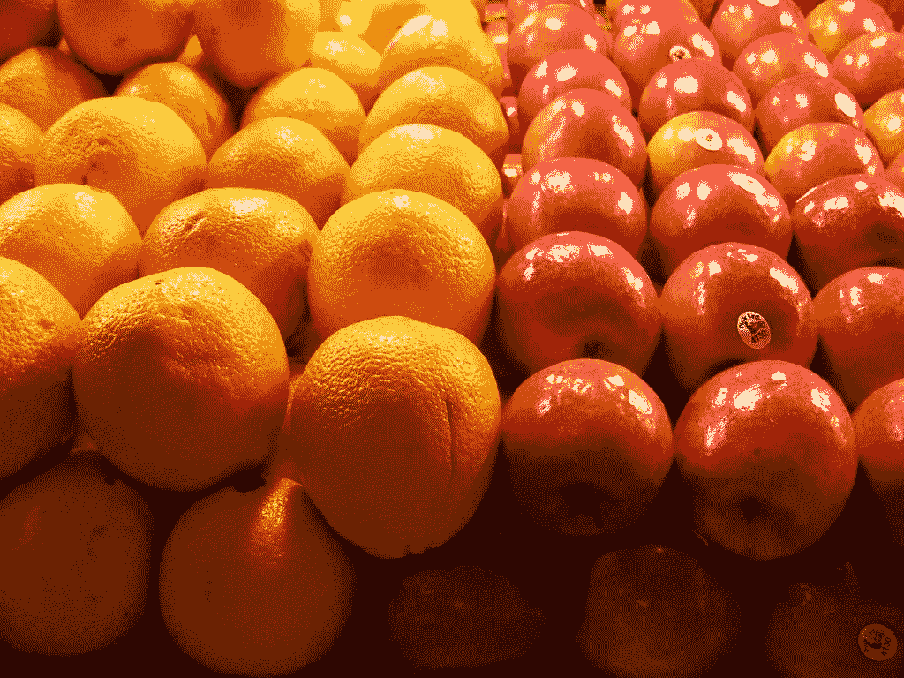
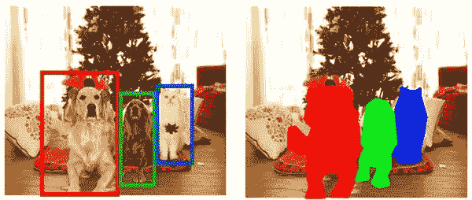
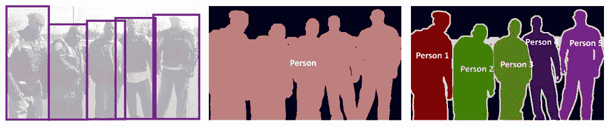
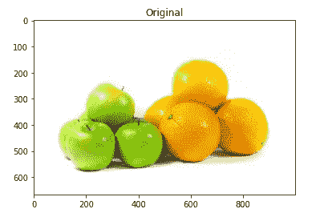
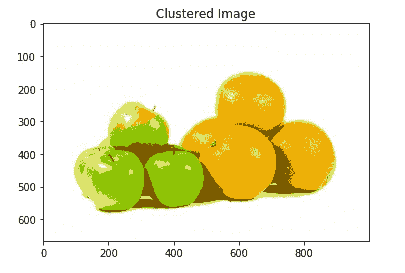

# 基于聚类的图像分割-Python

> 原文：<https://towardsdatascience.com/cluster-based-image-segmentation-python-80a295f4f3a2?source=collection_archive---------16----------------------->



个人电脑:Flickr

## 理解图像分割

最近，我在进行一项图像分类任务，首先我想在将图像输入模型之前，从图像中捕捉感兴趣的区域。我尝试了一种称为基于聚类的图像分割的技术，它帮助我将模型性能提高了一定的水平。让我们看看它是什么和一些样本代码做集群分割，你可以在底部找到 Jupyter 笔记本。

## 什么是图像分割？

想象一下，你要过马路了，你过马路之前做了什么？

首先，你看到道路的两边，以确定接近的车辆和其他环境物体，然后你对接近速度进行一些惊人的估计，并决定何时以及如何过马路。所有这些都发生在很短的时间内，这是多么不可思议。

1.  我们的大脑捕捉道路两边的图像
2.  它检测道路上的车辆和其他物体
3.  不仅在此之前检测它确定它检测的每个对象的形状==图像分割

我们的大脑是多么神奇，通过确定不同物体的形状，它能够在同一张快照中检测到多个物体。

让我进一步解释，假设我们有图像分类模型，它能够以超过 95%的准确率对苹果和橙子进行分类。当我们输入一个既包含苹果又包含橘子的图像时，预测精度会下降。随着图像中对象数量的增加，分类模型的性能会下降。这就是**对象定位**发挥作用的地方。

在我们检测图像中的对象并对其进行分类之前，模型需要理解图像中有什么，这就是图像分割有所帮助的地方。它为图像中的对象创建了一个像素级遮罩，这有助于模型在更精细的级别上理解对象的形状及其在图像中的位置。



对象检测与图像分割 PC:中型

## 细分的类型有哪些？

图像分割大致分为两大类。

1.  语义分割
2.  实例分割



检测到的对象—语义段—实例段 PC: mc.ai

在第一幅图像中，我们可以看到被检测的对象都是男性。在**语义分割**中，我们认为所有这些像素属于一类，所以我们用一种颜色来表示它们。另一方面，在**实例分割**中，那些像素属于同一类，但是我们用不同的颜色表示同一类的不同实例。

根据我们使用的方法，细分可以分为许多更窄的类别。

*   基于区域的分割
*   基于边缘检测的分割
*   基于聚类的分割
*   基于 CNN 的分割等等。

正如我在开头所承诺的，在本文中我只给出一个基于集群的分段的例子。

## 什么是基于聚类的细分？

回忆一下你对聚类算法的理解。聚类算法用于将彼此更相似的数据点从其他组数据点中更紧密地分组。

现在想象一个包含苹果和桔子的图像。苹果里的像素点大部分应该是红/绿，和橙色的像素值不一样。如果我们能把这些点聚集起来，我们就能正确地区分每个物体。这就是基于聚类的分段的工作方式。现在让我们看一些代码示例。

```
from skimage.io import imread
from skimage.color import rgb2gray
import numpy as np
import matplotlib.pyplot as plt
%matplotlib inline
from scipy import ndimage# Scaling the image pixels values within 0-1
img = imread('./apple-orange.jpg') / 255plt.imshow(img)
plt.title('Original')
plt.show()
```



个人电脑:Flickr

对于我们的肉眼来说，图像中有五个颜色段

1.  苹果的绿色部分
2.  橙子的橙色部分
3.  苹果和橘子底部的灰色阴影
4.  苹果顶部和右部的亮黄色部分
5.  白色背景

让我们看看是否可以使用 scikit-learn 中的 KMeans 算法对它们进行聚类

```
# For clustering the image using k-means, we first need to convert it into a 2-dimensional array
image_2D = img.reshape(img.shape[0]*img.shape[1], img.shape[2])# Use KMeans clustering algorithm from sklearn.cluster to cluster pixels in image
from sklearn.cluster import KMeans# tweak the cluster size and see what happens to the Output
kmeans = KMeans(n_clusters=5, random_state=0).fit(image_2D)
clustered = kmeans.cluster_centers_[kmeans.labels_]# Reshape back the image from 2D to 3D image
clustered_3D = clustered.reshape(img.shape[0], img.shape[1], img.shape[2])plt.imshow(clustered_3D)
plt.title('Clustered Image')
plt.show()
```



哇，真管用！！！我们能够将所有五个部分聚集在一起。这就是聚类分割的工作原理。

有许多先进的技术，如 Mask R-CNN，可以进行更细粒度的分割。让我们在其他文章中看到这些主题。我希望您现在对图像分割有了一定程度的了解。

你可以在[https://github . com/mathan Raj-Sharma/sample-for-medium-article/blob/master/cluster-based-segmentation-skimage/cluster-based-segmentation . ipynb](https://github.com/Mathanraj-Sharma/sample-for-medium-article/blob/master/cluster-based-segmentation-skimage/cluster-based-segmentation.ipynb)找到上面例子的笔记本