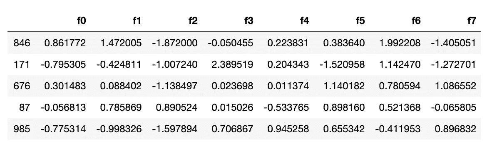
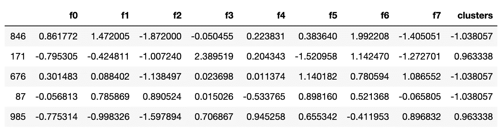
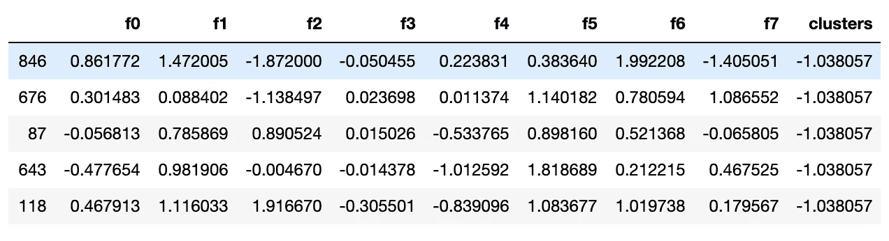
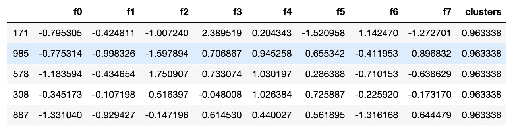
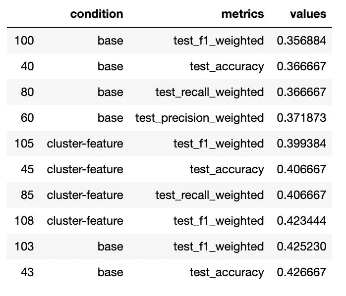
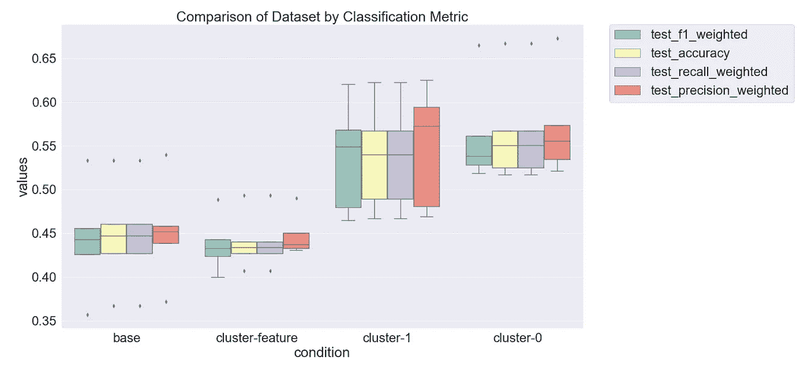
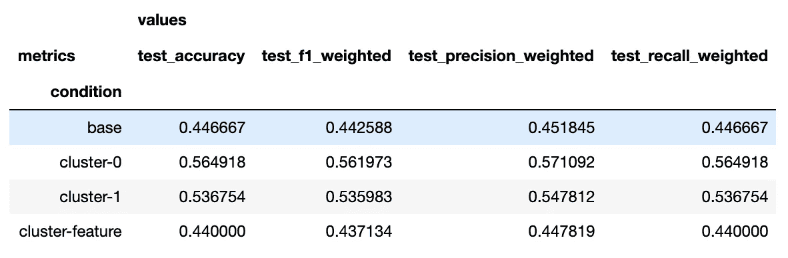

# 分类任务的先聚类后预测

> 原文：<https://towardsdatascience.com/cluster-then-predict-for-classification-tasks-142fdfdc87d6?source=collection_archive---------0----------------------->

## *如何在监督学习问题中利用无监督学习*

# 介绍

监督分类问题需要一个数据集，该数据集具有(a)一个分类因变量(“目标变量”)和(b)一组独立变量(“特征”)，这些变量可能(也可能不！)对预测班级有用。建模任务是学习将特征及其值映射到目标类的函数。这方面的一个例子是[逻辑回归](/building-a-logistic-regression-in-python-step-by-step-becd4d56c9c8)。

无监督学习采用没有标签的数据集，并试图在数据中找到一些潜在的结构。K-means 就是这样一种算法。在本文中，我将向您展示如何通过使用 k-means 发现数据集中的潜在“聚类”来提高分类器的性能，并使用这些聚类作为数据集中的新特征，或者按聚类对数据集进行分区，并在每个聚类上训练单独的分类器。

# 资料组

我们首先使用 sklearn 的 make_classification 实用程序生成一个 nonce 数据集。我们将模拟一个多类分类问题，并生成 15 个用于预测的特征。

```
from sklearn.datasets import make_classificationX, y = make_classification(n_samples=1000, n_features=8, n_informative=5, n_classes=4)
```

我们现在有一个 1000 行的数据集，有 4 个类和 8 个特征，其中 5 个是信息性的(另外 3 个是随机噪声)。为了便于操作，我们将这些转换成熊猫数据帧。

```
import pandas as pddf = pd.DataFrame(X, columns=['f{}'.format(i) for i in range(8)])
```

# 分为训练/测试

现在，我们可以将数据分为训练集和测试集(75/25)两部分。

```
from sklearn.model_selection import train_test_splitX_train, X_test, y_train, y_test = train_test_split(df, y, test_size=0.25, random_state=90210)
```

# 应用 K-均值

首先，您将想要确定给定数据集的最佳 *k* 。

为了简洁起见，也为了不偏离本文的目的，我向读者推荐这篇优秀的教程:[如何确定 K-Means 的最优 K？如果你想进一步了解这件事。](https://medium.com/analytics-vidhya/how-to-determine-the-optimal-k-for-k-means-708505d204eb)

在我们的例子中，因为我们使用了 make_classification 实用程序，所以参数

```
n_clusters_per_class
```

已经设置，默认为 2。因此，我们不需要确定最优的*k；然而，我们确实需要识别集群！我们将使用以下函数来查找训练集中的 2 个分类，然后为我们的测试集预测它们。*

```
import numpy as np
from sklearn.cluster import KMeans
from typing import Tupledef get_clusters(X_train: pd.DataFrame, X_test: pd.DataFrame, n_clusters: int) -> Tuple[pd.DataFrame, pd.DataFrame]:
    """
    applies k-means clustering to training data to find clusters and predicts them for the test set
    """
    clustering = KMeans(n_clusters=n_clusters, random_state=8675309,n_jobs=-1)
    clustering.fit(X_train)
    # apply the labels
    train_labels = clustering.labels_
    X_train_clstrs = X_train.copy()
    X_train_clstrs['clusters'] = train_labels

    # predict labels on the test set
    test_labels = clustering.predict(X_test)
    X_test_clstrs = X_test.copy()
    X_test_clstrs['clusters'] = test_labels
    return X_train_clstrs, X_test_clstrsX_train_clstrs, X_test_clstrs = get_clusters(X_train, X_test, 2)
```

我们现在有了一个新的特性，叫做“集群”，值为 0 或 1。


# 缩放比例

在我们拟合任何模型之前，我们需要缩放我们的特征:这确保所有的特征都在相同的数字尺度上。对于像逻辑回归这样的线性模型，在训练期间学习的系数的大小将取决于特征的尺度。如果您有 0-1 范围内的要素，而其他要素的范围为 0-100，则无法可靠地比较这些系数。

为了扩展这些特征，我们使用下面的函数来计算每个特征的 z 分数，并将训练集的学习映射到测试集。

```
from sklearn.preprocessing import StandardScalerdef scale_features(X_train: pd.DataFrame, X_test: pd.DataFrame) -> Tuple[pd.DataFrame, pd.DataFrame]:
    """
    applies standard scaler (z-scores) to training data and predicts z-scores for the test set
    """
    scaler = StandardScaler()
    to_scale = [col for col in X_train.columns.values]
    scaler.fit(X_train[to_scale])
    X_train[to_scale] = scaler.transform(X_train[to_scale])

    # predict z-scores on the test set
    X_test[to_scale] = scaler.transform(X_test[to_scale])

    return X_train, X_testX_train_scaled, X_test_scaled = scale_features(X_train_clstrs, X_test_clstrs)
```

我们现在准备运行一些实验！

# 实验

我选择使用逻辑回归来解决这个问题，因为它非常快，并且通过检查系数可以快速评估特征的重要性。

为了运行我们的实验，我们将在 4 个数据集上构建逻辑回归模型:

1.  没有聚类信息的数据集(基本)
2.  以“聚类”为特征的数据集(聚类-特征)
3.  df 的数据集["群集"] == 0(群集-0)
4.  df 的数据集[“群集”] == 1(群集-1)

我们的研究是 1x4 组间设计，以数据集[基础、聚类特征、聚类-0、聚类-1]为唯一因素。下面创建我们的数据集。

```
# to divide the df by cluster, we need to ensure we use the correct class labels, we'll use pandas to do that
train_clusters = X_train_scaled.copy()
test_clusters = X_test_scaled.copy()
train_clusters['y'] = y_train
test_clusters['y'] = y_test# locate the "0" cluster
train_0 = train_clusters.loc[train_clusters.clusters < 0] # after scaling, 0 went negtive
test_0 = test_clusters.loc[test_clusters.clusters < 0]
y_train_0 = train_0.y.values
y_test_0 = test_0.y.values# locate the "1" cluster
train_1 = train_clusters.loc[train_clusters.clusters > 0] # after scaling, 1 dropped slightly
test_1 = test_clusters.loc[test_clusters.clusters > 0]
y_train_1 = train_1.y.values
y_test_1 = test_1.y.values# the base dataset has no "clusters" feature
X_train_base = X_train_scaled.drop(columns=['clusters'])
X_test_base = X_test_scaled.drop(columns=['clusters'])# drop the targets from the training set
X_train_0 = train_0.drop(columns=['y'])
X_test_0 = test_0.drop(columns=['y'])
X_train_1 = train_1.drop(columns=['y'])
X_test_1 = test_1.drop(columns=['y'])datasets = {
    'base': (X_train_base, y_train, X_test_base, y_test),
    'cluster-feature': (X_train_scaled, y_train, X_test_scaled, y_test),
    'cluster-0': (X_train_0, y_train_0, X_test_0, y_test_0),
    'cluster-1': (X_train_1, y_train_1, X_test_1, y_test_1),
}
```



“基础”数据集



“聚类-特征”数据集



“0 类”数据集



“聚类-1”数据集

为了有效地运行我们的实验，我们将使用下面的函数，该函数遍历 4 个数据集，并在每个数据集上运行 5 重交叉遍历。对于每个数据集，我们获得每个分类器的 5 个估计值:准确度、加权精度、加权召回率和加权 f1。我们将绘制这些图来观察总体性能。然后，我们从每个模型各自的测试集上获得分类报告，以评估细粒度的性能。

```
from sklearn.linear_model import LogisticRegression
from sklearn import model_selection
from sklearn.metrics import classification_reportdef run_exps(datasets: dict) -> pd.DataFrame:
    '''
    runs experiments on a dict of datasets
    '''
    # initialize a logistic regression classifier
    model = LogisticRegression(class_weight='balanced', solver='lbfgs', random_state=999, max_iter=250)

    dfs = []
    results = []
    conditions = []
    scoring = ['accuracy','precision_weighted','recall_weighted','f1_weighted']for condition, splits in datasets.items():
        X_train = splits[0]
        y_train = splits[1]
        X_test = splits[2]
        y_test = splits[3]

        kfold = model_selection.KFold(n_splits=5, shuffle=True, random_state=90210)
        cv_results = model_selection.cross_validate(model, X_train, y_train, cv=kfold, scoring=scoring)
        clf = model.fit(X_train, y_train)
        y_pred = clf.predict(X_test)
        print(condition)
        print(classification_report(y_test, y_pred))results.append(cv_results)
        conditions.append(condition)this_df = pd.DataFrame(cv_results)
        this_df['condition'] = condition
        dfs.append(this_df)final = pd.concat(dfs, ignore_index=True)

    # We have wide format data, lets use pd.melt to fix this
    results_long = pd.melt(final,id_vars=['condition'],var_name='metrics', value_name='values')

    # fit time metrics, we don't need these
    time_metrics = ['fit_time','score_time'] 
    results = results_long[~results_long['metrics'].isin(time_metrics)] # get df without fit data
    results = results.sort_values(by='values')

    return resultsdf = run_exps(datasets)
```



# 结果

让我们画出我们的结果，看看每个数据集如何影响分类器的性能。

```
import matplotlib
import matplotlib.pyplot as plt
import seaborn as snsplt.figure(figsize=(20, 12))
sns.set(font_scale=2.5)
g = sns.boxplot(x="condition", y="values", hue="metrics", data=df, palette="Set3")
plt.legend(bbox_to_anchor=(1.05, 1), loc=2, borderaxespad=0.)
plt.title('Comparison of Dataset by Classification Metric')
```



```
pd.pivot_table(df, index='condition',columns=['metrics'],values=['values'], aggfunc='mean')
```



一般来说，我们的“基本”数据集，没有聚类信息，创建了性能最差的分类器。通过添加我们的二进制“集群”作为特性，我们看到了性能的适度提升；然而，当我们在每个集群上安装一个模型时，我们会看到最大的性能提升。

当我们查看用于细粒度性能评估的分类报告时，画面变得非常清晰:当数据集按集群分段时，我们看到了性能的大幅提升。

```
base
              precision    recall  f1-score   support

           0       0.48      0.31      0.38        64
           1       0.59      0.59      0.59        71
           2       0.42      0.66      0.51        50
           3       0.59      0.52      0.55        65

    accuracy                           0.52       250
   macro avg       0.52      0.52      0.51       250
weighted avg       0.53      0.52      0.51       250

cluster-feature
              precision    recall  f1-score   support

           0       0.43      0.36      0.39        64
           1       0.59      0.62      0.60        71
           2       0.40      0.56      0.47        50
           3       0.57      0.45      0.50        65

    accuracy                           0.50       250
   macro avg       0.50      0.50      0.49       250
weighted avg       0.50      0.50      0.49       250

cluster-0
              precision    recall  f1-score   support

           0       0.57      0.41      0.48        29
           1       0.68      0.87      0.76        30
           2       0.39      0.45      0.42        20
           3       0.73      0.66      0.69        29

    accuracy                           0.61       108
   macro avg       0.59      0.60      0.59       108
weighted avg       0.61      0.61      0.60       108

cluster-1
              precision    recall  f1-score   support

           0       0.41      0.34      0.38        35
           1       0.54      0.46      0.50        41
           2       0.49      0.70      0.58        30
           3       0.60      0.58      0.59        36

    accuracy                           0.51       142
   macro avg       0.51      0.52      0.51       142
weighted avg       0.51      0.51      0.51       142
```

考虑类别“0”，跨四个数据集的 f1 分数为

*   基数—“0”F1:0.38
*   聚类特征—“0”F1:0.39
*   群集-0—“0”F1:0.48
*   群集 1—“0”F1:0.38

对于“0”类，在 cluster-0 数据集上训练的模型显示 f1 分数比其他模型和数据集相对提高了约 23%。

# 结论和下一步措施

在本文中，我展示了如何利用“先聚类后预测”来解决分类问题，并梳理了一些表明这种技术可以提高性能的结果。在集群创建和结果评估方面，还有很多工作要做。

在我们的例子中，我们有一个包含两个集群的数据集；然而，在您的问题中，您可能会发现更多的集群。(一旦您在数据集上使用肘方法确定了最佳 *k* ！)

在 *k > 2* 的情况下，您可以将“clusters”特性视为分类变量，并应用一键编码在您的模型中使用它们。随着 *k* 的增加，如果您决定为每个集群拟合一个模型，您可能会遇到[过度拟合](https://medium.com/predict/what-overfitting-is-and-how-to-fix-it-887da4bf2cba)的问题。

如果您发现 K-Means 没有提高您的分类器的性能，也许您的数据更适合另一种聚类算法——参见[本文](/clustering-analyses-with-highly-imbalanced-datasets-27e486cd82a4)介绍不平衡数据集上的层次聚类。

和所有数据科学问题一样，实验，实验，实验！对不同的技术进行测试，让数据指导您的建模决策。

# 参考

[python 中统计计算的数据结构](https://conference.scipy.org/proceedings/scipy2010/pdfs/mckinney.pdf)，McKinney，第 9 届科学中的 Python 会议录，第 445 卷，2010 年。

```
@software{reback2020pandas,
    author       = {The pandas development team},
    title        = {pandas-dev/pandas: Pandas},
    month        = feb,
    year         = 2020,
    publisher    = {Zenodo},
    version      = {latest},
    doi          = {10.5281/zenodo.3509134},
    url          = {https://doi.org/10.5281/zenodo.3509134}
}
```

Harris，C.R .，Millman，K.J .，van der Walt，S.J .等人*用 NumPy 进行数组编程*。自然 585，357–362(2020)。DOI:[10.1038/s 41586–020–2649–2](https://doi.org/10.1038/s41586-020-2649-2)。

[sci kit-learn:Python 中的机器学习](http://jmlr.csail.mit.edu/papers/v12/pedregosa11a.html)，Pedregosa *等人*，JMLR 12，第 2825–2830 页，2011 年。

[J. D. Hunter，“Matplotlib:2D 图形环境”，科学计算&工程，第 9 卷，第 3 期，第 90–95 页，2007 年](https://doi.org/10.1109/MCSE.2007.55)。

瓦斯科姆，法学硕士，(2021 年)。seaborn:统计数据可视化。《开源软件杂志》，6 卷(60 期)，3021 页，[https://doi.org/10.21105/joss.03021](https://doi.org/10.21105/joss.03021)