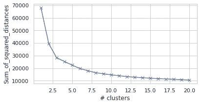
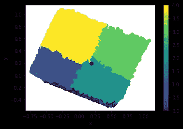
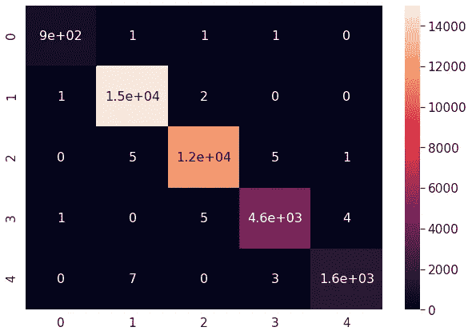
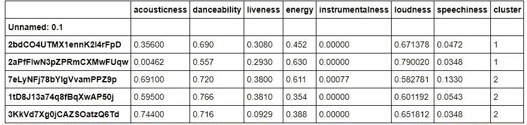
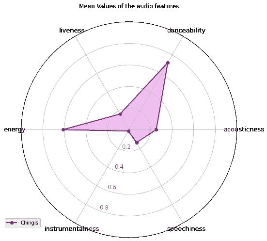
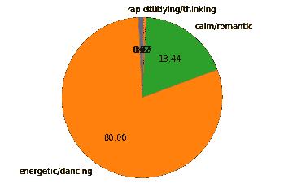

# 将您在 Spotify 上保存的歌曲分成相似歌曲的播放列表

> 原文：<https://towardsdatascience.com/cluster-your-liked-songs-on-spotify-into-playlists-of-similar-songs-66a244ba297e?source=collection_archive---------36----------------------->


由 [**默罕默德**](https://unsplash.com/@mohammadmetri) 上[**下**](https://unsplash.com/?utm_source=medium&utm_medium=referral)

## 探索音频特征，对情绪进行分类，并建立机器学习方法

答几周前，我偶然看到一篇有趣的文章，题为“使用 Spotify API 和 Python 进行音乐品味分析”。在这篇文章中，作者试图分析他和未婚妻的偏好，以确定数据对此有何说明。因此，他同时比较了 Spotify 的 API 提供的两种不同的音乐特征。在阅读它的时候，我很好奇，不仅分析了我自己的偏好，还玩了我的 Spotify 数据。因此，我想将我在 Spotify 上保存的歌曲集中到单独的播放列表中，这些播放列表将代表我在听这些歌曲时的特定心情。

> 所以为了完成我的任务，我把我的目标分成几个独立的任务:

*   获取数据
*   构建聚类模型
*   找出一个合适的分类器，并根据获得的数据进行训练
*   对我的歌曲进行分类，并将其分成播放列表
*   将建议分类

首先，值得一提的是，Twitter、Slack 和脸书 Spotify 也为开发者提供了一个 API，用于探索他们的音乐数据库，并深入了解我们的收听习惯。它提供了各种各样的功能；然而，我用了 8 个特征来描述一首歌。

*   **声学值**:*描述一首歌曲的声学程度。*
*   **可跳舞性** **值:** " *描述了一首曲目根据音乐元素(包括速度、节奏稳定性、节拍强度和整体规律性)的组合适合跳舞的程度。"*因此，我决定不使用 tempo，因为我相信这个特征是从他们那里得到的*。*
*   **活跃度值:** *“描述歌曲被现场观众录制的概率”。*
*   **能量值:***代表强度和活跃度的感知度量。通常，充满活力的曲目感觉起来又快又吵。*
*   **乐器性值:**“*预测音轨是否不包含人声。”在这种情况下,“Ooh”和“aah”音被视为乐器声。Rap 或口语词轨道明显是“有声的”。“乐器度”值越接近 1.0，轨道不包含声乐内容的可能性就越大。”*
*   **响度值:**显示音乐的音量有多大。
*   **语音值:** *“检测音轨中是否存在语音单词。”*

**关于所提供的不同功能的更多信息:** [**获取音轨的音频功能| Spotify for Developers**](https://developer.spotify.com/documentation/web-api/reference/tracks/get-audio-features/)


由[@**sgcdesignco**](https://unsplash.com/@sgcreative)****[**Unsplash**](https://unsplash.com/?utm_source=medium&utm_medium=referral)****

## ****实验装置****

****当我提到每个特征所代表的含义时，我想强调一下我在聚类任务中使用的数据集。聚类将使用 KMeans 聚类算法导出，该算法在 [Kaggle](https://www.kaggle.com/yamaerenay/spotify-dataset-19212020-160k-tracks) 上找到的 Spotify 数据集 1921–2020 上进行了训练。Spotify 数据集 1921–2020 包含从 Spotify Web API 收集的超过 160 000 首歌曲，您还可以在数据部分找到按艺术家、年份或流派分组的数据。****

> ****正常化响度****

****考虑到提到的所有其他特征都具有范围为[0，1]的值，重要的是将响度值的范围从 0 降低到-60 dB。因此，我使用 sklearn MinMaxScaler 将响度特性标准化，使其值介于 0 和 1 之间。****

```
****from** **sklearn** **import** preprocessing 
scaler=preprocessing.MinMaxScaler() *#instantiate a scaler*
*#all the feature values are in the range [0,1] ,except of loudnes*
*#so let's scale it to fit the exact same range*loudness=X["loudness"].values
loudness_scaled=scaler.fit_transform(loudness.reshape(-1, 1))**
```

# ****调整 K-均值聚类算法****

****我最终使用了 K-Means 聚类算法，该算法用于确定数据的分布。它是一种无监督学习算法，通过计算到质心的距离将相似的数据点分组到 *k* 组。为了达到这个目标，它寻找预定数量( *k* )的聚类。****

****为了得出一个合适的 k 值，我用了一个众所周知的方法叫做**肘法。**因此，通过对 *k 的范围(例如*1–20)运行 K 均值，我们可以得到下图:****

********

****如果我们将碎石图视为一座山，我们需要找出一个点，在那里我们的“山”结束，而“碎石”开始，因为直到该点，我添加的每个聚类的方差都有一个实质性的减少，在该点之后，有一个边际减少。因此，对于我的情况来说，值 5 似乎是最佳的。但也不是完全生动，所以有时候可以由一个人来决定。****

# ****使用主成分分析描述和可视化聚类****

****考虑到我们的聚类任务使用了 8 种不同的特征，很难将数据可视化。因此，有一些常用的技术来降低数据的维度。我使用了主成分分析(PCA ),它降低了维数，但仍然保留了重要的信息。PCA 同样用于加速学习过程；然而，我不打算在这篇文章中深究细节。****

********

****使用 KMeans 获得的聚类****

****上图显示了我们在 2 维空间中的 5 个集群。很明显，群集 0 可能很难与群集 2 和 1 区分开。同时，衍生出的其他聚类之间也存在明显的差异。****

*   ****因为所有歌曲的平均值是 0.87，所以聚类 0 在语音方面非常高。如果一首歌曲的语音度高于 0.66，它可能是由口语词组成的，0.33 到 0.66 之间的分数是一首可能同时包含音乐和词的歌曲，而低于 0.33 的分数意味着这首歌曲没有任何语音。此外，它的工具性较低，但舞蹈性相当高。我想大部分是说唱歌曲。****
*   ******集群 1** 的可舞性和能量相对较高，但工具性较低。我期待在那里看到很多充满活力的歌曲。****
*   ******集群 2** 音响性很高，但乐器性和响度较低。此外，它还具有相当高的可跳性。所以，我期待看到更平静，或许悲伤的歌曲。****
*   ****第 3 簇的声音和乐器性最高，但语音最低。****
*   ******第 4 组**乐器性和能量相当高，可舞性一般。同样，它的语速也相对较低。****

## ****识别最佳分类器****

****考虑到我们获得了标签作为我们的聚类，我们可以轻松地实现一个分类算法，这将有助于对我们在 Spotify 上保存的歌曲进行分类。此外，它将允许我们对推荐的歌曲进行分类，并将它们分成不同的播放列表。****

> ****重要提示:同样，只有一个响度特征是用相同的定标器归一化的；然而，重要的是要注意，我们需要使我们的定标器只适合于训练集，并对测试集和训练集都应用转换，以避免数据泄漏。在这篇文章中，我不打算深究细节。****

```
**X_train[:,5]=scaler.fit_transform(X_train[:,5].reshape(-1, 1)).reshape(-1,)
X_test[:,5]=scaler.transform(X_test[:,5].reshape(-1, 1)).reshape(-1,)**
```

****根据准确率得分比较了四种模型，分别是 K 近邻分类器、随机森林分类器、支持向量分类器和朴素贝叶斯。支持向量分类器被证明是在准确性分数方面最好的模型，其组成大约为 0.998，因此我们将使用它来进行未来的分类。****

********

****SVC 显示的混淆矩阵****

# ****预测我在 Spotify 上保存的歌曲****

****Spotify 的 API 提供了一套有用的功能。因此，我们能够获得我们保存的所有歌曲的数据集。所以，我会用上面提到的分类器对我喜欢的歌进行分类。最后，我们将我的歌曲分成 5 个不同的播放列表，并尝试分析它们。****

```
**offset = 0
songs = []
names = []
ids = []
**while** **True**:
    content = sp.current_user_saved_tracks(limit=50, offset=offset)
    songs += content['items']
    **if** content['next'] **is** **not** **None**:
        offset += 100
    **else**:
        **break**
**for** i **in** songs:
    names.append(i['track']['name'])
    ids.append(i['track']['id'])
index=0
audio_features=[]
**while** index < len(ids):
    audio_features += sp.audio_features(ids[index:index + 50])
    index += 50
features_list = []
**for** features **in** audio_features:
    features_list.append([features['acousticness'], features['danceability'],
                          features['liveness'],features['energy'],
                          features['instrumentalness'], features['loudness'],
                          features['speechiness']])

mydf = pd.DataFrame(features_list, columns=["acousticness", "danceability", "liveness","energy", "instrumentalness", "loudness", "speechiness"],index=ids)**
```

********

****分类歌曲****

****上图显示了我喜欢的歌曲使用 SVC 分类。最后，我听了每个集群的歌曲列表，得出了以下解释:****

*   ****正如我所料，绝大多数歌曲都是说唱歌曲。因此，如果我想听一些激进的说唱来振奋我的精神，我会听他们。****

****示例:****

*   ******集群 1** 包含大部分精力充沛且适合跳舞的歌曲。****

****示例:****

****有趣的是，肖恩·蒙德兹的所有歌曲都属于这一类。****

*   ******Cluster 2** 由很多缓慢而平静的歌曲组成。因此，我给它贴上平静或浪漫音乐的标签。****

****示例:****

****我保存的 Joji 的歌几乎都属于这一类，在我看来已经足够公平了。****

*   ******集群 3** 包含了很多通常没有歌词的歌曲。如果我想集思广益或学习，我会听他们。****

****示例:****

*   ****第四组主要是一些令人放松的歌曲。****

****示例:****

> ****现在让我们分析一下我对 Spotify 上音乐的偏好。****

********

****上图展示了我喜欢的歌曲数据集中使用的所有特征的平均值。因此，我推断我通常会听一些可舞性和能量都很高的歌曲。我从未想到过那件事，但现在我意识到那确实是真的。然而，我也时不时听听浪漫的，也许是悲伤的歌曲。****

********

****上面的饼状图证明了我喜欢的歌曲中有 80%属于活力/舞曲类。****

****最后，我把我的歌分成 5 个不同的播放列表，代表这些类别。****

```
**clustered_songs=list(zip(mydf.index,mydf.iloc[:,-1]))sorted_songs=[[],[],[],[],[]]
**for** i **in** range(len(clustered_songs)):
    sorted_songs[clustered_songs[i][1]].append(clustered_songs[i][0])playlists=[]
**for** i **in** range(5):
    playlist_created=sp.user_playlist_create(username, name="Cluster "+str(i), public=**False**,description='')*#create playlists for a corresponding cluster*
    sp.user_playlist_add_tracks(username,playlist_created['id'],sorted_songs[i][:100]) *#add new songs*
    playlists.append(playlist_created)**
```

## ****对推荐歌曲进行分类****

****作为我们实验的最后一步，我将请求根据我保存的歌曲生成 Spotify 推荐。****

```
**rec_tracks = []
**for** i **in** mydf.index.tolist():
    rec_tracks += sp.recommendations(seed_tracks=[i], limit=5)['tracks'] *#get recommendations from Spotify*

rec_track_ids = []
rec_track_names = []
**for** i **in** rec_tracks:
    rec_track_ids.append(i['id']) *#extract id and name of songs*
    rec_track_names.append(i['name'])

rec_features = []
**for** i **in** range(0,len(rec_track_ids)):
    rec_audio_features = sp.audio_features(rec_track_ids[i]) *#extract features*
    **for** track **in** rec_audio_features:
        rec_features.append(track)

rec_playlist_df = pd.DataFrame(rec_features, index = rec_track_ids) *#make a dataframe***
```

****最后，我对我获得的所有歌曲进行分类，并通过添加新的推荐歌曲来更新我创建的播放列表。让我们看看获得的歌曲是否符合我们的播放列表。****

> ****新增****

******集群 0:******

******集群 1:******

****有趣的是，还增加了几首法国歌曲。我认为那是他的风格。****

******集群 2:******

****尽管这是一首说唱歌曲，但风格和音乐符合播放列表。****

******集群 3:******

******集群 4:******

****注意:使这个集群不同于上面列出的其他两个集群的特征是它的低速度。****

# ****结论****

****总而言之，这些推荐是基于我保存的所有曲目的数据集(而不是基于单个播放列表)生成的。因此，我相信一个分类器可以很好地将它们分成 5 个不同的播放列表。我认为这项工作非常有趣，对于刚刚开始旅程的人来说是很好的实践，因为它同时包括了 ML 的各个领域。在这项工作中，我在公共 Spotify 数据集上训练了 KMeans 聚类算法。此外，我想出了一个分类器，帮助我将喜欢的歌曲分类到播放列表中，每个播放列表代表一种独特的风格/情绪。****

****源代码在我的 [**Github 上有。**](https://github.com/chingisooinar/Clustering-my-songs-on-Spotify)****

# ****创建了指向我的播放列表的链接****

*   ****【https://open.spotify.com/playlist/6dL6xOCcema8DUSzYLfx06】集群 0(说唱):****
*   ******Cluster1(活力/舞蹈):**[https://open.spotify.com/playlist/0LlIHqBd2zOHemZ3c7j6Ov](https://open.spotify.com/playlist/0LlIHqBd2zOHemZ3c7j6Ov)****
*   ******Cluster2(冷静/浪漫):**[https://open.spotify.com/playlist/4mF1KkRP5YITPTf1dakXJP](https://open.spotify.com/playlist/4mF1KkRP5YITPTf1dakXJP)****
*   ******集群 3(学习/思考)**:[https://open.spotify.com/playlist/4xRgEf6Y4iBs3I3WNNofMr](https://open.spotify.com/playlist/4xRgEf6Y4iBs3I3WNNofMr)****
*   ******Cluster4(寒气)【https://open.spotify.com/playlist/5FtCtZ5QrpQDlXxIB9DMEi】:******

******参考文献:******

 ****[## 重定向你-媒体

### 编辑描述

medium.com](https://medium.com/r?url=https%3A%2F%2Ftowardsdatascience.com%2Fa-music-taste-analysis-using-spotify-api-and-python-e52d186db5fc)**** ****[](/is-my-spotify-music-boring-an-analysis-involving-music-data-and-machine-learning-47550ae931de) [## 我的 Spotify 音乐很无聊吗？涉及音乐、数据和机器学习的分析

### 使用 Spotify 的音频功能 API、数据和机器学习，我调查了我保存的歌曲有多无聊。

towardsdatascience.com](/is-my-spotify-music-boring-an-analysis-involving-music-data-and-machine-learning-47550ae931de) [](https://medium.com/@RareLoot/extracting-spotify-data-on-your-favourite-artist-via-python-d58bc92a4330) [## 通过 Python 提取您最喜欢的艺术家的 Spotify 数据

### Spotify 是世界上最受欢迎的流媒体平台之一。他们也有一个 API 供开发者使用…

medium.com](https://medium.com/@RareLoot/extracting-spotify-data-on-your-favourite-artist-via-python-d58bc92a4330) [](https://developer.spotify.com/documentation/web-api/reference/tracks/get-audio-features/) [## 获取音轨的音频功能|面向开发者的 Spotify

### 需要路径参数授权。来自 Spotify 帐户服务的有效访问令牌:参见 Web API…

developer.spotify.com](https://developer.spotify.com/documentation/web-api/reference/tracks/get-audio-features/)****