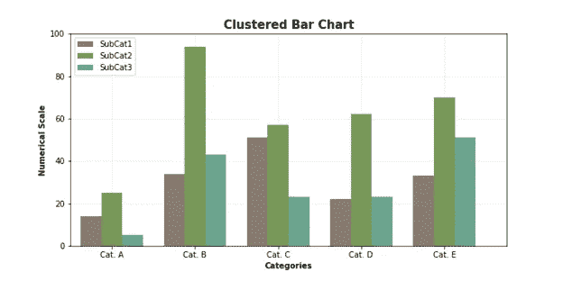
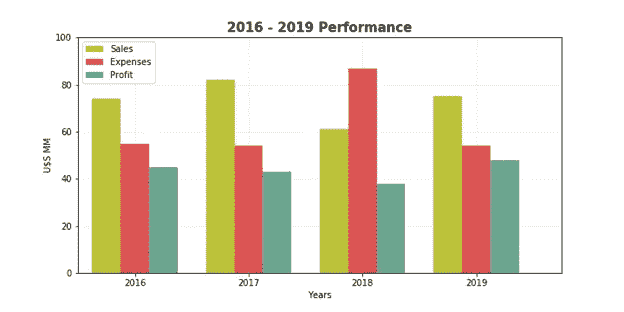
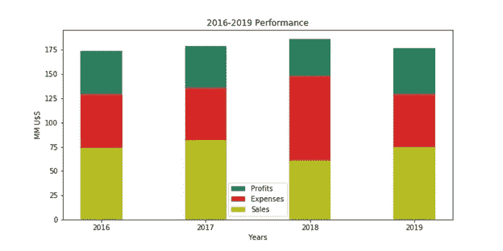
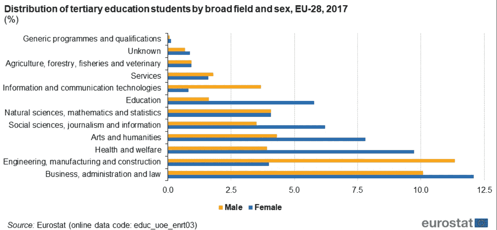
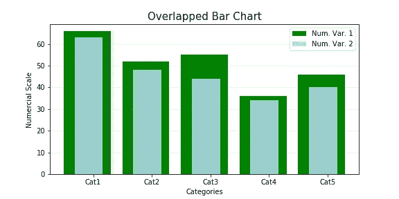
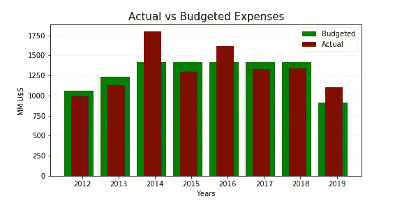
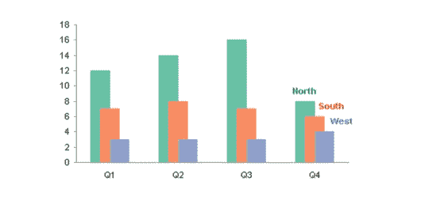

# 簇状和重叠条形图

> 原文：<https://towardsdatascience.com/clustered-overlapped-bar-charts-94f1db93778e?source=collection_archive---------35----------------------->

# 为什么和如何


图片由来自 Unsplash 的 Suyehon Choi 提供

1.- **簇状条形图**

**又名**:分组、并排、多集[条形图、条形图、柱形图]

**为什么**:聚类条形图(CBC)显示一个主要类别和属于第二分类变量的子类别之间的相对比例的数字信息。类似于堆积条形图，**它们应该用于比较和比例，但重点是组成。**与堆叠条形图不同，构成子类别的元素可能是广泛相关的。当一个整体被分成多个部分时，CBC 特别有效。它们能够在子类别之间进行比较**，而堆叠条形图在子类别**内进行比较**。**

它们允许可视化子组如何随时间变化，但是随着时间的延长和子类别数量的增加，图表变得难以阅读。它们不应用于关系或分布分析。

**如何**:和条形图一样，CBC 是二维的，有两个轴:一个轴显示类别，另一个轴显示数值。指示类别的轴没有刻度来突出它指的是离散的(互斥的)组。带有数值的轴必须有一个带有相应测量单位的刻度。

CBC 由多组矩形条表示，这些矩形条可以**水平或垂直**定向。每个主要类别被分成代表第二分类变量的子类别的条簇**和**。每个子类别的数量由那些并排放置形成一个簇的矩形条的长度或高度来表示，簇之间的间隙比单个标准条稍宽。



图 1:簇状条形图的示意图。该图形是用 Matplotlib 开发的。

子类别可以是顺序的或名词性的，但同等的子类别在每个聚类中必须有相同的颜色，以免混淆观众。使用合适的调色板、平衡的间距和便于比较的布局是很重要的。因为横条是沉重的视觉标记，仅仅为了改善故事情节，尽量少用网格线。

下图显示了 2016-2019 年期间与销售、费用和利润相关的公司业绩数据。这是一个垂直方向的簇状条形图，以年份作为主要类别。销售额、费用和利润每年表示为一个群集。可视化清晰地突出了 2018 年，即使在费用增加和销售额减少的情况下，利润仍保持相对恒定。



图 2:一家虚构公司在 2016-2019 年期间的经济表现。该图形是用 Matplotlib 开发的。

比较用堆积条形图表示的相同数据是很有趣的。如前所述，当您想要跨子类别进行比较时，CBC 是合适的:2016 年与 2017 年的销售额，2018 年与 2019 年的销售额；2016 年相对于 2017 年相对于 2018 年相对于 2019 年的支出；2016 年与 2017 年、2018 年与 2019 年的利润。相反，堆积条形图只能对接近基线(销售)的部分进行比较，因为费用和利润有不同的初始基线。此外，每个主体条的高度(特定年份的销售总额+费用+利润)没有任何意义。



图 3:具有与图 2 相同数据的堆积条形图。

下一个数字与 2017 年欧盟高等教育统计(EU-28)有关。那一年有 1980 万高等教育学生，其中女性占 54%,尽管获得博士头衔的大多数学生是男性。此外，四分之一的学生从事商业、管理和法律研究。下面的柱状图表明，在教育、社会科学、艺术和人文科学、健康和福利以及商业、管理和法律研究领域，女性人数超过了男性。另一方面，在信息技术和工程、制造和建筑研究领域，男性人数超过女性(欧盟统计局，2020 年)。该图表清楚地显示了广泛教育领域中男女参与高等教育的数字信息。这是一个横向的 CBC，其中教育领域构成主要类别，而性别是第二分类变量。



图 3:2017 年欧洲联盟高等教育学生按领域和性别分布情况。来源(#1)

簇状条形图的主要问题是，它们不能清楚地显示单个部分相对于整体的比例。这样一来，比例就不好评价了。它们的强度与第二分类变量的等价子类之间的直接比较有关。

2.- **重叠条形图**

**又名**:叠加、重叠、叠加【条形图、条形图、柱形图】

**为什么**:重叠条形图(OVC)用于不同项目或类别之间的**比较**。OVC 在一张图中对每个项目或类别只比较两个数字变量。数值变量必须密切相关，才能进行比较。它们也用于显示基于相似前提的长期趋势。它们不应用于关系或分布分析。

与 OVC 相关的概念想法是对比两个变量的数值，这两个变量相互重叠，允许用更大的阐释力来描述信息(讲故事)。从这个意义上说，它们比簇状条形图要好，因为这种比较直观上更优越。这种图表非常精确地显示了盈余和短缺，尤其是在添加了适当的网格后。它们通常用于显示相对于目标或基准的进展水平。



图 4:重叠条形图的示意图。该图形是用 Matplotlib 开发的

```
**How**: it is a two dimensional graph with two axis -similar to every standard bar chart- with rectangular bars that can be oriented horizontally or vertically**.** One axis shows categories, the other axis shows numerical values related with two variables. **Bars representing the same category share the same baseline and the same location on the corresponding axis**. Both numerical variables must be closely related and share the same numerical scale. The width of the bars is different for each numerical variable with the smaller going forward for clarity of reading. The drawback is that for some categories one of the bars is the shorter while it is the longer for others. 
```



图 5:一家虚构公司在 2012 年至 2019 年期间的实际支出与预算支出。该图形是用 Matplotlib 开发的

一些可视化工具允许**部分重叠**几个数值变量(多个数据序列)，这样代表每个连续数值变量的矩形被位于它们前面的其他矩形部分隐藏。从概念上讲，当代表不同数据集的矩形开始重叠而不是并排放置时，它们相当于聚类(分组)条形图。OVC 意味着一个矩形在另一个矩形前面 100%重叠的极端情况。毫无疑问，观众会发现很难对三个或更多部分重叠的条进行比较。当多个子类别的数据必须在单个图表中进行很长时间的比较时，使用它是合理的。



图 6:部分重叠的条形图，来源珀耳帖技术博客(#2)

**总而言之**，当你想对整体的各个部分进行直接比较时，你可能会使用一个簇状条形图。另一方面，重叠条形图能够很好地比较两个密切相关的数值变量。

和标准条形图一样，我为这两种类型的图表推荐以下**提示和警告**:

从 0 开始基线:如果条被截断，实际值不能正确反映；

当存在时序数据(时间序列、时间数据)或负数值时，建议采用垂直方向(柱形图)(图 2 和图 5)。另一方面，当绘制大量类别时，尤其是具有非常长的标签时，优选使用水平方向(图 3)；

如果较长的条形图总是在较短的条形图后面，部分重叠的条形图只能显示一个好的信息；

避免所有 3D 效果。尽管它们在美学上令人愉悦，但它们违背了适当的数据可视化的所有规则。

如果你对这篇文章感兴趣，请阅读我以前的:

堆积条形图，为什么和如何，讲故事和警告

[](/stacked-bar-graphs-why-how-f1b68a7454b7) [## 堆积条形图，为什么和如何

### 讲故事和警告

towardsdatascience.com](/stacked-bar-graphs-why-how-f1b68a7454b7) 

**参考文献:**

*# 1:https://EC . Europa . eu/Eurostat/statistics-explained/index . PHP/Tertiary _ education _ statistics # Fields _ of _ education*

*#2:珀尔帖科技博客，*[*【https://peltiertech.com/stacked-vs-clustered/】*](https://peltiertech.com/stacked-vs-clustered/)