# 聚类算法。第二部分。

> 原文：<https://towardsdatascience.com/clustering-algorithm-part-2-57907f5c0437?source=collection_archive---------51----------------------->

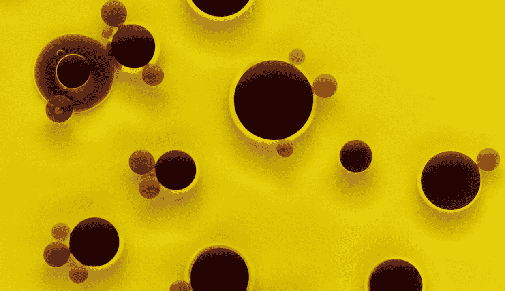

奥拉·米先科在 [Unsplash](https://unsplash.com/s/photos/circles?utm_source=unsplash&utm_medium=referral&utm_content=creditCopyText) 上拍摄的照片

## 更快、更聪明、更快乐…

*扩展我之前的帖子并尝试解决这个问题，这个问题对于大多数传统的聚类算法来说太难了。*

这篇文章在很大程度上遵循了我上一篇文章的思路，你可以在下面找到:

[](/a-fresh-look-at-clustering-algorithms-c3c4caa1a691) [## 重新审视聚类算法

### 深入研究一种新的聚类识别方法。

towardsdatascience.com](/a-fresh-look-at-clustering-algorithms-c3c4caa1a691) 

我在这里尝试做的是概括它(一点)，加速它(很多！)并将其应用于一个数据集，该数据集会使大多数其他聚类算法脱轨。我还将强调这一过程中的一些挑战，并介绍一种新的预分析方法，它应该有助于选择问题的参数，以获得最佳结果。

系好安全带。这将是一段颠簸的旅程。

优化部分本身并不新鲜——我将在这里浏览一下，因为你可能会发现它很有用，并强调从经验中吸取的一些教训。如果您对此不感兴趣(或者如果您是专家)，请直接跳到下一节，深入了解真正擅长颠覆经典聚类算法的数据集。在上一篇文章中，我对我的方法进行基准测试的九个算法都失败了。每一个。单身。一个。

## 优化代码

当我开始查看一个相当复杂和庞大的数据集时，对算法性能的真正测试开始了。这个数据集是伦敦市中心一平方公里的栅格文件表示，显示了不到 250 座(可识别的)建筑物。每个坐标有 4 个 ln 值，这给我的笔记本电脑带来了很大的压力，计算时间为 5 小时 47 分钟。一点都不好。不得不说，这个算法在这个阶段对于一个蛮力方法来说有点痛苦，所以我需要做一些改进。目前的版本能够在 4 分 40 秒内完成同样的计算。同样的笔记本电脑，没有并行化，只是改进了算法。

那么大部分的性能提升来自哪里呢？

该算法的核心是一个基本的 BFS 实现——在我们空间的图形表示中计算不相连的树。它遵循几个简单的步骤:

1.  选择我们想要检查的节点的 id(在这个阶段任何 id 都可以)。
2.  识别它的邻居，并检查它们是否属于阈值以上的节点集。
3.  将邻居添加到“检查”列表中。
4.  将当前节点标记为已访问。
5.  更新 id 列表(删除所有“已访问”和“待检查”列表元素)
6.  从“检查”列表中选择任意节点，并重复步骤 1-4。

我们这样做，直到“tocheck”列表为空，将所有“已访问”添加到集群字典，然后转到列表中的下一个 id(再次执行步骤 1)。

第一个主要的胜利来自于间歇性地去除了列表和 numpy 数组的使用，并且不得不从一个转换到另一个。当处理 4000 个点的数据集时，这并不是一个大问题，当处理 4，000，000 个点的数据集时，这就成了一个大问题。

所以我从中得到的主要教训是——**尽量避免类型转换**，至少在有潜在瓶颈的代码部分。这一变化导致了计算时间从**的 5 小时 47 分下降到 29 分 37 秒。**

第二个胜利来自于认识到，即使字典是处理图/树结构的一个相当明显和直观的选择，但在现实中它们是不必要的和耗费资源的。至少在这个算法的框架内。这都是因为我需要一个简单的 id 来处理每个单元格，并且需要一个简单的方法来识别最近的邻居。

如果你参考我以前的文章中的原始算法的主要步骤——我们采用一个包含所有输入参数的 numpy 数组，为了维护和计数所有的单元格，我们从它们中创建一个字符串 id，然后使用它作为检查一切的密钥。放弃字典也允许我们完全放弃对这些索引的需求。这实际上使整个算法更加通用，因为例如，如果我们想处理 word2vec 的文本表示，我们将得到 300 个维度，因为每个文本块(或单个单词)都由一个 300 长的浮点向量表示。现在想象一下，我们必须对每个维度进行 10 次以上的划分，然后将它们全部粘合到一个字符串 id 中。我们将以一个 600 字符长的字符串来表示每个观察结果。不太好。事实证明，我们可以通过使用原始的 numpy 数组、屏蔽和索引来完成整个计算和循环路径。这一变化带来了另一个重大胜利——从 29 分 37 秒缩短到不到 7 分钟。

最终的改进来自于一个非常小的变化，但仍然很重要。树计数过程的一部分涉及使用屏蔽来选择最近的邻居，然后将它们从仍然需要检查的元素数组中移除。这意味着同一个面具被使用了几次。只需将它传递到变量中，然后在多个需要的地方使用该变量，而不是在运行中进行计算，就又获得了 2 分钟的胜利，使最终执行时间达到 4 分 47 秒。

我们需要做的另一个重要改变是积分归属。我将再次向您推荐上一篇文章的内容，但简单地说，我们只使用通过阈值的细胞来构建我们的树结构。这意味着，一旦我们确定了我们的聚类，我们就剩下一大堆没有分配给任何聚类的点。一方面，我们可以让它们保持原样。另一方面，在某些情况下，我们希望将整个数据集划分到围绕集群创建的组中。在我以前的文章中，我通过识别每个聚类的质心，然后比较每个点到每个质心的距离，然后将其分配给最近的一个质心。这在大多数情况下都很好，我们看到结果非常接近 KMeans 算法获得的结果。然而，有一整类问题，这种方法是行不通的。出于这个原因，我们将转移到一个不同的方法，这是不太依赖于质心。具体来说，我们将查看到最近的标记邻居的距离。也就是说，我们将测量到每个聚类中所有已识别点的距离，看哪一个是最近的，然后分配给最近的一个。

所有的函数，包括两种属性方法都在本文的最后。

这意味着我们已经准备好解决我们原始 blobs 的一个更复杂的问题:

## 聚类算法禁区

剧透警告——不再是了:)。

经典数据集是简单的同心圆，它几乎颠覆了所有经典聚类算法。事实上，它是存在非线性边界的任何东西，所以在某种程度上，栅格文件簇识别已经是一个有效的例子。同心圆为我们提供了一个很好的简单示例，它还允许我们突出显示建筑物数据集因其规则模式而不会有的一些细微差别。但是我在这里跳向前。让我们从生成数据集开始，快速看一下标准算法是如何制作的。

我们首先加载需要的库:

```
%matplotlib inline
import numpy as np
import pandas as pd
import seaborn as sns
import matplotlib.pyplot as plt
pd.plotting.backend='seaborn'
from IPython.display import clear_output
import time
```

注意，我们不再需要最新实现的 itertools

生成数据集:

```
N=4000 #number of observationsr = np.random.random(N) * 0.1 + 1
theta = np.random.random(N) * 2 * np.pi
x = r * np.cos(theta) + 5
y = r * np.sin(theta) + 5r = np.random.random(N) * 0.1 + 0.5
theta = np.random.random(N) * 2 * np.pi
x1=r * np.cos(theta) + 5
y1 = r * np.sin(theta) + 5r = np.random.random(N) * 0.1
theta = np.random.random(N) * 2 * np.pi
x2 = r * np.cos(theta) + 5
y2 = r * np.sin(theta) + 5r = np.random.random(N) * 0.1
theta = np.random.random(N) * 2 * np.pi
x3 = r * np.cos(theta) + 5.8
y3=r * np.sin(theta) + 5
```

所以我们正在创建两个圆形斑点和两个同心圆。

让我们快速浏览一下:

```
plt.figure(figsize=(10,10))
plt.scatter(x, y)
plt.scatter(x1, y1)
plt.scatter(x2, y2)
plt.scatter(x3, y3)
```

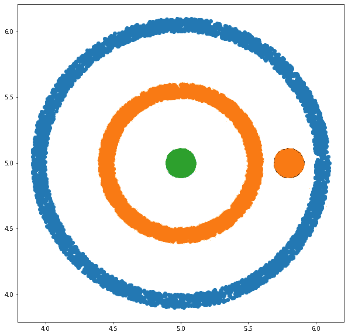

还要注意，外圆有相当多的不规则。这可能会给我们带来一些问题(剧透——会的)。

现在，让我们将所有这些组合成一个数据集并进行归一化:

```
ttf_circles = pd.DataFrame(
    {
        'x':np.concatenate([x, x1, x2, x3]),
        'y':np.concatenate([y, y1, y2, y3])
    }
)
ttf_norm = ttf_circles.copy()
ttf_norm['x'] = (
    ttf_norm['x'] - np.min(ttf_norm.x)
) / (
    np.max(ttf_norm.x) - np.min(ttf_norm.x)
)
ttf_norm['y'] = (
    ttf_norm['y'] - np.min(ttf_norm.y)
) / (
    np.max(ttf_norm.y) - np.min(ttf_norm.y)
)
```

快速浏览一下:

```
ttf_norm.plot(x='x', y='y', kind='scatter', figsize=(10,10))
```

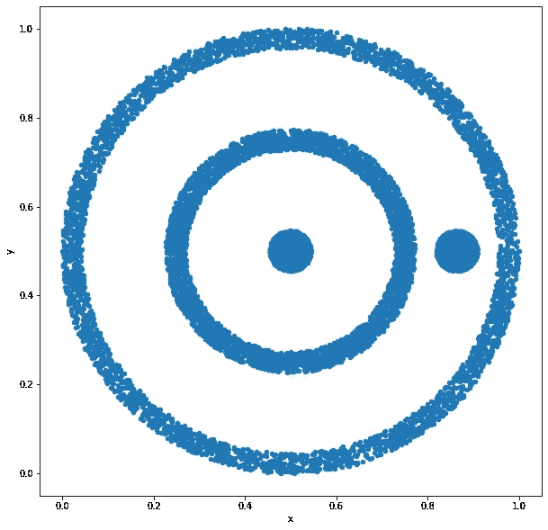

您可以直接看到为什么这会给基于质心的归因带来问题。我们的三个星团的质心在同一个地方！

让我们首先来看看标准的、现成的方法是如何处理这个问题的。

```
import sklearn
from sklearn.cluster import AffinityPropagation, AgglomerativeClustering, Birch
from sklearn.cluster import DBSCAN, KMeans, MiniBatchKMeans, MeanShift
from sklearn.cluster import SpectralClustering
from sklearn.mixture import GaussianMixture
```

1.  亲和力传播

```
X = np.array(ttf_norm[['x','y']].values)
model = AffinityPropagation(damping=0.9)
```

```
%%time
model.fit(X)
ttf_norm['Affinity'] = model.predict(X) + 1
```

出局:

```
CPU times: user 9min 18s, sys: 22.7 s, total: 9min 40s
Wall time: 9min 55s
```

并绘制结果:

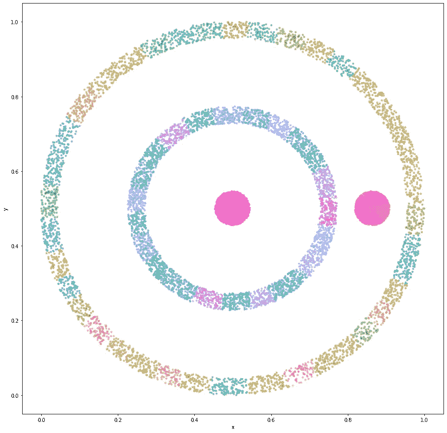

哎唷…我的意思是——它很有色彩……但是完全没用。

#失败！

其他方法的代码是相同的，所以我只展示结果。

2.结块的

```
CPU times: user 8.2 s, sys: 804 ms, total: 9 s
Wall time: 9.04 s
```

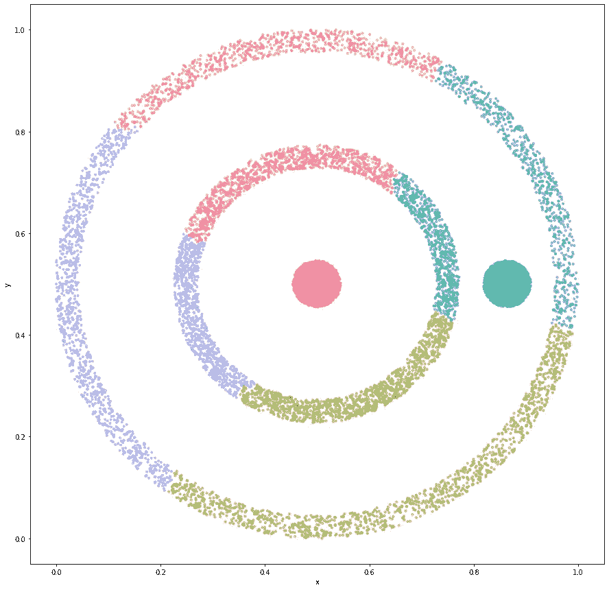

我们有正确数量的集群(因为我们告诉它要寻找多少！)，只是不是我们要找的人…

#失败！

3.桦树

```
CPU times: user 827 ms, sys: 50.7 ms, total: 877 ms
Wall time: 752 ms
```

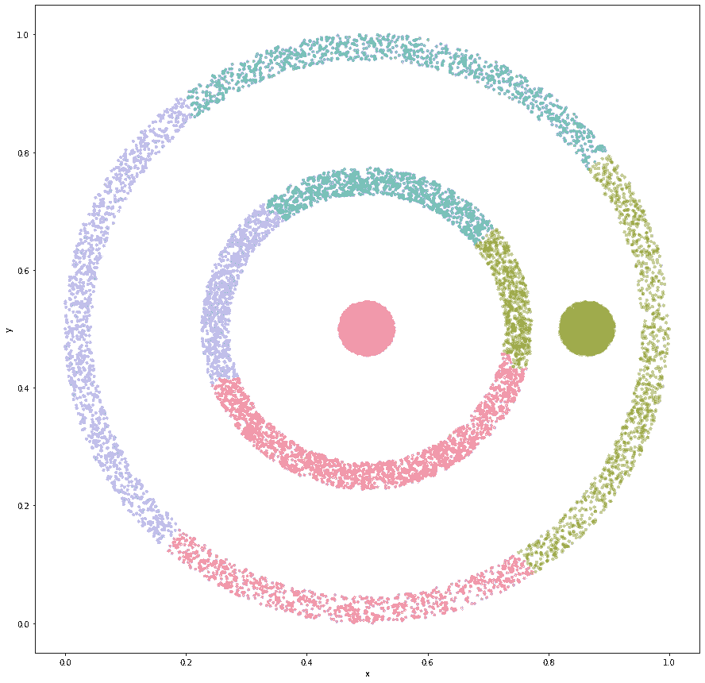

与#2 相同。相同的结论:

#失败！

4.基于密度的噪声应用空间聚类

```
CPU times: user 382 ms, sys: 370 ms, total: 752 ms
Wall time: 865 ms
```

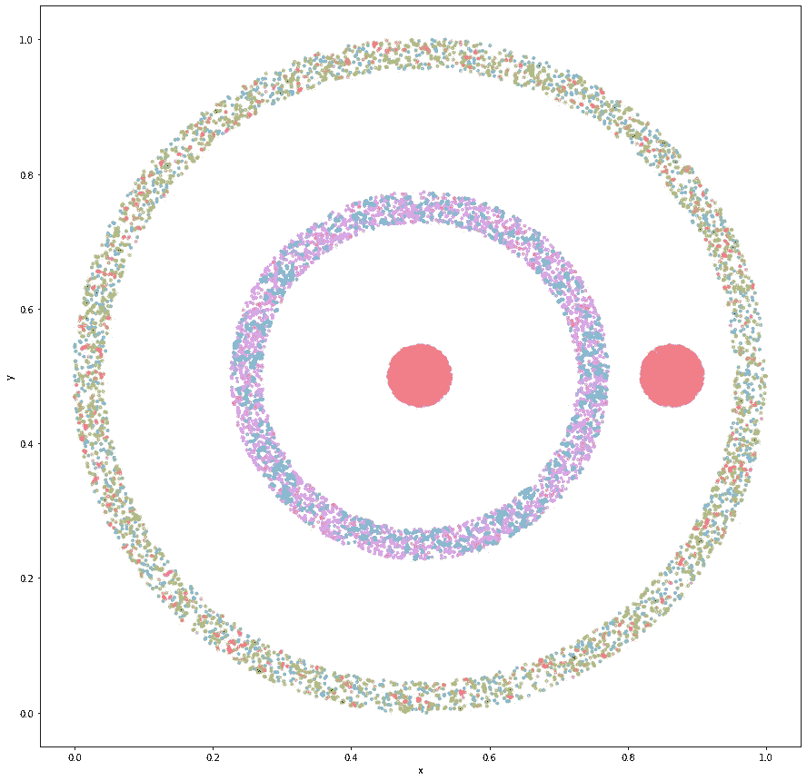

的确非常丰富多彩…只是对我们完全没用。

#失败！

5.KMeans

```
CPU times: user 662 ms, sys: 57.3 ms, total: 719 ms
Wall time: 366 ms
```

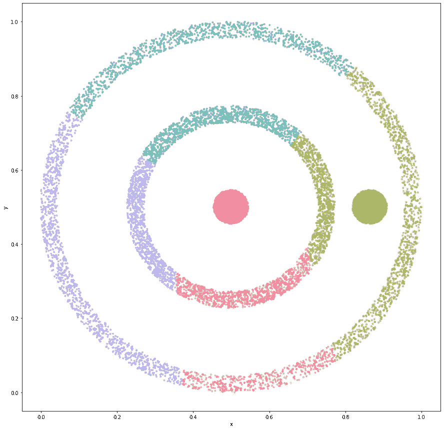

好吧，你明白了。让我们直接跳到高斯混合。这是我希望会比其他的好一点的一个，但是，唉，在 164 毫秒内，它达到了:

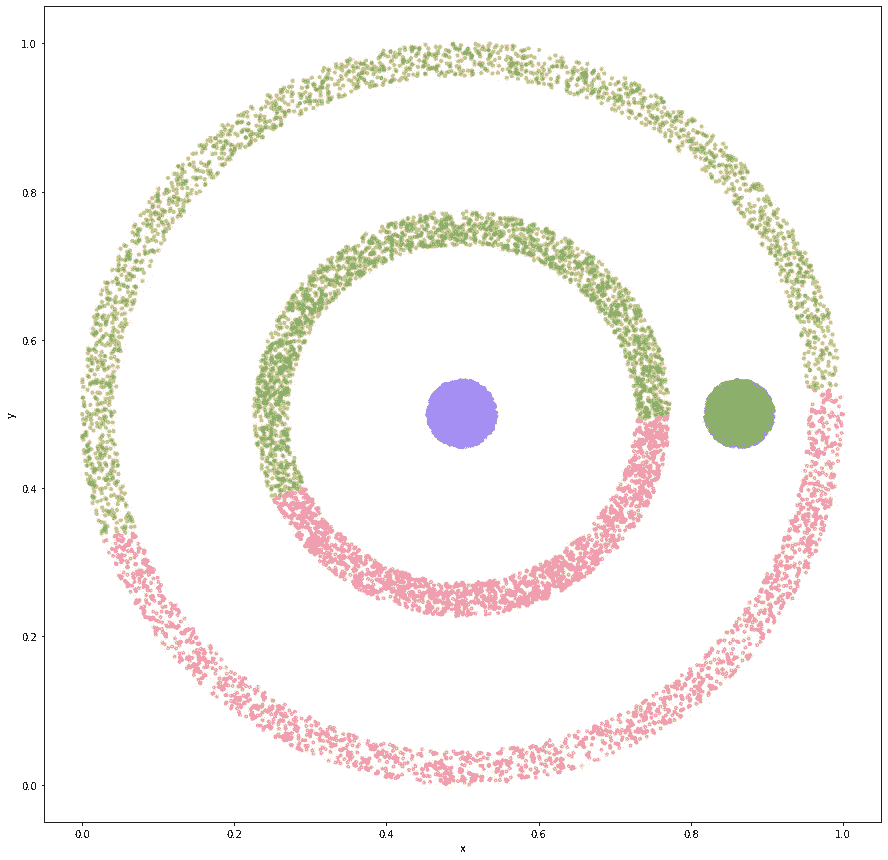

好，那么我们的密度树算法呢？请击鼓…

计算我们的部门数量:

```
D = int(np.sqrt(len(ttf_norm)))
D
```

出局:126

该模型运行时间为 374 毫秒，这已经足够了。然而，我们发现…

44 簇！

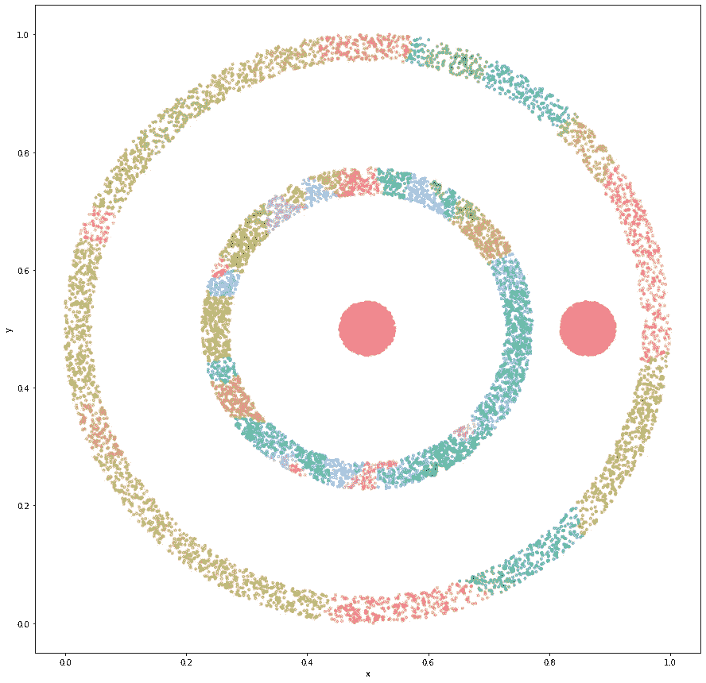

#失败！

或者是？或者说我们能做点什么吗？

事实上，如果我们仔细观察，这就是正在发生的事情:我们被问题的规模绊倒了。记得我提到过数据中的条纹会给我们带来一些问题。这就是了。我们正在识别由数据稀疏引起的数据中的不规则性。我们可能已经预料到了，因为我们已经尽我们的临界参数所允许的那样细化了。

现在，有没有一种方法可以确定(最好是一种自动化的方法)我们需要进行多少次划分才能得到我们想要的聚类类型。所以对于这样的问题，确定一组参数，让我们得到最细粒度和最小粒度的结果。

事实证明——确实有。

请记住，我们将所有东西都分割成单元，并计算落入每个单元的观察值的数量，以构建我们的聚类。我们可以看看这些划分是多么有效，我们的观察结果是如何被打包到我们的单位细胞中的。所以我们要看的是，有超过 10 个观察值的单胞，与只有一个观察值或根本没有观察值的单胞数量的比率。选择 10 有些武断，用这个数字来看看什么效果最好可能是有意义的，到目前为止，它对我测试的所有问题都足够好了。

我们将浏览多个部门，看看该比例如何变化:

```
prop=[]
for d in range(1, 500):
    Xint = (X * d).astype(int)
    unique, counts = np.unique(Xint, axis=0, return_counts=True)
    prop.append(
        len(
            counts[counts > 10]
        )/(
            len(
                counts[counts == 1]
            ) + len(Xint) - len(unique)
        )
    )
```

我在这里使用列表来收集结果，我很抱歉。这一点是快速的，但是的，真的应该翻译成 numpy。

让我们画出这个:

```
plt.figure(figsize=(12, 8))
plt.plot(list(range(1, 500)), prop)
```

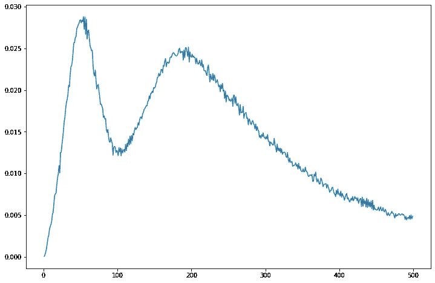

啊哈！我们有两个峰值。一个 50 左右，一个 200 左右。确切的数字并不重要，我们想知道大概的数字。

只是检查一下:

```
np.argmax(prop)
```

出局:49

够近了。

这意味着我们有两个最佳区域。如果我们想尽可能地细化并识别我们观察到的所有聚集点，我们会选择 200。如果我们想要一个更广阔的画面，我们用 49。

然而，这还不完全是结束。我们还想确保我们的宽容也符合我们的意图。对于更广阔的前景，我们希望非常低，否则我们有被过度排斥小数量的单位细胞产生的额外缺口绊倒的风险。对于更详细的前景，我们希望精确，所以我们可能希望使用更高的数字。这部分，暂时来说，还是不够规定性。也许转换到精确计数而不是百分位数会使它更简单。在我的待办事项/实验清单上。

好的，那么如果我们用 50 个除法和第 10 个百分位数会发生什么？

```
%%time
D = 49
tolerance = 10
ttf_norm['density_trees'] = density_trees_fit_nn(np.array(ttf_norm[['x','y']].values), D, tolerance)
```

出局:

```
Processed 100.00% ids
4 clusters found
CPU times: user 76.7 ms, sys: 8.56 ms, total: 85.3 ms
Wall time: 80.7 ms
```

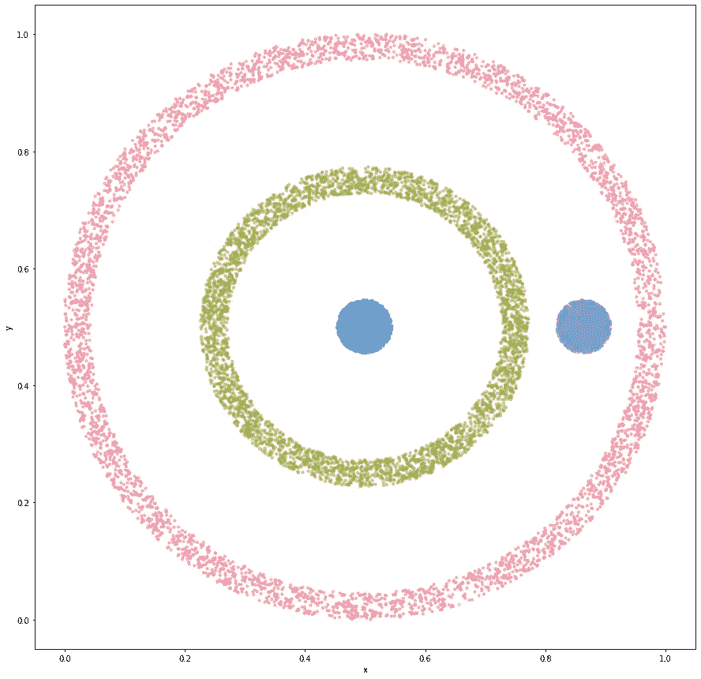

砰的一声。！！

## 其他器械包的临界分割值

看一下不同场景下的临界分割值图是有意义的，这样可以获得更多的直觉。

例如，如果我们通过在外环生成更多的数据点来增加外环的密度，会发生什么？理论上，随着我们逐渐填充更多的空间，这应该会使那里的迷你星团不那么明显。

让我们看看会发生什么:

```
N=4000 #numbner of observationsr = np.random.random(N * 4) * 0.1 + 1
theta = np.random.random(N * 4) * 2 * np.pi
x = r * np.cos(theta) + 5
y = r * np.sin(theta) + 5r = np.random.random(N) * 0.1 + 0.5
theta = np.random.random(N) * 2 * np.pi
x1=r * np.cos(theta) + 5
y1 = r * np.sin(theta) + 5r = np.random.random(N) * 0.1
theta = np.random.random(N) * 2 * np.pi
x2 = r * np.cos(theta) + 5
y2 = r * np.sin(theta) + 5r = np.random.random(N) * 0.1
theta = np.random.random(N) * 2 * np.pi
x3 = r * np.cos(theta) + 5.8
y3=r * np.sin(theta) + 5ttf_circles = pd.DataFrame(
    {
        'x':np.concatenate([x, x1, x2, x3]),
        'y':np.concatenate([y, y1, y2, y3])
    }
)ttf_norm = ttf_circles.copy()
ttf_norm['x'] = (
    ttf_norm['x'] - np.min(ttf_norm.x)
) / (
    np.max(ttf_norm.x) - np.min(ttf_norm.x)
)
ttf_norm['y'] = (
    ttf_norm['y'] - np.min(ttf_norm.y)
) / (
    np.max(ttf_norm.y) - np.min(ttf_norm.y)
)
```

好吧，很多代码。本质上，这与我们开始时所做的是一样的，但是当我们生成第一个圆时，我们将点数乘以 4。所以我们会有 4 倍多的观测值。

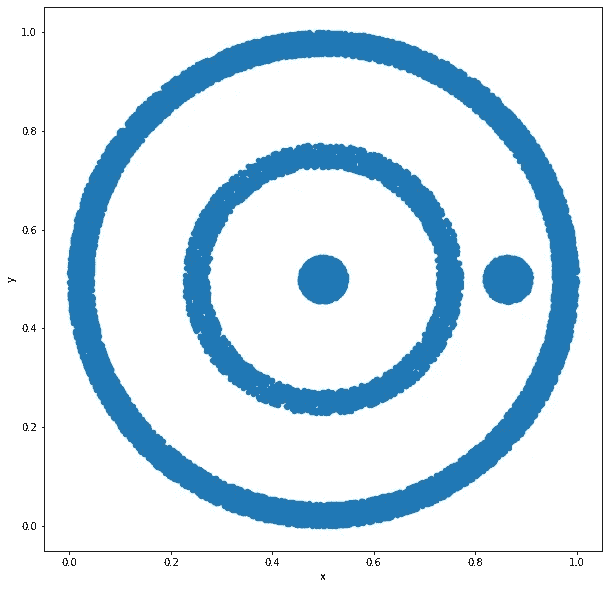

你看现在外环光滑多了…

临界分裂图变成了:

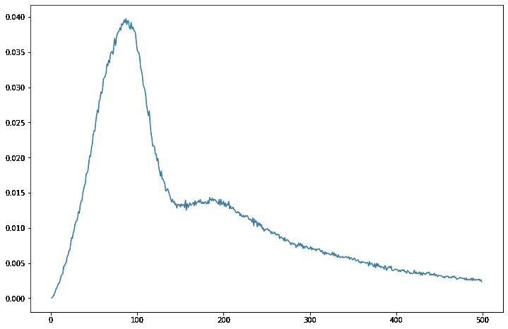

所以峰值现在移到了右边，max 现在是 86。第二个峰值仍然存在，在 200 左右，但不那么明显了。我们添加的观察越多，它就越不明显，最终会完全消失。

让我们也来看看我们在上一篇文章中看到的四个 blobs:

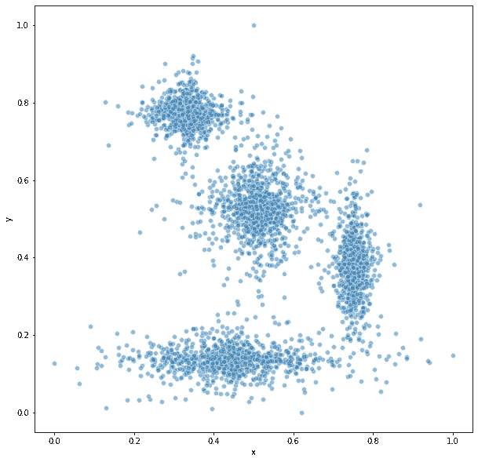

和临界分裂图:

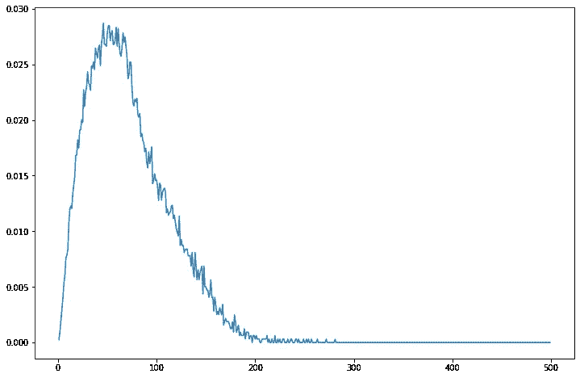

Max 在这里不太明显，实际的绝对最大值是 45，但我们可能可以达到 80。事实上，在文章中我们使用了临界值 63，这显然已经足够好了。

最后是栅格文件数据集。伦敦市中心的像素化建筑:

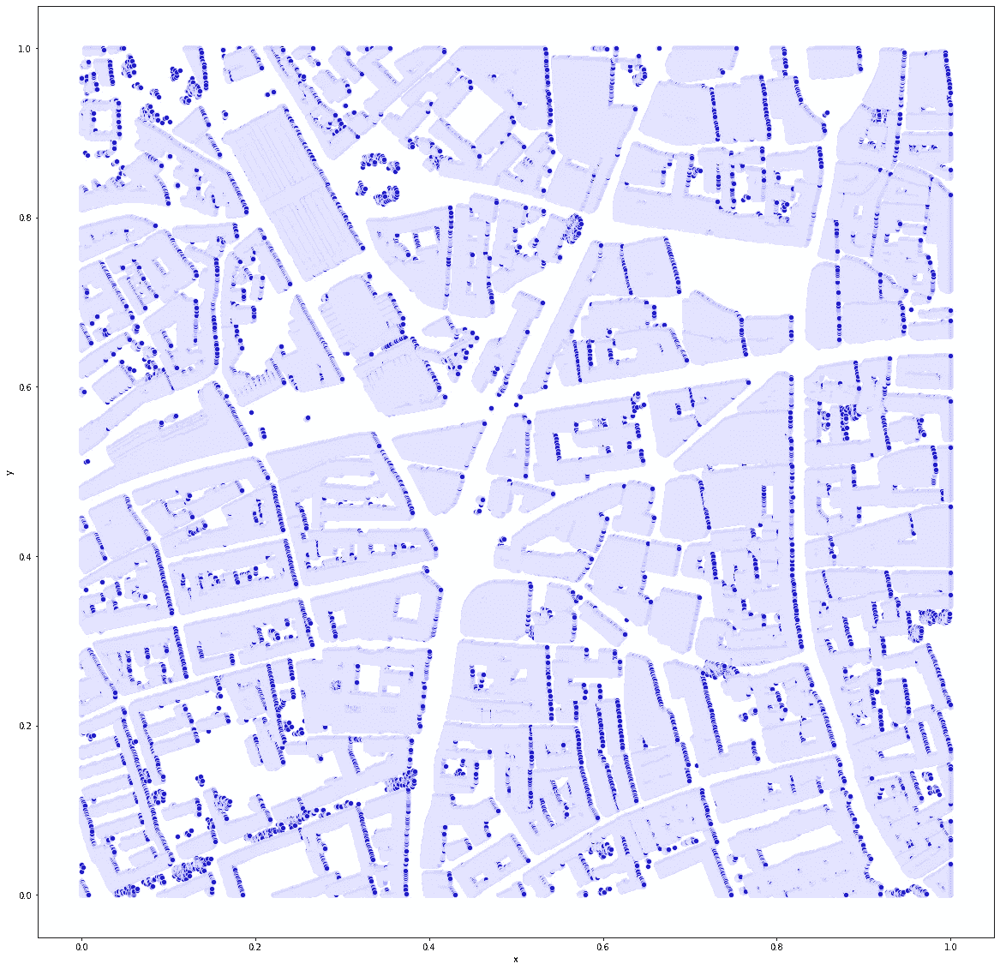

因为我们有 4mln 个点，所以计算这个需要一点时间，但是我们可以增加步长使它更容易，所以我显示的结果是使用步长 10:

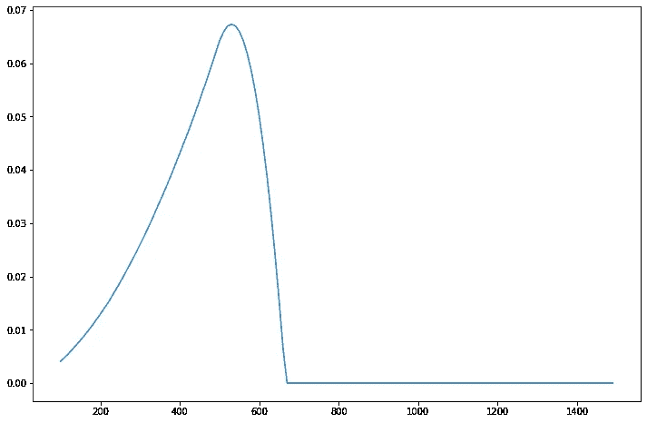

这个恰好很好很简单，临界除法参数恰好在 525 左右。我们在文章中使用了 501，这是我凭直觉得出的，而不是根据严格的计算得出的。现在，在我们开始之前，我们有了一个非常简单的方法来确定我们问题的正确粒度。

这种方法的好处是——现在我们可以测试数据中的条纹，并在试图找到正确的建模方法之前理解比例和联系。我们可以对任意数量的变量这样做。潜在地，这是非常强大的，可以节省很多时间。

正如我所承诺的，我在这里附上所有的主要功能。请随意使用和改进这些。如果你有一个有趣的项目/数据集，你想使用它，并希望我的投入-请让我知道，我不能保证我会接受它，但我会努力。如果你自己在用，请友好地引用这篇文章。谢谢！快乐聚类！