# 使用 INFORM 风险和新冠肺炎数据对国家进行聚类分析

> 原文：<https://towardsdatascience.com/clustering-analysis-of-countries-using-inform-risk-and-covid-19-data-6dbc54e0bd80?source=collection_archive---------42----------------------->

## 老龄人口、共病和流动是决定国家对新冠肺炎脆弱性的关键因素

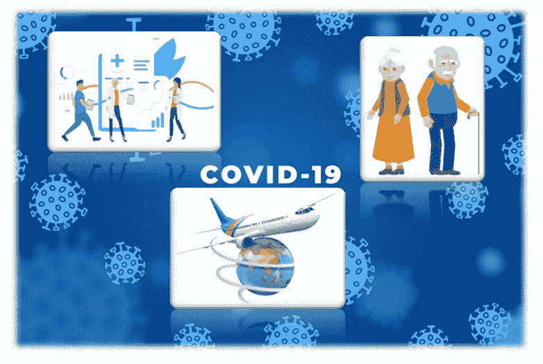

图片来源:freepik

*作者:纳米塔·希巴&凯瑟琳·洛佩斯*

# 新冠肺炎脆弱性相关风险

自 2020 年初以来，我们一直面临新冠肺炎疫情，它已经蔓延并影响到每个国家。 [HDE](https://data.humdata.org/) (人道主义数据交换)产生了 [INFORM](https://data.humdata.org/organization/inform) (风险管理指数)新冠肺炎风险指数，以确定**“面临新冠肺炎健康和人道主义影响的国家，这些影响可能超出当前的国家应对能力，因此需要额外的国际援助”**。我们将这一综合风险指数与其他新冠肺炎数据(包括病例、检测、卫生能力和人口)结合在一起，以更好地了解不同国家的风险及其管理。

# 数据

我们使用了新冠肺炎的公共数据集列表，如下所示，我们包括了大约 180 个国家和每个国家大约 40 个不同的特征:

*   约翰·霍普斯金大学[确诊病例、死亡病例、康复病例](https://github.com/CSSEGISandData/COVID-19/tree/master/csse_covid_19_data/csse_covid_19_time_series)
*   测试数据来自[我们的数据世界](https://github.com/owid/covid-19-data/tree/master/public/data/testing)
*   来自[世界人口统计的人口和人口密度数据](https://www.worldometers.info/world-population/population-by-country/)
*   来自[全球健康安全指数](https://www.ghsindex.org/)的健康能力得分，该指数是该国诊所、医院和社区中心的健康能力指数
*   通知来自[人道主义数据交换](https://data.humdata.org/organization/inform)的风险指数数据

# 基于主成分分析和自组织神经网络的数据预处理

我们在数据预处理中使用主成分分析(PCA)和自组织映射(SOM)来提取独立特征，并将高维数据可视化到低维表示上。

```
Principal Component Analysis (PCA) is a multivariate analysis technique to transform the original set of multiple features in the data into a smaller set of uncorrelated variables which account for the maximum variance in the data set, and are called principal components. Therefore, PCA is a dimensionality reduction technique for large datasets.
```

对于我们的数据，我们使用主成分分析来降低维数，同时仍然可以解释数据中 99%的方差。结果我们把变量的数量从 43 个减少到了 24 个。“sklearn”库用于执行 PCA。

```
Self Organizing Maps (SOM) are unsupervised neural networks that cluster high dimensional data into easy to understand two-dimensional outputs (SOM grid). The SOM grid is a two-dimensional manifold or topological space onto which each observation (row) in the m-dimensional space (where m is the number of variables) is mapped via its similarity with the prototypes (code book vectors) for each node in the SOM grid.
```

在我们的研究中，数据最初由 178 个观察值和 43 个特征描述，但在应用 SOM 算法时，它被压缩成 7x7x43 的二维图(49 个节点，43 个特征)。高维空间中接近的向量也最终被映射到二维空间中接近的节点。因此，SOM 保留了原始数据的拓扑结构。这意味着在我们的数据中，具有相似性的国家在结果 SOM 中更接近。

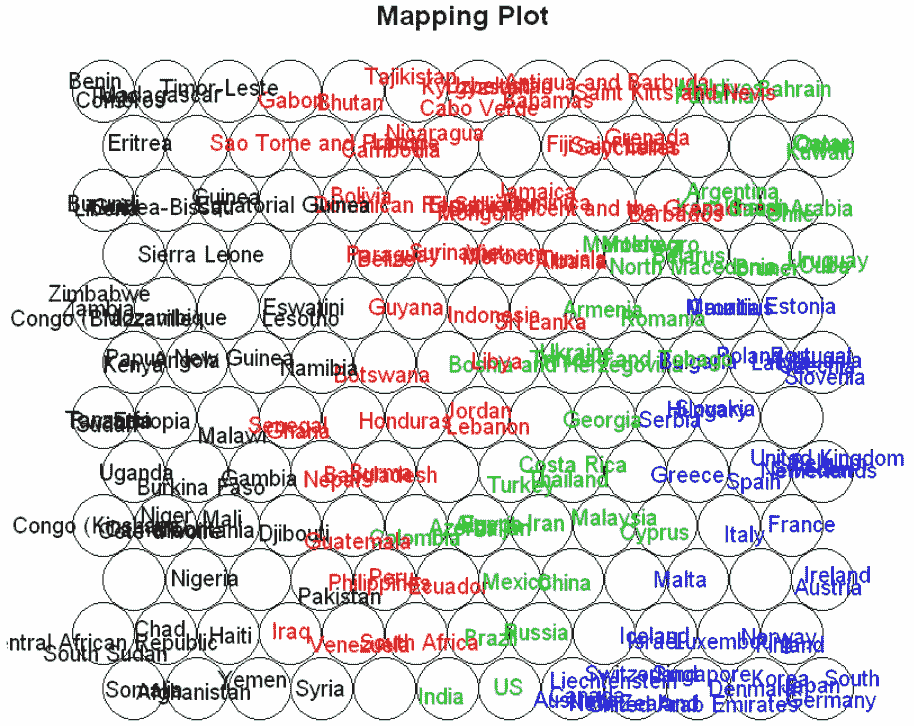

图 1: SOM 网格

# 使用层次聚类的聚类分析

层次聚类是一种聚类分析方法，它试图构建聚类的层次结构。有两种层次聚类策略:

```
**Divisive Hierarchical clustering**: It is a top-down approach, where all the observations are a part of a single cluster to begin with but then at each iteration the splits are performed and the process is repeated until each cluster contains only a single observation.**Agglomerative Hierarchical Clustering**: It is a bottom-up approach, where in the beginning there are as many clusters as is the number of observations but then at each iteration, the closest pair of clusters are merged and the process is repeated until there is only one cluster left.
```

我们使用主成分分析和 SOM 结果进行凝聚聚类分析。用这两种方法中的每一种都获得了四个聚类。下面的图 2 示出了使用来自 PCA 的特征作为输入获得的 4 个聚类(A、B、C & D ),图 3 示出了使用来自 SOM 的特征作为输入的 4 个聚类(1、2、3 和 4)。

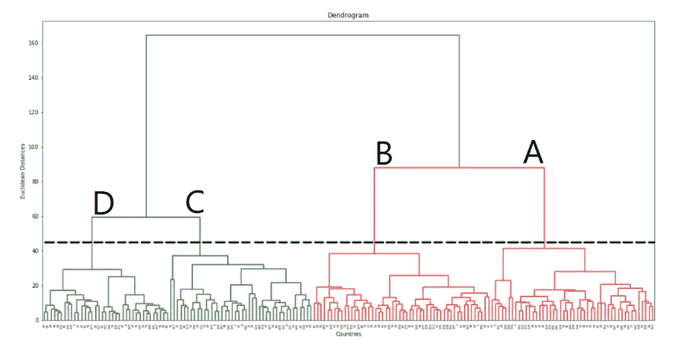

图 2:作为输入从 PCA 获得的 4 个聚类的树状图

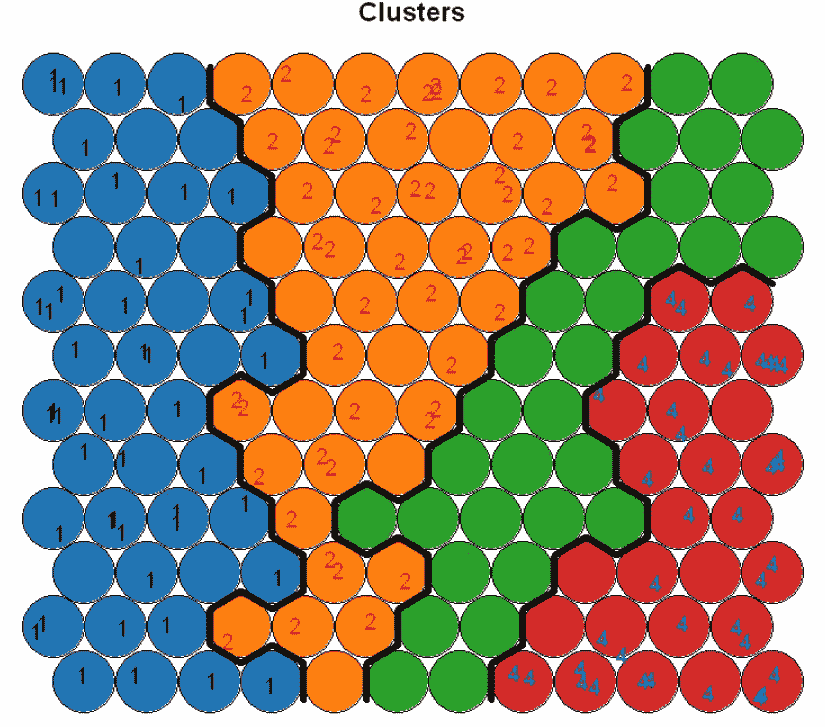

图 3:具有 4 个集群的 SOM 网格

每个国家(分析的 178 个国家中)通过主要成分的等级聚类被分配一个聚类 ID (A、B、C 或 D );和在 SOM 节点上使用分级聚类的另一个聚类 ID (1、2、3 或 4)。

在两种方法中，聚类 A 与聚类 1 一致，聚类 B 与聚类 2 一致，聚类 C 与聚类 3 一致，聚类 D 与聚类 4 一致。在聚类分析**、**所包含的 178 个国家中，有 169 个国家使用 PCA 和 SOM 在聚类分析中显示出一致的结果。总而言之:

*   **集群 4/D** 包括澳洲、丹麦、德国、冰岛、纽西兰、英国等 45 个国家；
*   **集群 3/C** 包括 50 个国家，包括阿根廷、巴西、印度、伊朗、墨西哥、美国；
*   第 2/B 组包括 40 个国家，包括印度尼西亚、伊拉克、斐济、利比亚、菲律宾、斯里兰卡、突尼斯；
*   **集群 1/A** 包括 40 个国家，包括尼日利亚、肯尼亚、埃塞俄比亚、乌干达、赞比亚和津巴布韦。

# 从 4 组国家中获得的见解

4 个集群的描述摘要:

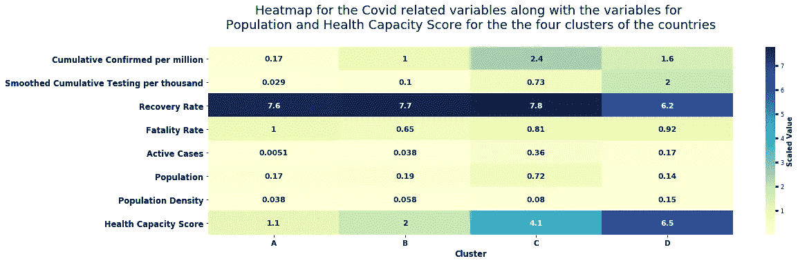

表 1:4 个集群的新冠肺炎案例相关指标的热图

从上面的热图可以明显看出，根据新冠肺炎相关指标，与其他国家相比，组成第 4/D 类的国家组**的平均卫生能力得分**以及**的每千人累计检测数**更高。这些人口密度相当高的国家与其他聚集地相比**累计确诊****每百万新冠肺炎病例数也很高。澳大利亚属于这一类(4/D)。类别 3/C 中的国家具有最高的平均人口数(T14)和最高的累计确认数(T16)。**

**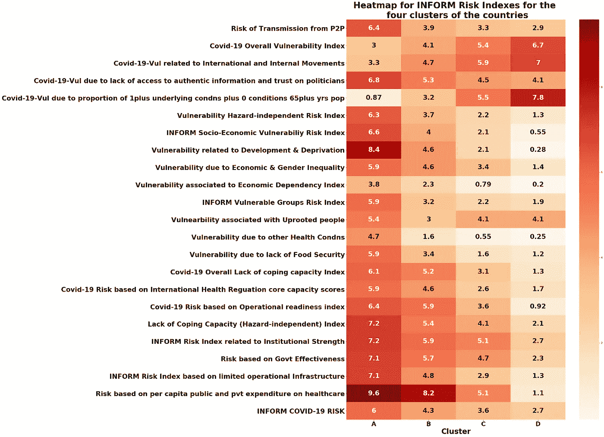**

**表 2:基于 4 个集群的信息风险因素的热图**

**上面的热图显示了与信息风险相关的指数，包括与灾害无关的脆弱性(包括与发展和贫困水平相关的脆弱性)和新冠肺炎脆弱性。群组 1/A 中的国家是一组贫穷的国家，如尼日尼亚、辛巴威、埃塞尔比亚，由于缺乏应对新冠肺炎病毒的能力而具有最高的风险，然而，他们并不是新冠肺炎病毒最脆弱的国家。对新冠肺炎来说，最脆弱的群体是集群 4/D，这一群体包括像澳大利亚、德国和英国这样的发达国家。如下图 4 所示，由于总人口中有**高** **至少一种与严重新冠肺炎病(共病)相关的潜在疾病的比例，以及无任何潜在疾病的老年人口(65 岁以上)**和**过度的内部和外部流动**，它们具有**最高的新冠肺炎脆弱性**。**

**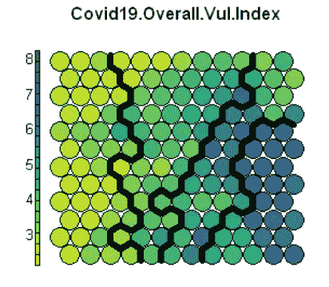****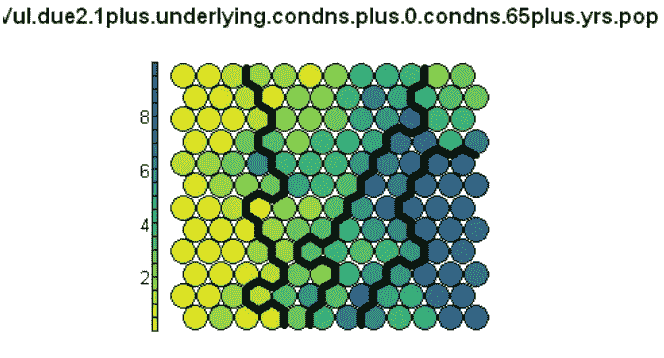****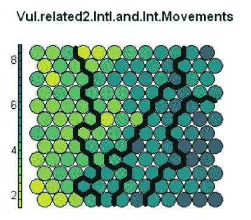**

**图 4:4 个集群中 3 个风险指标的分布**

**我们根据卫生能力、新冠肺炎脆弱性、人口和新冠肺炎病例对 4 个集群进行了命名。**

## **群组 4/D:高新冠肺炎脆弱性和高卫生能力**

**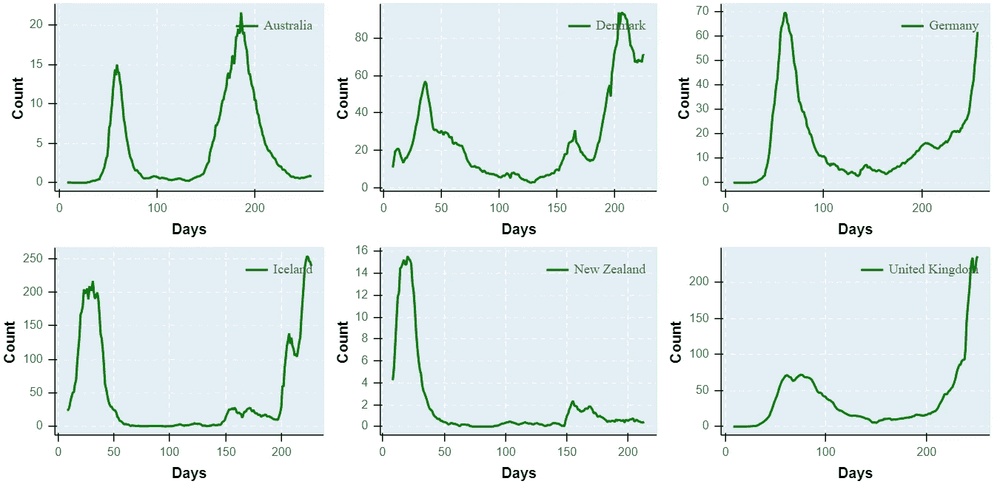**

**图 5:群组 4/D 中 6 个代表性国家每日每百万确诊病例的七天平均数**

*****代表国家:*** 澳大利亚、丹麦、德国、冰岛、新西兰、英国**

*****特征:*** 因过度的国内国际流动而导致的新冠肺炎脆弱性最高，65+人口中有前提条件的比例最高。最高的国际卫生条例核心能力得分和运营就绪指数，此外还有基于人均公共和私人医疗保健支出的最低风险。这些国家拥有最高的医疗保健能力和最大的每千人检测平均值。尽管每百万人累计确诊病例数很高，但这些国家中的许多国家在大约 2 个月内第一次变平。**

## **群组 3/C:高人口和高病例的高新冠肺炎脆弱性**

**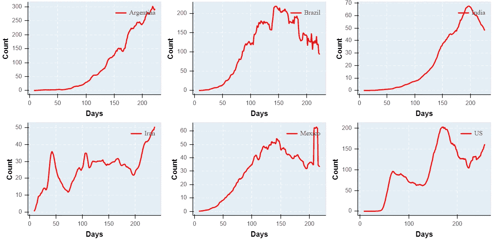**

**图 6:群组 3/C 中 6 个代表性国家每日每百万确诊病例的七天平均数**

*****代表国家:*** 阿根廷、巴西、印度、伊朗、墨西哥、美国**

*****特征:*** 新冠肺炎脆弱性高，健康能力得分一般，千分检测数高。这一组包括人口极其庞大和每百万人累计确诊病例最高的国家。自新冠肺炎开始以来，这些国家的每日确诊病例持续上升，在超过 3 个月的时间里曲线没有变平。**

## **第 2/B 组:新冠肺炎脆弱性低，新冠肺炎病例低且上升**

**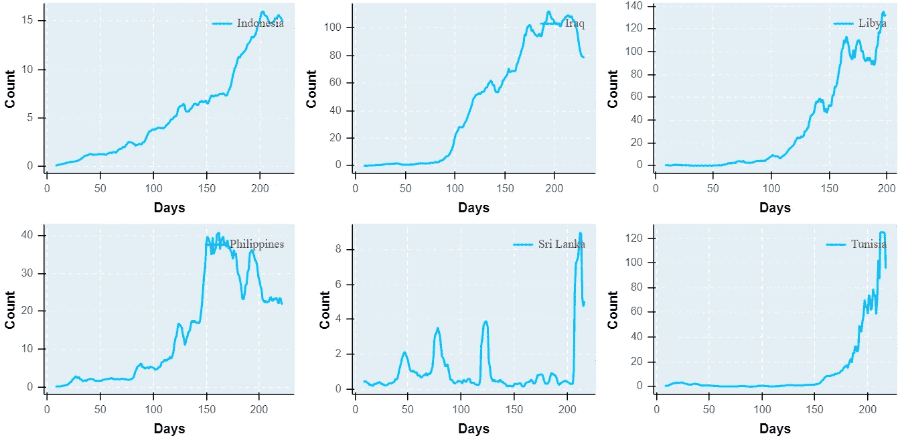**

**图 7:群组 2/B 中 6 个代表性国家每日每百万确诊病例的 7 天平均数**

*****代表国家:*** 印度尼西亚、伊拉克、斐济、利比亚、菲律宾、斯里兰卡、突尼斯**

*****特征:*** 与其他集群相比，健康容量低，每千人累计检测低；这一群体的新冠肺炎脆弱性低，国内和国际流动有限，并且有先决条件的人口和 65 岁以上年龄组的风险评分低。然而，它们在独立于风险的漏洞方面具有高风险，并且操作准备有限。尽管每日确诊病例数的增长率低于群组 3/C，但由于每日病例数的增加而没有任何曲线弯曲的明确迹象，这一组国家面临着挑战。**

## **群组 1/A:保健能力低，新冠肺炎脆弱性低**

**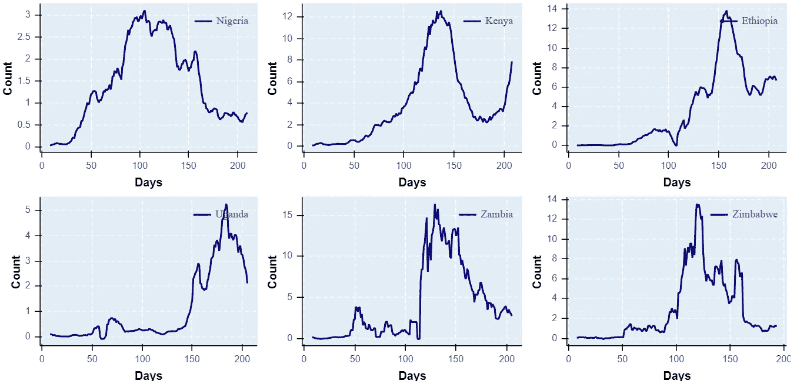**

**图 8:群组 1/A 中 6 个代表性国家每日每百万确诊病例的七天平均数**

*****代表国家:*** 尼日利亚、肯尼亚、埃塞俄比亚、乌干达、赞比亚、津巴布韦**

*****特征:*** 卫生容量最低，每千人累计检测最低，每百万人累计确诊病例最低。老龄人口和有先决条件的人口的脆弱性最低，除了最少的旅行活动之外，新冠肺炎的总体脆弱性在这一群体中最低。虽然这些国家在独立应对灾害的能力和有限的运作基础设施方面风险最高，但其中大多数国家每日确诊病例的增长率较低，而且它们也成功地使曲线变平**

# **结论**

**良好的卫生能力肯定有助于各国应对检测、住院和康复需求。许多国家，特别是发达国家，老年人口和有条件的人口比例很高，由于国内和国际旅行造成的过度流动，比不发达国家更容易受到新冠肺炎的影响。因此，很明显，为了抵御新冠肺炎的严重影响，非常关键的是**

> **“减少和规范运动，保护我们的老年公民”。**

***我们欢迎您的反馈和评论，在这里* *可以随意查看我们之前在数据探索方面的工作，也可以随意访问*[*ka ggle repo*](https://www.kaggle.com/namitachhibba/covid-19-data-analytics-project)*和*[*github repo*](https://github.com/namitachhibba/COVID-19_ClusteringAnalysis)*。***

*****来自《走向数据科学》编辑的注释:*** *虽然我们允许独立作者根据我们的* [*规则和指导方针*](/questions-96667b06af5) *发表文章，但我们不认可每个作者的贡献。你不应该在没有寻求专业建议的情况下依赖一个作者的作品。详见我们的* [*读者术语*](/readers-terms-b5d780a700a4) *。***