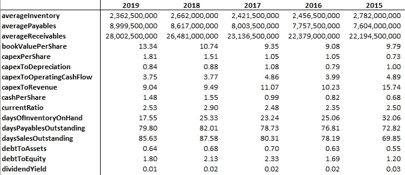
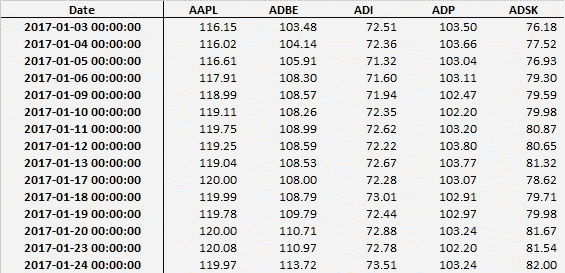
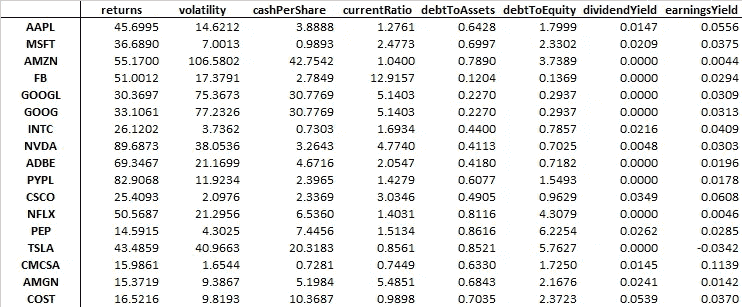
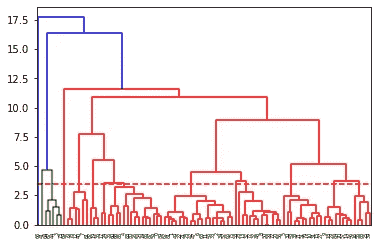
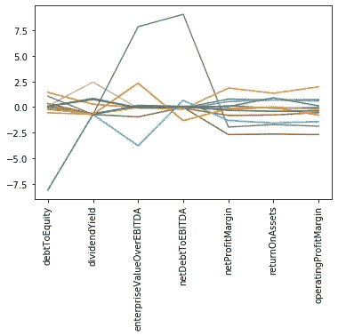
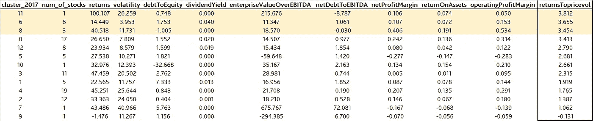
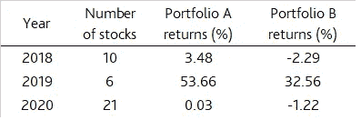

# 股票选择的聚类分析

> 原文：<https://towardsdatascience.com/clustering-analysis-on-stock-selection-2c2fd079b295?source=collection_archive---------12----------------------->

## 时间抛开复杂的时间序列模型，简单的基本面分析也可以帮助赚钱！！！

马库斯·斯皮斯克在 [Unsplash](https://unsplash.com?utm_source=medium&utm_medium=referral) 上的照片

# 背景

H 你有没有厌倦过通过查看数百个财务比率来选择一只股票？或者你已经厌倦了打磨你的技术分析技巧或改进你的时间序列模型来更好地预测价格？如果答案是肯定的，那你来对地方了。

在本文中，我们将通过一个实验来看看不同维度的财务比率是否真的增加了股票选择的价值。在这个过程中，我们还将看到聚类分析如何帮助我们摆脱财务指标的海洋。

在此之前，我还将向您展示 **(1)下载股票的历史财务比率、**和 **(2)股票的每日价格数据**，这对许多在不同项目中研究股票数据的人来说非常有用。

下面所有代码的原文，你可以在这里查阅我的 Github 链接[。](https://github.com/ngaiyin1760/Cluster-analysis-for-stock-selection)

# (1)下载股票的财务指标

首先，我们将使用一个名为 ***基础分析的库。*** 关于这个库的详细信息，请参考网站[这里](https://pypi.org/project/FundamentalAnalysis/)。

为了能够使用这个包，我们需要一个来自 [FinancialModellingPrep](https://financialmodelingprep.com/developer/docs/) 的 API 密匙，并按照那里的说明获得一个 ***免费的* API 密匙**。请注意，虽然没有时间限制，但这些密钥仅限于每个帐户 250 个请求。所以我强烈建议大家将下载的数据输出为 excel 文件以备将来使用。否则很容易超过限制。

并且由于这个限制，我**将实验中的选股范围设定为下面列出的 97 只股票，都是纳斯达克 100 指数**的成份股。

上面的代码会生成两个 excel 文件，***(a)key _ metrics . xlsx***和***(b)financial _ ratios . xlsx***，每只股票在一个单独的表中。这两个文件都存储了过去 10-20 年的各种财务指标，具体取决于公司上市的时间。在后面的步骤中，我们将把它们与收益和价格波动数据结合在一起。

MSFT 关键指标数据的捕获图像

# (2)下载股票价格数据

让我们下载价格数据。由于上面的包对请求配额有限制，我们将切换到另一个自由库 ***yfinance。***

上面的代码将下载股票行情表中所有股票的每日价格数据。并选择收盘价来表示价格，输出为 excel 文件， ***price.xlsx*** 。

价格数据的捕获图像

# (3)将所有数据结合起来使用

最后我们想**将准备好的三个 excel 文件合并成一个文件，每个文件在所选期间(2017–2019)**内保存一年。我不打算在这里赘述细节，因为这些都只是使用熊猫和 numpy 的一些基本技巧。本节原代码请参考 Github 链接[此处](https://github.com/ngaiyin1760/Cluster-analysis-for-stock-selection)中的***cluster _ stocks _ data . py***。

尽管如此，我还是想提到一些非常有用的关键技巧，即使是在你从事其他项目的时候。

***(a) dataframe.at[index，column name]****——为了避免混淆 iloc 或 loc 或任何其他类似的函数，您可以尝试使用函数* ***”。在"*** *，* *这些直接指的是 dataframe 内的单个单元格。并且可以很容易地用等号设置它的值。*

***【b】数据帧。t****—如果要交换行和列，转置数据帧。通过应用此功能* ***。T"*** *，那么列名就会变成索引，反之亦然。*

***(c)PD . concat()****—平行(水平)组合两个数据帧。*

***(d)data frame . fillna(value = N)****—用特定值的 NaN 填充单元格。*

经过繁琐的程序后，最终产品将是三个 excel 文件(2017 年、2018 年和 2019 年)。每个都存储特定年份股票行情表中每只股票的回报、价格波动和其他财务指标的数据。

2017 年最终数据集的捕获图像

# (4)实验

F 最后，我们可以回到本文的主要内容——(1)**检验** **不同维度的财务比率是否真的为选股增值，**和 **(2)看看聚类分析如何帮助我们摆脱财务指标的海洋。**

与其一行一行地检查冗长的代码，我们不如一起检查这个想法。但是，我还是会举例说明一些关键部分的代码。对于下面介绍的金融概念，如果你有进一步的兴趣，可以参考 [Investopedia](https://www.investopedia.com/) 了解更多详情。本节代码请参考 Github [链接](https://github.com/ngaiyin1760/Cluster-analysis-for-stock-selection) *中的***cluster _ stocks _ analysis . py***。*

***第一步:选择一组有代表性的财务指标。*** 在这个实验中，我选择了以下内容，旨在从不同维度捕捉一家公司的表现或能力。

**负债权益比率——公司的杠杆比率**

股息收益率——公司支付给股东的持有其股票的金额除以当前股价

**企业价值(EV) / EBITDA —** 一个常用的倍数来确定公司的价值

**净债务与 EBITDA 比率—** 表明公司减少债务的能力

**净利润率—** 净收入占收入的百分比是多少

**营业利润率—** 在支付可变生产成本(如工资和原材料)后，支付利息或税之前，公司从一美元销售中获得的利润

**资产回报率—** 通过确定一家公司相对于其总资产的盈利能力，表明该公司利用其资产的情况

***第二步:根据以上选择的财务指标进行聚类分析。***

不同的人在选择股票时有不同的偏好。有的关心公司盈利能力，有的关心股票是否稳定分红。但是如果我们想了解整体性能呢？那么就很难断定一只股票一定比另一只好，特别是每一个财务指标都代表不同的东西，可能有上百个指标。

在这种情况下，聚类分析可能是拯救我们的一种方法。**聚类帮助我们根据财务指标所代表的特征将相似的股票分组在一起。**

在本实验中，我们将应用一种最常用的方法——**系统聚类，用自底向上的方法、欧几里德距离和沃德方法来计算相似度**。对于层次聚类的详细解释，这篇[文章](/understanding-the-concept-of-hierarchical-clustering-technique-c6e8243758ec)给出了一个很好的教训。

***(一)标准化***

**每个财务指标都有自己的标度**。例如，EV / EBITDA 可以始终高于资产回报率。因此，为了防止这种规模差异导致无与伦比的权重和不可靠的结论，我们必须首先对数据进行标准化。我们可以通过下面的一行代码简单地做到这一点。

***mean() —*** 计算列内数值的平均值

***std() —*** 计算一列内数值的标准差

***(二)执行层次聚类分析***

将数据标准化后，我们可以使用一个名为**agglomeveclustering**的库来执行聚类，这个库的名字意味着自底向上的方法。

为了可视化聚类结果，我们将应用**树状图，**，它是一个树形图，记录了合并或拆分的顺序。但是，请注意，最终形成的集群数量完全基于您的判断。如果聚类太多，分类可能会太细。如果太少，股票可能无法很好地分类。

树状图绘制如下。

从树状图中，我们可以看到**可能有 13 个星团。**

有趣的是，四只股票本身形成了独立的集群。

基于该选择，我们接下来对数据集 2017、 ***应用函数**凝聚聚类**，通过将 n_clusters 设置为 13，将亲和力设置为欧几里德距离，将链接设置为沃德方法*** 。

为了说明这 13 个星团的特征，我们可以画一个线图。

从折线图上我们可以看到，2017 年有四个非常有特色的星团，实际上它们都是单独形成的。它们是:

(i) **【灰线】——高净债务/EBITDA 比率和 EV/EBITDA 比率**，这意味着公司偿还债务的能力相对较低，基于其较弱的盈利能力对其进行了高估值，这可能意味着其被高估。

(二) **IDXX(深蓝线)—负负债率**，主要是公司 2017 年权益余额为负。

(三) **DXCM(浅蓝色线)—负 EV / EBITDA 比率，**因 2017 年 EBITDA 为负。

(iv) **VRTX(橙色线)——负净债务与 EBITDA 比率**，因其 2017 年净债务为负值。

我们不打算调查公司业绩的细节，这可能需要为每只股票单独写一篇文章。我只是想给大家展示一下**在选取的财务指标中，聚类可以帮助我们将具有相似特征的股票分组在一起，同时也可以检测出一些离群值。**

***第三步:根据聚类结果构建投资组合，并与不借助聚类构建的投资组合进行比较***

截至 2017 年底，13 个集群的平均绩效表如下所示。

**在进行聚类分析后，需要一个标准来帮助做出投资组合构建的决策。**在这个实验中，**收益价格波动率**将是唯一遵循的标准。

回报将是一年的回报，通过比较 2017 年末的价格和 2017 年初的价格来计算。价格波动率是 2017 年全年价格的标准差。因此**收益-价格波动率比率仅仅是一个收益和风险的度量**，也用来模仿[夏普比率](https://www.investopedia.com/articles/07/sharpe_ratio.asp)。

从上表中可以看出，**集群 6、8 和 11 将被选中，因为它们的收益价格波动率相对较高**。投资组合 A 是通过对这三个组中的所有股票进行相等的加权投资而构建的，总共有 10 只股票。作为比较，我们希望通过选择 2017 年收益价格波动率最高的相应数量的个股来构建另一个投资组合，而无需事先应用聚类分析。

两个投资组合:

***(一)2017 年收益率波动率最高的前 3 个集群*** *，共 10 只股票(CSCO、FAST、XEL、EXC、COST、QCOM、VRSN、CHKP、FB、VRTX)*

***(B)2017 年收益价格波动率最高的 10 只股票*** *(为了公平比较，我们每年都会调整该投资组合的股票数量，以便与投资组合 A 中的股票数量相匹配)(SIRI、、、EBAY、、CSCO、MU、MXIM、NTAP、CMCSA)*

现在，我们有兴趣看看哪个投资组合在未来一年(2018 年)产生更高的回报。并且**结果显示，投资组合 A 产生了 3.48%的收益，而投资组合 B 遭受了 2.29%的损失。**

然而，仍然很难断定基于上述方法的投资组合结构一定会表现更好，尤其是基于一年的数据。因此，我将这个实验延长两个时期(2018–2019 和 2019–2020)，结果相当令人惊讶。

两个投资组合在三年内的表现。

显然，**在所有三年中，投资组合 A 始终比投资组合 B 产生更高的回报。**

# (5)性能提高的可能原因

当然，通过财务指标的聚类分析来构建投资组合并不一定能取得优异的业绩。**但其持续优于仅考虑回报和风险的选股表现表明，基本面分析确实增加了一些价值，聚类分析有助于简化分析过程。**

以下是对更好性能的一些可能解释:

***(一)价值基本面分析—*** *财务指标从不同维度衡量一家公司的业绩。因此，财务表现良好的公司的回报应该比“随机产生的”回报更具可持续性。定期考虑财务指标并更新投资组合配置对其可持续表现非常必要。作为证据，如果我们试图保持 2017 年构建的投资组合的配置在 2019 年前不变，其业绩在 2018-2019 年期间实际上恶化了很多。*

***(二)多元化收益—*** *聚类分析有助于区分不同特征的股票。换句话说，所选择的三个集群应该是完全不同的。这种多样化可以防止投资组合在某一时期因某一特定类型公司的低迷而遭受重大损失。*

***(c)防范一些公司特有的风险—*** *将具有相似特征的股票聚集在一起。所以一个过去收益率与价格波动率比值高的群体应该比一只比值高的个股更“具体”。通过这种方法构建的投资组合可能防范了一些公司特有的风险。*

# (6)结论

构建一个持续表现良好的投资组合总是不容易的，尤其是当有成千上万只股票的时候。有时，我们可能会先缩小范围，但在做出决定之前，仍然需要查看数百个财务指标。

本文介绍了一种可能的方法——**聚类分析**来帮助我们摆脱财务指标的海洋，并通过一些程序构建了一个完整的财务数据集。我希望这将开启关于如何通过利用一些数据科学技术来改善我们的投资组合分配的讨论。

# **参考**

1.  柴坦尼亚·瑞迪·帕特拉。(2018).[理解层次聚类技术的概念](/understanding-the-concept-of-hierarchical-clustering-technique-c6e8243758ec)。
2.  达米安·博。(2020).[使用 Python](/get-up-to-date-financial-ratios-p-e-p-b-and-more-of-stocks-using-python-4b53dd82908f) 获取最新的股票财务比率。
3.  小牛顿达科斯塔，杰弗逊库尼亚和塞尔吉奥达席尔瓦。(2005).基于聚类分析的股票选择

 [## 用我的推荐链接加入媒体-哈德森高

### 如果你对我写的东西感兴趣，不要错过成为 Medium 会员的机会。您将可以完全访问所有…

medium.com](https://medium.com/@hudsonko/membership) 

如果你对时间序列模型更有信心，我的另一篇关于在 LSTM 模型中定制损失函数的文章可能会对你有所帮助。谢了。

 [## 定制损失函数，使 LSTM 模型更适用于股票价格预测

### 损失函数不要只考虑价格差异，方向损失也很重要！！！

towardsdatascience.com](/customize-loss-function-to-make-lstm-model-more-applicable-in-stock-price-prediction-b1c50e50b16c) 

*免责声明:请注意，投资可能因任何原因而上涨或下跌，股票的过去表现并不能保证未来表现。*

本文对任何内容的及时性、准确性或适用性不做任何陈述，也不对任何不规则或不准确之处承担责任。

*本文中的股票推荐和评论不代表我对是否买入、卖出或持有任何特定股票的观点。*

建议所有投资者在做出投资决定之前进行独立研究。投资者应该考虑任何投资建议的来源和适合性。您使用本文中的任何内容都要自担风险。