# 圣保罗的汉堡聚集地

> 原文：<https://towardsdatascience.com/clustering-burger-venues-in-s%C3%A3o-paulo-f4bfc0a031cd?source=collection_archive---------53----------------------->

## 使用 Foursquare API、无监督机器学习、树叶地图和单词云绘制见解

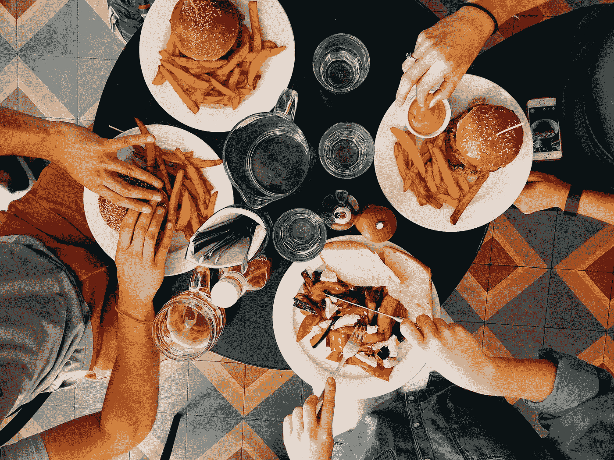

丹·戈尔德通过 [Unsplash](http://unsplash.com) 拍摄的照片

圣保罗是世界上最大的城市之一，人口超过 1200 万，是巴西的经济中心。它有太多的场地和餐厅，供应来自世界各地的特色美食。特别是，有一类餐馆在这个城市非常受欢迎:汉堡店。圣保罗总共有大约 600 家汉堡店，有些街区每个街区有不止一家。

作为我的 IBM 数据科学专业证书期末项目的一部分，我决定将数据科学和我对汉堡的巨大爱好结合起来，以了解一点关于我目前居住的城市圣保罗的汉堡店的情况。

这里的目标是为那些想开一家汉堡店的人，或者已经有一家店并想获得一些关于市场的新信息的人，或者只是为那些对数据如何改变我们对任何主题的看法感到好奇的人提供见解。

所有这些项目都是使用 Python 语言和 Jupyter 笔记本完成的。详细代码在这个 [Jupyter 笔记本链接](https://github.com/guilhermelac001/Coursera_Capstone_Project)里。目前，我只打算发布一些重要部分的代码片段。

# 战略:

我对这个项目的设想是从圣保罗的汉堡店中检索数据，根据它们的特点创建场馆群，对它们进行分类，并得出每个场馆群的见解。

为了实现这一目标，本研究分为 4 个部分:

*   **数据采集**
*   **数据预处理和聚类**
*   **聚类分析**
*   **结论**

# 数据采集:

获取数据的第一步是使用 *geopy* 库来检索圣保罗的街区，以便稍后我们可以找到每个街区的汉堡店。


照片通过 [Geopy](https://geopy.readthedocs.io/en/stable/)

*Geopy 是一个库，Python 开发人员可以使用第三方地理编码器和其他数据源轻松定位全球各地的地址、城市、国家和地标的坐标。*

使用 *geopy* 非常简单，只需写下街区的名称，它就会返回该位置的纬度和经度。下面是一段代码，它使用包含所有街区名称的 excel 文件检索每个街区的所有纬度和经度值:

```
data_hoods= pd.read_excel('Neighborhoods_SP.xlsx')
geolocator = Nominatim()
from geopy.exc import GeocoderTimedOut
lat=[]
lon=[]
for i in data_hoods['Neighborhood']:
    try:
        location_hood = geolocator.geocode("{}, Sao Paulo,Sao Paulo".format(i))
        print(i)
        lat.append(location_hood.latitude)
        lon.append(location_hood.longitude)
    except GeocoderTimedOut:
        location_hood = geolocator.geocode("{}, Sao Paulo,Sao Paulo".format(i))
        print(i)
        lat.append(location_hood.latitude)
        lon.append(location_hood.longitude)
```

有了这些信息，我们可以使用每个位置来检索每个街区 900 米半径范围内的每个地点。选择该半径是因为较大的半径只会导致场馆重叠，并在数据集中产生更多的重复。下面的代码显示了如何调用 API 来检索所有的场馆、它们的位置、名称和 id:

```
def getNearbyVenues(names, latitudes, longitudes, radius=900):

    venues_list=[]
    for name, lat, lng in zip(names, latitudes, longitudes):
        print(name)

        # create the API request URL
        url = 'https://api.foursquare.com/v2/venues/explore?&client_id={}&client_secret={}&v={}&ll={},{}&radius={}&limit={}&query={}'.format(
            CLIENT_ID, 
            CLIENT_SECRET, 
            VERSION, 
            lat, 
            lng, 
            radius, 
            LIMIT,
            'burguer'
        )

        # make the GET request
        results = requests.get(url).json()["response"]['groups'][0]['items']

        # return only relevant information for each nearby venue
        venues_list.append([(
            name, 
            lat, 
            lng, 
            v['venue']['name'], 
            v['venue']['location']['lat'], 
            v['venue']['location']['lng'],  
            v['venue']['id']) for v in results])

    burguer_venues = pd.DataFrame([item for venue_list in venues_list for item in venue_list])
    burguer_venues.columns = ['Neighborhood', 
                  'Neighborhood Latitude', 
                  'Neighborhood Longitude', 
                  'Venue', 
                  'Venue Latitude', 
                  'Venue Longitude', 
                  'Venue Id']

    return(burguer_venues)

SP_burguer_venues = getNearbyVenues(names=data_hoods['Neighborhood'],
                                   latitudes=data_hoods['lat'],
                                   longitudes=data_hoods['lon']
                                  )
```

注意，要复制上面的代码，你需要一个 foursquare 开发者账户:[http://developer.foursquare.com/](http://developer.foursquare.com/)。

现在我们可以使用一张地图来看看圣保罗的汉堡店

```
map_burguers_neigh = folium.Map(location=[latitudeSP,longitudeSP], zoom_start=11)

for lat, lon, name in zip(SP_burguer_venues['Venue Latitude'], SP_burguer_venues['Venue Longitude'], SP_burguer_venues['Venue']):
    label = folium.Popup(' name ' + str(name), parse_html=True)
    folium.CircleMarker(
        [lat, lon],
        radius=5,
        popup=label,
        color='red',
        fill=True,
        fill_color='red',
        fill_opacity=0.7).add_to(map_burguers_neigh)

map_burguers_neigh
```


在 Foursquare API 注册的汉堡店

上图描绘了圣保罗的汉堡联合市场有多大。在一些地区，这实际上可能是一个饱和的市场，例如在 Itaim Bibi 社区，我们有超过 30 家汉堡店(仅计算在 Foursquare 注册的汉堡店)。

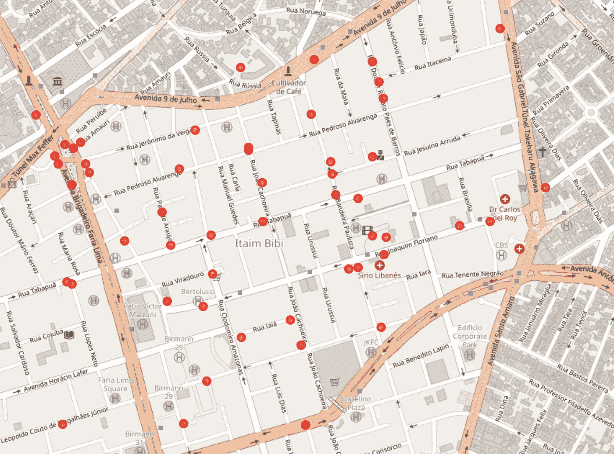

伊泰姆比比社区的汉堡店

现在，这里的想法是收集信息，这将有助于我们了解这些场馆。

*   场馆评级:区分场馆的简单方法。我们将通过从 Foursqaure API 请求场馆评级来检索最佳场馆。该数据是一个从 0 到 10 不等的等级。
*   场馆价格:逗号分隔的价格点列表。目前价格点的有效范围是[1，2，3，4]，1 是最便宜的，4 是最贵的。1< 10 USD an entree, 2 is 10 to 20 USD an entree, 3 is 20 to 30 USD an entree, 4 is >主菜 30 美元吗？这个数据也在来自 Foursquare API 响应的 json 中。
*   场地评论:对参加了在 Foursquare 平台注册的特定场地的客户的文本评论。这将有助于我们更深入地了解客户最看重什么。
*   街区平方米价格:这是特定街区每平方米的房地产价格。如果我们假设某个地区的房地产价格越高，居住在该地区的人的购买力就越高，那么这将有助于获取关于在特定地点维护场地的成本以及参加该场地的客户类型的见解。这一特征以雷亚尔(R$)计量。

为了获得这些信息，我们需要再次调用 Foursquare API，但是这一次我们需要使用另一个端点，因为我们需要每个特定地点的信息。进行呼叫的 url 是[https://api.foursquare.com/v2/venues/$VENUE_ID&客户端 id &客户端秘密& v](https://api.foursquare.com/v2/venues/{}?&client_id={}&client_secret={}&v={}') 版本。这将以 json 格式返回我们需要的大部分信息。

```
def getVenuesinfo(venue,names,venue_id):
    jsondict={}
    for ven,name, v_id in zip(venue,names,venue_id):
        print(name)

        # create the API request URL
        url_venue = 'https://api.foursquare.com/v2/venues/{}?&client_id={}&client_secret={}&v={}'.format(
            v_id,
            CLIENT_ID, 
            CLIENT_SECRET, 
            VERSION 
        )

        # make the GET request
        results_venues = requests.get(url_venue).json()
        jsondict[v_id]=results_venues

    return(jsondict)
```

在对每个场馆 id 进行调用后，我们将获得每个场馆的评论、价格和评级，只剩下我们要检索的邻近平方米价格。我不得不从圣保罗地区([http://proprietariodireto.com.br](http://proprietariodireto.com.br))的一个房地产网站手动获取这些信息。现在，我们剩下一个数据框，如下图所示:


包含圣保罗汉堡店信息的数据框

现在我们已经有了所有需要的信息，是时候进入数据预处理并最终创建我们的集群了。

# 数据预处理和聚类:

在我们开始做一大堆聚类并开始得出结论之前，我们需要问自己:我们有什么类型的数据？哪种聚类算法是最佳选择？我们如何准备数据？我们将如何评估聚类结果？

> 我们有什么类型的数据？

让我们回忆一下，我们感兴趣的是为我们的聚类算法提供信息的 3 个特征:场馆的价格(范围从 1 到 4，以雷亚尔(R$)为单位的每平方米价格)和等级(范围从 1 到 10)。其中两个特征的问题是它们是有序数据。这使得一些无监督算法很难产生相关结果。例如，k-means 使用欧几里德距离来计算一个簇中元素之间的相异度。这意味着分类数据的这项任务是不可能的，因为我们无法确定类别 A 与类别 B 之间的距离，因为它们是不连续的数据。另一方面，有专门对纯分类数据进行聚类的聚类算法，如 k-modes。但是有序数据是一个特例，因为我们的信息被分成不同的类别，但是有一定的顺序。这给我们留下了一个重要的决定:我们应该将我们的数据视为连续的，还是应该将我们的数据视为混合数据，其中一些将是连续的，一些将是分类的？这两个决定都有利弊，这将最终影响聚类算法的选择。


欧几里德距离公式的例子，照片由[克里斯·麦考密克](https://mccormickml.com/)拍摄

> 哪种聚类算法是最佳选择？

将数据视为纯连续数据会假设一个类别和另一个类别之间的距离相同，就好像它们是连续数据一样，但这有时是不正确的。通过将它们视为混合数据，我们将基本上失去有序数据的排序信息，并将它们视为纯粹的分类数据。对于这种方法(混合数据),我们需要使用 **k-prototypes** 算法，我会在这篇文章的最后解释。由于我们需要两个分类数据的信息顺序，我们将把它们视为连续的，并使用 **k-means 算法**对它们进行聚类。

> 我们如何准备数据？

在继续执行以下步骤之前，检查要素中的空值和重复 id 并删除符合任一情况的行非常重要。然后，我们需要对数据进行标准化，这样在聚类过程中就不会有比其他特征更高的权重。为此，我们将使用 *sklearn 的标准标尺*。这将通过移除平均值并缩放至单位方差来标准化要素。

```
cluster_df=SP_burguer_venues.filter(['Rating','Price_M2','Price'], axis=1)

Clus_dataSet=StandardScaler().fit_transform(cluster_df) 
```

现在，我们已经准备好对我们的场馆进行分组:

```
from sklearn.cluster import KMeans

wcss = []
for i in range(1, 11):
    kmeans = KMeans(n_clusters=i, init='k-means++', max_iter=300, n_init=10, random_state=0)
    kmeans.fit(Clus_dataSet)
    wcss.append(kmeans.inertia_)
plt.plot(range(1, 11), wcss)
plt.title('Elbow Method')
plt.xlabel('Number of clusters')
plt.ylabel('WCSS')
plt.show()
```

这个代码片段中生成的图将在下一步中有用。

> 我们将如何评估聚类结果？

用于评估聚类准确性的方法将是肘方法。实际上，我们将最小化所有聚类中的每个数据点到它们各自质心的距离。这将为我们的具体情况提供最佳的集群数量。为了使用肘方法，我们使用不同数量的簇绘制了具有惯性值的图形:

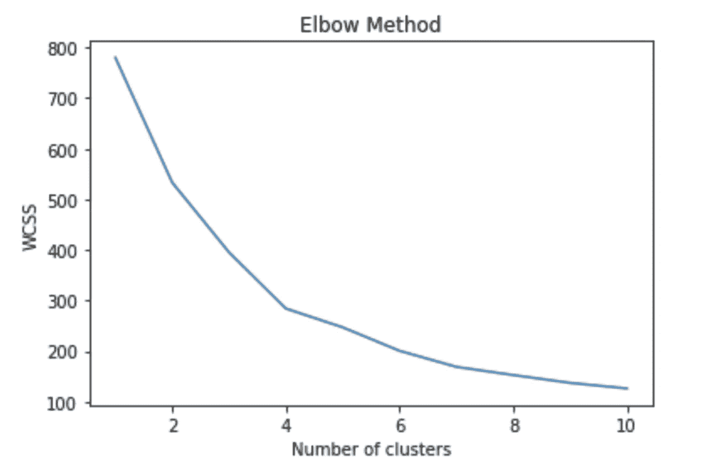

聚类数的平方和

通过查看上图，我们可以得出结论，对于这种情况，4 个集群将是我们的最佳选择。

使用 4 个聚类并再次运行该算法，我们在我们的聚类的 3 个特征内获得以下点分布(该图是使用 plotly 生成的):

```
import plotly
import plotly.express as px
fig = px.scatter_3d(SP_burguer_venues, x='Rating', y='Price', z='Price_M2',
              color='Cluster Labels', size_max=18,
               opacity=0.7)

fig.update_layout(margin=dict(l=0, r=0, b=0, t=0))
fig.show()
```

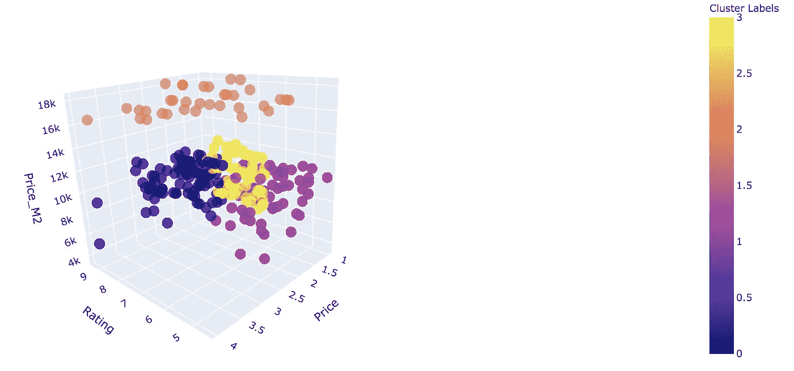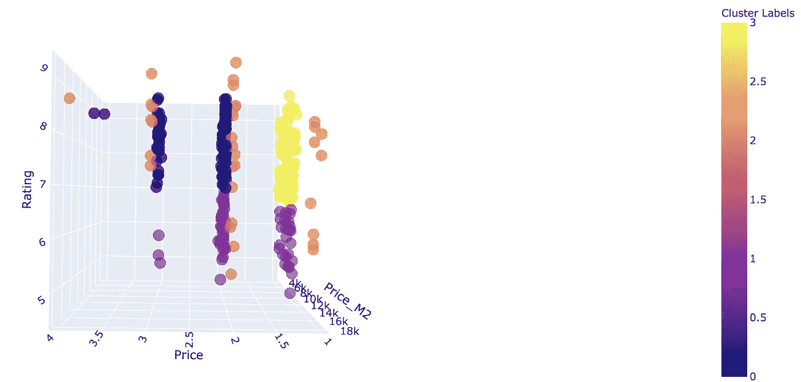

有了这 3 个可视化，我们就可以开始了解算法是如何对场馆进行聚类的了。在我们继续之前，让我们创建一个叶子地图来可视化圣保罗地图中按集群分隔的场馆:

```
map_clusters = folium.Map(location=[latitudeSP,longitudeSP], zoom_start=11)

# set color scheme for the clusters
x = np.arange(kclusters)
ys = [i + x + (i*x)**2 for i in range(kclusters)]
colors_array = cm.rainbow(np.linspace(0, 1, len(ys)))
rainbow = [colors.rgb2hex(i) for i in colors_array]

# add markers to the map
markers_colors = []
for lat, lon, poi, cluster in zip(SP_burguer_venues['Venue Latitude'], SP_burguer_venues['Venue Longitude'], SP_burguer_venues['Neighborhood'], SP_burguer_venues['Cluster Labels']):
    label = folium.Popup(str(poi) + ' Cluster ' + str(cluster), parse_html=True)
    folium.CircleMarker(
        [lat, lon],
        radius=5,
        popup=label,
        color=rainbow[cluster-1],
        fill=True,
        fill_color=rainbow[cluster-1],
        fill_opacity=0.7).add_to(map_clusters)

map_clusters
```


聚集场馆的圣保罗地图。

红色聚类是聚类 0，紫色聚类是聚类 1，聚类 2 用蓝色编码，聚类 3 用米色显示。

将每个地点分配给每个聚类的独立数据框后，我们可以开始分析每个聚类，并开始从生成的结果中获得洞察力。

# 聚类分析:

好的，我们有集群，但是他们告诉我们什么？要回答这个问题，我们需要经历 2 个步骤:

1.  分析每个特征，并在聚类之间进行比较。
2.  创建每个集群场馆评论的文字云。

让我们从第一步开始，绘制每个聚类中的要素。从每个集群场馆的平均价格开始:

```
cluster_labels=['Cluster 0','Cluster 1','Cluster 2','Cluster 3']
cluster_mean_price=[cluster1['Price'].mean(),cluster2['Price'].mean(),cluster3['Price'].mean(),cluster4['Price'].mean()]
cluster_price=pd.DataFrame({'Mean Price':cluster_mean_price,'Clusters':cluster_labels})

fig = px.bar(cluster_price, x='Clusters', y='Mean Price',title="Mean Price of each cluster",color="Clusters")
fig.show()
```


上图显示第 0 类和第 2 类最贵，主菜价格在 10-20 美元之间。如果我们假设价格等级和实际价格之间的线性关系，则集群 0 平均比第二贵的集群 2 贵大约 17%。

这清楚地区分了集群 0 和 2 以及集群 1 和 3。集群 0 和 2 是最贵的场馆，集群 1 和 3 是最便宜的场馆，特别注意集群 3，它不到集群 0 平均价格的一半。这意味着第三组场馆主菜的平均价格低于 10 美元。

现在，我们来看看每个集群的平均房地产价格:


该图显示了将分类 2 与其他分类区分开来的主要分类特征之一是房地产价格。它的平均价格比第二贵的邻居集群(集群 0)高 75%。

考虑到这一点，与其他集群相比，预计参加集群 2 场馆的人有更大的购买力。

最后，我们有场地评级:


几乎所有的群组在评级上没有相关的百分比差异，所有群组的平均值都在 7.6 到 8.1 之间。可以假设，这些集群的场馆都是非常满意的客户。

另一方面，我们在集群 1 上观察到集群之间的另一个清楚的划分。它的平均评分为 5.86，比排名第二低的集群低 23%。

显然，每个集群都有其特点，但现在是时候回顾一些更定性的东西了，这些东西不仅会带来关于场馆的一些见解，还会带来来自这些场馆本身的客户的一些见解。

## **输入单词云:**


萨姆·斯库勒通过 [Unsplash](http://unsplash.com) 拍摄的照片

词云是非常美学的工具，可以帮助我们根据某个词在某个文本中的出现频率来检索文本信息。单词云会产生一个图像，其中最常见的单词会显得更大。

使用客户的评论，我们可以生成每个客户的词云，并尝试识别关于场地和客户的特征，找到对我们在特征中获得的价值的解释，还可以发现每个集群的场地的哪些方面最能引起客户的注意。

由于这个项目是与一个说葡萄牙语的国家打交道，对于不懂这种语言的人来说，将很难从单词 cloud 整体上保留信息。也正因如此，这个词云中产生的关键点才会得到解释和恰当的翻译。

为了创建单词云，我们从每个聚类的评论中生成单词列表，对于来自 4 个聚类的每个单词列表，我们将创建一个单词云:

```
#!conda install -c conda-forge wordcloud --yes

# import package and its set of stopwords
from wordcloud import WordCloud, STOPWORDS

list_tip1=[]
list_tip2=[]
list_tip3=[]
list_tip4=[]

for i in cluster1['Review']:
    list_tip1.append(i)
for i in cluster2['Review']:
    list_tip2.append(i)
for i in cluster3['Review']:
    list_tip3.append(i)
for i in cluster4['Review']:
    list_tip4.append(i)

flatList1 = [ item for elem in list_tip1 for item in elem]
flatList2 = [ item for elem in list_tip2 for item in elem]
flatList3 = [ item for elem in list_tip3 for item in elem]
flatList4 = [ item for elem in list_tip4 for item in elem]

import numpy as np 
from PIL import Image
unique_string1=(" ").join(flatList1)
unique_string2=(" ").join(flatList2)
unique_string3=(" ").join(flatList3)
unique_string4=(" ").join(flatList4)

#Importing burguer mask
burger_mask = np.array(Image.open('burger_mask.png'))

burguer_wc1 = WordCloud(
    background_color='white',
    max_words=2000,
    stopwords=stopwords,
    mask=burger_mask
)

burguer_wc2 = WordCloud(
    background_color='white',
    max_words=2000,
    stopwords=stopwords,
    mask=burger_mask
)

burguer_wc3 = WordCloud(
    background_color='white',
    max_words=2000,
    stopwords=stopwords,
    mask=burger_mask
)

burguer_wc4 = WordCloud(
    background_color='white',
    max_words=2000,
    stopwords=stopwords,
    mask=burger_mask
)

# generate the word cloud
burguer_wc1.generate(unique_string1)
burguer_wc2.generate(unique_string2)
burguer_wc3.generate(unique_string3)
burguer_wc4.generate(unique_string4)
```

绘制每个词云后，我们得到:

```
fig = plt.figure()
fig.set_figwidth(50) # set width
fig.set_figheight(50) # set height
fig.add_subplot(4, 2, 1)
plt.axis('off')
plt.title('Cluster 0',fontsize=38,loc='left',verticalalignment='baseline',horizontalalignment= 'left')
plt.imshow(burguer_wc1, interpolation='bilinear')
fig.add_subplot(4, 2, 2)
plt.axis('off')
plt.title('Cluster 1',fontsize=38,loc='left',verticalalignment='baseline',horizontalalignment= 'left')
plt.imshow(burguer_wc2, interpolation='bilinear')
fig.add_subplot(4, 2, 3)
plt.axis('off')
plt.title('Cluster 2',fontsize=38,loc='left',verticalalignment='baseline',horizontalalignment= 'left')
plt.imshow(burguer_wc3, interpolation='bilinear')
fig.add_subplot(4, 2, 4)
plt.axis('off')
plt.title('Cluster 3',fontsize=38,loc='left',verticalalignment='baseline',horizontalalignment= 'left')
plt.imshow(burguer_wc4, interpolation='bilinear')
```

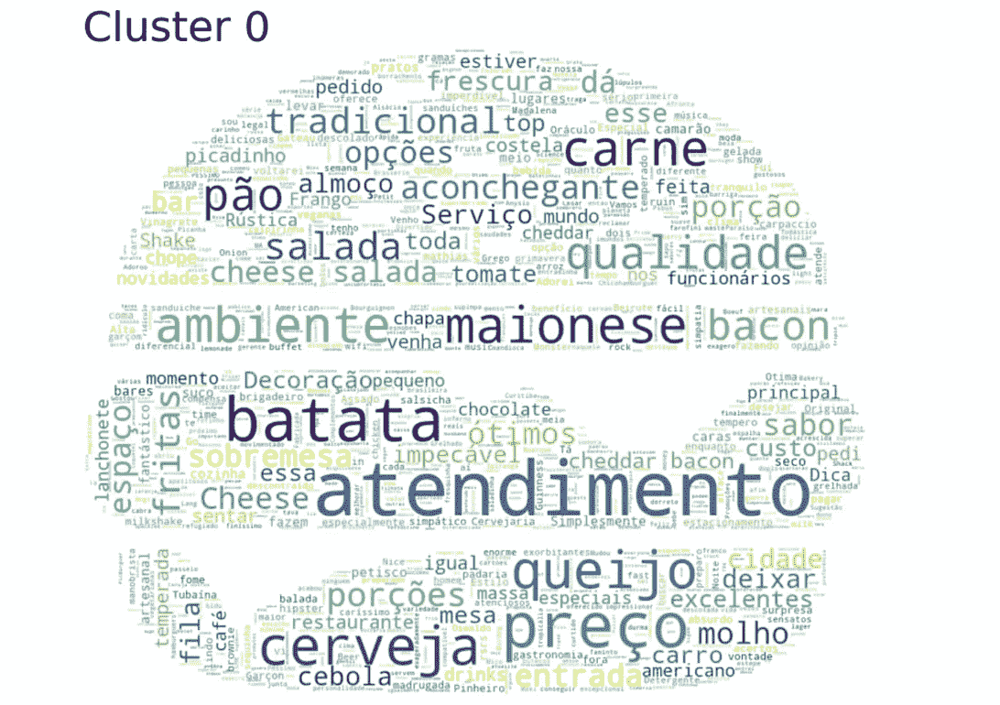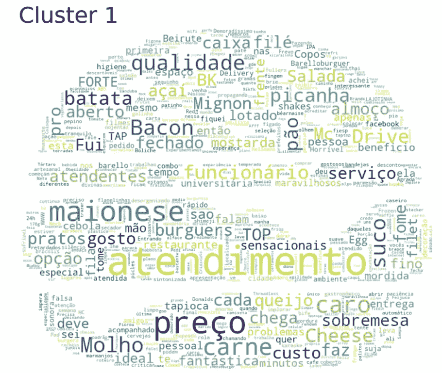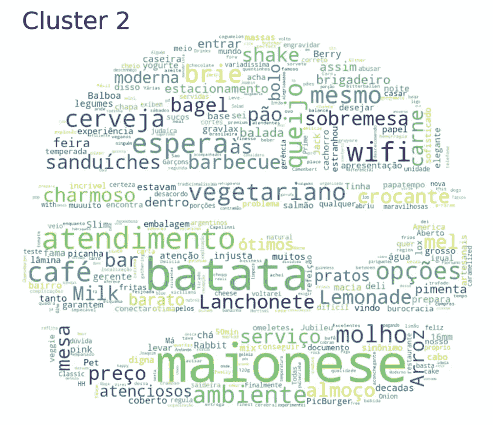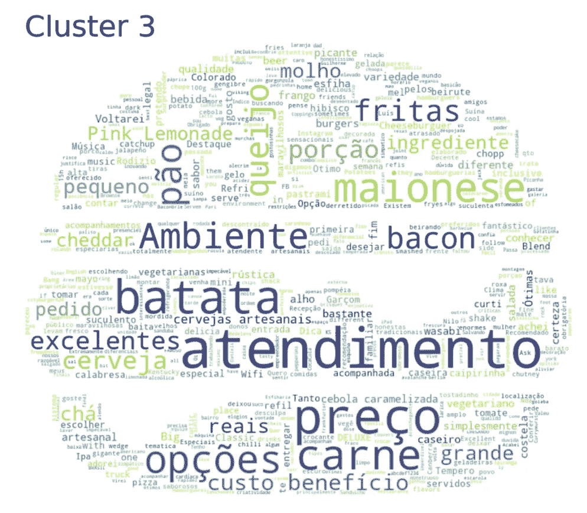

聚类 0，1，2，3 的词云

从视觉检查中，我们可以看到在每个簇中更常见的单词。虽然这已经给我们带来了一些见解，但还是让我们从每个聚类中找出前 10 个单词。我已经翻译了这些单词，以便让那些不会说这种语言的人更容易理解这一部分。


每个聚类中的前 10 个单词

从这一部分中，我们可以确定在前面步骤中收集的信息之间的一些相似之处，同时对集群进行定量分析。

首先让我们来看看他们排名最高的单词中的所有共同点，这些可能是想开一家汉堡店的人的必备词汇。它们都有“atendimento”这个词，在葡萄牙语中是“服务”的意思。因此，从这一信息中得出的第一个关键信息是，无论你的客户群、价格或位置如何，你都必须提供良好的服务，这个词在所有类别中都排在前三位。另一个出现在所有聚类中的单词是“maionese ”,你可能会猜它是蛋黄酱。

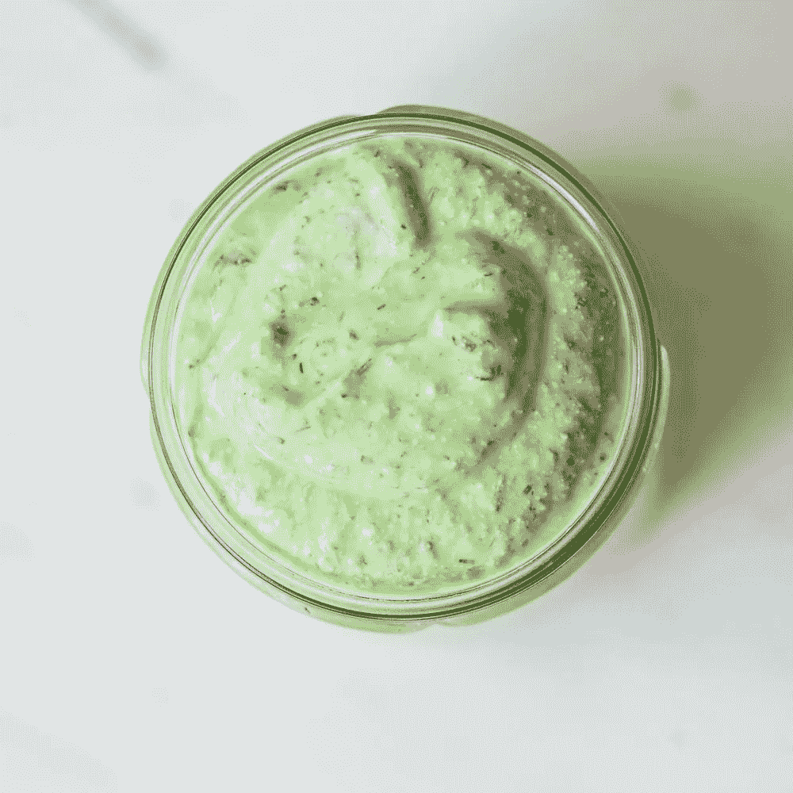

香草蛋黄酱，一种在圣保罗几乎每个汉堡店里都很受欢迎的酱料，图片来自 receitasagora.com

现在，我们来看一下集群之间的差异，我们可以看到除集群 2 之外的所有集群都有单词“preç”，在葡萄牙语中是“价格”的意思。这意味着当访问汉堡店时，集群 2 可能对评估价格作为定义类别没有表现出太大的兴趣。基于每平方米的价格，这是有意义的，因为集群 2 被归类为拥有最富有的客户。另一个有趣的事实是，cluster 2 指的是素食(葡萄牙语中的“素食者”)和布里干酪(至于奶酪)，表明他们在选择方面也非常苛刻。

另一个有趣的观察点是薯条在聚类 3 中出现了两次。发生这种情况是因为单词“batata”和“fritas”在上下文中都是指薯条，所以**薯条实际上对这个集群有很大的影响。**聚类 3 还显示了一个没有明确出现在来自其他聚类的任何其他前 10 个单词中的单词，即单词“options”。这可能表明，虽然他们不要求像布里干酪或素食这样的花式调味品，但他们也重视使用传统调味品的不同组合或大小的场所。

既然我们已经对客户谈论最多的话题有了一些了解，我们可以将我们从定量分析和热门词汇中观察到的内容结合起来，得出关于每个集群的一些结论:

# 群集 0


德韦恩·勒格朗通过 [Unsplash](http://unsplash.com) 拍摄的照片

**高价场地，位于平均价格和高评级的社区。**顾客谈论价格、服务和另一个啤酒类别中没有的特点。这向我们表明，参加这些高价场所的人没有集群 2 那么大的购买力，但当他们选择花钱时，很可能是在**休闲时间(因此啤酒在热门词汇上)，他们重视这种类型的体验(因此评级较高)。**

# 群组 1

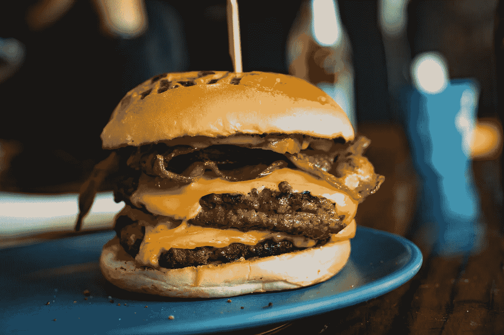

菲德尔·费南多通过 [Unsplash](http://unsplash.com) 拍摄的照片

**平均价格(与其他人相比)、低价社区和低评级。**这一群人不仅在评分中表现出不满意，而且在价格和昂贵位于前 10 名的热门词汇中也表现出不满意。这可能是因为这个群体中的人没有太多的购买力，当他们试图在平均价格的场馆上多花一点钱时，他们通常不会达到他们的预期。**第 1 类场馆应注意的要点可能与成本效益相关，给人们带来了并未真正实现的期望。**

# 群组 2


Jakub Kapusnak 通过 [Unsplash](http://unsplash.com) 拍摄的照片

**高价场地和邻近位置以及高评级。**该集群以高标准和差异化为特征。与第 0 类和第 3 类相比，评级较低的一个解释是，购买力较高且去高价场所的人会提高他们的期望，因此，他们在提交评级时会更少怜悯。基于上面的话，我们可以看到这些场馆的客户注重差异化的调味品和选择。**第 2 组场馆应该注意的一点是，优先考虑场馆菜单的独特性，而不是价格。**

# 第 3 组

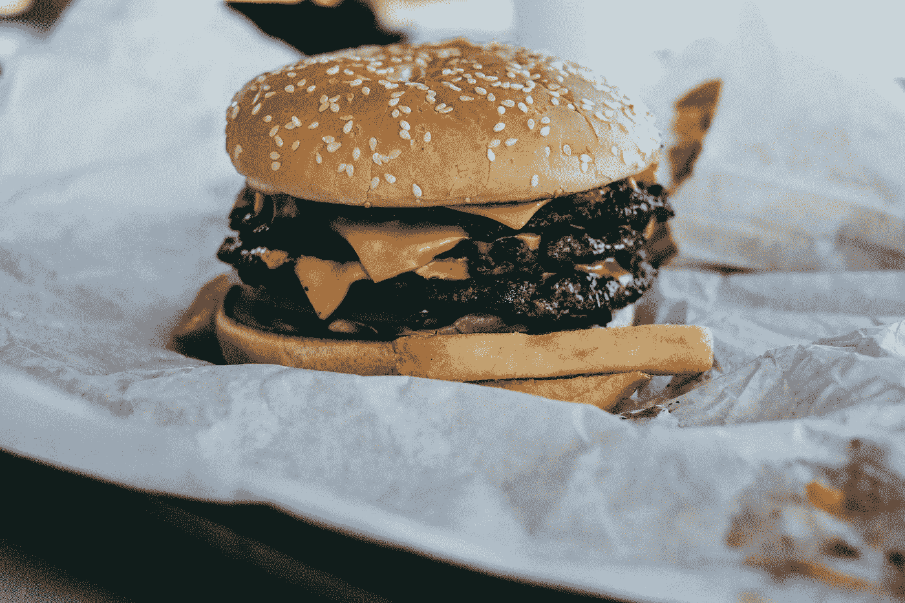

照片由 Pj Gal Szabo 通过 Unsplash 拍摄

**高收视率的低价街区的低价场馆。**这个集群的目的是降低价格，物有所值。一个没有被讨论但在单词 cloud 上出现在第 15 位的单词是成本效益。这已经向我们表明，顾客正在得到他们所寻找的东西:一顿好饭的好价钱。聚类 3 词云上的价格频率高于所有其他词，从那里，顶部的词突出了汉堡店的基本方面，即薯条、肉、蛋黄酱和许多选择。**集群 3 场馆的关键要点是:保持简单和便宜。**

# 结论:

这就结束了对圣保罗汉堡店的研究。虽然有大量的数据可以使这项研究在统计上更加可靠，而且如果我们可以事先标记场地，监督算法可能是一个不错的选择，但这是对圣保罗汉堡联合市场的一个有趣的高水平分析。如果你对所有这些背后的代码感兴趣，我真的建议你看看我为这个项目准备的 Jupyter 笔记本，也可以看看下面的附录，快速概述我使用 k-prototypes 算法而不是 k-means 得到的结果。

欢迎对这里分享的知识提出编辑或补充建议。我希望这篇文章能够启发那些刚开始从事数据科学的人，以及那些只对从数据中得出不同见解感兴趣的人，否则这些数据是不可能用肉眼观察到的。

# **附录:k 原型算法:**

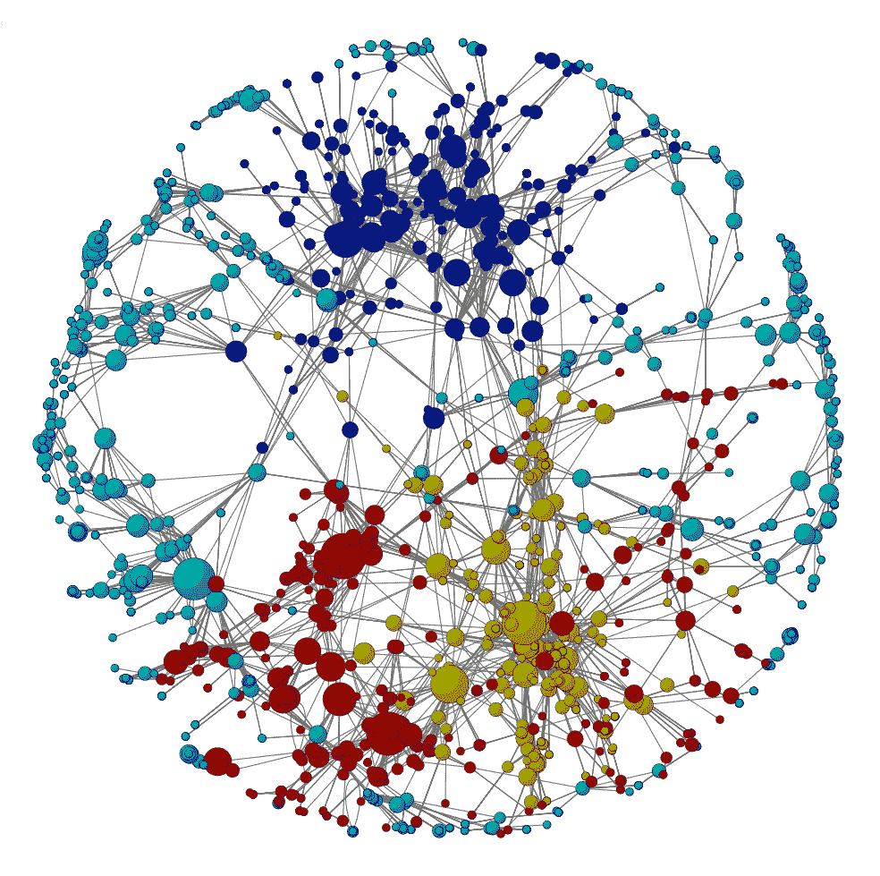

图片来自[考古学](http://archaeoethnologica.blogspot.com/)

**k 原型**算法基本上是一个 k 均值和 k 模式绑定在一起。k-means 将使用欧几里德距离来计算聚类内元素之间的不相似性，k-modes 将基于每个个体中的特征的模式来计算距离，以计算分类特征之间的不相似性。在处理混合数据时，这是一个非常有用的方法。

k 原型的相异度函数可以表示为:S+γP，其中 S 是数值属性的相异度，P 是类别属性之间的相异度。Gamma (γ)是分类属性在我们的聚类算法中的权重。当然，这是对算法的过度简化，所以请务必查看本节末尾参考书目中黄哲学发表的文章。

我将使用这个算法的 python 实现:[https://github.com/nicodv/kmodes](https://github.com/nicodv/kmodes)

## 准备数据和运行算法:

对于本节，我们将假设价格层级是明确的，其余的是连续的。为了将平方米价格与评级(我们的连续变量)进行比较，我们需要对它们进行缩放:

```
scaler = MinMaxScaler(feature_range=(0, 10))
price_M2=cluster_df['Price_M2']
price_M2=price_M2.to_numpy()
price_M2=price_M2.reshape(-1, 1)
price_M2_scaled=scaler.fit_transform(price_M2)
price_M2_scaled=pd.DataFrame(price_M2_scaled)
price_M2_scaled.reset_index(drop=True,inplace=True)
cluster_scaled=cluster_df.filter(['Rating','Price'], axis=1)
cluster_scaled.reset_index(drop=True,inplace=True) 
```

现在，我们可以对数据运行 k-prototypes，并再次使用肘技术来找到最佳的聚类数:

```
cost = []
K = range(1,10)
for k in K:
    kp=KPrototypes(n_clusters=k, init='Huang', n_init=1, verbose=2)
    clusters = kp.fit_predict(cluster_scaled, categorical=[1])
    cost.append(kp.cost_)
plt.plot(cost)
```


使用不同 k 值最小化成本函数

好的，那么这一个将选择 2 个集群。让我们再次运行该算法，并用聚类绘制圣保罗地图。


该图显示了由 k 原型制造的两个集群

让我们分别探索这些特性:


显然，与聚类 0 相比，该算法在聚类 1 上划分为高价场所、高价社区和高评级。让我们看看客户评论是否反映了我们在上面观察到的情况:

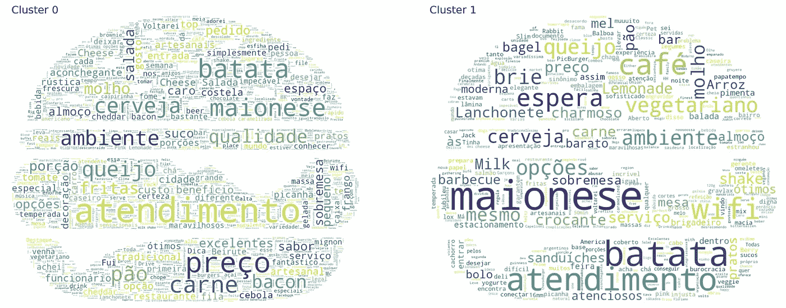

两个集群的词云

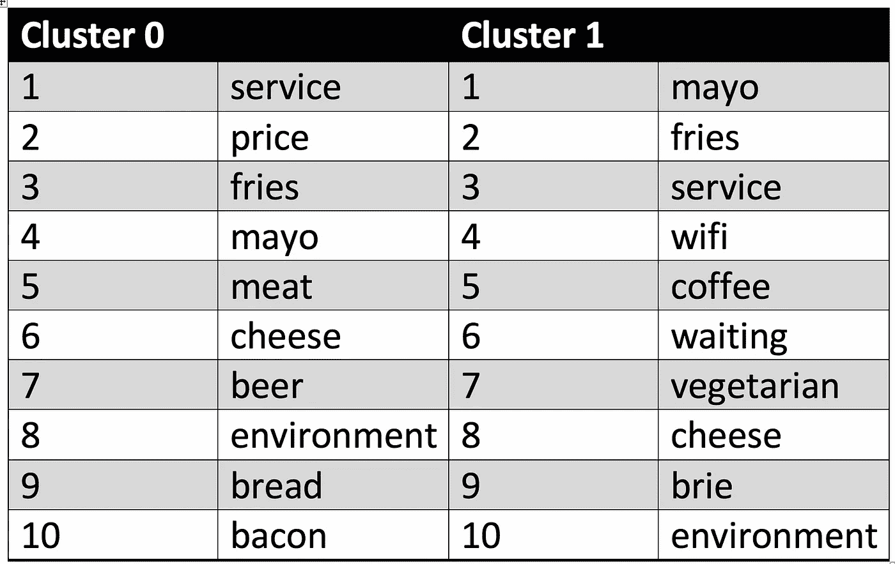

有趣的是，我们可以观察到，使用 k-means 算法，聚类 1 中的单词与聚类 2 中的单词非常相似。另一方面，群集 0 最终是上一节中所有其他群集的混合。

因此，k-原型给了我们一个关于汉堡店的二元视角，就现实中对它们进行分类的最佳方式而言，这可能不一定是真的或假的，但它给我们带来的关于这些场所的见解比 k-means 更少，特别是在这项研究中。

作为这篇文章的总结，这只是一个示范，展示了一个选定的算法如何改变你使用无监督算法得到结果的方式。尤其是使用 k 原型时，有许多因素会影响我们的结果。其中一个因素是 gamma 乘数，它设置分类变量的权重，在本演示中我们使用默认值 0.5。如果我们开始增加 gamma，该算法将尝试根据场地价格进一步分离聚类，这可能会给我们带来失真的结果。

因此，无监督算法的选择和如何使用取决于我们自己的偏见和我们自己对什么可能是真的概念，而不一定是成立的和可以验证的。这是一个重要的收获，因为尽管它们可以为我们所用，通过显示我们无法清楚看到的模式，无监督算法也可能非常误导人。

# 参考资料:

> ——黄，哲学。对具有分类值的大数据集进行聚类的 K-Means 算法的扩展。1998 年 1 月，[http://citeseerx.ist.psu.edu/viewdoc/download?doi = 10 . 1 . 1 . 15 . 4028&# 38；rep = rep 1&# 38；type=pdf](http://citeseerx.ist.psu.edu/viewdoc/download?doi=10.1.1.15.4028&#38;rep=rep1&#38;type=pdf) 。
> 
> -一个销售和销售平台。proprietariodireto.com.br/.
> 
> - Foursquare 开发者。developer.foursquare.com/.