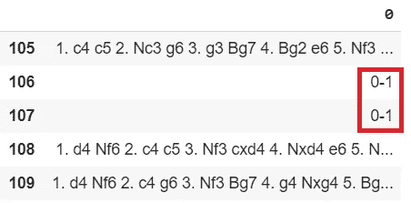

# 聚类:国际象棋开局分类器(第一部分)

> 原文：<https://towardsdatascience.com/clustering-chess-openings-classifier-part-i-6299fbc9c291?source=collection_archive---------71----------------------->

## 聚类方法

## 第一部分:下载象棋游戏数据集

在我的库中有完整的代码[。](https://github.com/arditoibryan/Projects/blob/master/20200526_Chess_Openings_Classifier/Chess_Downloader.ipynb)

聚类使我们能够在数据样本中发现模式。聚类应用有很多，我们选择的算法取决于我们需要解决的问题类型。在这个系列中，我将解释如何在成千上万的样本(象棋比赛)中找到最受专业人士欢迎的空缺。

## 为什么要下象棋？

对于初级分析师来说，最令人兴奋的事情之一就是处理任何类型的数据。为什么不处理象棋比赛数据？这些数据是开源的，可以很容易地大量找到，并且可以从多个来源获得。


由[菲利克斯·米特迈尔](https://unsplash.com/@felix_mittermeier?utm_source=medium&utm_medium=referral)在 [Unsplash](https://unsplash.com?utm_source=medium&utm_medium=referral) 上拍摄的照片

# 什么是棋局开局？

在国际象棋理论中，比赛的初始阶段已经被研究和概念化了。冠军被用来研究以开局开始的游戏发展，而不是即兴发挥:大师们已经给数千个预定义的国际象棋游戏序列命名。职业棋手研究这些序列，以获得对敌人的竞争优势。

# lichess.org

玩家玩免费象棋和提高技术的最好网站之一叫做 lichess.org。这个网站允许开发者免费下载他们想要的所有数据，只有很小的数据流限制。

我通过标签找到了[lichess.org 排名前 50 的玩家，并将他们的名字保存到一个 python 列表中。这是我开始从服务器下载数据所需的少数信息之一。在本教程中，我将简单地使用 3 个姓名标签，但是在我的代码中(](https://lichess.org/player)[在我的库](https://github.com/arditoibryan/Projects/blob/master/20200526_Chess_Openings_Classifier/Chess_Downloader.ipynb)中)你会找到所有 50 个顶级棋手的姓名标签。

# 存储变量

我将开始设置主要变量，这些变量将通过我们的算法存储所有主要信息。

```
#list of nametages
player_list = ['Konevlad','Liem_Chess','Azzaro25']#list of nametags that have been downloading successfully
player_completed = list()#all the downloaded matches
game_dataset = list()
```

当我们运行我们的算法时，如果查询成功，player_completed 和 game_dataset 将填充我们可以导出的信息。

# 下载功能

现在我需要创建一个可以执行单个请求的函数。因为要下载信息，我需要访问一个特定的链接，所以我将使用一个函数来创建允许我执行 GET 请求的正确字符串。我将多次运行这个函数，这样我将为我列表中的每个玩家创建一个链接，并且我将一次为每个玩家下载 200 个游戏。

```
import requests
import time
#get request of single user
def get_request(user):
  print('trying ' + user)
  if user in player_completed:
    print('already existing')
    return 0
  else:
    print(user)
    response = requests.get('[https://lichess.org/api/games/user/'](https://lichess.org/api/games/user/') + user, params={'max':200, 'pgnInJson':False})
    return response
```

不幸的是，数据是 ndjson 格式的。由于一个错误，我无法用任何已知的库来解码它:我需要即兴创作一个算法，可以提取每一个游戏并将其添加到一个列表中。

```
#conversion one user response to all games returned as a list
def games_to_list(response):
  a = str(response.content)lines = a.split("\\n");game_list = list()
  for r in lines:
    if "[" in r:
      pass
    else:
      if r == '':
        pass
      else:
        game_list.append(r)
  game_list.remove("'")
  return game_list
```

# 开始下载

现在是运行算法的时候了。像往常一样，我们不能过分强调在线数据库，否则，它们可能会让我们在几分钟内无法进行查询。如果每次出现问题时我们都必须手动重启下载算法，那么使用我们的浏览器手动下载这些数据会更舒服(这是我们想要避免的)。

```
#for each player download a single request
for _ in player_list:response = get_request(_)
  time.sleep(140)
  if response == 0:
    pass
  else:
    player_completed.append(_)
    #download games into a list
    game_list = games_to_list(response)
    #add all games of a user to the final list: game_dataset
    for _ in game_list:
      game_dataset.append(_)
```

为了解决这个问题，我将尝试每隔 140 秒向数据库发送一次查询(GET 请求)。

* * *如果我们不是第一次运行该算法，并且一些匹配(但不是标签列表中的所有匹配)已经存储在我们的变量中(换句话说，我们之前的尝试已经部分完成)，我添加了一个解决方法。该函数将发现它正在尝试下载列表中已经存在的标签:它将返回 0 作为输出，算法将传递它作为避免进行相同查询的措施。您可以为错误添加退出案例，以使其更加平滑。

## 输出

正如我们所看到的，在为每个请求运行并等待必要的时间之后，算法应该输出每个请求的状态。

```
trying Konevlad 
Konevlad 
trying Liem_Chess 
Liem_Chess 
trying Azzaro25 
Azzaro25
```

我已经将成功下载的标签存储在一个特定的列表中。

```
player_completed
['Konevlad', 'Liem_Chess', 'Azzaro25']
```

所有匹配都存储在一个名为 final_dataset 的数据帧中。

```
import pandas as pd
game_dataset = pd.DataFrame(game_dataset)
final_dataset = game_dataset.copy()
final_dataset
```

# 解决异常

要提取比赛中的每一步棋，每一行都必须是相同的格式。每一行(至少表面上)都有以下模式:

```
1\. c4 c5 2\. Nc3 g6 3\. g3 Bg7 4\. Bg2 e6...
```

但是，我需要检查有问题的行，这些行可能会在我们的数据分析中产生错误。因此，我将向所有不以 1 开头的行发送信号。

* * *这似乎是一种非常近似的发现异常的方法，但是在用聚类算法测试数据集之后，结果证明这已经足够了

```
#non valid rows
for _ in range(len(final_dataset.values)):
  if final_dataset.values[_][0][0] != '1':
    print(_)
106 
107
```

行 106 和 107 没有相同的模式，让我们更仔细地看看:

```
final_dataset[105:110]
```



因为行 106 和 107 有异常，我们将删除它们。如果您要下载成千上万的匹配，包含异常的行可能会更多。

```
#drop non valid rows
final_dataset = final_dataset.drop([106, 107], axis=0)
```

# 导出数据帧

我们准备好导出数据集以用于分析目的:

```
#export dataset
final_dataset.to_csv('chess.csv')
```

[- >进行第二部分](/clustering-chess-openings-classifier-part-ii-7a4f0ce9dcc9?source=post_stats_page---------------------------)