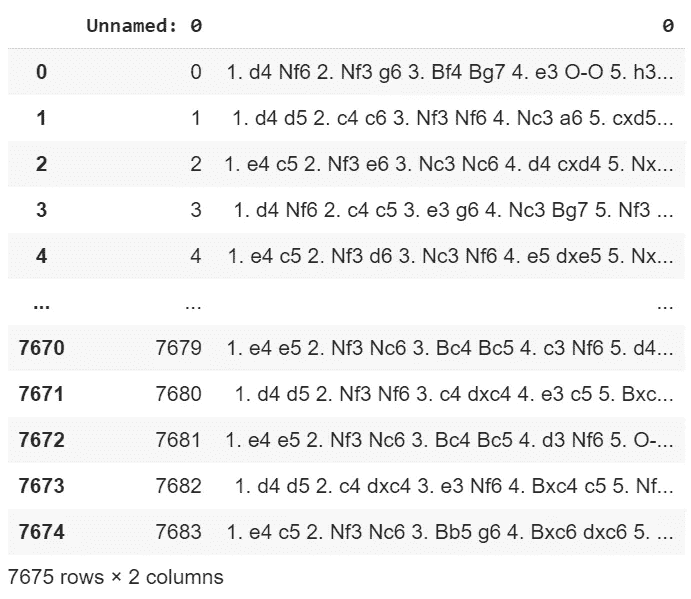
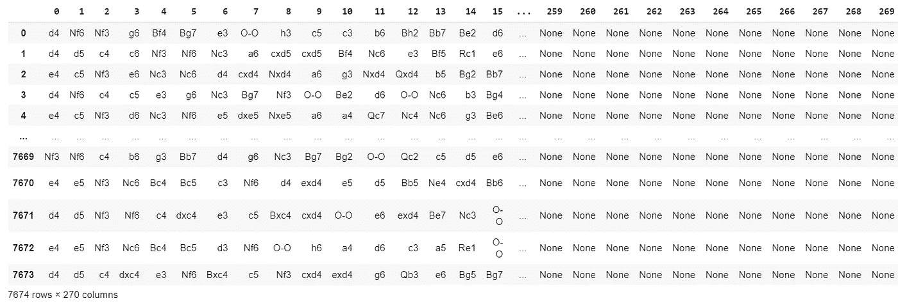
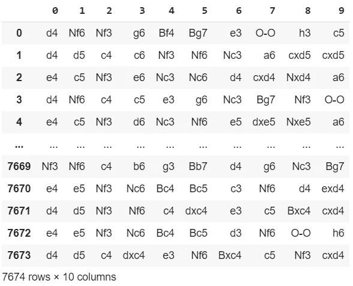
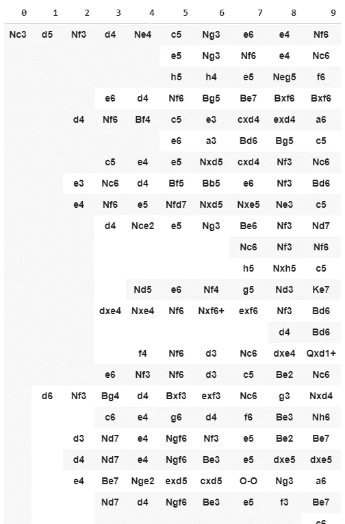
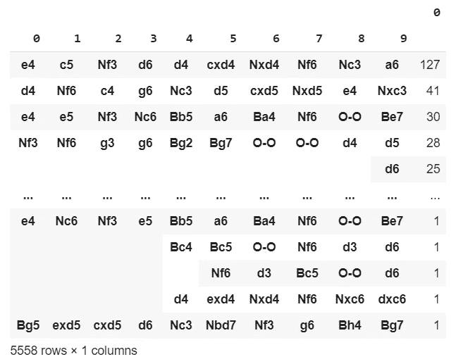
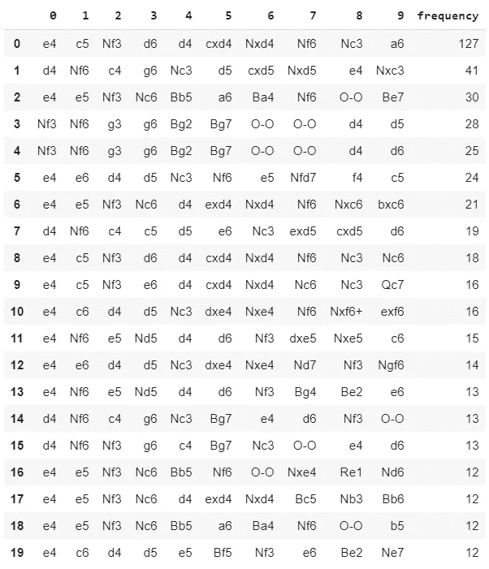
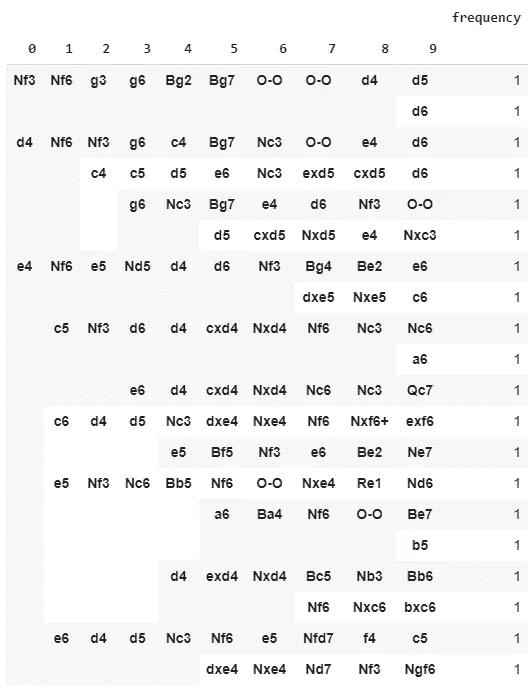

# 聚类:国际象棋开局分类器(第二部分)

> 原文：<https://towardsdatascience.com/clustering-chess-openings-classifier-part-ii-7a4f0ce9dcc9?source=collection_archive---------53----------------------->

## 聚类方法

## 第二部分:国际象棋开局分类


在 [Unsplash](https://unsplash.com?utm_source=medium&utm_medium=referral) 上由 [A. Yobi Blumberg](https://unsplash.com/@yobiworks?utm_source=medium&utm_medium=referral) 拍摄的照片

在本文的前一部分，我已经编写了一个 API，允许我从 lichess.org 下载大量的顶级国际象棋比赛。我已经收集了 7000 多个匹配项，今天我将使用聚类技术对它们进行分析。我的目标是:列出这些比赛中最受欢迎的空缺。

[我的仓库里有完整的代码。](https://github.com/arditoibryan/Projects/blob/master/20200526_Chess_Openings_Classifier/Chess_Clustering.ipynb)

# 导入数据集

像往常一样，第一步是使用[导入下载的匹配数据集，这是我上一篇文章(第一部分)](/clustering-chess-openings-classifier-part-i-6299fbc9c291?source=your_stories_page---------------------------)中的说明。

```
import pandas as pd
#importing dataset
X = pd.read_csv('/content/drive/My Drive/Colab Notebooks/Projects/20200526_Chess Openings/chess1.csv')
```



不幸的是，数据根本没有结构化。我需要预处理所有的数据来创建一个数据集，为每一列保存一个单独的棋步。

```
n_moves = X.shape[0]#break every game in individual moves
moves = [[] for x in range(n_moves-1)]
for _ in range(n_moves-1):
  game = X['0'][_].split(".")
  game.remove('1')
  #print(game)
  for move in game:
    try:
      player_move = move.split(" ")
      #print(player_move)
      moves[_].append(player_move[1]) #add white move
      moves[_].append(player_move[2]) #add black move
    except:
      #if error occurs
      print(_, move)
```

使用这个算法，我获取了第 0 列的所有内容，并分解了每个字符串(因此每个匹配)。比如我分解了“1。d4 Nf6 2。Nf3 g6 3。Bf4 Bg7 4。e3 O-O 5。H3……”，分成单个动作。它将创建一个名为 moves 的数据集，将每个单独的移动作为一个字符串放在不同的列中。

## 输出

该函数还将返回将遇到错误的行，并避免将它们添加到数据集中。

```
3302  
3303  
3304  
3305  
3306   
3307   
3308   
3309  
3310  
5280  
5284  
5285 
```

* * *对于一个微小的错误，数字会在代码中重复一次，但对我们的结果没有任何影响

现在，让我们看看最终的结果:

```
moves = pd.DataFrame(moves)
moves
```



我们的结构化数据集

# 空缺

如果我将聚类算法应用于 moves，即结构化数据集，我将不只是对空缺进行分类，而是对整个匹配进行分类。我需要设置一个限制，集群将在数据中找到模式。

```
#only conserve opening columns
list1 = [x for x in range(0, 10)]
list1moves.columns
tot = moves[list1]
tot
```

我选择选择最多 10 步棋(相当于 5 回合)。这些数据足以为我提供一组常用的组合，但也不会有太多的数据模糊组合的频率。



# 按名称分组

通过这个简单的 groupby 算法，我可以通过组合对所有 7674 个匹配进行排序。

```
final = tot.groupby([0, 1, 2, 3, 4, 5, 6, 7, 8, 9], group_keys=True, squeeze=True, sort=True).count()
final = pd.DataFrame(final)
final
```

这将是我们的输出。如果您查看前 4 行，您会看到它们都包含变体:Nc3、d5、Nf3。现在的问题是我们按字母顺序排列它们。当我们的数据集超过 7000 行时，我们不知道这些开口有多受欢迎。这些只是没有明显重量的随意搭配。



# 按频率分组

我要用的是另一种形式的 groupby。在 7000 个匹配中，我可以通过统计它们的频率立即看出哪些是最受欢迎的空缺。

```
final = tot.groupby([0, 1, 2, 3, 4, 5, 6, 7, 8, 9], group_keys=True, squeeze=True, sort=True).size().sort_values(ascending=False)
final = pd.DataFrame(final)
final
```



我要做的是将这个数据集转换成熊猫数据帧(我找到的唯一方法是将其导出为。csv，然后再次导入)。

```
#in order to reset it, we need to export it
final.to_csv('chess.csv')#import of already reset dataset
final_ = pd.read_csv('/content/chess.csv')
final_.columns = [0, 1, 2, 3, 4, 5, 6, 7, 8, 9, 'frequency']
final_ = final_[0:20]
final_
```



最后，我可以按字母顺序对空缺进行分组，以使用第一种分组算法来识别聚类:

```
final_ = final_.groupby([0, 1, 2, 3, 4, 5, 6, 7, 8, 9], group_keys=True, squeeze=True, sort=True).count()
final_[0:20]
```



如您所见，这些是按频率选择的前 20 个空缺职位，然后按类别分组。虽然每个聚类的频率都为 1，但它只是随着数据集格式的变化而重置，因此我们可以忽略它。