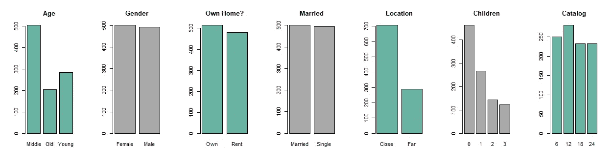
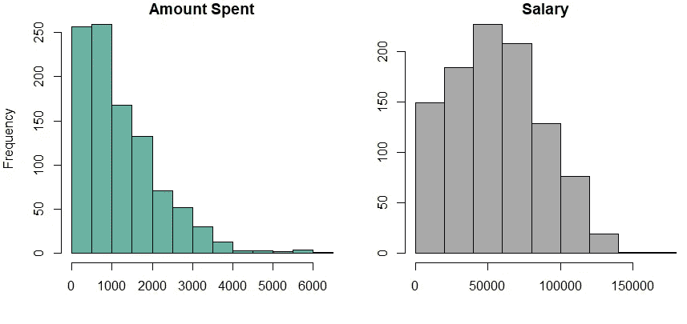
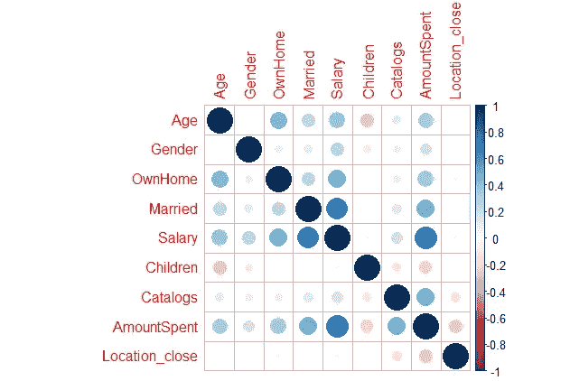
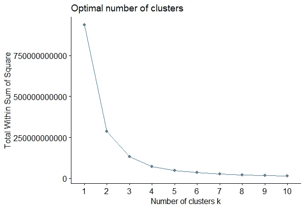
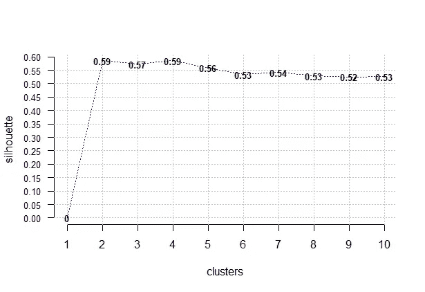
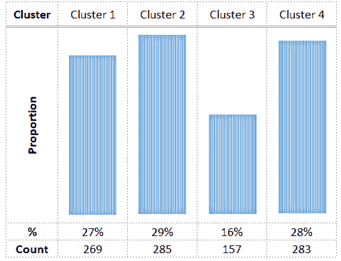
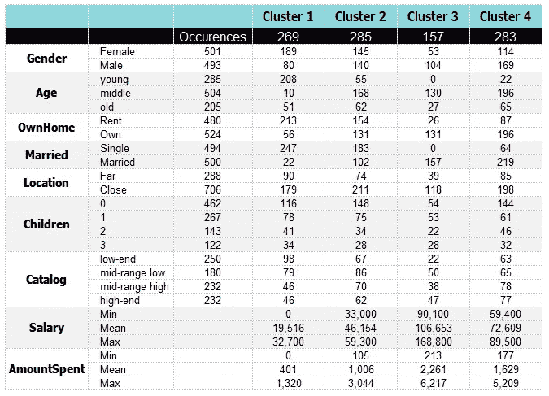

# 使用 K 均值机器学习算法对客户进行聚类

> 原文：<https://towardsdatascience.com/clustering-customers-using-k-means-machine-learning-algorithm-fb0a28948975?source=collection_archive---------12----------------------->

## 这个故事是关于使用 K-means 算法对网上购物者进行聚类的。一种有趣的方法，使用机器学习来细分您的客户，或者检查您的细分是否正确。


拉胡尔·潘迪特来自 Pexels.com 的照片

# 为什么要细分？

营销人员的工作是找到客户的模式和共同特征，对他们进行细分。这是你想出正确的信息和渠道与客户沟通并建立持久关系的第一步。

对具有共同特征的客户进行细分并不容易，需要大量的人力和智慧。

# 基于机器学习算法的聚类

机器学习算法的最新发展给了我们一个新的工具集，使用机器在数据集中寻找模式并创建聚类。无监督学习 K-means **算法搜索数据集中的隐藏模式(人类不可见)，并将每个观察值分配到相关的聚类**。我们将使用 R 进行 K 均值聚类。

# 关于数据集

数据集是从 [Kaggle](https://www.kaggle.com/arawind/retail-marketing) 中获取的。它包含零售购物网站的客户信息。数据集有 10 个变量和 1000 条记录(在数据清理之前)。让我们看看数据集的详细信息:

数据集中的前几条记录

数据集有 8 个分类变量和 2 个连续变量(*薪水*和*花费金额*)。由于缺少很多值，我们将删除*历史*变量，剩下 7 个分类变量。此外，删除缺少值的行会留下 994 条记录。我们还是好好的:)

让我们把分类变量的因子级别变成整数。例如，对于*年龄*设置年轻=0，中间=1，年老=2。对于*性别*，设置女性=0，男性=1，其他分类变量也是如此。

## 变量及其分布:



每个分类变量的数据分布



连续变量的分布

# 相互关系

```
cor.matrix <- cor(data, method = "pearson", use = "complete.obs")corrplot(cor.matrix)
```

分析 9 个变量(7 个分类变量和 2 个连续变量)的相关矩阵，揭示了一些直观的见解，其中一些令人惊讶:



相互关系

*结婚*和*工资*，以及*花费*和*工资*都呈高度正相关。

*子女*(子女数量)与*年龄*呈负相关，在数据集中，老年人有少量子女——要么是 0，要么是 1。

来自关联矩阵的另一个令人惊讶的发现是*结婚了*和*有了孩子*——他们没有关联。经过调查，我们发现已婚和单身的孩子数量差不多。

不那么令人惊讶和更直观的是，*性别*和*年龄*之间没有明显的相关性。

我们有非常有趣的顾客在网站上购物:)

# 聚类数

我们需要多少个集群？为了确定这一点，让我们使用肘法，轮廓评分和 Calinski-Harabasz 指数。一种方法可能无法给我们一个明确的答案。这就是为什么我们需要尝试另一种方法来决定正确的集群数量。

这些方法在 R 中有现成的公式，我们只需要应用到我们的数据集。

> E lbow 方法:

此方法的 r 代码:

上述 R 代码的结果显示在下图中。从图中可以看出，很难决定最佳的集群数量。2 个 3 个还是 4 个？嗯…很难说…我们用另一种方法吧。



肘法

> 剪影分数:

r 代码:

```
opt.k.sil <- Optimal_Clusters_KMeans(data, max_clusters=10, plot_clusters = TRUE, criterion = "silhouette")
```

结果如下图所示。较高的轮廓分数为我们提供了最佳聚类数的指示。在我们的例子中，两个和四个集群都有最高的分数，但是问题是两个都是一样的，我们不能决定选择哪一个:(。让我们转到卡林斯基-哈拉巴斯指数。



剪影配乐

> 卡林斯基-哈拉巴斯指数:

r 代码:

较高的 Calinski-Harabasz 指数决定了要选择的聚类数。现在很明显，4 个集群是最好的:)

# 聚类结果

K 均值算法的 r 代码:

```
KMC <- kmeans(data, centers = 4, iter.max = 999, nstart=50)
```

应用算法后，让我们看看每个集群中有多少客户:



每个集群中的客户数量

集群 1、2、4 几乎均匀分布，分别有 269、285 和 283 个客户，而集群 3 有 157 个客户。

## 每个集群中的数据:



聚类结果

C **光泽 1**——大多是年轻的单身女性，没有孩子，租房居住。该集群具有最低的平均工资和最低的平均支出额。

C 第二低的平均工资和花费。

C光泽 3——多为中年男性，自有住房。这个群体中的每个人都结婚了。相对于其他群体，他们有 2 到 3 个孩子的比例最高。他们收入最高，花费也最多。

C 买高端产品，花第二高的金额。


米盖尔·Á的照片。来自 Pexels.com 的帕德里纳

每个聚类的特征都是非常独特的，并且产生几乎相同的部分。很容易注意到，**集群 1** 拥有“最没有价值”的客户，但是，我们没有关于该细分市场购买频率的数据。但是这个片段描绘的是一个年轻的女学生，她没有赚很多钱，也不花钱。

**集群 2** 是收入不高、消费也不多的中老年客户，几乎类似于**集群 4** 但是这些中年人确实工资高，确实消费多，大多是高端产品。

**集群 3** 则是中年男性，收入稳定高，有孩子，消费金额最高。

现在就看我们针对每个集群的策略了。

> 这个故事是基于我和我的同事诺姆·施穆尔在华沙大学教授亚采克·卢科维兹博士的“无监督学习”课上共同完成的项目

完整的 R 代码和数据库在我的 GitHub 上。

# 参考资料:

[1] A. Rezaeian，S. Shokouhyar 和 F. Dehghan，[使用聚类技术测量电子商务网站的客户满意度:Nyazco 网站的案例研究](https://pdfs.semanticscholar.org/1d00/e195eea6cd870285952576451afbed37eb6d.pdf)。国际管理、会计和经济学杂志，(2016)，3(1)，61–74。

[2] A. Sagar，[利用 K 均值聚类进行客户细分](/customer-segmentation-using-k-means-clustering-d33964f238c3) (2019)，towardsdatascience.com

[3] Dataflair 团队，数据科学项目— [在 R](https://data-flair.training/blogs/r-data-science-project-customer-segmentation/) 使用机器学习进行客户细分(2019)

[4]cran . R-project . org 上的 R 包描述:[corr plot 包介绍](https://cran.r-project.org/web/packages/corrplot/vignettes/corrplot-intro.html)和 r-blogger 上 R 中的 [RFM 分析](https://www.r-bloggers.com/rfm-analysis-in-r/)

[5] [数据集](https://www.kaggle.com/arawind/retail-marketing)取自 Kaggle.com