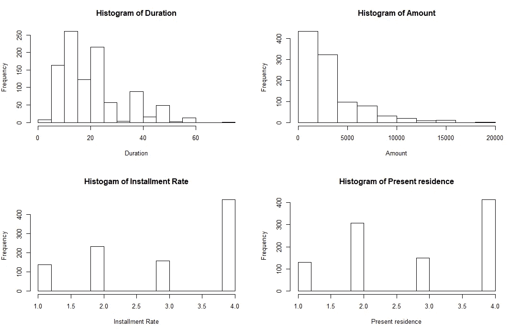
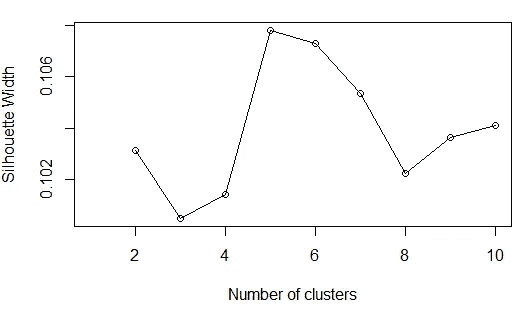

# 具有数字和分类变量的聚类数据集

> 原文：<https://towardsdatascience.com/clustering-datasets-having-both-numerical-and-categorical-variables-ed91cdca0677?source=collection_archive---------1----------------------->

随着现代机器学习的出现，企业已经看到了他们做出决策和推动利润的方式的转变。一个成功公司最重要的属性之一是他们能多好地理解他们的客户，以及他们能多好地迎合他们的个性化需求。对于公司来说，理解“一刀切”的模式不再有效变得越来越重要。

这就把我们带到了集群的话题上。聚类只不过是对实体的分割，它允许我们理解数据集中不同的子群。虽然许多文章回顾了使用具有简单连续变量的数据的聚类算法，但是对具有数字和分类变量的数据进行聚类在现实问题中是常见的情况。本文讨论了一种使用高尔距离、PAM(Medoids 周围划分)方法和剪影宽度的聚类方法，并用 r。

我们使用的'[**german credit**](https://archive.ics.uci.edu/ml/machine-learning-databases/statlog/german/)'*数据取自 UCI 的机器学习知识库:([https://archive . ics . UCI . edu/ml/Machine-Learning-databases/statlog/german/](https://archive.ics.uci.edu/ml/machine-learning-databases/statlog/german/))。为了导入 R 中的数据，我们使用' **read.table'** 命令，如下所示:*

```
*set.seed(2020)
german_credit = read.table("[http://archive.ics.uci.edu/ml/machine-learning-databases/statlog/german/german.data](http://archive.ics.uci.edu/ml/machine-learning-databases/statlog/german/german.data)")*
```

*我们注意到这个数据集的列名不是不言自明的，因此我们在[文档](https://archive.ics.uci.edu/ml/datasets/statlog+(german+credit+data))的帮助下重命名这些列。*

```
*colnames(german_credit) = c("chk_acct", "duration", "credit_his", "purpose", "amount", "saving_acct", "present_emp", "installment_rate", "sex", "other_debtor",                   "present_resid", "property", "age", "other_install", "housing", "n_credits", "job", "n_people", "telephone", "foreign", "response")*
```

*此外，为了使事情更容易，我们只选择几个相对更重要的变量。请注意，我选择这些特定的列只是为了举例说明，读者可以自由尝试不同的列。*

```
*library(dplyr)
german_credit_clean = german_credit %>% select(duration, amount, installment_rate, present_resid, age, n_credits, n_people, chk_acct, credit_his, sex, property, housing, present_emp)*
```

*我们看到这个数据集既包含数字变量(连续变量)也包含分类变量。*

***连续变量:***

*期限:期限(月)
金额:贷款的信用额度
分期付款率:分期付款率占可支配收入的百分比
现在 _ 剩余:在现居住地居住的时间
年龄:年龄(年)
n _ 信用:在该银行的现有信用数量
n _ 人数:有责任为
信用提供维护的人数 _his:信用历史
财产:财产
住房:住房
现在 _ 雇员:目前就业自*

***分类变量:***

*chk_account:现有支票账户的状态
性别:个人状态和性别
credit_his:信用记录
财产:财产
住房:住房
present_emp:目前就业自*

*既然我们已经理解并预处理了数据，我们将注意力转向聚类。聚类的基本前提是数据点之间的相似/相异。正如我们所知，K-means 算法反复迭代，直到它达到一种状态，其中一个聚类的所有点彼此相似，而属于不同聚类的点彼此不相似。这种相似性/不相似性由点之间的距离来定义。*

*度量这个距离的一个流行的选择是欧几里德距离。一些研究人员还提倡对特定类型的问题使用曼哈顿距离。然而，这两种距离度量仅适用于连续数据。在包含混合数据类型的数据中，欧几里德距离和曼哈顿距离不适用，因此，K-means 和层次聚类等算法将无法工作。*

*因此，我们使用高尔距离，这是一种可用于计算两个实体之间距离的度量，这两个实体的属性是分类值和数量值的混合。该距离的数值范围为 0(相同)和 1(最大差异)。高尔距离的数学细节相当复杂，将在另一篇文章中讨论。*

*在 R 中，高尔距离可以使用'**雏菊** *'* 包来计算。在我们使用' **daisy** '函数之前，我们观察数字变量的分布，以了解它们是否需要转换。我们发现变量*的数量*需要进行对数变换，因为它的分布存在正偏斜。*

****

*下面的代码显示了高尔距离计算的实现。请注意，我们已经将“2”指定为*类型*参数中的参数。这确保了在执行高尔计算之前，第二个变量 *amount* 经过对数转换。*

```
*library(cluster)
gower_df <- daisy(german_credit_clean,
                    metric = "gower" ,
                    type = list(logratio = 2))*
```

*接下来，我们检查**‘gower _ df’**数据帧的摘要。类型“I”和“N”告诉我们相应的列是区间标度的(数值)还是标称的。*

**

***K-medoids 和围绕 medoids 的划分***

*现在我们已经有了一个距离矩阵，我们需要选择一个聚类算法来从这些距离中推断相似性/不相似性。就像 K-means 和分层算法与欧几里德距离密切相关一样，Medoids 周围划分(PAM)算法也与高尔距离密切相关。PAM 是一个迭代聚类过程，就像 K-means 一样，但有一些细微的区别。PAM 不是 K-means 聚类中的质心，而是反复迭代，直到**质心**不再改变它们的位置。分类的中间值是分类的一个成员，它代表所有考虑中的属性的中间值。*

***剪影宽度选择最佳聚类数***

*在选择最佳聚类数时，轮廓宽度是非常受欢迎的选择之一。它测量每个点与其聚类的相似性，并将其与该点与最近的相邻聚类的相似性进行比较。该度量的范围在-1 到 1 之间，其中较高的值意味着点与其聚类的相似性较好。因此，较高的轮廓宽度值是可取的。我们计算一系列集群数量的这个度量，并找到它最大化的地方。以下代码显示了 R 中的实现:*

```
*silhouette <- c()
silhouette = c(silhouette, NA)for(i in 2:10){
  pam_clusters = pam(as.matrix(gower_df),
                 diss = TRUE,
                 k = i)
  silhouette = c(silhouette ,pam_clusters$silinfo$avg.width)
}plot(1:10, silhouette,
     xlab = "Clusters",
     ylab = "Silhouette Width")
lines(1:10, silhouette)*
```

*轮廓宽度与聚类数的关系如图所示:*

**

*可以看出，该值在 5 处最大。因此，我们可以得出结论，将数据聚类成 5 个簇可以提供最佳的分段。说到这里，我们构建了一个包含 5 个集群的 PAM 模型，并尝试在 medoids 的帮助下解释这些集群的行为。*

```
*pam_german = pam(gower_df, diss = TRUE, k = 5)
german_credit_clean[pam_german$medoids, ]*
```

**

*上图显示了 medoids 表，其中每一行代表一个聚类。使用该表，我们可以推断出属于聚类 1 的客户具有以下特征:持续时间为 15 个月，信用金额为 1829 美元，分期付款率为 4，他们从 4 个月起就一直住在现居住地，他们的平均年龄为 46 岁，他们有 2 笔贷款未决，他们有 1 个受抚养人，他们没有支票账户(A14)，他们的信用历史很重要(A34)，他们是男性单身(A93)，他们有一辆汽车作为他们的财产(A123)，住在他们自己的住房中(A152)，并且已经被雇用更多请注意，不是所有的客户都会完全这样；并且 medoids 仅仅是中间值的表示。*

*对其他集群也可以作出类似的解释。为了更深入地了解每个集群的特征，我们找到了摘要统计信息。下面显示了相同的 R 代码，以及第一个集群的统计数据。*

```
*pam_summary <- german_credit_clean %>%
  mutate(cluster = pam_german$clustering) %>%
  group_by(cluster) %>%
  do(cluster_summary = summary(.))pam_summary$cluster_summary[[1]]*
```

**

***可视化***

*最后，让我们用一些奇特的视觉效果来结束这篇文章。为此，我们使用 t-SNE 或 t-分布随机邻居嵌入技术。这项技术提供了一种很好的方式来可视化多维数据集，比如我们正在处理的数据集。*

```
*library(Rtsne)
library(ggplot2)tsne_object <- Rtsne(gower_df, is_distance = TRUE)tsne_df <- tsne_object$Y %>%
  data.frame() %>%
  setNames(c("X", "Y")) %>%
  mutate(cluster = factor(pam_german$clustering))ggplot(aes(x = X, y = Y), data = tsne_df) +
  geom_point(aes(color = cluster))*
```

**

*正如我们所见，t-SNE 帮助我们将多维数据可视化为一个简单的二维图形。虽然这些集群看起来有一些重叠，但它们总体上非常独特。*

*这就把我们带到了本文的结尾。总之，我们讨论了高尔距离、PAM 聚类和侧影宽度的概念，以聚类具有数字和分类特征的数据。希望这能帮助周围所有遇到这种数据集的数据人。*

*快乐聚类！*