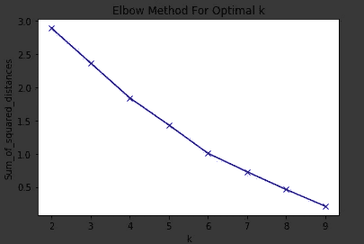
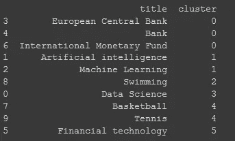
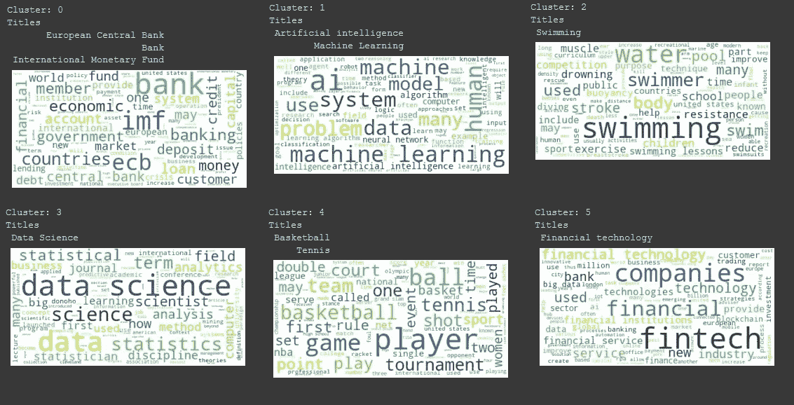

# 用 Python 聚类文档

> 原文：<https://towardsdatascience.com/clustering-documents-with-python-97314ad6a78d?source=collection_archive---------2----------------------->

自然语言处理在过去的几年里取得了巨大的进步。目前，神经网络的各种实现是最前沿的，似乎每个人都在谈论它们。但是，有时更简单的解决方案可能更好。毕竟，一个人应该在跑之前先试着走一走。在这篇短文中，我将展示一种用 Python 对文档进行聚类的简单方法。所有代码都可以在 [GitHub](https://github.com/dpanagop/ML_and_AI_examples/blob/master/NLP_example_clustering.ipynb) 获得(请注意，在 [nbviewer](https://nbviewer.jupyter.org/github/dpanagop/ML_and_AI_examples/blob/master/NLP_example_clustering.ipynb) 中查看代码可能会更好)。

我们将使用 k-means 算法对维基百科文章进行聚类。执行此操作的步骤如下:

1.  获取一些维基百科的文章，

2.将每篇文章表示为一个向量，

3.执行 k 均值聚类，

4.评估结果。

# 1.获取维基百科文章

使用维基百科包可以很容易地从维基百科下载内容。对于本例，我们将文章的内容用于:

*   数据科学
*   人工智能
*   机器学习
*   欧洲中央银行
*   银行
*   金融技术
*   国际货币基金组织
*   篮球
*   游泳
*   网球

每篇维基百科文章的内容存储在 wiki_list 中，而每篇文章的标题存储在变量 title 中。

```
import pandas as pd
import wikipediaarticles=['Data Science','Artificial intelligence','Machine Learning','European Central Bank','Bank','Financial technology','International Monetary Fund','Basketball','Swimming','Tennis']wiki_lst=[]
title=[]
for article in articles:
   print("loading content: ",article)
   wiki_lst.append(wikipedia.page(article).content)
   title.append(article)print("examine content")
wiki_lstAt the top of the github page there is a button that will allow you to execute the notebook in Google’s Colab. Feel free to experiment!
```

# 2.将每篇文章表示为一个向量

因为我们要使用 k-means，所以我们需要将每篇文章表示为一个数字向量。一种流行的方法是使用[词频/逆词频(tf-idf)](https://en.wikipedia.org/wiki/Tf%E2%80%93idf) 。简单地说，用这种方法对每个单词 *w* 和文档 *d* 我们计算:

*tf(w，d):**d*中 *w* 的出现次数除以*d*中总字数的比值

*idf(w):* 文档总数除以包含 *w.* 的文档数的分数的对数

*tfidf(w，d)=tf(w，d) x idf(w)*

建议排除常见的停用词。所有的计算都可以通过 sklearn 的 tfidf 矢量器轻松完成。

```
from sklearn.feature_extraction.text import TfidfVectorizer
vectorizer = TfidfVectorizer(stop_words={'english'})
X = vectorizer.fit_transform(wiki_lst)
```

(说实话，sklearn 的计算略有不同。你可以在[文档](https://scikit-learn.org/stable/modules/feature_extraction.html#text-feature-extraction)中读到。)

# 3.执行 k 均值聚类

变量 X 的每一行都是维基百科文章的向量表示。因此，我们可以使用 X 作为 k-means 算法的输入。

首先，我们必须决定集群的数量。这里我们就用[肘法](https://en.wikipedia.org/wiki/Elbow_method_(clustering))。

```
import matplotlib.pyplot as plt
from sklearn.cluster import KMeansSum_of_squared_distances = []
K = range(2,10)for k in K:
   km = KMeans(n_clusters=k, max_iter=200, n_init=10)
   km = km.fit(X)
   Sum_of_squared_distances.append(km.inertia_)plt.plot(K, Sum_of_squared_distances, 'bx-')
plt.xlabel('k')
plt.ylabel('Sum_of_squared_distances')
plt.title('Elbow Method For Optimal k')
plt.show()
```



每组数量的距离平方和图

情节几乎是一条直线，可能是因为我们要的文章不多。但是在更近的观察中，当 k=4 或 k=6 时，出现了一个凹痕。我们将尝试分成 6 组。

```
true_k = 6
model = KMeans(n_clusters=true_k, init='k-means++', max_iter=200, n_init=10)
model.fit(X)
labels=model.labels_
wiki_cl=pd.DataFrame(list(zip(title,labels)),columns=['title','cluster'])
print(wiki_cl.sort_values(by=['cluster']))
```



聚类结果

# 4.评估结果

因为我们只使用了 10 篇文章，所以通过检查每个集群中包含哪些文章来评估集群是相当容易的。这对于大型语料库来说是很困难的。一个很好的方法是从每个集群的文章中创建一个词云。

```
from wordcloud import WordCloud
result={'cluster':labels,'wiki':wiki_lst}
result=pd.DataFrame(result)
for k in range(0,true_k):
   s=result[result.cluster==k]
   text=s['wiki'].str.cat(sep=' ')
   text=text.lower()
   text=' '.join([word for word in text.split()])
   wordcloud = WordCloud(max_font_size=50, max_words=100, background_color="white").generate(text)
   print('Cluster: {}'.format(k))
   print('Titles')
   titles=wiki_cl[wiki_cl.cluster==k]['title']         
   print(titles.to_string(index=False))
   plt.figure()
   plt.imshow(wordcloud, interpolation="bilinear")
   plt.axis("off")
   plt.show()
```



星团的文字云

*   集群 0 由关于欧洲中央银行、银行和国际货币基金组织的文章组成
*   集群 1 由关于人工智能和机器学习的文章组成
*   第二组有一篇关于游泳的文章
*   集群 3 有一篇关于数据科学的文章
*   集群 4 有关于篮球和网球的文章
*   第五组有一篇关于金融科技的文章

游泳不属于篮球和网球这一类似乎有点奇怪。或者说 AI 和机器学习跟数据科学不是一个群体。这是因为我们选择创建 6 个集群。但是通过查看单词 clouds，我们可以看到关于篮球和网球的文章中有一些单词是相同的，比如游戏、运动员、团队、球，而关于游泳的文章则没有。

在 GitHub 页面的顶部，有一个按钮，可以让你在谷歌的 Colab 中执行笔记本。您可以很容易地尝试不同数量的集群。结果可能会让你大吃一惊！