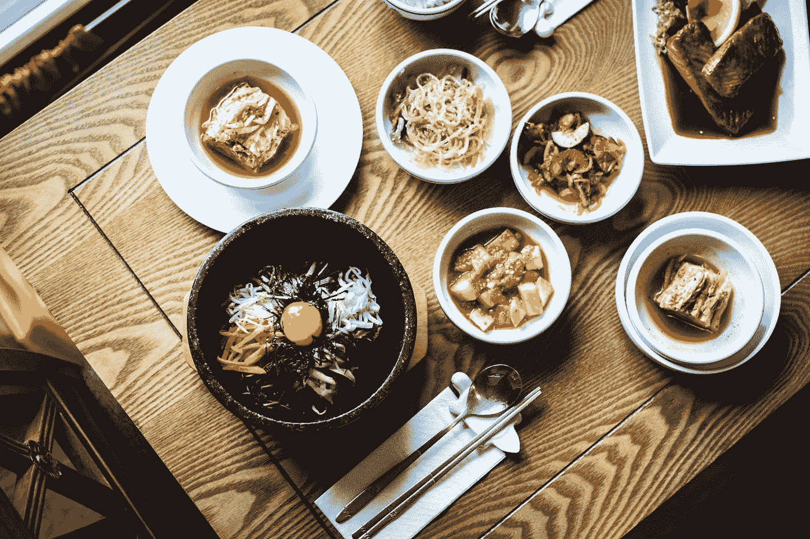
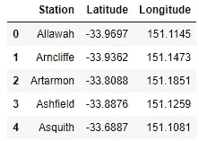
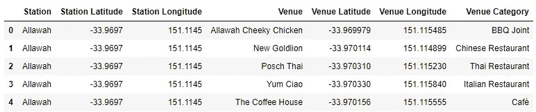
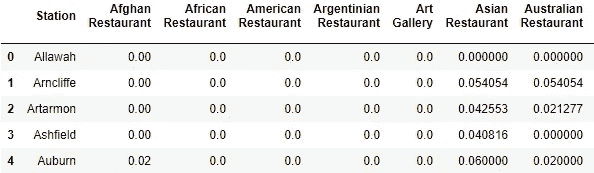
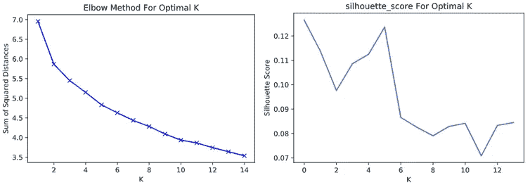
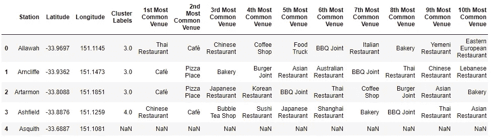
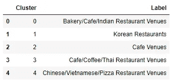
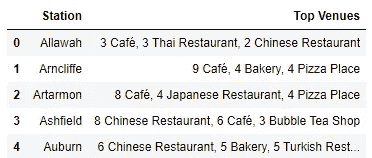
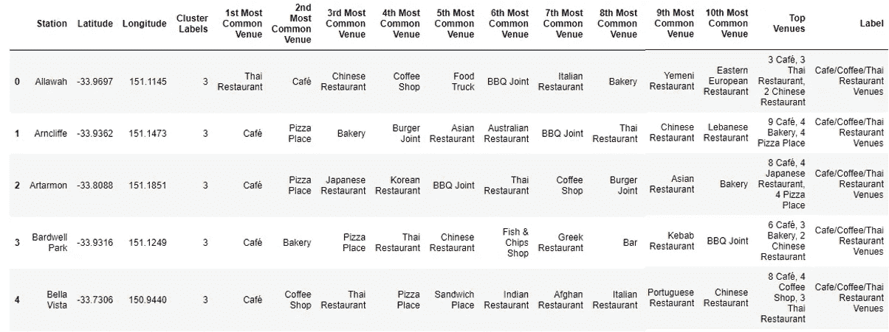
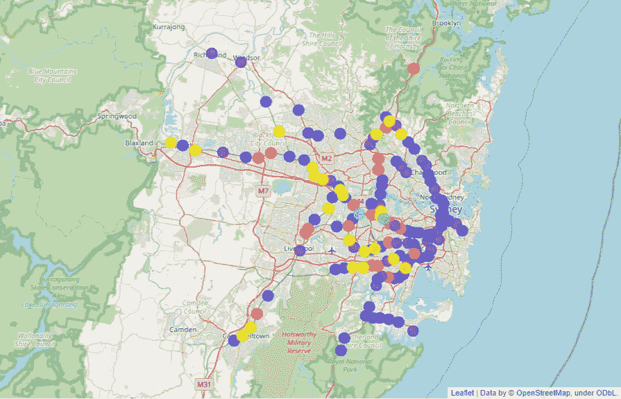

# 悉尼的美食聚集地

> 原文：<https://towardsdatascience.com/clustering-food-venues-in-sydney-bf48877650d5?source=collection_archive---------49----------------------->

## 使用 Foursquare API 和悉尼美食聚集地。



雅各布·卡普斯纳克在 [Unsplash](https://unsplash.com?utm_source=medium&utm_medium=referral) 上的照片

## **背景信息**

对一些人来说，很难确定他们想和朋友去哪里吃饭。有这么多不同的食物和菜肴可供选择。一般来说，如果一个地区因某种特定的美食而闻名，那么游客更有可能在那个地区吃那种美食。澳大利亚是一个多元文化的国家，在共同的地方不难找到不同的民族社区。

在这个项目中，我们的目标是帮助人们根据自己的兴趣找到在悉尼就餐的地点。例如，如果你想吃泰国菜，你可以去你周围的郊区。我们将使用 *Foursquare API* 和 *K-means 聚类*来发现地区中最常见的美食，并在地图上可视化聚类。

## 数据

悉尼火车站附近有很多餐馆。为此，我编制了一个数据集，其中包含了悉尼所有的火车站和地铁站，以及它们各自的经度和纬度坐标。这将使我们能够在悉尼的地图上看到这些地点。车站位置的选择是因为大多数悉尼工人都乘坐公共交通工具。靠近车站的餐馆为居民提供了方便的选择。这里可以查看数据集[，共 181 个站。](https://github.com/ngoharry19/Coursera_Capstone/blob/master/sydney_trains.csv)



。悉尼站数据帧的 head()

## 方法和分析

在将悉尼站读入一个*熊猫*数据框后，我们现在将使用 Foursquare API 来查找我们站附近的美食地点。然后，我们将使用 *K-means* 聚类来创建具有相似特征的站点的聚类。

首先，让我们看看我们的站在悉尼地图上是什么样子，以检查我们的坐标是否正确。我们可以使用 *geopy* 和*叶子*库来创建一张悉尼地图，上面叠加我们的站坐标。

悉尼火车/地铁网络——使用笔获得交互式地图

现在，我们使用 four square API T1，这是一种社交定位服务，允许用户发现商业和景点。由于我们试图找到与食物相关的地点，我添加了类别 ID '*4d 4b 7105d 754 a 06374d 81259*'作为 API 请求 URL 的一部分。我将返回的场地限制为 300 个，半径为 1 公里。

```
url = 'https://api.foursquare.com/v2/venues/search?&categoryId=4d4b7105d754a06374d81259&client_id=**{}**&client_secret=**{}**&v=**{}**&ll=**{}**,**{}**&radius=**{}**&limit=**{}**'.format(
            CLIENT_ID, 
            CLIENT_SECRET, 
            VERSION, 
            lat, 
            lng, 
            radius, 
            LIMIT)
```

利用我们提取的附近美食场所的信息，我们可以将其合并到一个包含我们的站点信息的新数据帧中。



。head()提取的悉尼美食场馆数据框

*四方*共退回 5565 家美食场所。然而，当查看一些站点的场馆数量时，一些站点的数量很少或者根本没有。为了使这些站点不影响聚类，我删除了所有少于 9 个美食场所的站点。这导致了总共 5458 个美食场所和 175 个独特的类别。从 181 个站点，我们的数据帧现在包含 142 个站点，即删除了 39 个站点。

在使用一种热编码并对每个食品场所类别的频率取平均值后，我们可以使用 *K-means* 聚类，这是一种无监督学习算法，用于根据特征相似性创建数据点的 *K* 聚类。

```
sydney_onehot = pd.get_dummies(sydney_venues[['Venue Category']], prefix="", prefix_sep="")

*# add neighborhood column back to dataframe*
sydney_onehot['Station'] = sydney_venues['Station'] 

*# move neighborhood column to the first column*
fixed_columns = [sydney_onehot.columns[-1]] + list(sydney_onehot.columns[:-1])
sydney_onehot = sydney_onehot[fixed_columns]sydney_grouped = sydney_onehot.groupby('Station').mean().reset_index()
sydney_grouped.head()
```



悉尼分组数据框显示了前 7 个类别的频率平均值

使用这个数据框，我们可以删除第一列并将其用于 *K-means* 聚类。观察肘方法和剪影评分，我们发现要使用的最佳聚类数是 *K = 5* 。



最佳 K 的肘方法和轮廓分数

生成聚类标签后，我们可以将其添加到新的数据框中，合并原始数据框和它们各自的前 10 个场馆。



由于之前已经删除了一些站点，我们获得了一些站点的 *NaN* 值，因此我们使用 *dropna()* 方法删除了这些行。
我将每个车站的第一个最常见的场馆可视化，按照它们的集群进行分组，让我们清楚地了解这些集群可能具有的特征。


通过查看条形图，我归纳了每个集群并给它们贴上标签。
我不得不包括几个类别作为标签，因为顶级场所有相似之处，例如咖啡馆:



数据框中每个聚类的标签

我还添加了每个站点的前三个地点，这样我们可以在地图上查看它们。



然后，通过合并先前的数据帧，创建包含所有新信息的最终数据帧。



## 结果

我们的最终地图显示的信息集群创建。



悉尼车站集群地图

对总共 142 个站(最初来自 181 个)进行聚类的结果展示了 5 个聚类。我们将集群归纳如下:

*   集群 0(黄色)-23 个车站、面包店/咖啡馆/印度餐馆场馆
*   聚类 1(青色)-2 个车站，韩国餐馆
*   第 2 组(紫色)——35 个车站、咖啡厅
*   集群 3(蓝色)-63 个车站、咖啡馆/咖啡/泰国餐馆场馆
*   第 4 组(红色)-19 个车站，中国/越南/披萨餐厅场馆

悉尼车站周围的美食场所-使用笔来获得交互式地图版本

虽然有些车站可能与标签描述不同，但它很好地概述了有哪些类型的餐馆或美食场所。

## 结论

总之，我们使用了 K-means 聚类，为悉尼火车站和地铁站创建了 5 个不同的聚类，这些火车站和地铁站周围至少有 9 个美食场所。下次你出去吃饭的时候(希望快点！)，你可以看看这张地图，了解一下悉尼车站和周围的美食广场都提供什么样的食物。

感谢阅读！

这是我的“[探索悉尼的地区和场所](/exploring-areas-and-venues-of-sydney-nsw-australia-88c0cf4f3da2?source=friends_link&sk=4260f408761960b57ed6a3f91c3e2aea)”文章的第 2 部分，在这里我重点介绍了悉尼的餐馆和其他与食物相关的场所。
你可以在这里查看这个项目的全部代码/笔记本[。](https://github.com/ngoharry19/Coursera_Capstone/blob/master/Clustering_Food_Venues_in_Sydney.ipynb)

欢迎在 [LinkedIn](https://www.linkedin.com/in/harryngo19/) 上联系我，或者在 [Medium](https://medium.com/@harryngo) 上关注我。