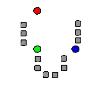
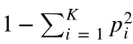
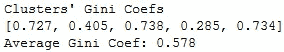

# 高级数据聚类教程

> 原文：<https://towardsdatascience.com/clustering-for-data-nerds-ebbfb7ed4090?source=collection_archive---------9----------------------->

## K 均值，基尼系数，熵的终极指南。如何用 R 和 Python 从相机图像中对人体手势进行分类？

在本文中，我们使用 R 和 Python 实现了数据分割和数据聚类，用于对相机图像中的手势和人体姿态进行分类。


[来源](http://www.livelongandtravel.com/5-american-hand-gestures-with-different-meanings-overseas/)

# 我们什么时候对数据进行聚类？

当没有明确定义的分类或回归任务时，我们面临着一种**无监督学习**的情况，在这种情况下，我们基本上探索观察组，并尝试对数据进行聚类，以便有意义。

> 聚类的目标是将一组对象组合在一起，使得同一聚类中的对象彼此之间比其他聚类中的对象更相似。


[来源](https://people.eecs.berkeley.edu/~jrs/189s19/lec/21.pdf):加州大学 Jonathan Richard Shewchuk 教授的讲稿

**相似度**是反映两帧之间关系强度的量。相似性度量的经典方法是**欧几里德距离和曼哈顿距离**。

# K-Means 聚类是如何工作的？

K-Means 聚类是最简单也是最常用的聚类方法，用于将数据集分割成一组 K 个(预定义的)组。

*   该算法从随机选择 K 个称为质心的起始点开始。



来源:马蒂亚·西内利的博客

*   然后，它计算数据集中每个点与质心之间的距离。被认为最接近给定质心的点被认为是由该质心表示的聚类的一部分。


来源:马蒂亚·西内利的博客

*   在最后一步中，在每个聚类内计算一个新的质心作为平均点。重复这些步骤，直到质心不再改变。


来源:马蒂亚·西内利的博客

# 手势识别的数据聚类

手势和手势识别旨在识别特定的人类手势，并使用它们来传递信息。对非语言交流进行正确的分类对于一个熟练的人机交互框架来说是必不可少的。数据聚类有助于解决这个问题。

聚类的工作原理是探索从一组用户记录的视频姿势，并对数据进行分区，使其有意义。

通过将视频帧分成簇，我们可以认识到每个用户都有一个独特的姿势集。我们还可以将姿势分组，显示所有用户以相似的方式执行相同的姿势。

我们可能会发现异常聚类，这些异常聚类识别出执行特定任务的用户与其他人有很大不同。这些发现可能有助于将这些簇与某种疾病状况联系起来，或者突出一些罕见的物理特性。

# 数据

我们将聚集从运动捕捉相机系统收集的数据，发表在[这篇加德纳的论文](https://pdfs.semanticscholar.org/8512/1a32b411878449e6dc87ef2a7d7303861d50.pdf)。该系统被用于记录 14 个不同的用户进行 5 种不同的手部姿势，并在左手手套上附着标记。


来源:安德鲁·加德纳，加州大学

手套背面的一组 4 个标记用于建立手的局部坐标系。它们在手背上形成一个固定的图案，作为手的位置和方向的标识。他们还为附着在手套的拇指和手指上的剩余标记创建了一个局部坐标系。


来源:安德鲁·加德纳，加州大学

基于来自照相机系统的观察，总共收集了 24 个特征。数据集中的另外两个变量是用户的 ID 和用户做出的姿势。

完整的数据集可在[这里](https://archive.ics.uci.edu/ml/datasets/MoCap+Hand+Postures)获得。所有标记都被转换到包含它们的记录的本地坐标系。这些数据已经过预处理，包括转换到记录的本地坐标系统、去除异常值和去除缺失数据。

数据集`postures_clean.csv`包含 38，943 行和 26 列。每行对应于照相机系统捕获的单个帧。


这些列如下所述。

**类**描述给定观察的手部姿势，具有以下可能值:

```
1 = Fist (with thumb out)
2 = Stop (hand flat)
3 = Point1 (point with index finger)
4 = Point2 (point with index and middle fingers)
5 = Grab (fingers curled as if to grab)
```

**用户**代表贡献记录的用户的 ID。

**X0，Y0，Z0，X1，Y1，Z1，…，X7，Y7，Z7** 代表八个未标记标记位置的 x 坐标，y 坐标，z 坐标。

下面我们绘制了每个用户和每种姿势记录的帧数。我们可以观察到一些用户缺少一些姿势。此外，为给定姿势记录的帧数因用户而异。我们还注意到，当用户 id 从 0 到 14 时，用户 id 3 丢失了，剩下 14 个用户。


我们观察到，由于自遮挡，许多原始记录缺少标记并被从数据集中删除。由于记录中可见标记的数量总是 8，我们可以得出结论，一些用户的姿势被完全删除了。这将解释例如用户 4 和 7 仅具有少量记录且仅执行了一些姿势。

有些姿势记录的总帧数非常少。例如，类别 1(拇指向外的拳头)只为 3 个用户记录，总共 52 帧。大概是用户握拳的时候大部分标记都被遮挡了。

# 聚类需要距离的概念

查看数据，我们注意到平均值 X、Y、Z 大致来自同一分布。不存在可见的异常值。这表明坐标代表现实世界中的物理位置。我们还可以观察到，值的范围(最小值和最大值)与 X 的不同，而与 Y 或 z 的不同。如果我们在 3D 空间中绘制数据，它在空间中会显得受到挤压。


这些发现表明，扩大这类数据可能不是一个好主意。缩放会将例如所有用户的 X0 值投影到同一坐标系上，从而失去校准的局部性。因此，我们将在不缩放坐标的情况下继续。

欧几里德距离对于我们数据集中的坐标非常有意义。然而，让 id 为 0 的用户和 id 为 14 的用户之间的欧几里德距离影响聚类是不太合适的。类似地，姿势类别 1 与姿势类别 5 的不同之处与姿势类别 2 的不同之处相同。因此，如果我们将用户和类特性包括在集群任务中，我们可能必须扩展它们。

# 主成分分析聚类

PCA 可用于从我们的 26 维特征集中导出 2 维特征集，同时努力保留尽可能多的信息(方差)。

我们设想下面的前两个主要部分。虽然有两个组件可以解释数据中的差异，但是它们不能对记录进行聚类。


# k-表示 R 中的实现

在本文中，我们演示了如何在 Python 笔记本中使用 R 执行 K-Means 聚类。这多亏了 [**rpy2**](https://pypi.org/project/rpy2/) ，一个到 *R* 语言的 Python 接口。

以下函数对输入数据帧`df`执行 K 均值聚类。`cols_features`是我们要考虑的数据帧中的列列表。如果为空，则考虑所有列。`cols_to_scale`是需要缩放以进行适当相似性测量的特征子集。`nb_clusters`是我们尝试构建的预定义集群数量。`nb_config`是这个过程重复的次数。`cluster_col_name`是用于在原始数据帧中存储聚类标签的列名。

我们首先仅使用坐标特征对数据进行聚类。


现在，我们使用所有列进行聚类。我们感兴趣的是调查用户和类如何影响集群的学习。对于我们的任务来说，这一步没有多大意义，但是我们很好奇 K-Means 是否能够拾取标签。为了保持一致的距离度量，我们在聚类之前对用户和类列进行了标准化。


# 集群数量的选择很重要

下面，我们使用 *R* 函数`r_factoextra.fviz_cluster`可视化 2000 个观察值的随机样本的 K 均值结果。


在主成分分析图上，聚类看起来非常重叠。第一个维度只能解释数据中 13%的差异，而第二个因素只能解释 8%。在那个空间中，一些质心彼此非常接近。我们可能想把一些集群合并在一起。对于我们的探索，使用 14 个集群并不是一个好的选择。

下面，我们通过将聚类的数量设置为 5 来执行用于姿势识别的 K 均值聚类。可视化显示了更好的集群分离。


# 集群有多好？

重要的是评估我们的聚类有多好，换句话说，这些区域的分离程度有多好。

## 基尼系数聚类优度

**基尼系数**是评价集群集合异质性程度的常用方法。对于 K 个总标签，每个聚类的基尼系数如下所示，其中 *p* 是聚类中带有标签 *i* 的数据点的比例。



在我们的例子中，基尼系数将测量任何用户是否以高比例出现在所创建的任何一个集群中。如果一个或多个用户以高比例出现在所考虑的集群中，则该集群的平方和将更接近 1，并且基尼系数将更接近 0。



通常，如果类别在聚类中完全混合，基尼系数最大。**第 2 和第 4 簇最纯**，系数分别为 0.405 和 0.285。第二类具有特定姿势的强比例(0.697)，并且很可能是该姿势的强代表。

这为基于手边数据集的姿势识别目的的学习聚类提供了额外的证据。

## 熵聚类优度

熵也可以用来检验聚类质量。它利用了簇 *i* 中的记录被分类为类别 *i* 的概率。


虽然基尼系数旨在将错误分类的概率降至最低，但熵是一种衡量杂质的方法。

如果聚类的所有记录都属于同一姿态，则熵为 0，如果我们具有均匀的姿态分布，则熵最大。换句话说，因为概率是 *1* 和 *log(1) = 0* ，所以分离良好的聚类的熵为零。当集群中的所有姿态具有相等的概率时，熵达到最大值。下面我们可以看到**第一、第三和第五簇是最不纯的。**


# 结论

结果表明，我们的数据集更有可能被分为 5 组，而不是 14 组。给定记录标记的位置，我们几乎没有机会识别记录是从哪个用户那里产生的。从同一用户获得的位置在不同的手姿势之间没有足够的相似性，因此它们可以被分组到不同的群中。

然而，用户以相似的方式执行姿势，因此不同用户记录的位置之间的距离最小，允许我们以可接受的纯度将它们分组为姿势群。

这些结果是有意义的，但我们可能需要寻找最佳的聚类数，这将使我们实现更好的分离，并可能了解更多的数据。使用**肘方法**、**间隙统计**或**剪影技术**我们将能够评估群集数量的最佳选择。