# 聚类地理空间数据

> 原文：<https://towardsdatascience.com/clustering-geospatial-data-f0584f0b04ec?source=collection_archive---------1----------------------->


## 使用交互式地图绘制机器学习和深度学习聚类

## 摘要

在本文中，我将使用数据科学和 Python，展示如何将不同的聚类算法应用于地理空间数据，以解决零售合理化业务案例。

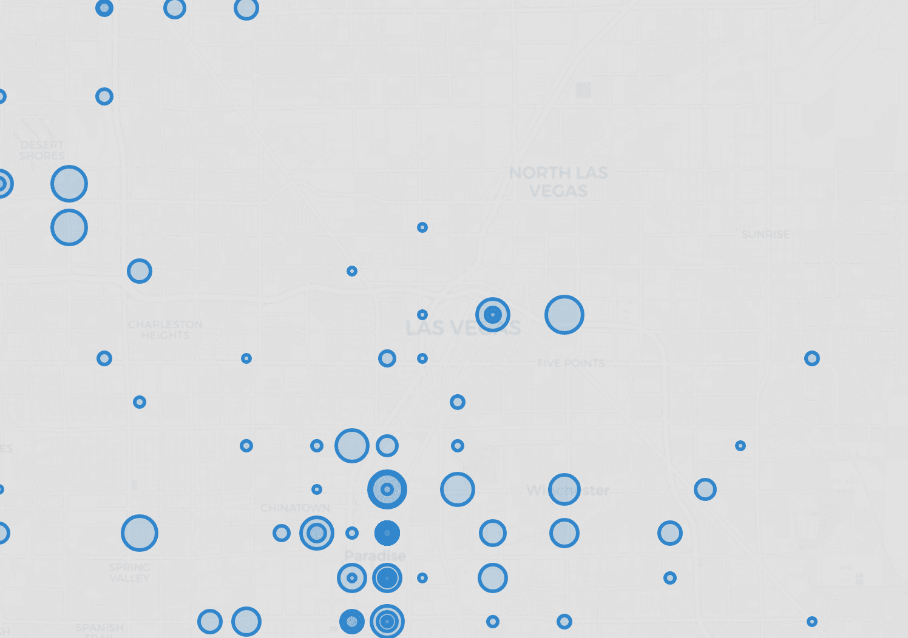

[**门店合理化**](https://www.investopedia.com/terms/r/rationalization.asp) 是公司为了提高经营效率，降低成本而进行的重组。由于 T4 和新冠肺炎的危机，世界各地的几家零售企业正在关闭店铺。这并不仅仅是金融危机的症状，事实上许多公司已经将投资集中在使他们的业务更加数字化上。

[**聚类**](https://en.wikipedia.org/wiki/Cluster_analysis) 是对一组对象进行分组的任务，使同一组中的观察值彼此之间比其他组中的观察值更相似。这是[无监督学习](https://en.wikipedia.org/wiki/Unsupervised_learning)(没有目标变量时的机器学习)最受欢迎的应用之一。

[**地理空间分析**](https://en.wikipedia.org/wiki/Spatial_analysis) 是处理卫星图像、GPS 坐标和街道地址以应用于地理模型的数据科学领域。

在本文中，我将使用地理数据聚类来解决零售合理化问题。我将展示一些有用的 Python 代码，这些代码可以很容易地应用于其他类似的情况(只需复制、粘贴、运行)，并通过注释遍历每一行代码，以便您可以复制这个示例(下面是完整代码的链接)。

[](https://github.com/mdipietro09/DataScience_ArtificialIntelligence_Utils/blob/master/machine_learning/example_clustering.ipynb) [## mdipietro 09/data science _ 人工智能 _ 实用工具

### permalink dissolve GitHub 是超过 5000 万开发人员的家园，他们一起工作来托管和审查代码，管理…

github.com](https://github.com/mdipietro09/DataScience_ArtificialIntelligence_Utils/blob/master/machine_learning/example_clustering.ipynb) 

我将使用" **Starbucks Stores dataset** "提供所有正在运营的商店的位置(下面的链接)。我将选择一个特定的地理区域，除了所提供的纬度和经度之外，我将模拟数据集中每个商店的一些业务信息(成本、容量、员工)。

[](https://www.kaggle.com/starbucks/store-locations) [## 星巴克在全球的位置

### 运营中的每家星巴克店的名称、所有权类型和位置

www.kaggle.com](https://www.kaggle.com/starbucks/store-locations) 

特别是，我将经历:

*   设置:导入包，读取地理数据，创建业务功能。
*   数据分析:用*叶子*和 *geopy* 在地图上展示商业案例。
*   聚类:用 *scikit-learn* 的机器学习(K-Means / Affinity Propagation)，用 *minisom* 的深度学习(自组织映射)。
*   商店合理化:构建确定性算法来解决业务案例。

## 设置

首先，我需要导入以下包。

```
**## for data**
import **numpy** as np
import **pandas** as pd**## for plotting**
import **matplotlib**.pyplot as plt
import **seaborn** as sns**## for geospatial**
import **folium**
import **geopy****## for machine learning**
from **sklearn** import preprocessing, cluster
import **scipy****## for deep learning**
import **minisom**
```

然后我将把数据读入一个熊猫数据帧。

```
dtf = pd.read_csv('data_stores.csv')
```

原始数据集包含超过 5，000 个城市和 25，000 家商店，但是出于本教程的目的，我将只处理一个城市。

```
filter = **"Las Vegas"**dtf = dtf[dtf["City"]==filter][["City","Street Address","Longitude","Latitude"]].reset_index(drop=True)dtf = dtf.reset_index().rename(columns={"index":"id"})
dtf.head()
```

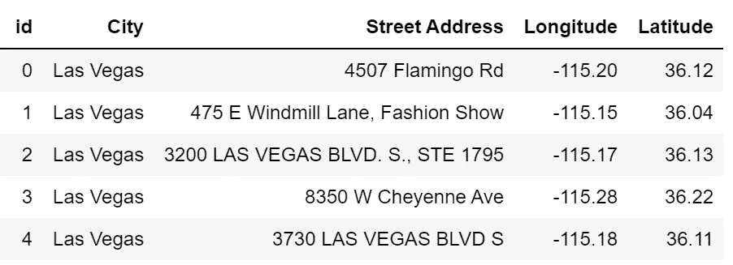

在那个地区，有 156 家商店。为了继续进行业务案例，我将**模拟每个商店的一些信息**:

*   *潜在能力*:员工的总能力(例如，10 表示商店最多可容纳 10 名员工)
*   *员工*:当前员工级别(如 7 表示该店目前有 7 名员工在运营)
*   *容量*:当前剩余容量(如 10–7 = 3，商店仍可容纳 3 名员工)
*   *成本*:公司维持店铺运营的年度成本(*低*、*中*、*高*)

```
dtf["**Potential**"] = np.random.randint(low=3, high=10+1, size=len(dtf))dtf["**Staff**"] = dtf["**Potential**"].apply(lambda x: int(np.random.rand()*x)+1)dtf["**Capacity**"] = dtf["**Potential**"] - dtf["**Staff**"]dtf["**Cost**"] = np.random.choice(["high","medium","low"], size=len(dtf), p=[0.4,0.5,0.1])dtf.head()
```

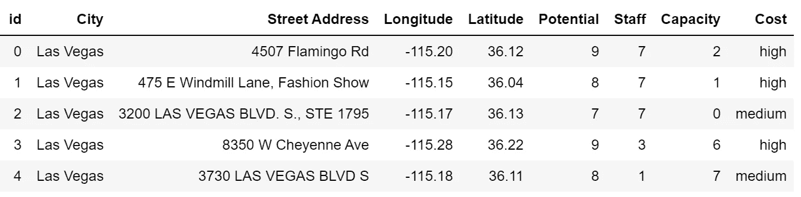

请注意，这只是一个模拟，这些数字是随机产生的，并不真正反映星巴克(或任何其他公司)的业务。

现在一切都准备好了，我将从分析业务案例开始，然后构建一个聚类模型和一个合理化算法。

我们开始吧，好吗？

## 数据分析

假设我们拥有一家零售企业，我们不得不关闭一些商店。我们希望在不裁员的情况下实现利润最大化(通过成本最小化)。

费用分配如下:

```
**x = "Cost"**ax = dtf[x].value_counts().sort_values().plot(kind="barh")
totals = []
for i in ax.patches:
    totals.append(i.get_width())
total = sum(totals)
for i in ax.patches:
     ax.text(i.get_width()+.3, i.get_y()+.20, 
     str(round((i.get_width()/total)*100, 2))+'%', 
     fontsize=10, color='black')
ax.grid(axis="x")
plt.suptitle(x, fontsize=20)
plt.show()
```

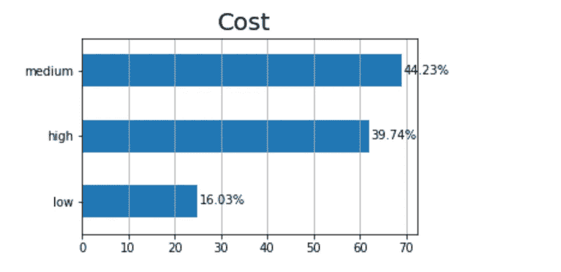

目前，只有一小部分商店在满负荷运转(剩余容量= 0)，这意味着有些商店的员工数量很少(剩余容量很高):

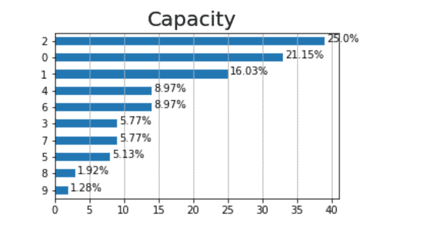

让我们把这些信息在地图上形象化。首先，我需要获得地理区域的坐标来启动地图。我会用 [*geopy*](https://geopy.readthedocs.io/en/stable/) 来做:

```
city = **"Las Vegas"****## get location**
locator = geopy.**geocoders**.**Nominatim**(user_agent="MyCoder")
location = locator.geocode(city)
print(location)**## keep latitude and longitude only**
location = [location.latitude, location.longitude]
print("[lat, long]:", location)
```

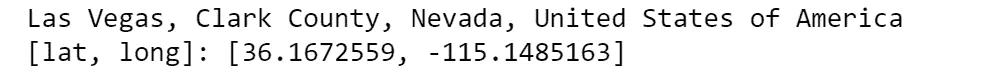

我将使用[](https://python-visualization.github.io/folium/quickstart.html#Getting-Started)**创建地图，这是一个非常方便的包，允许我们绘制交互式地图，而无需加载 [shapefile](https://en.wikipedia.org/wiki/Shapefile) 。每个商店应通过一个点来识别，该点的大小与其当前的员工人数成比例，颜色基于其成本。我还将向默认地图添加一小段 HTML 代码来显示图例。**

```
**x, y = **"Latitude", "Longitude"**
color = **"Cost"** size = **"Staff"** popup = **"Street Address"**
data = dtf.copy() **## create color column**
lst_colors=["red","green","orange"]
lst_elements = sorted(list(dtf[color].unique()))
data["color"] = data[color].apply(lambda x: 
                lst_colors[lst_elements.index(x)])**## create size column (scaled)**
scaler = preprocessing.MinMaxScaler(feature_range=(3,15))
data["size"] = scaler.fit_transform(
               data[size].values.reshape(-1,1)).reshape(-1) **## initialize the map with the starting location** map_ = folium.**Map**(location=location, tiles="cartodbpositron",
                  zoom_start=11)**## add points**
data.apply(lambda row: folium.**CircleMarker**(
           location=[row[x],row[y]], popup=row[popup],
           color=row["color"], fill=True,
           radius=row["size"]).add_to(map_), axis=1)**## add html legend** legend_html = """<div style="position:fixed; bottom:10px; left:10px; border:2px solid black; z-index:9999; font-size:14px;">&nbsp;<b>"""+color+""":</b><br>"""
for i in lst_elements:
     legend_html = legend_html+"""&nbsp;<i class="fa fa-circle 
     fa-1x" style="color:"""+**lst_colors[lst_elements.index(i)]**+"""">
     </i>&nbsp;"""+str(i)+"""<br>"""
legend_html = legend_html+"""</div>"""map_.get_root().**html.add_child**(folium.**Element**(legend_html)) **## plot the map**
map_**
```

**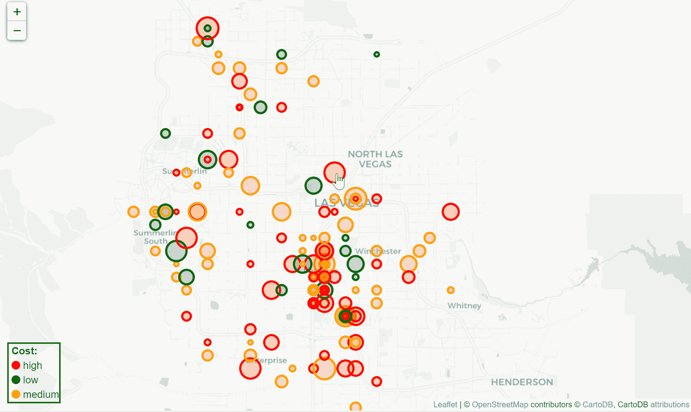**

**我们的目标是尽可能多地关闭高成本商店(红点),将员工转移到位于同一社区的低成本商店(绿点)。因此，我们将最大化利润(通过关闭高成本商店)和效率(通过让低成本商店满负荷工作)。**

**我们如何在不选择距离阈值和地理边界的情况下定义邻域？嗯，答案是……集群。**

## **使聚集**

**有几种算法可以使用，这里列出了主要的[和](https://scikit-learn.org/stable/modules/clustering.html)。我将尝试 K-Means、相似性传播、自组织映射。**

**[**K-Means**](https://en.wikipedia.org/wiki/K-means_clustering) 旨在将观察值划分为预定义数量的聚类( *k* )，其中每个点属于具有最近均值的聚类。它首先随机选择 k 个质心并将这些点分配给最近的聚类，然后用聚类中所有点的平均值更新每个质心。当您需要获得精确的组数时，这种算法很方便(例如，保持最小数量的运营商店)，并且它更适合于少量的偶数聚类。**

**这里，为了定义正确的 k，我将使用[肘方法](https://en.wikipedia.org/wiki/Elbow_method_(clustering)):绘制方差作为集群数量的函数，并选择使曲线变平的 *k* 。**

```
**X = dtf[[**"Latitude","Longitude"**]]max_k = **10****## iterations**
distortions = [] 
for i in range(1, max_k+1):
    if len(X) >= i:
       model = cluster.KMeans(n_clusters=i, init='k-means++', max_iter=300, n_init=10, random_state=0)
       model.fit(X)
       distortions.append(model.inertia_)**## best k: the lowest derivative**
k = [i*100 for i in np.diff(distortions,2)].index(min([i*100 for i 
     in np.diff(distortions,2)]))**## plot**
fig, ax = plt.subplots()
ax.plot(range(1, len(distortions)+1), distortions)
ax.axvline(k, ls='--', color="red", label="k = "+str(k))
ax.set(title='The Elbow Method', xlabel='Number of clusters', 
       ylabel="Distortion")
ax.legend()
ax.grid(True)
plt.show()**
```

**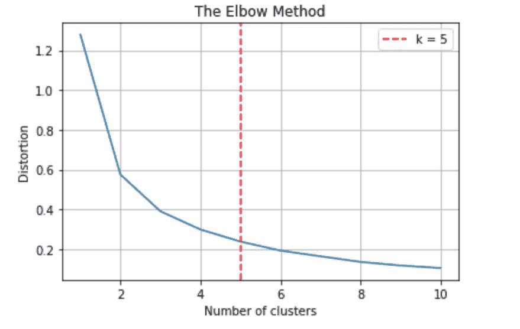**

**我们可以尝试使用 *k = 5* ，这样 K-Means 算法将找到 5 个理论质心。此外，我还将确定真正的质心(离聚类中心最近的观测值)。**

```
**k = 5
model = cluster.**KMeans**(n_clusters=k, init='k-means++')
X = dtf[[**"Latitude","Longitude"**]]**## clustering**
dtf_X = X.copy()
dtf_X["cluster"] = model.fit_predict(X)**## find real centroids**
closest, distances = scipy.**cluster.vq.vq**(model.cluster_centers_, 
                     dtf_X.drop("cluster", axis=1).values)
dtf_X["centroids"] = 0
for i in closest:
    dtf_X["centroids"].iloc[i] = 1**## add clustering info to the original dataset** dtf[["**cluster**","**centroids**"]] = dtf_X[["**cluster**","**centroids**"]]
dtf.sample(5)**
```

**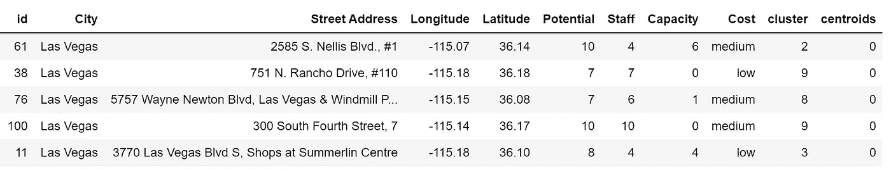**

**我向数据集添加了两列:" *cluster* "表示观察值属于哪个簇，以及" *centroids* "如果观察值也是质心(最靠近中心)，则为 1，否则为 0。让我们计划一下:**

```
****## plot**
fig, ax = plt.subplots()
sns.**scatterplot**(x="Latitude", y="Longitude", data=dtf, 
                palette=sns.color_palette("bright",k),
                hue='cluster', size="centroids", size_order=[1,0],
                legend="brief", ax=ax).set_title('Clustering 
                (k='+str(k)+')')th_centroids = model.cluster_centers_
ax.scatter(th_centroids[:,0], th_centroids[:,1], s=50, c='black', 
           marker="x")**
```

**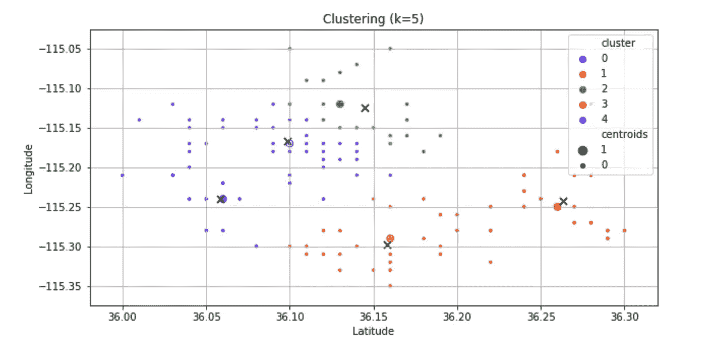**

**[**相似性传播**](https://en.wikipedia.org/wiki/Affinity_propagation) 是一种基于图形的算法，将每个观察值分配给其最近的样本。基本上，所有的观察“投票”给它们想要关联的其他观察，这导致将整个数据集划分成大量不均匀的聚类。当您不能指定簇的数量时，这是非常方便的，并且它适用于地理空间数据，因为它可以很好地处理非平面几何。**

```
**model = cluster.**AffinityPropagation**()**
```

**使用之前的相同代码，您可以拟合模型(找到 12 个簇)，并且您可以使用下面的代码来绘图(不同之处在于 *k* 在开始时没有声明，并且没有理论上的质心):**

```
**k = dtf["cluster"].nunique()sns.**scatterplot**(x="Latitude", y="Longitude", data=dtf, 
                palette=sns.color_palette("bright",k),
                hue='cluster', size="centroids", size_order=[1,0],
                legend="brief").set_title('Clustering 
                (k='+str(k)+')')**
```

**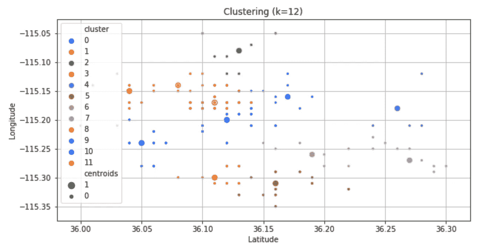**

**[**自组织地图**](https://en.wikipedia.org/wiki/Self-organizing_map) (SOMs)由于使用深度学习而大不相同。事实上，SOM 是一种人工神经网络，它使用无监督学习进行训练，以产生输入空间的低维表示，称为“地图”(也称为 [Kohonen 层](https://en.wikipedia.org/wiki/Hybrid_Kohonen_self-organizing_map))。基本上，输入连接到形成映射的 *n x m* 神经元，然后为每个观察计算“获胜”神经元(最近的)，并使用横向距离将神经元聚集在一起。这里，我将尝试使用 4x4 SOM:**

**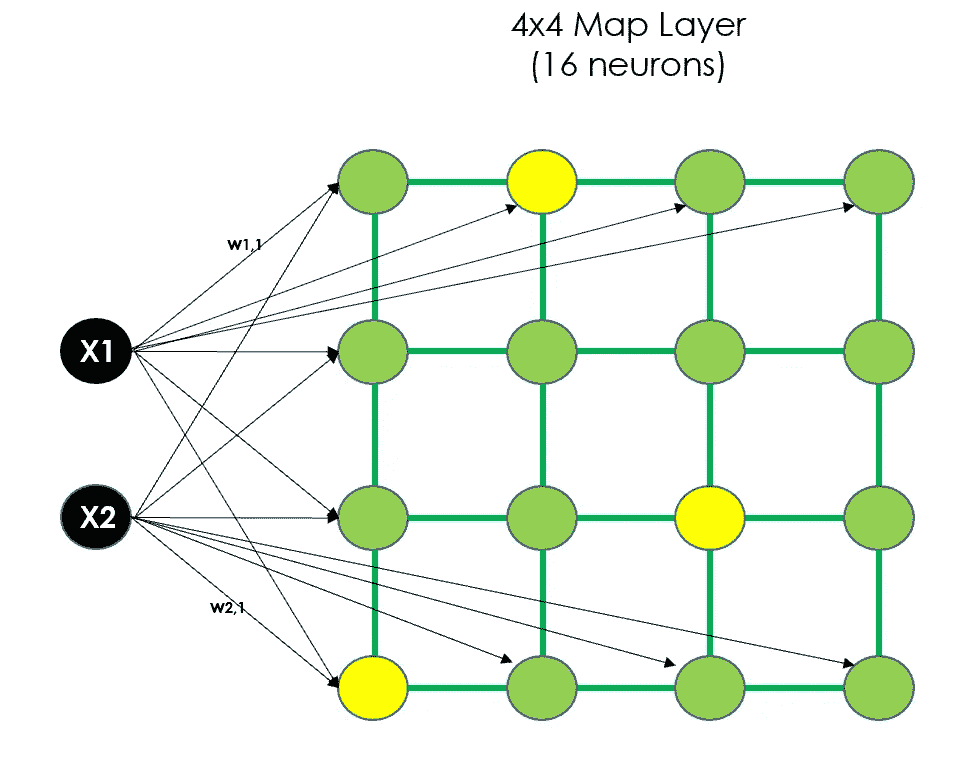**

```
**X = dtf[[**"Latitude","Longitude"**]]
map_shape = **(4,4)****## scale data**
scaler = preprocessing.**StandardScaler**()
X_preprocessed = scaler.fit_transform(X.values)**## clustering** model = minisom.**MiniSom**(x=map_shape[0], y=map_shape[1], 
                        input_len=X.shape[1])
model.train_batch(X_preprocessed, num_iteration=100, verbose=False)**## build output dataframe**
dtf_X = X.copy()
dtf_X["cluster"] = np.**ravel_multi_index**(np.array(
      [model.winner(x) for x in X_preprocessed]).T, dims=map_shape)**## find real centroids** cluster_centers = np.array([vec for center in model.get_weights() 
                            for vec in center])closest, distances = scipy.**cluster.vq.vq**(model.cluster_centers_, 
                                         X_preprocessed)
dtf_X["centroids"] = 0
for i in closest:
    dtf_X["centroids"].iloc[i] = 1**## add clustering info to the original dataset** dtf[["cluster","centroids"]] = dtf_X[["cluster","centroids"]]**## plot** k = dtf["cluster"].nunique()fig, ax = plt.subplots()
sns.**scatterplot**(x="Latitude", y="Longitude", data=dtf, 
                palette=sns.color_palette("bright",k),
                hue='cluster', size="centroids", size_order=[1,0],
                legend="brief", ax=ax).set_title('Clustering 
                (k='+str(k)+')')th_centroids = scaler.inverse_transform(cluster_centers)
ax.scatter(th_centroids[:,0], th_centroids[:,1], s=50, c='black', 
           marker="x")**
```

**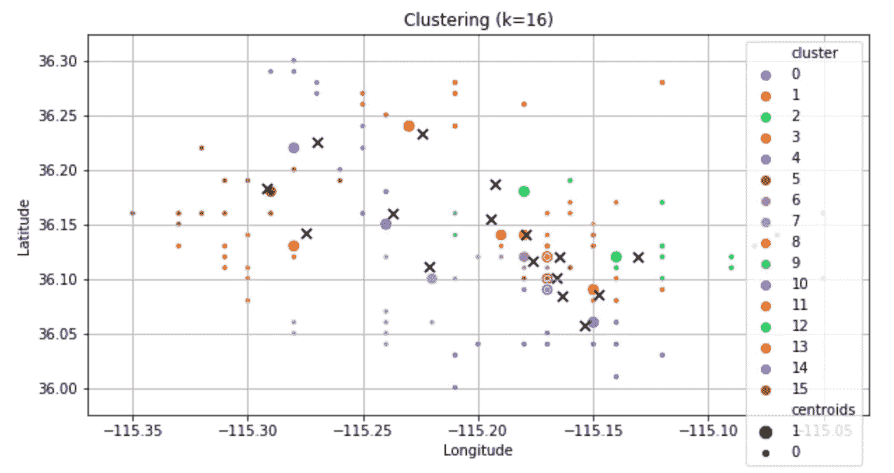**

**独立于您用来对数据进行聚类的算法，现在您有了一个多了两列的数据集(" *cluster* "，" *centroids* ")。我们可以用它来可视化地图上的星团，这次我也要用一个标记来显示质心。**

```
**x, y = **"Latitude", "Longitude"**
color = **"cluster"** size = **"Staff"** popup = **"Street Address"** marker = "**centroids**"
data = dtf.copy()**## create color column**
lst_elements = sorted(list(dtf[color].unique()))
lst_colors = ['#%06X' % np.random.randint(0, 0xFFFFFF) for i in 
              range(len(lst_elements))]
data["color"] = data[color].apply(lambda x: 
                lst_colors[lst_elements.index(x)])**## create size column (scaled)**
scaler = preprocessing.MinMaxScaler(feature_range=(3,15))
data["size"] = scaler.fit_transform(
               data[size].values.reshape(-1,1)).reshape(-1)**## initialize the map with the starting location** map_ = folium.**Map**(location=location, tiles="cartodbpositron",
                  zoom_start=11)**## add points**
data.apply(lambda row: folium.**CircleMarker**(
           location=[row[x],row[y]], popup=row[popup],
           color=row["color"], fill=True,
           radius=row["size"]).add_to(map_), axis=1)**## add html legend** legend_html = """<div style="position:fixed; bottom:10px; left:10px; border:2px solid black; z-index:9999; font-size:14px;">&nbsp;<b>"""+color+""":</b><br>"""
for i in lst_elements:
     legend_html = legend_html+"""&nbsp;<i class="fa fa-circle 
     fa-1x" style="color:"""+**lst_colors[lst_elements.index(i)]**+"""">
     </i>&nbsp;"""+str(i)+"""<br>"""
legend_html = legend_html+"""</div>"""map_.get_root().**html.add_child**(folium.**Element**(legend_html))**## add centroids marker**
lst_elements = sorted(list(dtf[marker].unique()))
data[data[marker]==1].apply(lambda row: 
           folium.**Marker**(location=[row[x],row[y]], 
           popup=row[marker], draggable=False,          
           icon=folium.**Icon**(color="black")).add_to(map_), axis=1)**## plot the map**
map_**
```

**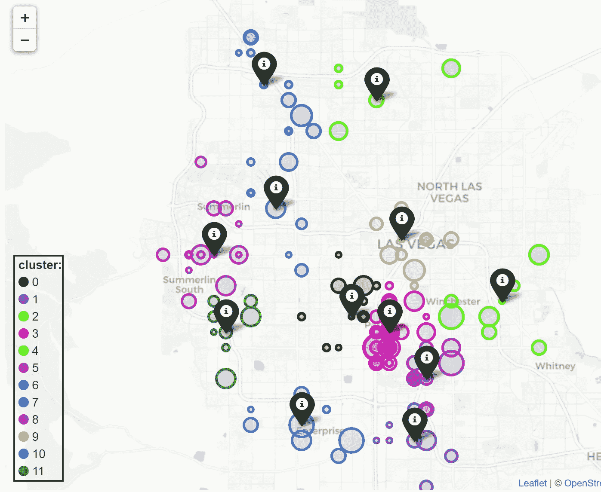**

**现在我们有了集群，我们可以在每个集群内部开始商店合理化。**

## **商店合理化**

**因为本文的主要焦点是地理空间数据的聚类，所以我将保持这一部分非常简单。在每个集群中，我将选择潜在目标(高成本商店)和中心(低成本商店)，并将目标的员工重新安置在中心，直到后者达到满负荷。当一个目标的所有员工都被转移时，商店可以关闭。**

**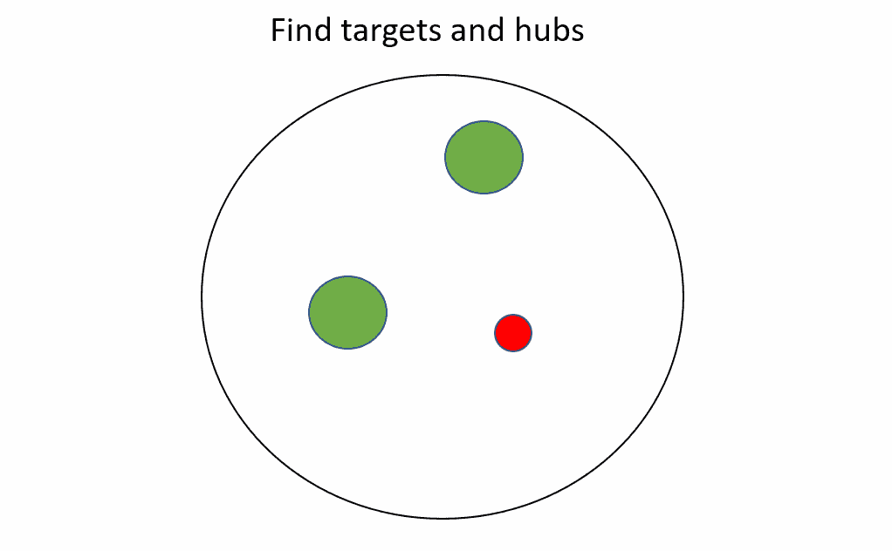**

**集群内的迭代**

```
**dtf_new = pd.DataFrame()for c in sorted(dtf["cluster"].unique()):
    dtf_cluster = dtf[dtf["cluster"]==c]

   ** ## hubs and targets**
    lst_hubs = dtf_cluster[dtf_cluster["Cost"]=="low"
               ].sort_values("Capacity").to_dict("records")
    lst_targets = dtf_cluster[dtf_cluster["Cost"]=="high"
               ].sort_values("Staff").to_dict("records") **## move targets**
    for target in lst_targets:
         for hub in lst_hubs:
             **### if hub has space**
             if hub["Capacity"] > 0:
                residuals = hub["Capacity"] - target["Staff"] **#### case of hub has still capacity: do next target**
                if residuals >= 0:
                   hub["Staff"] += target["Staff"]
                   hub["Capacity"] = hub["Potential"] - hub["Staff"]
                   target["Capacity"] = target["Potential"]
                   target["Staff"] = 0
                   break **#### case of hub is full: do next hub**
                else:
                   hub["Capacity"] = 0
                   hub["Staff"] = hub["Potential"]
                   target["Staff"] = -residuals
                   target["Capacity"] = target["Potential"] - 
                                          target["Staff"] dtf_new = dtf_new.append(pd.DataFrame(lst_hubs)
                 ).append(pd.DataFrame(lst_targets))dtf_new = dtf_new.append(dtf[dtf["Cost"]=="medium"]
                 ).reset_index(drop=True).sort_values(
                 ["cluster","Staff"])
dtf_new.head()**
```

**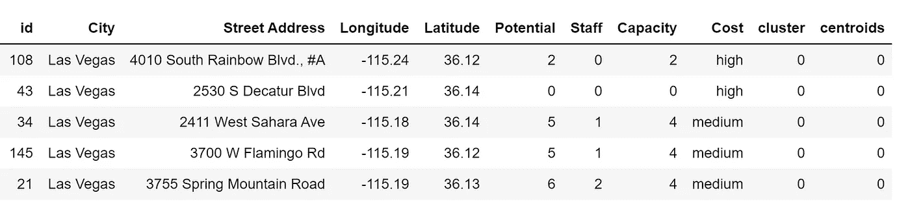**

**这是一个非常简单的算法，可以通过多种方式进行改进:例如，将中等成本的商店纳入等式，并在低成本商店全部满员时重复这一过程。**

**让我们看看我们用这个基本流程关闭了多少家高成本商店:**

```
**dtf_new["**closed**"] = dtf_new["**Staff**"].apply(lambda x: 1 
                                           if x==0 else 0)
print("closed:", dtf_new["**closed**"].sum())**
```

**我们成功关闭了 19 家商店，但我们是否也保持了该地区的均匀覆盖，这样顾客就不需要去另一个社区逛商店了？让我们在地图上标出关闭的商店( *marker = "closed"* )来想象一下后果:**

**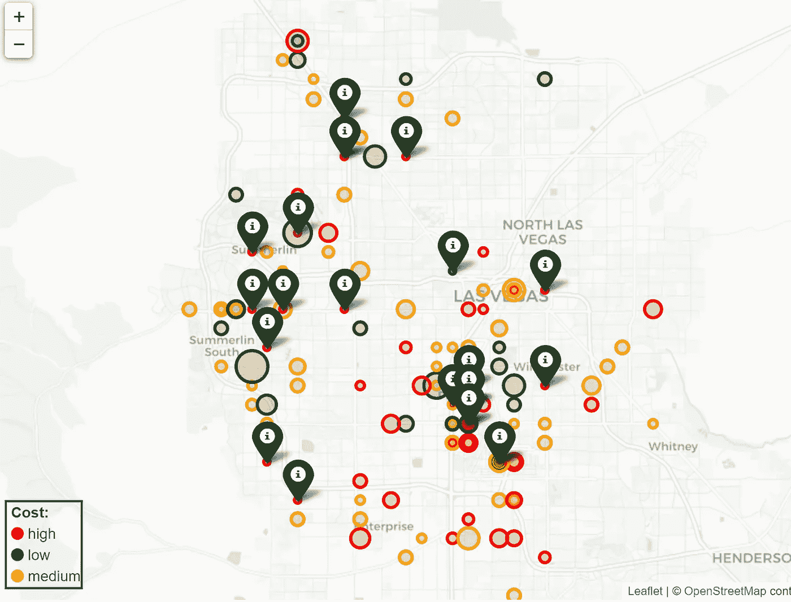**

## **结论**

**这篇文章是一篇关于**如何在零售商业案例**中使用聚类和地理空间分析的教程。我使用模拟数据集来比较流行的机器学习和深度学习方法，并展示了如何在交互式地图上绘制输出。我还展示了一个简单的确定性算法来提供业务案例的解决方案。**

**我希望你喜欢它！如有问题和反馈，或者只是分享您感兴趣的项目，请随时联系我。**

> **👉[我们来连线](https://linktr.ee/maurodp)👈**

> **本文是用 Python 进行机器学习系列**的一部分**，参见:**

**[](/machine-learning-with-python-classification-complete-tutorial-d2c99dc524ec) [## 用 Python 进行机器学习:分类(完整教程)

### 数据分析和可视化、特征工程和选择、模型设计和测试、评估和解释

towardsdatascience.com](/machine-learning-with-python-classification-complete-tutorial-d2c99dc524ec) [](/machine-learning-with-python-regression-complete-tutorial-47268e546cea) [## Python 机器学习:回归(完整教程)

### 数据分析和可视化、特征工程和选择、模型设计和测试、评估和解释

towardsdatascience.com](/machine-learning-with-python-regression-complete-tutorial-47268e546cea) [](/deep-learning-with-python-neural-networks-complete-tutorial-6b53c0b06af0) [## Python 深度学习:神经网络(完整教程)

### 用 TensorFlow 建立、绘制和解释人工神经网络

towardsdatascience.com](/deep-learning-with-python-neural-networks-complete-tutorial-6b53c0b06af0) [](/modern-recommendation-systems-with-neural-networks-3cc06a6ded2c) [## 基于神经网络的现代推荐系统

### 使用 Python 和 TensorFlow 构建混合模型

towardsdatascience.com](/modern-recommendation-systems-with-neural-networks-3cc06a6ded2c)**