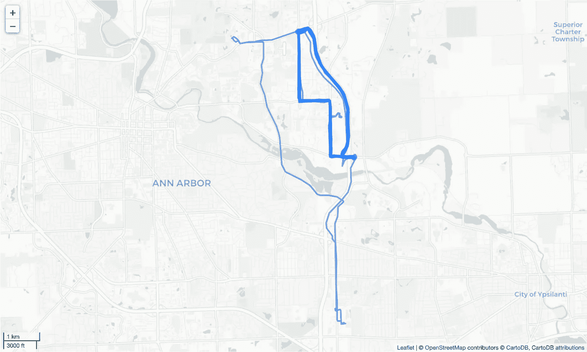
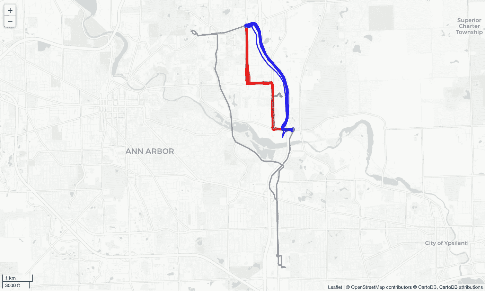

# 聚类移动对象轨迹

> 原文：<https://towardsdatascience.com/clustering-moving-object-trajectories-216c372d37e2?source=collection_archive---------22----------------------->

## 两个端点之间有多少不同的轨迹？

亚历克斯·霍利奥克在 [Unsplash](https://unsplash.com?utm_source=medium&utm_medium=referral) 上拍摄的照片

你可能会从家里到办公室走一条你从经验中学到的已知路线，在某种意义上这是最好的。也许它最大限度地减少了你早上的通勤时间或旅行成本，或者也许它是最方便的。每天早上上班的时候，我把车开到公共停车场，然后坐地铁。回家的通勤从地铁开始，然后是汽车，但这次我总是使用不同的路线。使用早上的路线开车回家将意味着严重的交通堵塞，所以我绕道缩短我的通勤时间。我的路线选择反映了我的一些条件，了解这些可能有利于交通部门更好地规划。但是他们怎么能仅仅通过观察交通模式就知道这些呢？

轨迹的研究是理解运动物体行为的基础。我们不仅关心开始和结束位置，而且特别关心对象在端点之间移动的路径。一旦我们知道了轨迹，我们就可以收集关于移动物体行为的统计数据，并将其用于未来的推断。例如，在给定一般路径的情况下，我们确定车辆在两个已知位置之间行驶时的典型燃料消耗。我们可以稍后决定在相同位置之间的新行程是属于已知分布还是过于激进。

# 轨道

> *空间轨迹*是运动物体在地理空间中产生的轨迹，通常由一系列按时间顺序排列的点表示，例如*p*1→*p*2→*pn*，其中每个点都由一个地理空间坐标集和一个时间戳组成，例如 *p* = ( *x* ， *y* ， *t* [1]

移动的物体产生轨迹，即定义空间曲线的时间位置序列。我们通常使用采样过程收集轨迹信息，以离散的时间间隔收集位置。当你允许你的智能手机收集你的位置信息时，这个过程就会发生。该设备正在收集形成折线的数据，而不是一条连续的线。通过给每个顶点分配一个时间戳，折线呈现一个明确的方向，从较小的时间值到较大的时间值。

# 聚类轨迹

为什么我们需要对轨迹进行聚类？让我们以轻型车辆在现代城市中行驶为例。理解汽车沿着特定轨迹行驶时的驾驶行为是令人感兴趣的。人们可以简单地把可比较的路线想象成在相同的大致位置开始和结束的路线。但是这种假设是误导性的，因为驾驶员可能会选择不同的路径从 A 到达 b。一天中不同的交通状况可能会影响可用的选项，并且相同的行程可能会使用不同的轨迹。如果我们想以某种方式研究两个端点之间的驾驶性能，我们还必须确保我们沿着相似的路径进行比较。我们需要确保轨迹在相同的地方开始和结束，并遵循相同的一般路径。然而，我们需要给轨迹的实际地理匹配留有余地。轨迹记录存在自然的可变性，我们不想强迫车辆精确地通过相同的位置。我们还必须确保考虑到通过 GPS 传感器测量车辆位置时不可避免的误差。

我们如何让轨迹聚类发挥作用？我们使用聚类算法和距离度量。您可以选择任何一种聚类算法，但是距离度量仅限于一小组选项。我们希望确保相似的轨迹比不相似的轨迹产生更低的距离度量值。幸运的是，我们可以为此使用几个距离度量，例如[豪斯多夫距离](https://en.wikipedia.org/wiki/Hausdorff_distance)或[弗雷歇距离](https://medium.com/tblx-insider/how-long-should-your-dog-leash-be-ba5a4e6891fc)。在本文中，我们将使用后者和 HDBSCAN 作为聚类算法。

# 例子

我将说明如何使用[车辆能量数据集](https://arxiv.org/abs/1905.02081v1)【2】数据和[代码库](https://github.com/joaofig/ved-explore)对车辆轨迹进行聚类，我一直在构建代码库来探索它。我邀请你克隆储存库并打开 Python 笔记本 9 号。请注意，如果这是您第一次使用此代码，您必须按顺序运行所有笔记本，以准备使用数据库。

笔记本从声明几个支持函数开始，主要是读取和显示轨迹和聚类 geofences。真正的行动开始于名为“轨迹显示”的部分我们将查看一组特定的路径，即从第九组开始并在第六组结束的路径。

下图显示了所选簇之间的所有轨迹。从九点到六点有两种不同的方式，左边的阶梯路径和右边的平滑路径。我们还可以看到一些外围轨迹。聚类过程会对它们产生什么影响？

上面的地图显示了从第九个星团到第六个星团的所有轨迹。有两个清晰的集群，左边的阶梯路径和右边的弯曲路径。向左的长轨迹似乎是一个异常值。作者创造的形象。

在我们开始聚类过程之前，我们必须首先计算所有轨迹之间的距离矩阵。HDBSCAN 算法不支持轨迹距离函数，因此我们提供了一个距离矩阵。计算非常简单，有两个嵌套循环，并确保所需的对称性。出于性能原因，我们只计算矩阵的上半部分。

上述函数使用离散弗雷歇距离计算对称距离矩阵。

现在，我们可以继续将数据提供给 HDBSCAN，并收集计算出的集群标识符。通过将这些提供给地图显示函数，我们得到了下面显示的最终结果。

上面的地图显示了先前轨迹集的聚类结果。聚类过程正确地识别了两个主要的聚类和一些用灰色表示的外围路径。作者创造的形象。

我们现在可以确定驾驶员在两个终点之间使用的两个主要轨迹，并使用其特定的数据分布来表征它们。这些信息可能有助于我们回答相关的问题，例如为什么司机选择一个轨迹而不是另一个。

# 结论

本文使用 HDBSCAN 算法和离散弗雷歇距离作为度量，对轨迹进行了聚类。使用这一对算法，首先要计算所有路径之间的距离矩阵。轨迹聚类是移动对象分析的基本工具，因为它可以帮助揭示数据中隐藏的行为。

# 笔记

1 —由 Scikit-Learn 包实现的 KMeans 聚类算法由于缺乏对距离矩阵的支持而无法使用。显然，这是有充分理由的。

# 资源

[GitHub 库](https://github.com/joaofig/ved-explore)

# 相关文章

 [## 快速离散弗雷歇距离

### 如何提高离散弗雷歇距离计算性能？

towardsdatascience.com](/fast-discrete-fréchet-distance-d6b422a8fb77)  [## 使用 HDBSCAN 进行地理聚类

### 如何使用 HDBSCAN、H3、图论和 OSM 探索地理数据。

towardsdatascience.com](/geographic-clustering-with-hdbscan-ef8cb0ed6051) 

# 参考

[1]郑，杨，周，谢.(编者).**用空间轨迹计算**。斯普林格，2011 年。

[2] [汽车能源数据集(VED)，用于汽车能源消耗研究的大规模数据集](https://arxiv.org/abs/1905.02081v1)