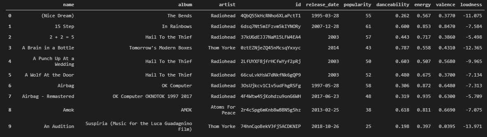
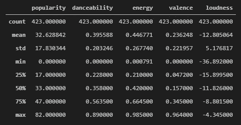
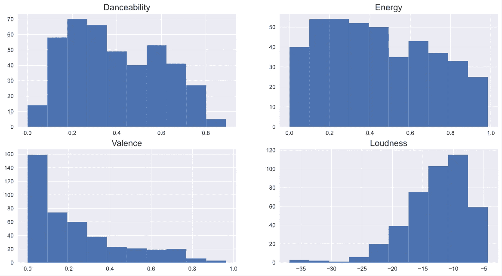
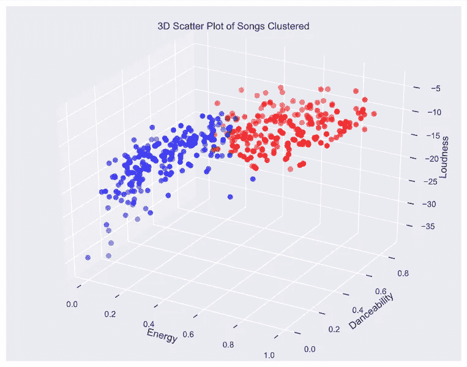
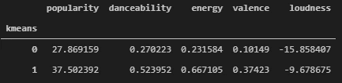
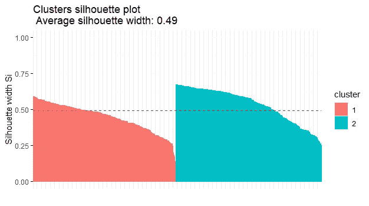

# 使用 Python 和 r 对音乐进行聚类，在 Spotify 上创建您的播放列表。

> 原文：<https://towardsdatascience.com/clustering-music-to-create-your-personal-playlists-on-spotify-using-python-and-k-means-a39c4158589a?source=collection_archive---------26----------------------->

## 使用 K-Means 在 Spotify 播放列表上按相似性对歌曲进行分组的简单方法。


照片由[海蒂·芬](https://unsplash.com/@heidifin?utm_source=unsplash&utm_medium=referral&utm_content=creditCopyText)在 [Unsplash](https://unsplash.com/s/photos/music-desk?utm_source=unsplash&utm_medium=referral&utm_content=creditCopyText) 拍摄

S potify 是发现新音乐的最著名的音乐平台之一。该公司使用许多不同的算法，根据用户的音乐偏好向他们推荐新音乐，这些推荐大多位于播放列表中。这些播放列表是根据各种音乐流派为不同用户创建的，甚至 Spotify 也能够根据心情推荐新音乐。

在我的一生中，音乐一直在我的日常生活中，它是一种药物，当我做家务、在办公室工作、遛狗、锻炼等等时，我都需要它。我在 Spotify 上有很多音乐，我一直想根据歌曲的相似性将其分开，并保存到不同的播放列表中。幸运的是，凭借一点机器学习算法和 Python 的知识，我可以实现这个目标！！！。

为此，首先我会列出构建聚类模型所需的工具和 Spotify 音频功能的一些定义。

# 工具:

*   熊猫和 Numpy 进行数据分析。
*   Sklearn 构建机器学习模型。
*   Spotipy Python 库([点击此处](https://spotipy.readthedocs.io/en/2.13.0/)了解更多信息)。
*   Spotify 凭证访问 Api 数据库和播放列表修改([点击此处](https://developer.spotify.com/)了解更多信息)。

# Spotify 音频功能:

Spotify 使用一系列不同的功能对歌曲进行分类。我从 Spotify 网页复制/粘贴信息。

*   声音:一种置信度，从 0.0 到 1.0，表示音轨是否是声音的。1.0 表示音轨是声学的高置信度。
*   可跳舞性:可跳舞性描述了一个曲目在音乐元素组合的基础上适合跳舞的程度，包括速度、节奏稳定性、节拍强度和整体规律性。值 0.0 最不适合跳舞，1.0 最适合跳舞。
*   能量:能量是一个从 0.0 到 1.0 的度量，代表强度和活动的感知度量。通常，高能轨道感觉起来很快，很响，很嘈杂。例如，死亡金属具有高能量，而巴赫前奏曲在音阶上得分较低。对该属性有贡献的感知特征包括动态范围、感知响度、音色、开始速率和一般熵。
*   乐器性:预测音轨是否不包含人声。“Ooh”和“aah”在这种情况下被视为乐器。Rap 或口语词轨道明显是“有声的”。乐器度值越接近 1.0，轨道不包含人声内容的可能性就越大。高于 0.5 的值旨在表示乐器轨道，但随着该值接近 1.0，置信度会更高。
*   活跃度:检测录音中是否有观众。较高的活跃度值表示音轨被现场执行的概率增加。高于 0.8 的值很有可能表示该音轨是实时的。
*   响度:轨道的整体响度，以分贝(dB)为单位。响度值是整个轨道的平均值，可用于比较轨道的相对响度。响度是声音的质量，是与体力(振幅)相关的主要心理因素。值通常在-60 和 0 db 之间。
*   语速:语速检测音轨中是否存在口语单词。越是类似语音的录音(例如脱口秀、有声读物、诗歌)，属性值就越接近 1.0。高于 0.66 的值描述可能完全由口语单词组成的轨道。介于 0.33 和 0.66 之间的值描述可能包含音乐和语音的轨道，可以是分段的，也可以是分层的，包括说唱音乐。低于 0.33 的值很可能代表音乐和其他非语音类轨道。
*   配价:从 0.0 到 1.0 的一种量度，描述音轨所传达的音乐积极性。高价曲目听起来更积极(例如，快乐、愉快、欣快)，而低价曲目听起来更消极(例如，悲伤、沮丧、愤怒)。
*   速度:轨道的整体估计速度，单位为每分钟节拍数(BPM)。在音乐术语中，速度是给定作品的速度或步调，直接来源于平均节拍持续时间。

出于减少信息的目的，我决定使用**响度**、**化合价**、**能量、**和**可跳舞性**的特征，因为它们对区分精力充沛的歌曲和放松的歌曲更有影响。

# 1.获取和分析数据:

我最喜欢的乐队是**电台司令**，所以我决定获得他们的唱片目录以及他们在个人音乐生涯中创作的所有音乐。

我用 Spotipy 库创建了一些函数来下载**电台司令**、**汤姆·约克**、**和平原子**、**约翰尼·格林伍德**、**艾德·奥布莱恩**、**科林·格林伍德**和**菲尔·塞尔维**的所有歌曲(是的，我痴迷于他们的音乐呵呵)。你可以在我的 Github 库上访问这些功能([点击这里](https://github.com/cristobalvch/Spotify-Playlists))。

我获得了以下数据:



具有 423 行 10 列形状的数据框。(图片由作者提供)

我一直想知道为什么我喜欢很多电台司令的音乐，我意识到他们的大多数歌曲都倾向于忧郁。描述了上述特征，数据显示我的化合价和能量小于 0.5，Danceability 倾向于低值，所以我喜欢低能量和负面声音的轨道(仍然有一些我 2000 年的 Emo 边看 MTV 视频)。



数据框的主要统计数据(图片由作者提供)



歌曲特征直方图(图片由作者提供)

# 2.构建模型:

由于我的数据(423 首曲目)的形状，并考虑到我想创建 2 个播放列表，将放松的曲目与充满活力的曲目分开(K=2)，我决定使用 **K-means** 聚类进行无监督的机器学习。

***重要提示*** *:我没有使用训练和测试数据，因为在这种情况下，我只想将所有的曲目分成 2 个不同的组，以创建包含全部数据的播放列表。*

所以让我们开始吧！。我首先导入库:

```
from sklearn.cluster import KMeansfrom sklearn.preprocessing import MinMaxScaler
```

然后，我需要定义特性并规范化模型的值。我将使用**最小最大缩放器**来保持原始分布的形状，并在 0 到 1 的范围内缩放特征。一旦我有了正确格式的值，我只需简单地创建 **K-Means** 模型，然后将标签保存到名为“df”的主数据框中。

```
col_features = ['danceability', 'energy', 'valence', 'loudness']
X = MinMaxScaler().fit_transform(df[col_features])kmeans = KMeans(init="kmeans++",
                n_clusters=2,
                random_state=15).fit(X)df['kmeans'] = kmeans.labels_
```

就这样，我把音乐分成了 2 组！！！

但现在我需要研究这些标注的特征，所以我绘制了 3D 散点图中的轨迹，然后我分析了通过 K 均值结果标注对数据框进行分组的每个特征的各自均值。



使用“能量”、“可跳舞性”和“响度”特征的音轨 3D 散点图(图片由作者提供)



每个 K 均值标签的均值特征(图片由作者提供)

正如我在图上注意到的，这些值被很好地分组，蓝色值位于标签 0 中，红色值位于标签 1 中。查看手段表，**标签 0** 将具有较少可跳舞性、能量、效价、响度的轨道分组，因此这个**对应于放松歌曲**，同样地，**标签 1 具有能量歌曲**。

# 3.带 R 的模型的精度:

我知道，试图评估聚类算法的最佳结果时，聚类准确性有点主观，但同样，我想观察我的模型是否能很好地分离轨迹。所以在 Rstudio 的一点帮助下，我使用了轮廓分析。来衡量我的模型的准确性。

在 Rstudio 中，我使用库“cluster”和“factoextra”来可视化和计算使用欧几里德距离的轮廓分析。完整的代码在我的 Github 存储库中([点击这里](https://github.com/cristobalvch/Spotify-Playlists)):

```
#Calculate The euclidean distance of my dataframe values.
dd <- dist(df,method="euclidean")#Silhouette Analysis using the K-means model(km) and distance(dd)
sil.km <- silhouette(km$cluster,dd)
fviz_silhouette(sil.km)
```

结果是:



轮廓分析(图片由作者提供)

轮廓分析是一种测量聚类中的每个点与其相邻聚类中的点的接近程度的方法。轮廓值在[-1，1]范围内。值+1 表示样本远离其相邻聚类，而非常接近其所分配的聚类。类似地，值为-1 表示该点与其相邻的簇的距离比与其所分配的簇的距离更近。因此，在我的例子中，值在 0.25 和 0.60 之间，这意味着大多数值被很好地分组。

# 4.在 Spotify 上创建播放列表:

为了创建播放列表并添加集群曲目，我使用了本文第一部分中介绍的库 Spotipy。你只需要获得一个客户端 id、客户端密码和用户名代码，就可以使用 Spotify 的 API 并操作你的音乐库。我把信息的链接给你([点击这里](https://spotipy.readthedocs.io/en/2.9.0/#client-credentials-flow))。

我必须将曲目分成 2 个不同的变量，然后有了曲目的 id，我只需创建 2 个新的播放列表，并向它们传递曲目的 id。代码如下所示:

```
#Separating the clusters into new variables
cluster_0 = df[df['kmeans']==0]
cluster_1  = df[df['kmeans']==1]#Obtaining the ids of the songs and conver the id dataframe column to a list.
ids_0 = cluster_0['id'].tolist()
ids_1 = cluster_1['id'].tolist()#Creating 2 new playlists on my Spotify User
pl_energy = sp.user_playlist_create(username=username,
                                           name="Radiohead :)")pl_relaxed = sp.user_playlist_create(user=username,
                                            name="Radiohead :(")#Adding the tracks into the playlists
#For energetic Playlist
sp.user_playlist_add_tracks(user=username,
                            playlist_id = pl_energy['id'],
                            tracks=ids_1)#For relaxed Playlist
sp.user_playlist_add_tracks(user=username,
                            playlist_id = pl_relaxed['id'],
                            tracks=ids_0)
```

最后，我有两个电台司令歌曲的播放列表，使用 K-means 聚类算法将充满活力的歌曲从放松的歌曲中分离出来！！！！。

如果你想听这两个播放列表，你可以在下面访问它们。

# 最有活力的电台司令歌曲(209 首)

作者创建的播放列表

# 最轻松的电台司令歌曲(214 首)

作者创建的播放列表

# 结论

机器学习算法在实现与你喜欢的事情相关的想法或项目方面有很多乐趣。就我而言，我非常喜欢音乐，所以我可以用这些知识创造一些很酷的方法来帮助我自动完成一项可能需要很长时间才能完成的任务。我还可以更多地了解这个神奇的数据科学世界，以及我对音乐品味的倾向。

# 我的文章:

*   [一个友好的公共汽车和分析员在网上到达部门](https://medium.com/@cristobal.veas.ch/una-forma-genial-para-buscar-y-analizar-arriendos-de-departamentos-en-la-web-e20727390a8c)
*   [用深度学习预测一首歌的音乐情绪](/predicting-the-music-mood-of-a-song-with-deep-learning-c3ac2b45229e)
*   [一种在网络上进行公共汽车和分析工作的交互形式。](https://medium.com/@cristobal.veas.ch/una-forma-interactiva-para-buscar-y-analizar-ofertas-de-trabajo-en-la-web-ef9327b0a8d3)
*   [从你电脑的音乐文件夹中自动播放 Spotify 上的播放列表](https://medium.com/datadriveninvestor/automating-playlists-on-spotify-from-the-music-folders-of-your-computer-c79060eadab2)

参考资料:

*   [https://towards data science . com/a-music-taste-analysis-using-Spotify-API-and-python-e52d 186 db 5 fc](/a-music-taste-analysis-using-spotify-api-and-python-e52d186db5fc)
*   [https://towards data science . com/is-my-Spotify-music-boring-an-analysis-containing-music-data-and-machine-learning-47550 AE 931 de](/is-my-spotify-music-boring-an-analysis-involving-music-data-and-machine-learning-47550ae931de)
*   [https://medium . com/@ rare loot/extracting-Spotify-data-on-your-favorite-artist-via-python-d 58 BC 92 a 4330](https://medium.com/@RareLoot/extracting-spotify-data-on-your-favourite-artist-via-python-d58bc92a4330)
*   [https://spotipy.readthedocs.io/en/2.9.0/#](https://spotipy.readthedocs.io/en/2.9.0/#)