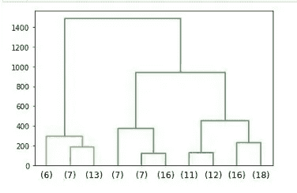

# 聚类技术

> 原文：<https://towardsdatascience.com/clustering-techniques-hierarchical-and-non-hierarchical-b520b5d6a022?source=collection_archive---------13----------------------->

聚类属于 u [监督学习](http://en.wikipedia.xn--org%20%20wiki%20%20unsupervised_learning-s35yka/)技术。在这种技术中，数据没有标记，也没有定义因变量。这种类型的学习通常是为了识别数据中的模式和/或对相似的数据进行分组。

在这篇文章中，详细解释了集群技术的类型，并提供了一个代码遍历。

# 什么是集群？

聚类是一种对相似对象进行分组的方法。聚类的目的是从异类的观察中创建同类的组。假设数据来自多个群体，例如，可能有不同行业的人出于不同目的向银行申请贷款。如果这个人是学生，他/她可以申请教育贷款，想买房的人可以申请住房贷款等等。聚类有助于识别相似的群体，更好地满足需求。

# 为什么要集群？

聚类是一种基于距离的算法。聚类的目的是最小化类内距离和最大化类间距离。


未分类的数据(图片由作者提供)


聚类数据(按作者分类的图片)

聚类作为一种工具可以用来深入了解数据。通过可视化数据可以获得大量的信息。聚类的输出也可以用作其他算法的预处理步骤。这项技术有几个广泛使用的用例，其中一些重要的是市场细分、客户细分和图像处理。

在继续之前，让我们了解一下集群的核心。

# 距离的度量

聚类完全是关于两点之间的距离和两个聚类之间的距离。距离不能为负。对于聚类问题，该算法使用一些常见的距离度量。

***欧氏距离***

这是算法使用的默认距离。最好解释为两点之间的距离。如果要测量两点 p 和 q 之间的距离，则欧几里德距离为


欧几里德距离(图片由作者提供)

***曼哈顿距离***

它是沿轴以垂直角度计算的两点之间的距离。它也被称为出租车距离，因为这代表了曼哈顿市的车辆如何在街道以直角相交的地方行驶。


曼哈顿距离(图片作者提供)

***闵可夫斯基距离***

在 n 维空间中，两点之间的距离称为闵可夫斯基距离。


闵可夫斯基距离(图片作者提供)

欧几里德距离和曼哈顿距离的推广是，如果 p 的值是 2，则它成为欧几里德距离，如果 p 的值是 1，则它成为曼哈顿距离。

# 聚类的类型

有两种主要类型的聚类技术

1.  等级或聚集
2.  k 均值

让我们看看每种类型以及代码走查

# 分层聚类

这是一种自下而上的方法。基于记录之间的距离以及聚类之间的距离，数据集中的记录被顺序分组以形成聚类。这是一个逐步实现这个方法的方法

1.  从 n 个群集开始，其中每行被视为一个群集
2.  使用基于距离的方法，将彼此最接近的两个记录合并到一个聚类中。在图 3 中，对于给定的五个记录，假设 A 和 C 在距离上最接近，它们形成一个聚类，同样 B 和 E 形成另一个聚类，等等


两个最接近记录的聚类(按作者分类的图片)

3.在每一步，两个最接近的聚类将被合并。要么将单个记录(singleton)添加到现有分类中，要么合并两个分类。在至少一个多元素集群形成后，需要为单个元素和一组观察值计算距离的场景，这就是**链接**的概念出现的地方。有五种主要类型的链接。通过使用下面的一个概念，聚类发生了-

*   ***单联动:*** 它是两个集群中任意两点之间的最短距离
*   ***完全联动:*** 与单联动相反。这是两个集群中任意两点之间的最长距离
*   ***平均连锁度:*** 一个聚类中的每一点到另一个聚类中的每一点的平均距离
*   ***质心联动:*** 一个簇的中心点到另一个簇的中心点的距离
*   ***沃德连锁:*** 平均法和质心法的结合。通过确定分类的中心点和观察值与中心的距离来计算分类内方差。当试图合并两个聚类时，在聚类之间找到方差，并且与另一个组合相比方差较小的聚类被合并。

需要注意的一点是，每种链接方法都会产生一个独特的结果。当这些方法中的每一种应用于相同的数据集时，它可能被不同地聚类。

4.重复这些步骤，直到出现一个包含所有记录的聚类

# 形象化

为了形象化聚类，有一个叫做**树状图的概念。**树状图是总结聚类过程的树形图。记录在 x 轴上。相似的记录由直线连接，直线的垂直长度反映了记录之间的距离。身高差距越大，差异越大。展示了一个样本树状图


树状图(图片由作者提供)

## 分层聚类代码演练

分层聚类的代码是使用 jupyter notebook 用 Python 3x 编写的。让我们从导入必要的库开始。

```
#Import the necessary librariesimport numpy as np
import pandas as pd
import seaborn as sns
import matplotlib.pyplot as plt
%matplotlib inline
from scipy.cluster.hierarchy import linkage, dendrogram, fcluster
```

接下来，加载数据集。这里使用了星巴克食物菜单上的一个数据集。

```
#Read the datasetdf = pd.read_csv('starbucks_menu.csv')#Look at the top 5 rows df.head()
```

进行必要的探索性数据分析，如查看描述性统计数据，检查空值和重复值。进行单变量和双变量分析，进行异常值处理(如果有的话)。由于这是一种基于距离的算法，因此有必要在适用的情况下执行标准化，以便所有变量都没有任何测量单位。这使得模型能够以最佳状态运行。

```
from scipy.stats import zscore
df.iloc[:,1:6] = df.iloc[:,1:6].apply(zscore)#Check the head after scalingdf.head()
```

一旦数据准备好了，让我们开始构建模型。需要分配一个标签列表，它是分类变量的唯一值的列表。这里，标签列表是从**食物**变量中创建的。

```
#Before clustering, setup label list from the food variablelabelList = list(df.Food.unique())
labelList
```

下一步是形成一个链接，将单例集群和另一个集群连接起来。在这种情况下，**沃德的**法是首选。

```
#Create linkage method using Ward's methodlink_method = linkage(df.iloc[:,1:6], method = 'ward')
```

借助树状图可视化聚类。在这种情况下，通过指定显示倒数第二个和倒数第二个聚类的 p 值，得到一个截断的树状图。

```
#Generate the dendrogramdend = dendrogram(link_method,
                  labels = labelList,
                  truncate_mode='lastp', 
                  p=10)
```



截断的树状图(图片由作者提供)

一旦创建了树状图，就需要切割树来确定最佳的聚类数。有两种方法可以做到这一点(如图所示)。在这种情况下，选择 3 个集群。可将聚类作为新列附加到数据框中，以获得更多信息。

```
#Method 1: criterion = 'maxclust' where a cut is defined based on the number of clustersclusters = fcluster(link_method, 3, criterion='maxclust') 
clusters#Method 2: criterion='distance' where a cut is defined based on distance in the y-axis#clusters = fcluster(link_method, 800, criterion='distance')#Apply the clusters back to the datasetdf['HCluster'] = clusters
df.head()
```

最后一步是进行聚类分析，从算法中提取信息和见解，以帮助做出有效的决策。聚类分析是通过对聚类的平均值进行分组并基于频率进行排序来完成的。

```
aggdata=df.iloc[:,1:8].groupby('HCluster').mean()
aggdata['Frequency']=df.HCluster.value_counts().sort_index()
aggdata
```


聚类分析(作者图片)

快速了解一下，第一类食物通常热量较低，因此宏量营养素含量较低。第二类食物的卡路里含量最高，因此宏量营养素含量也较高，第一类和第二类食物的卡路里含量居中，第三类食物的卡路里含量和宏量营养素含量较高。总的来说，简而言之，这种模式聚集得很好。

让我们继续下一个方法

# k 均值聚类

K-Means 是一种无层次的方法。这个想法是事先指定集群的数量。根据分类的数量，每个记录根据与每个分类的距离被分配到分类中。当数据集很大时，这种方法是首选的。单词**表示 k-means 中的**是指数据的平均，也称为寻找质心。这是一个循序渐进的方法

1.  事先指定 k 值
2.  将每个记录分配给到质心的距离最小的聚类。默认情况下，K 均值使用欧几里德距离
3.  重新计算新形成的簇的质心。基于距离，一些数据点可能会移动。
4.  重新分配可以在迭代的基础上发生，并且形成新的质心。这个过程将停止，直到没有从一个集群到另一个集群的观察跳跃。
5.  如果有任何重新分配，请返回步骤 3 并继续这些步骤。如果没有，则集群被最终确定。

尽管我们已经事先确定了聚类的数量，但这并不总是正确的，因此有必要确定最优的聚类数量。没有确定集群数量的可靠解决方案，但是有一个通用的方法。对于 k 的每个值，可以识别平方和(WSS)值。不能选择单个聚类，因此重要是找到 k 值，在该 k 值之后 WSS 值没有显著差异。为了提高效率，可以绘制一个肘形图，y 轴为 WSS 分数，x 轴为聚类数，以直观显示最优聚类数。

有一种方法可以了解模型的表现。这是通过检查两个度量来完成的，即**轮廓宽度**和**轮廓分数。**这有助于我们根据距离标准分析映射到聚类的每个观察值是否正确。轮廓宽度计算如下


轮廓宽度公式(图片由作者提供)

其中 b 是观测值和相邻聚类的质心之间的距离，a 是观测值和自身聚类的质心之间的距离。

轮廓宽度的值可以在-1 到 1 的范围内。如果轮廓宽度的值为正，则观测值到当前聚类的映射是正确的。当 a > b 时，轮廓宽度将返回负值。所有轮廓宽度的平均值称为轮廓得分。如果最终得分是正值，并且接近+1，则平均来说，聚类被很好地分开。如果接近 0，说明分离得不够好。如果是负值，则该模型在聚类中犯了一个错误。

## k-均值聚类代码遍历

让我们从导入必要的库开始

```
#Import the necessary librariesimport numpy as np
import pandas as pd
import seaborn as sns
import matplotlib.pyplot as plt
%matplotlib inline
from sklearn.cluster import KMeans
from sklearn.metrics import silhouette_score
```

接下来，加载数据集。这里使用了用于分层聚类的相同数据集。

进行必要的探索性数据分析，如查看描述性统计数据，检查空值和重复值。进行单变量和双变量分析，进行异常值处理(如果有的话)。K-means 聚类需要扩展。这样做是为了使所有的变量都没有任何测量单位。这使得模型能够以最佳状态运行。在这种情况下，使用 StandardScaler 方法。

```
#Importing the standard scaler module and applying it on continuous variablesfrom sklearn.preprocessing import StandardScaler 
X = StandardScaler()
scaled_df = X.fit_transform(df.iloc[:,1:6])
scaled_df
```

下一步是调用 KMeans 方法，预先定义集群的数量。然后将缩放后的数据集拟合到模型中。

```
# Create K Means cluster and store the result in the object k_meansk_means = KMeans(n_clusters=2)# Fit K means on the scaled_dfk_means.fit(scaled_df)# Get the labelsk_means.labels_
```

现在是时候通过分析给定 k 范围内的平方和(WSS)值来找到最佳聚类数了

```
#To determine the optimum number of clusters, check the wss score for a given range of kwss =[] 
for i in range(1,11):
    KM = KMeans(n_clusters=i)
    KM.fit(scaled_df)
    wss.append(KM.inertia_)

wss
```


WSS 得分(图片由作者提供)

可以看出，在 k=2 之后，WSS 分数有所下降，因此让我们关注 k=3。同样的情况也可以用肘图来显示

```
#Draw the elbow plotplt.plot(range(1,11), wss, marker = '*')
```


肘图(图片由作者提供)

决定聚类数量的另一个帮助可以是轮廓分数的值。如前所述，分数越高，聚类越好。让我们检查分数。

```
#Checking for n-clusters=3k_means_three = KMeans(n_clusters = 3)
k_means_three.fit(scaled_df)
print('WSS for K=3:', k_means_three.inertia_)
labels_three = k_means_three.labels_
print(labels_three)#Calculating silhouette_score for k=3print(silhouette_score(scaled_df, labels_three))
```

k=3 的 WSS 是 261.67，并且这些标签的轮廓分数是 0.3054。因为分数是正的，所以这是发生了良好聚类的标志。

最后一步是进行聚类分析，以了解聚类是如何发生的，并获得更多的见解。

```
clust_profile=df.iloc[:,1:8].groupby('KMCluster').mean()
clust_profile['KMFrequency']=df.KMCluster.value_counts().sort_index()
clust_profile
```


KMeans 的聚类分析(图片由作者提供)

就像分层聚类一样，这三个聚类表示三个级别的食物，它们具有不同的热量和宏观营养范围。

*   数据集来源:[https://www.kaggle.com/starbucks/starbucks-menu?select =星巴克-菜单-营养-食物. csv](https://www.kaggle.com/starbucks/starbucks-menu?select=starbucks-menu-nutrition-food.csv)
*   要查看 jupyter 笔记本文件，点击[这里的**这里的**](https://github.com/bharathwaj1607/MachineLearningModels/tree/master/01-Clustering%20Techniques)