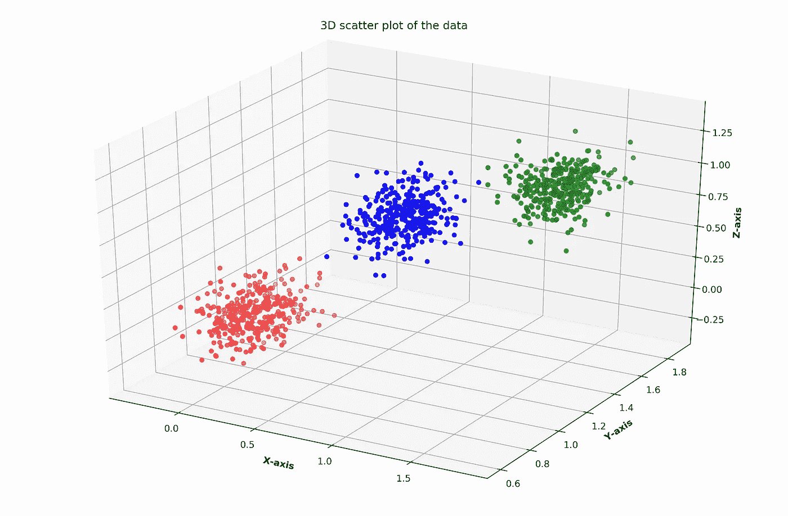
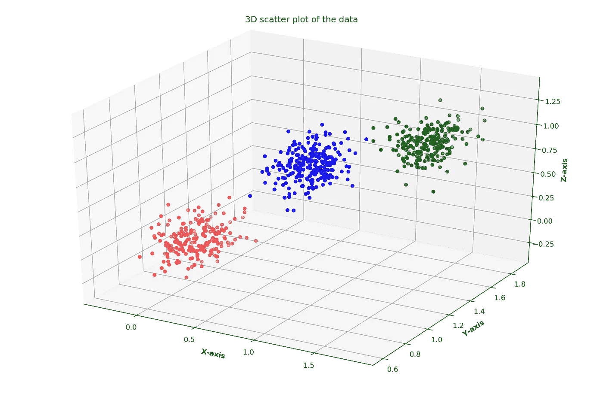
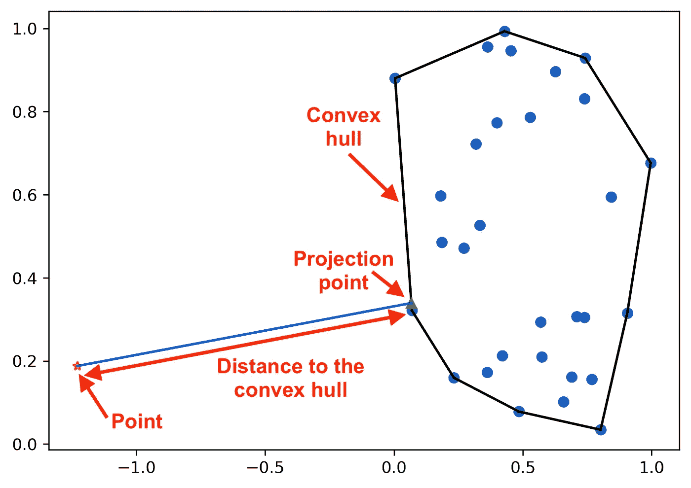
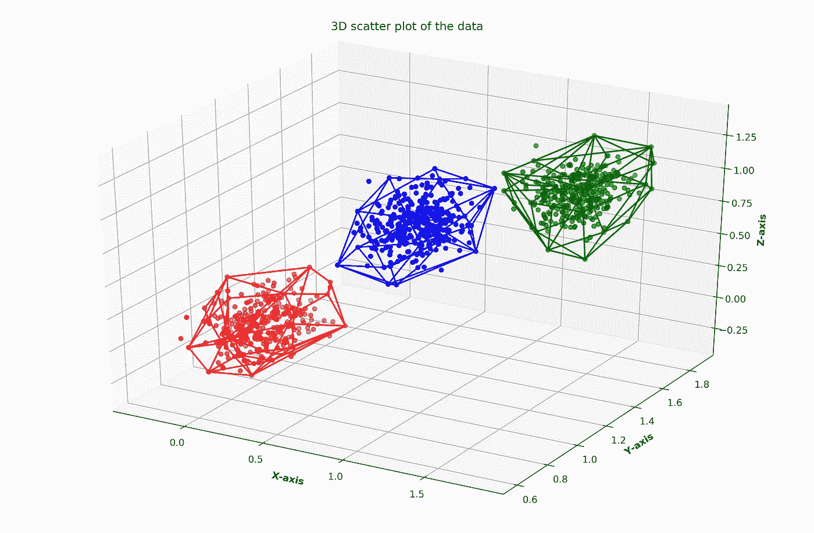

# 使用凸包的聚类

> 原文：<https://towardsdatascience.com/clustering-using-convex-hulls-fddafeaa963c?source=collection_archive---------17----------------------->

## 如何在数据聚类中使用凸包

最近在[模式识别快报](https://www.sciencedirect.com/science/journal/01678655)偶然看到哈坎·切维卡普的文章《利用局部仿射/凸包 进行高维数据聚类》。提出了一种利用局部仿射/凸包对高维数据进行聚类的新算法。他们使用凸包进行聚类的方法启发了我。我想尝试使用凸包实现我自己的简单聚类方法。因此，在本文中，我将向您介绍我使用凸包实现聚类方法的过程。在我们进入编码之前，让我们看看什么是凸包。

# 凸包

根据[维基百科](https://en.wikipedia.org/wiki/Convex_hull)，凸包定义如下。

> 在几何学中，一个形状的凸包或凸包络或凸闭包是包含它的最小凸集。


图一。一组钉子的凸包(图片由作者提供)

让我们考虑一个简单类比的例子。如图 1 所示，假设有几个钉子被钉在木板的中间。你拿一根橡皮筋，把它拉长包住钉子，然后放开它。它将适合最外面的指甲(显示为蓝色)，并采取最小化其长度的形状。被橡皮筋围起来的区域叫做这组钉子的**凸包**。

这个二维空间中的凸包(如图 1 所示)将是一个*凸多边形*，其所有内角都小于 180°。如果是在 3 维或者更高维的空间，那么凸包会是一个*多面体*。

有几种算法可以确定给定点集的凸包。一些著名的算法是[礼品包装算法](https://en.wikipedia.org/wiki/Gift_wrapping_algorithm)和[格雷厄姆扫描算法](https://en.wikipedia.org/wiki/Graham_scan)。

由于凸包包围了一组点，所以它可以充当聚类边界，允许我们确定聚类中的点。因此，我们可以利用凸包和执行聚类。让我们进入代码。

# 简单的例子

在这个例子中，我将使用 Python。在开始之前，我们需要以下 Python 库。

```
sklearn
numpy
matplotlib
mpl_toolkits
itertools
scipy
quadprog
```

## 资料组

为了创建我们的样本数据集，我将使用 **sci-kit learn** 库的 **make blobs** 函数。我将制作 3 个集群。

```
import numpy as np
from sklearn.datasets import make_blobscenters = [[0, 1, 0], [1.5, 1.5, 1], [1, 1, 1]]
stds = [0.13, 0.12, 0.12]X, labels_true = make_blobs(n_samples=1000, centers=centers, cluster_std=stds, random_state=0)
point_indices = np.arange(1000)
```

由于这是一个三维点数据集，我将绘制一个 3D 图来显示我们的地面真实集群。图 2 显示了带有彩色聚类的数据集的散点图。

```
import matplotlib.pyplot as plt
from mpl_toolkits.mplot3d import Axes3Dx = X[:,0]
y = X[:,1] 
z = X[:,2]

# Creating figure 
fig = plt.figure(figsize = (15, 10)) 
ax = plt.axes(projection ="3d") 

# Add gridlines  
ax.grid(b = True, color ='grey',  
        linestyle ='-.', linewidth = 0.3,  
        alpha = 0.2)  

mycolours = ["red", "green", "blue"]# Creating color map 
col = [mycolours[i] for i in labels_true]# Creating plot 
sctt = ax.scatter3D(x, y, z, c = col, marker ='o')plt.title("3D scatter plot of the data\n") 
ax.set_xlabel('X-axis', fontweight ='bold')  
ax.set_ylabel('Y-axis', fontweight ='bold')  
ax.set_zlabel('Z-axis', fontweight ='bold')

# show plot 
plt.draw()
```



图二。数据集的初始散点图(图片由作者提供)

## 获得初始聚类

首先，我们需要将数据集分成两部分。一部分将被用作种子，以使用 K-means 获得初始聚类。另一部分中的点将被分配给基于初始聚类的聚类。

```
from sklearn.model_selection import train_test_splitX_seeds, X_rest, y_seeds, y_rest, id_seeds, id_rest = train_test_split(X, labels_true, point_indices, test_size=0.33, random_state=42)
```

现在，我们对种子点执行 K 均值聚类。

```
from sklearn.cluster import KMeanskmeans = KMeans(n_clusters=3, random_state=9).fit(X_seeds)
initial_result = kmeans.labels_
```

由于生成的标签可能与地面真实标签不同，我们必须映射这两组标签。为此，我们可以使用下面的函数。

```
from itertools import permutations# Source: [https://stackoverflow.com/questions/11683785/how-can-i-match-up-cluster-labels-to-my-ground-truth-labels-in-matlab](https://stackoverflow.com/questions/11683785/how-can-i-match-up-cluster-labels-to-my-ground-truth-labels-in-matlab)def remap_labels(pred_labels, true_labels): pred_labels, true_labels = np.array(pred_labels), np.array(true_labels)
    assert pred_labels.ndim == 1 == true_labels.ndim
    assert len(pred_labels) == len(true_labels)
    cluster_names = np.unique(pred_labels)
    accuracy = 0 perms = np.array(list(permutations(np.unique(true_labels)))) remapped_labels = true_labels for perm in perms: flipped_labels = np.zeros(len(true_labels))
        for label_index, label in enumerate(cluster_names):
            flipped_labels[pred_labels == label] = perm[label_index] testAcc = np.sum(flipped_labels == true_labels) / len(true_labels) if testAcc > accuracy:
            accuracy = testAcc
            remapped_labels = flipped_labels return accuracy, remapped_labels
```

我们可以从上面的函数中得到精度和映射的初始标签。

```
intial_accuracy, remapped_initial_result = remap_labels(initial_result, y_seeds)
```

图 3 表示种子点的初始聚类。



图三。使用 K-means 对种子点进行初始聚类(图片由作者提供)

## 得到初始聚类的凸包

一旦我们获得了初始聚类，我们就可以得到每个聚类的凸包。首先，我们必须获得聚类中每个数据点的索引。

```
# Get the idices of the data points belonging to each cluster
indices = {}for i in range(len(id_seeds)):
    if int(remapped_initial_result[i]) not in indices:
        indices[int(remapped_initial_result[i])] = [i]
    else:
        indices[int(remapped_initial_result[i])].append(i)
```

现在我们可以从每个集群中获得凸包。

```
from scipy.spatial import ConvexHull# Get convex hulls for each cluster
hulls = {}for i in indices:
    hull = ConvexHull(X_seeds[indices[i]])
    hulls[i] = hull
```

图 4 表示代表 3 个聚类中的每一个的凸包。


图 4。每个聚类的凸包(图片由作者提供)

## 将剩余的点分配给最近的凸包簇

现在我们有了初始聚类的凸包，我们可以将剩余的点分配给最近的凸包的聚类。首先，我们必须将数据点投影到一个凸包上。为此，我们可以使用下面的函数。

```
from quadprog import solve_qp# Source: [https://stackoverflow.com/questions/42248202/find-the-projection-of-a-point-on-the-convex-hull-with-scipy](https://stackoverflow.com/questions/42248202/find-the-projection-of-a-point-on-the-convex-hull-with-scipy)def proj2hull(z, equations): G = np.eye(len(z), dtype=float)
    a = np.array(z, dtype=float)
    C = np.array(-equations[:, :-1], dtype=float)
    b = np.array(equations[:, -1], dtype=float) x, f, xu, itr, lag, act = solve_qp(G, a, C.T, b, meq=0, factorized=True) return x
```

寻找凸壳上的点的投影的问题可以使用二次规划来解决。上述功能利用了`quadprog`模块。您可以使用`[conda](https://anaconda.org/omnia/quadprog)`或`[pip](https://pypi.org/project/quadprog/)`安装`quadprog`模块。

```
conda install -c omnia quadprog
OR
pip install quadprog
```

关于如何用二次规划解决这个问题，我就不赘述了。如果你有兴趣，你可以阅读更多来自[这里](https://stackoverflow.com/questions/42248202/find-the-projection-of-a-point-on-the-convex-hull-with-scipy)和[这里](https://math.stackexchange.com/questions/2146961/find-a-point-on-the-convex-hull-of-a-given-set-of-points-which-is-closest-to-a-g/2153051#2153051)。



图五。从一个点到它在凸包上的投影的距离(图片由作者提供)

一旦获得了凸包上的投影，就可以计算从该点到凸包的距离，如图 5 所示。基于这个距离，现在让我们将剩余的数据点分配给最近的凸包的簇。

我将考虑从数据点到它在凸包上的投影的欧几里德距离。那么该数据点将被分配到具有距离该数据点最短距离的凸包的聚类中。如果一个点位于凸包内，那么距离将为 0。

```
prediction = []for z1 in X_rest: min_cluster_distance = 100000
    min_distance_point = ""
    min_cluster_distance_hull = ""

    for i in indices: p = proj2hull(z1, hulls[i].equations) dist = np.linalg.norm(z1-p) if dist < min_cluster_distance: min_cluster_distance = dist
            min_distance_point = p
            min_cluster_distance_hull = i prediction.append(min_cluster_distance_hull)prediction = np.array(prediction)
```

图 6 显示了最终的聚类结果。



图六。凸包的最终结果(图片由作者提供)

## 评估最终结果

让我们评估一下我们的结果，看看它有多准确。

```
from sklearn.metrics import accuracy_scoreY_pred = np.concatenate((remapped_initial_result, prediction))
Y_real = np.concatenate((y_seeds, y_rest))
print(accuracy_score(Y_real, Y_pred))
```

我得到了 1.0 (100%)的准确率！棒极了，激动人心，对吧？😊

如果想了解更多关于评估聚类结果的内容，可以查看我之前的文章[评估聚类结果](/evaluating-clustering-results-f13552ee7603)。

[](/evaluating-clustering-results-f13552ee7603) [## 评估聚类结果

### 用于评估聚类结果的标准

towardsdatascience.com](/evaluating-clustering-results-f13552ee7603) 

我使用了一个非常简单的数据集。您可以在更复杂的数据集上尝试这种方法，看看会发生什么。

## 高维数据

我还尝试使用我的聚类外壳方法对一个具有 8 维数据点的数据集进行聚类。你可以找到显示代码和结果的 [jupyter 笔记本](https://gist.github.com/Vini2/0dc28a1d8b7d78cf30b3d633cd62c271)。最终结果如下。

```
Accuracy of K-means method: 0.866
Accuracy of Convex Hull method: 0.867
```

我的凸包方法相对于 K-means 有一点改进。

# 最后的想法

HakanCevikalp 的题为 [**通过使用局部仿射/凸包**](https://doi.org/10.1016/j.patrec.2019.10.007) 进行高维数据聚类的文章表明，他们提出的基于凸包的方法避免了“*孔洞伪影*”问题(高维空间中的稀疏和不规则分布会使最近邻距离不可靠)，并且与其他最先进的子空间聚类方法相比，提高了高维数据集的准确性。

[](https://www.sciencedirect.com/science/article/pii/S0167865519302806?via%3Dihub) [## 利用局部仿射/凸包的高维数据聚类

### 我们提出了一种新的算法，使用局部仿射/凸包的高维数据聚类。*建议的…

www.sciencedirect.com](https://www.sciencedirect.com/science/article/pii/S0167865519302806?via%3Dihub) 

您可以找到包含本文所用代码的 [jupyter 笔记本](https://gist.github.com/Vini2/2d35132f70ee18298fdea142b5530a52)。

希望这篇文章是有趣和有用的。

干杯！😃