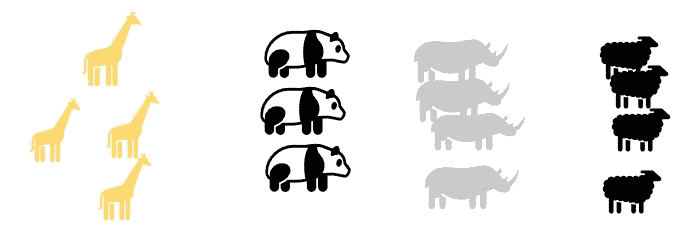
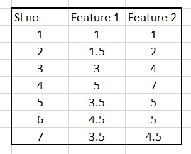
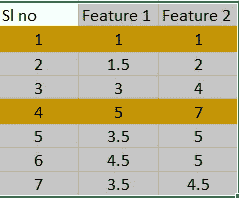
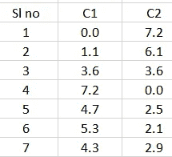
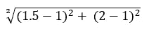
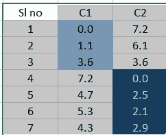
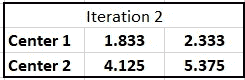
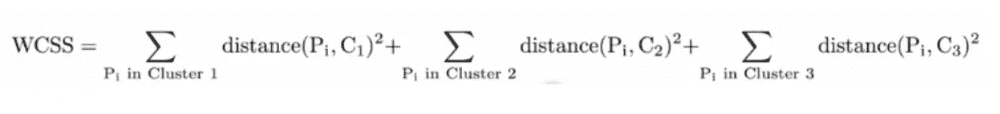
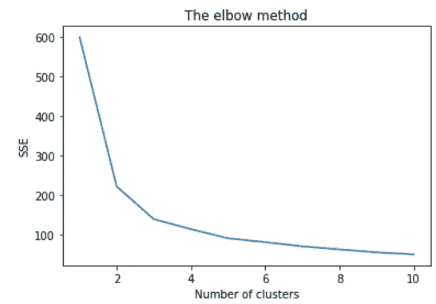

# 基于 k-Means 的聚类算法及其实现

> 原文：<https://towardsdatascience.com/clustering-using-k-means-with-implementation-40988620a973?source=collection_archive---------42----------------------->

## 我们周围的物体来自自然群体


图片来源:[https://unsplash.com/@nauleyco](https://unsplash.com/@nauleyco)

C 聚类是一种在数据中寻找自然群体的技术。



图 1:成群的动物(来源:作者)

如果我们给一个孩子看上面的图片，他可以识别出有四种动物。他可能不知道他们所有人的名字，但他仍然可以识别出有四种不同的类型，他可以独立完成这项工作，不需要成年人的帮助。**由于我们不需要一个成年人来监督，聚类是一种无人监督的技术**。

# 集群的主要动机是什么？

这三个动机可以列举如下。

**底层结构:**我们可以理解有不同的组，组内的差异较小，组间的差异较小。

**自然分类:**我们知道动物有四种不同的类型或类群。

**总结**:如果我们现在为它们的住所或食物想出一些策略，我不需要为所有的动物考虑，因为一只羊的食物需求与熊猫、长颈鹿或 Rhyno 不同，但与另一只羊没有太大的不同。当任何公司试图提出一个客户群特定的策略时，这可能是非常重要的。

k-means 可以说是最流行的算法，它将对象分成 k 个组。这有许多应用，因为我们想在数据中找到结构。我们希望将学生、客户、患者、产品、电影、推文、图像等等分组。

现在让我们看看它是如何工作的。

# k-means 如何工作

输入:将给出数据和“k”的值



数据:输入到 K- Means(图片:作者)

步骤 1:从数据中初始化随机的“k”个点作为聚类中心，让我们假设 k 的值是 2，选择第 1 和第 4 个观察值作为中心。



随机选择的 K (2)点(来源:作者)

步骤 2:对于所有的点，找出距离 k 个聚类中心的距离。可以使用欧几里德距离。下表用作说明。C1 和 C2 列分别表示离中心的距离。



距质心的距离计算(来源:作者)

如果对于第二次观测，我们想要确定距质心 1 的距离，计算将如下所示



欧几里德距离的例子(来源:作者)

*   请注意，第一个点距中心 1 的距离为 0，第四个点距第二个聚类的距离为 0。原因很简单，这些点被选为质心
*   同样对于第三次观察，两个中心的距离是相同的。

步骤 3:将每个点分配给它最近的聚类中心，然后使用算术方法再次计算聚类中心



分配给最近中心的点(来源:作者)

对于前两个点，它们被分配给聚类 1，第三个点被随机分配，最后四个点被分配给聚类 2。



集群中心(来源:作者)

重复步骤 2 和步骤 3，直到收敛

*   每次迭代之间聚类中心没有变化
*   集群分配的变化非常小

> 本质上，我们试图找到 k 个最佳代表点。这些是通过取平均值来选择的。因此，我们试图迭代地找到 k 个最佳代表点。因此得名 k-means。

# k-means 中的一些问题是什么，如何绕过它们？

k-means 的一些问题是

*   由于第一步是随机初始化，这关系到聚类的质量(其中一些可以通过 k-means ++来解决，k-means ++递增地选择随机点，确保下一个点仅在远离所选点时被选择)
*   拾取圆形的圆(可以在一定程度上使用距离度量)
*   受到异常值的影响(可以删除异常值，然后应用聚类)
*   k 的值需要由用户给定(讨论了找到相同值的方法)

# 如何求 k 的最优值



WCSS 在平方和聚类内(来源:作者)

好的聚类是那些点靠近中心的聚类。怎样才能找到亲近？我们可以找到该簇中所有点离簇中心的欧几里德距离。现在我们需要将此扩展到所有集群。这种想法用上面的等式表示，称为平方的组内和。理想情况下，我们希望它很小。极端的情况是，我们可以对每个点有一个聚类，结果 WCSS 为 0。事实证明，随着 k 的增加，WCSS 继续减小。从技术上讲，这被称为单调递减。

我们想停下来，当我们在 y 轴上画 WCSS，在 x 轴上画星团数量的时候，有一个最陡的下降或形成一种肘形。

# 如何应用 k-means

标准化:所有基于距离的算法都需要对数据进行标准化，这样就不会因为值的范围更大而使某个属性变得过于重要。下面给出了代码片段。

```
# Importing the Standard Scaler
from sklearn.preprocessing import StandardScaler 
#Intializing the Stnadard Scaler
scaler = StandardScaler().fit(df) 
#Standardizing the data
df_scaled = scaler.transform(df)
```

集群:下面给出了代码片段

```
#Imporing the Library
from sklearn.cluster import KMeans
# Intialization
kmeans = KMeans(n_clusters = 3, init = 'random', max_iter = 300, n_init = 10, random_state = 0) 
#Applying Clustering
y_kmeans = kmeans.fit_predict(df_scaled)
```

一些重要参数:

*   n_clusters:簇的数量或 k
*   init: Random 或 kmeans++(我们已经讨论过 kmeans++如何提供更好的初始化)
*   n_init:算法是用这些不同的初始 k 点随机选择来运行的。最好的还回来了。
*   最大迭代次数:算法将运行多少次迭代
*   tol:代表公差，也用于终止标准。这是一个有趣的概念。如果从一次迭代到另一次迭代，中心的变化很小，那么我们就趋向于收敛。中心是矩阵，我们可以通过检查元素间的欧几里德距离来找出两个矩阵之间的接近度。这被称为弗罗贝纽斯范数。

确定“k”的值

下面给出了代码片段。

```
# Applying k-means for diffrent value of k and storing the WCSS
from sklearn.cluster import KMeans
wcss = []
for i in range(1, 11):
    kmeans = KMeans(n_clusters = i, init = 'random', max_iter = 300, n_init = 10, random_state = 0)
    kmeans.fit(x_scaled)
    wcss.append(kmeans.inertia_)
```

用于绘制聚类数

```
plt.plot(range(1, 11), wcss)
plt.title('The elbow method')
plt.xlabel('Number of clusters')
plt.ylabel('SSE')      #within cluster sum of squares
plt.show()
```



图 2:通过肘图得出的聚类数(来源:作者)

*   你可以在这里查看我们的完整实现。
*   你也可以在这里看一个关于集群[的视频教程](https://www.youtube.com/watch?v=FFhmNy0W4tE)

**结论**:

k-means 因其简单、易于实现而一直存在。在任何调查中，它都很容易出现在 ML 的前 10 个算法中。有缺点，也有办法使 k-means 稳健。

参考:

[1][https://towardsdatascience . com/k-means-clustering-13430 ff 3461d](/k-means-clustering-13430ff3461d)