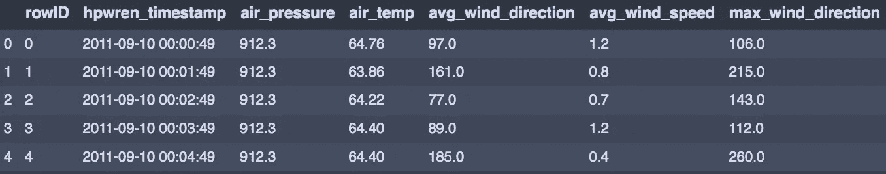
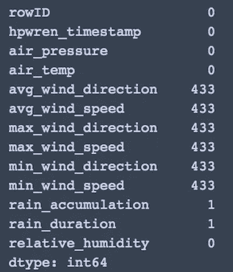
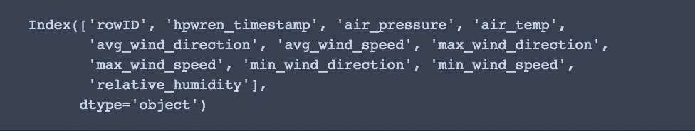
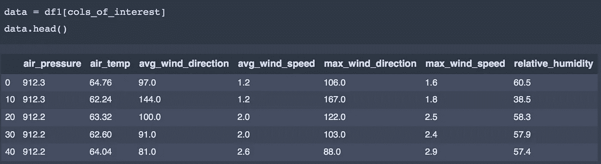
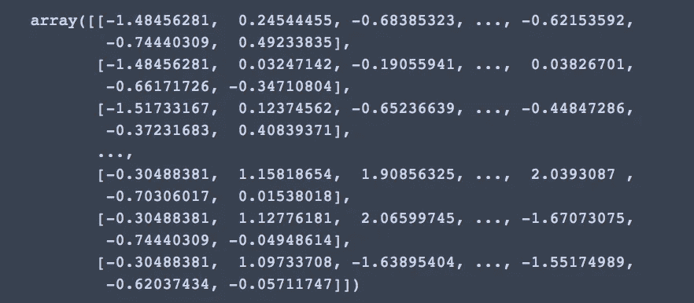
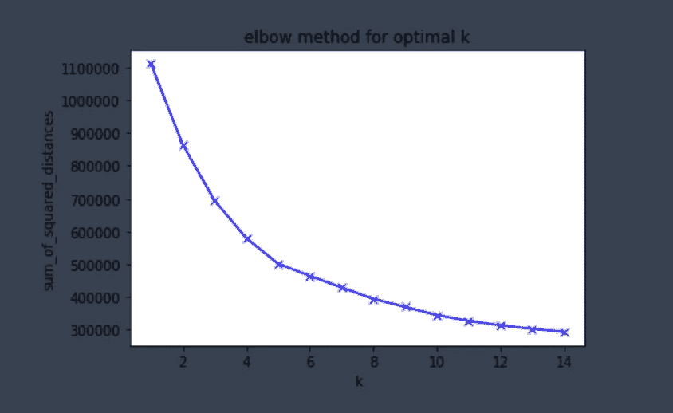
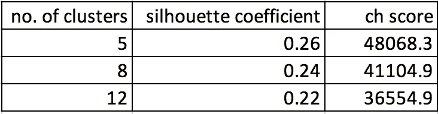
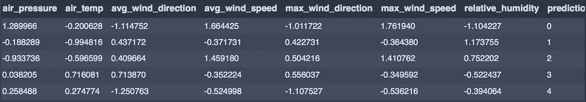

# K-均值聚类

> 原文：<https://towardsdatascience.com/clustering-with-k-means-1e07a8bfb7ca?source=collection_archive---------3----------------------->

## *使用无监督的机器学习在天气数据中寻找模式*


图片来源:[unsplash-logoNicole Wilcox](https://unsplash.com/@nicolerwilcox?utm_medium=referral&utm_campaign=photographer-credit&utm_content=creditBadge)

无监督学习最常用的技术之一是聚类。顾名思义，聚类是对具有相似特征的数据进行分组的行为。在机器学习中，当没有预先指定的数据标签可用时，即我们不知道要创建哪种分组时，会使用聚类。目标是将数据分组到相似的类中，以便:

*类内相似度高*

*类间相似度低*

有两种主要的聚类类型— **K 均值聚类**和**层次凝聚聚类**。在 *K 均值聚类*的情况下，我们试图找到 *k* 聚类中心作为属于这些聚类的数据点的均值。这里，预先指定了聚类的数量，并且该模型旨在为任何给定的聚类*，K*找到最优的聚类数量。

我们使用的是来自 Kaggle 的[分钟天气数据集](https://www.kaggle.com/julianjose/minute-weather)，其中包含与天气相关的测量值，如气压、最大风速、相对湿度等。这些数据是从 2011 年 9 月到 2014 年 9 月的三年时间里在圣地亚哥采集的，包含以一分钟为间隔采集的原始传感器测量值。

第一步是导入必要的库…

```
import pandas as pd
import numpy as np
import matplotlib.pyplot as plt
%matplotlib inline
import seaborn as sns
import sklearn
from sklearn.preprocessing import StandardScaler
from sklearn.cluster import KMeans
from sklearn import metrics
from sklearn.cluster import AgglomerativeClustering
```

…和数据集

```
df = pd.read_csv('minute_weather.csv')
df.head()
```



浏览我们的数据，我们发现有 1，587，257 行和 13 列！由于这个数据集非常大，我们需要随机抽取样本。此外，对于 K-means 方法，首先找到初始质心的位置是必要的，以便该算法可以找到收敛性。为了做到这一点，我们不使用整个数据集，而是起草一个样本，对随机初始化的质心进行短期运行，并跟踪度量的改进。这里给出了这种方法的一个很好的解释。

从每第 10 行抽取一个样本，我们创建一个新的样本数据帧

```
sample_df = df[(df['rowID'] % 10) == 0]
sample_df.shape
```

这产生了 158726 行和 13 列(好得多！)

检查空值，我们发现 rain_accumulation 和 rain_duration 可以被删除



```
df1 = sample_df.drop(columns =['rain_accumulation','rain_duration'])
print(df1.columns)
```



在最大风速/风向和最小风速/风向这两个值之间，出于聚类的目的，我只选择了最大值，因为我们已经有了这两个值的平均值。如果愿意，最小值也可以包括在分析中。最后，我们对聚类感兴趣的列可以排序到一个新的数据框架中，如下所示

```
cols_of_interest = ['air_pressure', 'air_temp', 'avg_wind_direction', 'avg_wind_speed','max_wind_direction',
                    'max_wind_speed', 'relative_humidity']
```



下一步是衡量我们的价值观，给予它们同等的重要性。从聚类的角度来看，缩放也很重要，因为点之间的距离会影响聚类的形成方式。

使用 StandardScaler，我们将数据帧转换成以下 numpy 数组

```
X = StandardScaler().fit_transform(data)
X
```



**K-均值聚类**

如前所述，在 K-means 的情况下，在运行模型之前已经指定了聚类的数量。我们可以为 K 选择一个基准水平数，并迭代找到最佳值。为了评估哪个数量的聚类更适合我们的数据集，或者找到*聚类适合度*，我们使用两种评分方法— **剪影系数**和 **Calinski Harabasz 评分。**实际上，根据模型中最重要的指标，有许多不同的评分方法。通常选择一种方法作为标准，但是为了这个分析的目的，我使用了两种方法。

使用每个样本的**平均聚类内距离(a)** 和**平均最近聚类距离(b)** 计算轮廓系数。样本的轮廓系数为 **(b-a) / max(b-a)**

Calinski Harabasz 得分或方差比率是**类内离差**和**类间离差**之间的比率

让我们使用 sci-kit learn 实现 K-means 算法。

n 个簇= 12

```
*#Set number of clusters at initialisation time*k_means = KMeans(n_clusters=12)*#Run the clustering algorithm*model = k_means.fit(X)
model#Generate cluster predictions and store in y_haty_hat = k_means.predict(X)
```

计算轮廓系数…

```
from sklearn import metrics
labels = k_means.labels_metrics.silhouette_score(X, labels, metric = 'euclidean')
```

0.2405

…以及 CH 分数

```
metrics.calinski_harabasz_score(X, labels)
```

39078.93

让我们尝试另一个随机选择的值，即 n_clusters = 8

```
k_means_8 = KMeans(n_clusters=8)
model = k_means_8.fit(X)
y_hat_8 = k_means_8.predict(X)
```

再次计算轮廓系数和 CV 值

```
labels_8 = k_means_8.labels_
metrics.silhouette_score(X, labels_8, metric = 'euclidean')
```

轮廓系数= 0.244

```
metrics.calinski_harabasz_score(X, labels_8)
```

CV 值= 41105.01

我们可以看到，对于这两种类型的分数，8 个聚类给出了更好的值。然而，我们必须对不同数量的集群进行多次迭代，才能找到最优的集群。相反，我们可以使用一个叫做**肘图**的东西来找到这个最佳值。

> 肘形图显示了 k 值为多少时，一个聚类的平均值与该聚类中的其他数据点之间的距离最小。

这里有两个值很重要— *失真*和*惯性*。失真是离各个聚类的质心的欧几里德平方距离的平均值。惯性是样本到它们最近的聚类中心的平方距离之和。

```
*#for each value of k, we can initialise k_means and use inertia to identify the sum of squared distances of samples to the nearest cluster centre*sum_of_squared_distances = []
K = range(1,15)
for k in K:
    k_means = KMeans(n_clusters=k)
    model = k_means.fit(X)
    sum_of_squared_distances.append(k_means.inertia_)
```

请记住，我们关心 K-means 中的类内相似性，这是肘图有助于捕捉的。

```
plt.plot(K, sum_of_squared_distances, 'bx-')
plt.xlabel('k')
plt.ylabel('sum_of_squared_distances')
plt.title('elbow method for optimal k')
plt.show()
```



这里我们可以看到，距离平方和的下降在 k=5 之后开始放缓。因此，5 是我们分析的最佳聚类数。

我们可以通过计算 k=5 时的轮廓系数和 CH 值来验证这一点。

```
k_means_5 = KMeans(n_clusters=5)
model = k_means_5.fit(X)
y_hat_5 = k_means_5.predict(X)labels_5 = k_means_5.labels_
metrics.silhouette_score(X, labels_5, metric = 'euclidean')metrics.calinski_harabasz_score(X, labels_5)
```

轮廓系数= 0.261

CV 值= 48068.32



这两个值都高于我们之前的星团 12 和 8。我们可以得出结论，k=5 是我们的最佳聚类数。

最后，我们可以看到每个集群中包含的值。使用[这个](https://www.kaggle.com/prakharrathi25/weather-data-clustering-using-k-means/notebook)函数，我创建了一个效用图。

```
*#function that creates a dataframe with a column for cluster number*def pd_centers(cols_of_interest, centers):
        colNames = list(cols_of_interest)
        colNames.append('prediction')# Zip with a column called 'prediction' (index)
        Z = [np.append(A, index) for index, A in enumerate(centers)]# Convert to pandas data frame for plotting
        P = pd.DataFrame(Z, columns=colNames)
        P['prediction'] = P['prediction'].astype(int)
        return PP = pd_centers(cols_of_interest, centers)
P
```



如需进一步阅读:

1.  [https://sci kit-learn . org/stable/modules/generated/sk learn . cluster . k means . html](https://scikit-learn.org/stable/modules/generated/sklearn.cluster.KMeans.html)
2.  [https://www . ka ggle . com/prakharrathi 25/weather-data-clustering-using-k-means/notebook](https://www.kaggle.com/prakharrathi25/weather-data-clustering-using-k-means/notebook)
3.  [https://www . datascience central . com/profiles/blogs/python-implementing-a-k-means-algorithm-with-sk learn](https://www.datasciencecentral.com/profiles/blogs/python-implementing-a-k-means-algorithm-with-sklearn)
4.  [https://blog . Cambridge spark . com/how-to-determine-the-optimal-number-of-k-means-clustering-14f 27070048 f](https://blog.cambridgespark.com/how-to-determine-the-optimal-number-of-clusters-for-k-means-clustering-14f27070048f)