# 具有两个以上特征的聚类？尝试用这个来解释你的发现

> 原文：<https://towardsdatascience.com/clustering-with-more-than-two-features-try-this-to-explain-your-findings-b053007d680a?source=collection_archive---------1----------------------->

## 使用 Plotly 的 line_polar 将向我们展示一种令人兴奋的聚类解释方法。此外，我们将看到，算法只是可以从集群中获得的商业价值过程的一小部分。

Aditya Chinchure 在 [Unsplash](https://unsplash.com?utm_source=medium&utm_medium=referral) 上拍摄的照片

# 我们的案子

*想象一下，你在一家主要销售男装的新电子商务公司获得了一份很棒的工作，担任数据科学团队的负责人。你注意到，在面试过程中，问题主要集中在聚类上，现在你知道为什么了:公司的首席执行官迫使营销部门精心策划针对最具代表性群体的活动。营销团队知道你是最适合帮助他们的人！所以他们开了一个会议来解决这个问题，在简单介绍了情况后，他们很快就谈到了重点。“当我们了解我们试图接触的人群时，我们是定义合适活动的专家，但我们需要首先通过描述他们的行为来确定最具代表性的客户群。此外，我们知道这 6 个特征——它们向您展示了 csv 文件——最能描述我们的客户，您能帮助我们吗？”。*

你觉得在你的幸运日，一个项目，由首席执行官推动，很容易符合标准集群的例子！看起来像是速战速决！但是有两件事困扰着你，那就是“描述他们的行为”和“6 个特征”这两句话一直在你的脑海中回响，这两句话的组合在追捕你。你能解决这个问题吗？。

# 动机

那么，我为什么要写这个呢？因为我对所有机器学习应用的商业用例充满热情，在这个特定的主题中，我已经看到了降维方面良好的直觉和可解释性。尽管如此，这些技术并不意味着解释每个群体的特征。

> 尽管我们将训练一个模型，但这不会是解释数学和讨论更好的误差测量的标准文章。这里的重点是思考集群的业务用例！

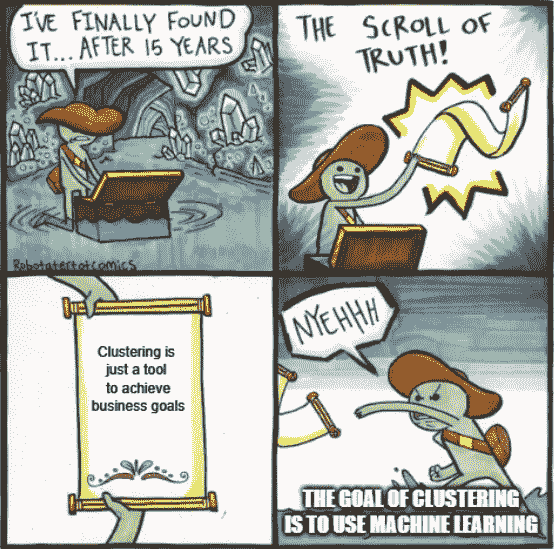

来自[https://imgflip.com/memegenerator](https://imgflip.com/memegenerator)

重要的是要认识到集群只是实现确定的业务目标的一种工具。问题不在于创建最好的集群(尽管这很有帮助)，或者仅仅是使用机器学习。在我们的案例中，问题在于我们想了解谁是我们的客户。

对我们客户的理解可能会有很大的影响，甚至对我们公司的战略也有影响，但是今天，让我们将这一点用于我们的目标案例。

# 一些基本概念

在上面的章节中，我假设您知道一些基本的概念，如果您不知道，我想向您展示我对它们的简短定义。如果你想深入了解，我将在下面嵌入一些资源([这里](/explaining-k-means-clustering-5298dc47bad6)这也是一个好的开始)。

如果你认识他们，就跳过这一节。

*   [**无监督学习**](https://www.mathworks.com/discovery/unsupervised-learning.html#:~:text=Unsupervised%20learning%20is%20a%20type,patterns%20or%20grouping%20in%20data.) : *是在没有目标向量的情况下，理解数据中模式的魔力。*
*   [**聚类**](https://en.wikipedia.org/wiki/Cluster_analysis#:~:text=Cluster%20analysis%20or%20clustering%20is,in%20other%20groups%20%28clusters%29.) : *是试图在一组对象(在我们的例子中是人)中定义组。目标是属于同一组的对象共享一些关键特征。*
*   [**K-Means**](https://en.wikipedia.org/wiki/K-means_clustering):*是一种迭代算法，其中每个观测值属于具有最近均值(质心)的聚类。*

把所有这些概念结合起来的力量，在识别甚至我们都不知道存在的群体时，会遭到诋毁。算法的工作是给实体分配一个标签，当所有实体都得到一个标签时，我们的工作就是让这些信息变得有价值。

# 我们的数据

我会马上向你们展示我们的数据集，因为我想很快展示一些关于它的东西。它是使用 Numpy 和熊猫创建的，但我不会透露构建过程，直到最后。你知道，了解我们的客户最激动人心的部分是一开始并不了解他们。我知道你不喜欢剧透！

正如我们所讨论的，这个数据集被认为是复制了一个电子商务，每一行都指向一个特定的客户。让我们从了解特征开始(这里是[回购](https://github.com/MauricioLetelier/E-commerce-Clustering))。

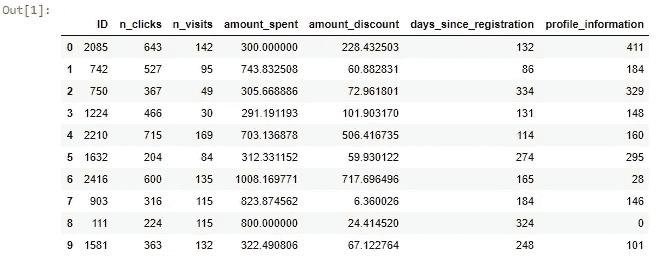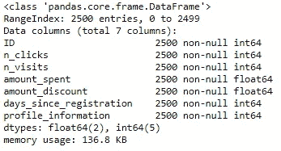

***ID:*** 客户的唯一标识符。

***n_clicks:*** 产品的总点击次数。

***n _ 访问量:*** 页面的总访问量。

***金额 _ 花费:*** 在产品上花费的美元总额。

***amount _ discount:***在打折产品上花费的美元总额(该值应小于或等于*amount _ spend)。*

***days _ since _ registration:***客户注册后经过的天数。

***profile _ information:***一个介于 0 和 100 之间的指标，衡量客户填写了多少个人资料信息。

太好了！现在我们觉得已经准备好开始我们被赋予的使命。Plotly 这是伟大的可视化！图表的简单性、美观性和专业性对于更好地理解我们的数据来说是完美的。px.scatter_matrix 方法可以让我们了解整个数据集。

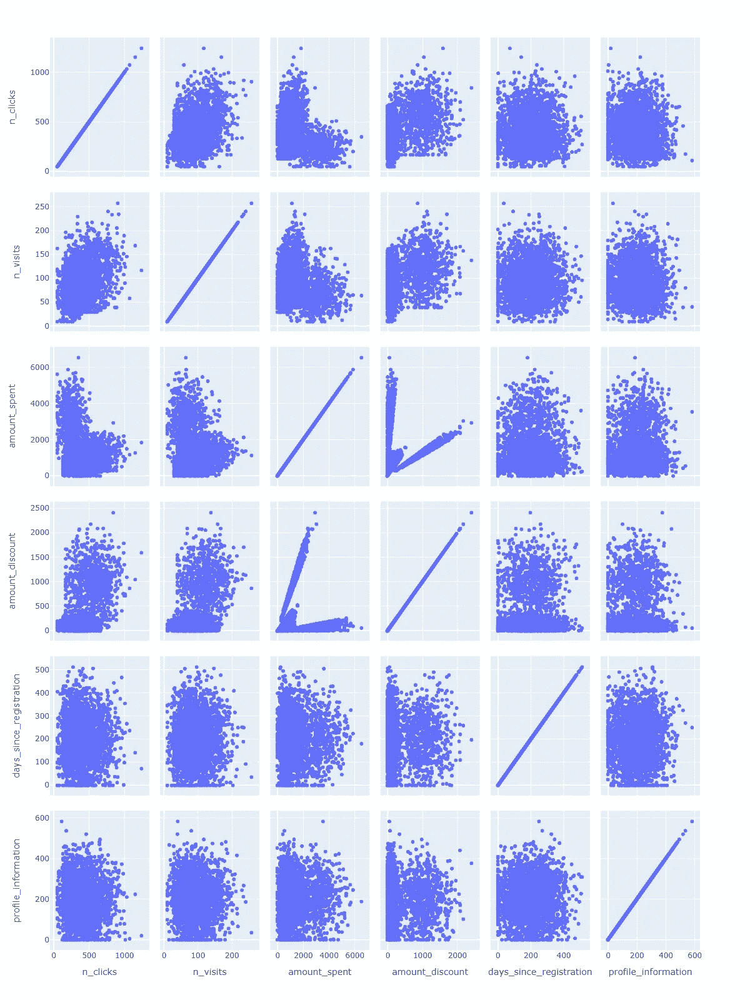

# 超过 3D？

如你所知，当有 2 个甚至 3 个特征时，很容易解释结果。这可能是因为我们的标准空间表示适合二维或三维图表，这对我们来说完全有意义。

当特征的数量超过我们三维思维的能力时，仍然有一些选择。我们可以定义图表中的颜色或大小等特征。例如，为了捕捉我们的 6 个特征中的 4 个，我将使用 Plotly express 向您展示一个示例。

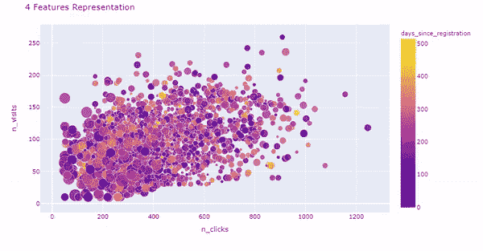

有意思！我们可以看到最大的圆圈在左下方。此外，我们可以注意到“n 次点击”和“n 次访问”之间的正相关关系对于“days_since_registration”功能，颜色似乎与任何东西都没有明显的关联。

你觉得四个特征是可以管理的吗？让我们试试五个！

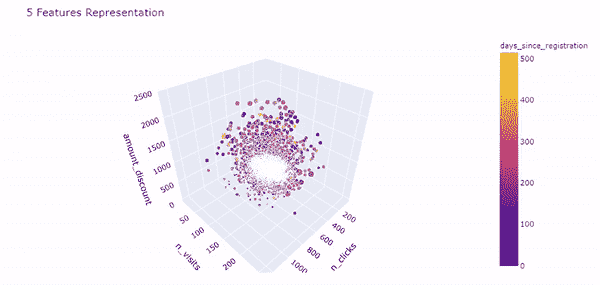

现在我们可以在下方的角落看到一个组，但是试图理解三维图加上颜色和大小信息有点让人不知所措。想象一下在创建集群之后的这个过程，由于标签(通常作为颜色添加)而增加了一个维度，我们可以肯定地知道这不是以正确的方式进行的。

这种使用多维方法进行探索性数据分析的非常规途径是为了向您展示这是可能的，但不建议遵循。很难扩展到六个以上的功能，更难理解实际发生的一切。

现在很清楚为什么拥有太多的特性是一个问题了。如果我们很难看到这些图表，想象一下向其他人展示这些图表有多难。我们该进入下一步了:聚类！

# 寻找我们的集群

因为找到最佳的集群数量或尽可能减少惯性不是今天最重要的部分，所以我将向您展示仅基于惯性和“肘规则”的集群数量的决定。

这个过程可以在很多方面进行改进，我不会在这里列出来，但你知道创建你的模型应该是一个更严格的过程，这很好。

如果你对惯性的细节感兴趣，请访问 Scikit-learn 的文档。

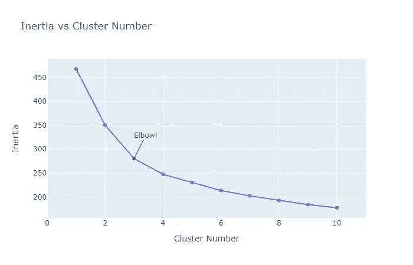

K-Means 是一种基于距离的算法。因此，规范化、标准化或选择任何其他选项，使距离对所有列具有某种可比较的意义，这是非常重要的。MinMaxScaler，对它来说是个极好的工具。

在缩放我们的数据集之后，我们可以在不同的聚类数上评估我们的惯性。如果我们看到图表，我们可以说肘部在 3 或 4 上。为了简单起见，我们将使用 3。

# 为什么不是 PCA 或 t-SNE？

我们将谈到我们刚刚发现的群体，但首先，描述一下向团队解释您的发现与其他领域的发现之间的一些差异是很重要的。

PCA 和 t-SNE 是减少数据集中要素数量的技术。这两种算法会有所帮助，因为我们可以在更少的维度上获得可视化，这将引导我们进行解释，以确定这些组是否确实被很好地分开。它在其他情况下也有帮助，在这个特殊的例子中，再次在 Scikit-learn 的文档中有很好的解释。

> “惯性不是一个标准化的指标:我们只知道值越低越好，零是最佳值。但是在非常高维的空间中，欧几里德距离往往会变得膨胀(这是所谓的“维数灾难”的一个实例)。在 k-means 聚类之前运行主成分分析(PCA)等降维算法可以缓解这个问题，并加快计算速度。”

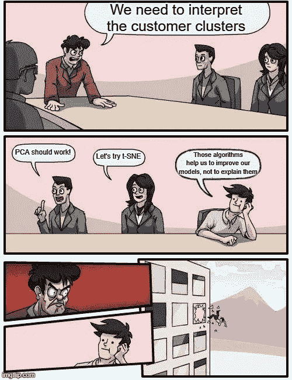

来自 https://imgflip.com/memegenerator[的](https://imgflip.com/memegenerator)

那么，为什么主成分分析和 SNE 霸王龙无法解释我们的发现呢？因为那些算法是给我们的！如果我们使用它们，我们可以改进我们模型的结果！他们创造的新变量不能直接与我们的原始特征相比。因此，尽管这可以帮助**我们，**但它无助于将你的发现传达给**他人。**

为了避免离题太远，我们不会将这些算法应用到我们的数据集，但我鼓励您尝试一下，看看集群会发生什么！

# 描述我们的客户

在这一部分，我们将最终以一种对组织中的每个人都容易的方式描述我们的发现。简单来说，我们可以通过客户的特征来了解他们，因为我们知道每个变量都是可变的。

Line_polar 非常适合这个任务，因为一个圆可以处理任意多的变量，而且里面的线条非常直观！

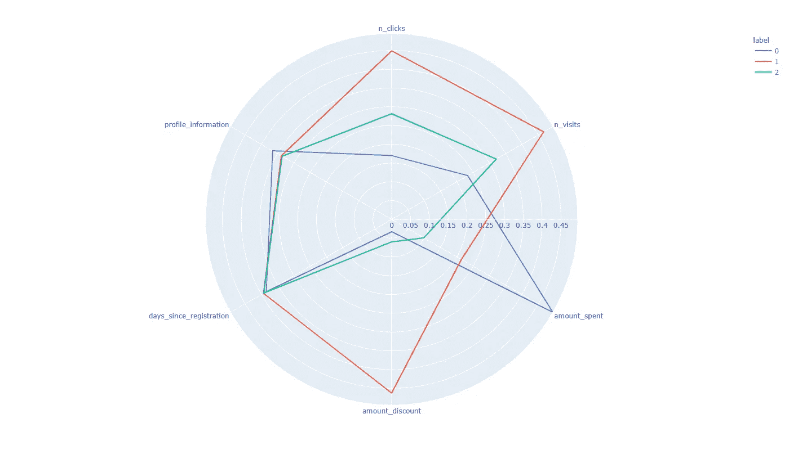

首先，重要的是要看到全局，了解真正使我们的客户与众不同的变量。很明显，每个组的“注册天数”和“个人资料信息”都是相似的。这意味着我们可以从分析中减去它们。

看看每组有多少人也很重要。

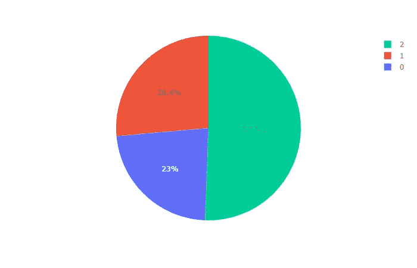

之后，了解我们的客户在每个变量上的行为是很重要的。例如，如果你看标签 0，你可以理解他们点击、访问和花费的折扣比其他组少得多，但他们是——到目前为止——购买最多的客户。

我将把其他顾客的描述留给你，因为我知道你已经明白了。不过，我们的工作还没有结束，除非你把这个交给你的营销同事。

# 营销会议

好了，现在您已经分享了结果，并且每个人都很好地理解了它，业务用例可以蓬勃发展了。

分析“挥金如土”的群集，营销团队可以说，对他们来说，一个好的策略是首先在他们的主页上推荐最赚钱的产品！他们似乎只花很少的时间来选择他们的产品，我们可以断言，这是因为他们真的很珍惜他们的时间。你可以用描述顾客主要特征的插图来支持你的新朋友(line_polar )!

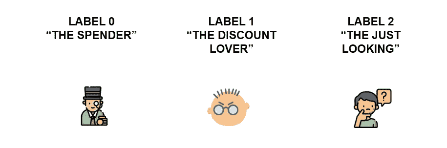

从[https://www.flaticon.com](https://www.flaticon.com/)。参考资料: [1](https://www.flaticon.com/free-icon/rich_3142069?term=rich&page=1&position=24) 、 [2](https://www.flaticon.com/free-icon/miserly_136255?term=miser&page=1&position=1) & [3](https://www.flaticon.com/free-icon/question_2353678?term=people&page=1&position=31)

此外，简化生产环境以避免项目停留在“重要信息”和 Excel 表格满天飞的状态也很重要！将这些信息流与你公司网站的推荐整合起来是很重要的。

如果你感兴趣，我可以用这些相同的图表制作一个简单的 Dash 应用程序的教程。这是一个将模型结果货币化并帮助产品采用的好工具。

还有更多的话要说，但现在，重要的是你必须考虑如何创建一个有利可图的活动，并尝试部署它。

# 一个好的数据魔术师总是会展示他的技巧

如果您仍然对数据是如何创建的感到好奇，我将与您分享创建每个集群的技巧。你可以有趣地发现，很多本应成为某种类型客户的客户，最终却出现在了另一个集群中！

我认为，做一些更好的功能工程和尝试其他算法可能会成功。如果你有更好的效果，就在评论里分享吧！

代码如下:

# **最终想法**

您可能已经注意到，这些组应该属于定义明确的特征。现实生活中会有很多嘈杂的数据，客户聚类可能会高很多。

此外，模型开发和客户的描述过于简单。平均值不是你应该关注的唯一指标。

不过今天就到这里吧！我希望这篇文章能对你有所帮助。回头见！

如果你喜欢，就在 [Medium](https://medium.com/@maletelier) 和 [Linkedin](http://www.linkedin.com/in/maletelier) 上关注我。如果你想给我写信，我最近在[推特](https://twitter.com/maletelier)上。我很乐意与你交谈！

如果你想多读一点，看看我最近的帖子:

 [## 交易的概率机器学习方法+ MACD 商业理解

### 在文章的最后，你会知道如何用概率的方式构造一个交易问题。此外，您将…

towardsdatascience.com](/probabilistic-machine-learning-approach-to-trading-macd-business-understanding-6b81f465aef6)  [## 优化…目标变量(？)交易机器学习模型的例子

### 我们的目标是静态的吗？

towardsdatascience.com](/optimizing-the-target-variable-an-example-for-trading-machine-learning-models-48a1587d7b9a)