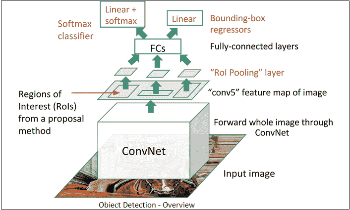
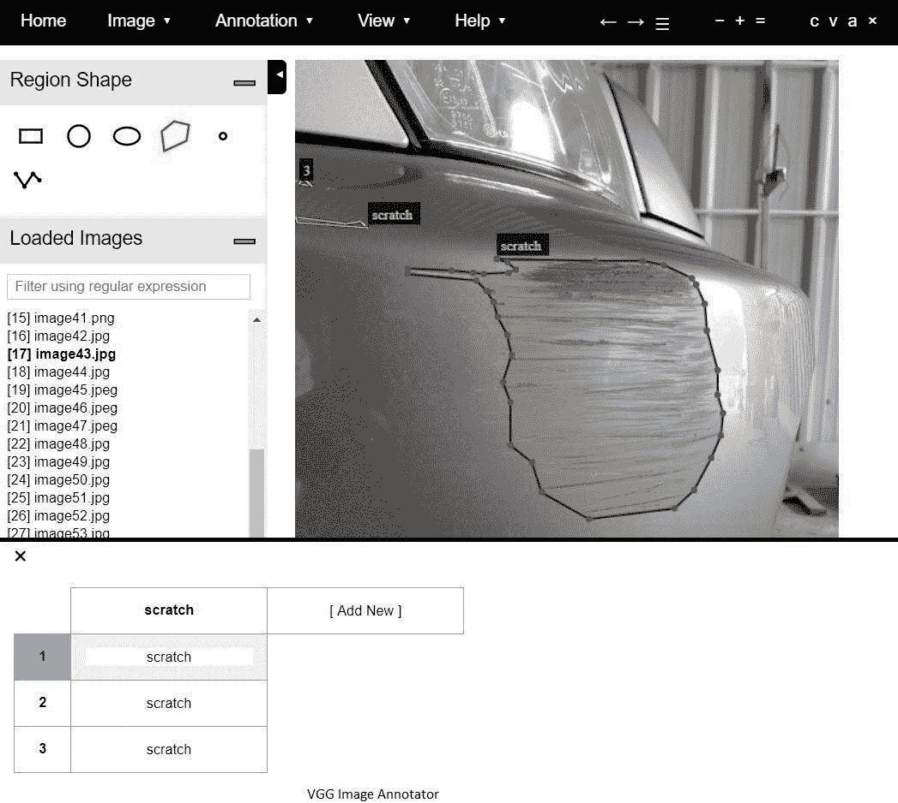
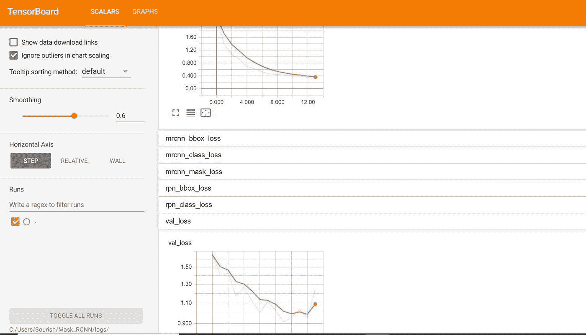
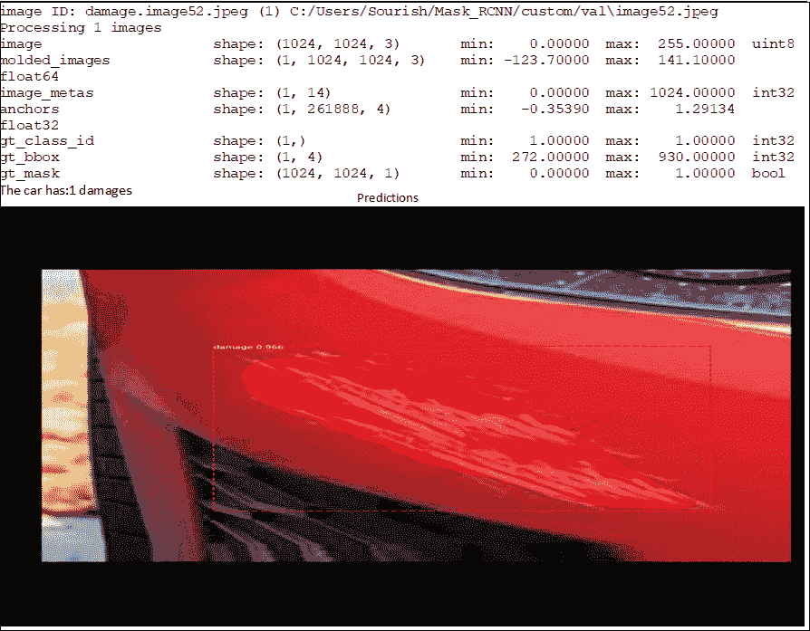

# CNN 应用程序-检测汽车外部损坏(完整的可实现代码)

> 原文：<https://towardsdatascience.com/cnn-application-detecting-car-exterior-damage-full-implementable-code-b28fca70b20f?source=collection_archive---------57----------------------->


检测汽车外部损坏

深度学习和计算基础设施(云、GPU 等)的最新进展。)已经使计算机视觉应用实现了飞跃:从用我们的面部解锁办公室通道门到自动驾驶汽车。几年前，图像分类任务，如手写数字识别(伟大的 [MNIST 数据集](https://en.wikipedia.org/wiki/MNIST_database))或基本对象(猫/狗)识别，被认为是计算机视觉领域的巨大成功。然而，计算机视觉应用背后的驱动程序卷积神经网络(CNN)正在快速发展，采用先进的创新架构来解决几乎所有与视觉系统相关的问题。

汽车外部损坏的自动检测和随后的量化(损坏严重程度)将有助于二手车经销商(市场)通过消除损坏评估的手动过程来准确和快速地对汽车定价。这一概念同样有利于财产和意外伤害(P&C)保险公司，因为它可以加快理赔速度，从而提高客户满意度。在本文中，我将一步一步地描述使用 CNN 迁移学习利用 Tensorflow 后端检测汽车划痕(最常见的外部损坏)的概念。

# 汽车损坏检测——实例分割的典型应用

在详细讨论业务问题和实现步骤之前，我将讨论用于对象检测这一特殊应用的技术及其背后的基本原理。像大多数真实世界的计算机视觉问题一样，我们也将利用来自合适的预训练 CNN 的迁移学习来节省重新训练整个权重矩阵的大量时间。作为目标检测技术的一个典型应用，我们有几种选择技术——R-CNN、快速 R-CNN、快速 R-CNN、SSD 等。为了获得这些技术的概述，我鼓励阅读[这篇文章](https://machinelearningmastery.com/object-recognition-with-deep-learning/)。简而言之，像每个对象检测任务一样，这里我们也有以下 3 个子任务:

a)提取感兴趣的区域(RoI):图像被传递到 ConvNet，该 conv net 基于诸如选择性搜索(RCNN)或 RPN(区域建议 N/W，用于更快的 RCNN)的方法返回感兴趣的区域，然后在提取的 ROI 上的 ROI 汇集层，以确保所有区域具有相同的大小。

b)分类任务:区域被传递到完全连接的网络，该网络将它们分类到不同的图像类别中。在我们的情况下，它将是划痕(“损坏”)或背景(车身无损坏)。



c)回归任务:最后，使用边界框(BB)回归来预测每个识别区域的边界框，以收紧边界框(获得精确的 BB 定义相对坐标)

然而，在我们的案例中，仅达到方形/矩形的 BBs 是不够的，因为汽车划痕/损坏是无定形的(没有明确定义的形状或形式)。我们需要确定边界框中对应于类别(损坏)的确切像素。划痕的精确像素位置只会有助于确定位置和准确量化损坏。因此，我们需要在整个管道中添加另一个步骤——语义分割(感兴趣类别的逐像素着色),为此，我们将使用基于掩蔽区域的 CNN(Mask R-CNN)架构。

屏蔽 R-CNN:

[Mask R-CNN](https://arxiv.org/pdf/1703.06870.pdf) 是一个实例分割模型，允许识别我们感兴趣的对象类的逐像素描绘。因此，Mask R-CNN 有两个广泛的任务——1)基于 BB 的对象检测(也称为定位任务)和 2)语义分割，其允许在场景内的像素处分割单个对象，而不管形状如何。将这两个任务放在一起，Mask R-CNN 可以对给定的图像进行实例分割。

虽然关于 R-CNN 面罩的详细讨论超出了本文的范围，但我们还是来看看基本组件，并对不同的损耗有一个概述。


屏蔽 R-CNN 组件([来源](https://www.google.co.in/search?q=mask+RCNN+steps&source=lnms&tbm=isch&sa=X&ved=0ahUKEwii2_r07-7iAhXDCuwKHTTXA0AQ_AUIECgB&biw=1536&bih=760#imgrc=gJSeQhD3o02sbM:)

因此，本质上掩模 R-CNN 具有两个组件——1)BB 对象检测和 2)语义分割任务。对于对象检测任务，它使用与[更快的 R-CNN](https://arxiv.org/abs/1506.01497) 类似的架构，掩模 R-CNN 的唯一区别是 ROI 步骤——它不使用 ROI 合并，而是使用 ROI align 来允许 ROI 的像素到像素保留，并防止信息丢失。对于语义分割任务，它使用完全卷积 n/w(FCN)。FCN 通过创建每个区域(不同的感兴趣对象)的逐像素分类，在 BB 对象周围创建遮罩(在我们的例子中是二进制遮罩)。因此，总体上，R-CNN 最小化了总损失，包括实例分割中每个阶段的以下损失。在进入不同的损失定义之前，让我们先介绍一些重要的符号。


1) rpn_class_loss:为每个 ROI 计算 rpn 锚分类器损失，然后对单个图像的所有 ROI 求和，并且网络 rpn_class_loss 将对所有图像的 rpn_class_loss 求和(训练/验证)。所以这只是交叉熵损失。


2) rpn_bbox_loss:网络 RPN BB 回归损失聚合为 rpn_class_loss。边界框损失值反映了真实框参数(即，框位置的(x，y)坐标、其宽度和高度)与预测值之间的距离。它本质上是一种回归损失，并且它惩罚较大的绝对差异(对于较小的差异以近似指数的方式，对于较大的差异以线性的方式)。

给定图像，该 RPN 阶段提取图像中可能的对象位置的许多自下而上的区域提议，然后它抑制具有≥ 0.5 IoU(交集/并集)标准的区域提议，并计算 rpn_class_loss(这些细化区域的正确性的度量)以及它们有多精确(rpn_bbox_loss)。精确的损失计算方法需要在中心(预测与地面实况)之间以及宽度(预测与地面实况)和高度(预测与地面实况)之间进行有点复杂的非线性转换。准确地说，网络减少了预测的 BB 坐标:(tx，ty，th，tw)-建议区域的位置与目标:(Vx，Vy，Vh，Vw)-该区域的地面实况标签之间的 SSE。因此，在为类“u”和预测边界框 t 结合了[平滑 L1 损失](https://github.com/rbgirshick/py-faster-rcnn/files/764206/SmoothL1Loss.1.pdf)函数之后，rpn_bbox_loss 将是:


因此，在 RPN 步骤中，总网络损耗为:


3) mrcnn_class_loss:该损失的计算原理与 rpn_class_loss 相同，然而，这是在语义分割任务的逐像素分类期间在完全卷积 n/w(FCN)步骤的分类损失。

4) mrcnn_bbox_loss:该损失的计算原理与 rpn_bbox_loss 相同，然而，这是在用于语义分割任务的掩模 R-CNN 边界框细化期间在完全卷积 n/w(FCN)步骤的 BB 回归损失。

5) mrcnn_mask_loss:这是在掩蔽精确的对象位置(非晶外部汽车损坏位置)期间掩蔽头部的二进制交叉熵损失。相对于真实的类标签，它惩罚错误的每像素二元分类-前景(损坏像素)/背景(车身像素)。

虽然第一个损失是在 BB 对象检测步骤期间产生的，但是最后三个损失是在语义分割任务期间产生的。因此，在训练期间，使总损耗最小化的网络包括 5 个组件(对于每个训练和验证)。


# 商业问题

在二手车行业(市场和实体经销商)，除了只能通过试驾/人工检查来评估的汽车功能和设备可用性和健康状况外，车身外部损坏(划痕、凹痕、重新喷漆等)。)在决定车辆的准确定价方面起着至关重要的作用。在大多数情况下，这些损坏是在汽车评估过程中从汽车图像中人工检测和评估的。然而，最新的计算机视觉框架可以检测车身上的损坏位置，并帮助定价者量化损坏，而无需太多的人工干预。这一概念还将帮助汽车保险公司自动评估损失，并更快地处理索赔。

在下一节中，我将简要讨论数据准备以及使用 Mask R-CNN 在真实汽车图像上实现这一概念。详细代码以及所有输入(内容视频和样式图像)和输出(生成的图像帧)可以在我的 [GitHub 库](https://github.com/nitsourish/car-damage-detection-using-CNN)的[这里](https://github.com/nitsourish/Neural-Style-Transfer-on-video-data)找到。

第一步:数据收集——尽管我们将利用来自适当的预训练(权重)CNN 架构的迁移学习，但我们需要为我们的特定用途定制网络，以最大限度地减少应用特定的损失——由于地面真实值和预测值之间的像素级损坏位置不匹配而造成的损失。因此，我们将使用从谷歌收集的 56 张汽车损坏图像运行 n/w 训练，其中 49 张图像用于训练，7 张用于验证目的。


第二步:数据标注——由于这个概念属于制度监督学习，我们需要标记数据。在计算机视觉对象检测或对象定位上下文中，这种标记称为注释。准确地说，对于我们的应用来说，它是识别图像中的损伤区域，并沿着划痕的边界精确地标记它们。出于注释的目的，我在这个[链接](http://www.robots.ox.ac.uk/~vgg/software/via/via-1.0.6.html)处使用的是 VGG 图像注释器(VIA)。使用这个工具，我上传了我所有的图片，并沿着每个图片的损坏边界绘制了多边形遮罩，如下所示。



注释完所有图像后，我们将注释下载到。json 格式，我对训练和验证图像分别进行了处理。

第三步:环境设置-这是在收集的图像和注释(标签)上训练模型之前的重要步骤之一，因为我将使用“matter port Mask R-CNN”[存储库](https://github.com/matterport/Mask_RCNN)来利用一些预先训练的 CNN n/w 权重矩阵，这些矩阵建立在不同的标准数据集上，如 [COCO](http://cocodataset.org/#home) 数据集、 [ImageNet](http://image-net.org/download) 等。以及定制功能，例如数据处理和准备、配置设置、模型训练、创建日志文件以保存迭代方式权重矩阵对象& n/w 损失、对象检测、屏蔽检测到的局部区域等。为了在图像和注释上运行定制的训练功能，我们需要首先克隆存储库，遵循存储库中描述的精确的文件夹结构。这个 Matterport Mask R-CNN 建立在 [Tensorflow 对象检测 API](https://github.com/tensorflow/models/tree/master/research/object_detection) 之上。以下是开始培训前的步骤。

a)将训练和验证图像以及各自的注释文件保存在数据文件夹内名为“train”和“val”的单独子文件夹中。我把它命名为“定制”。

b)基于计算基础设施、期望的对象检测精度、训练步骤，我们需要定义训练配置。

```
class CustomConfig(Config):
    """Configuration for training on the toy  dataset.
    Derives from the base Config class and overrides some values.
    """
    *# Give the configuration a recognizable name*
    NAME = "scratch" *# We use a GPU with 6GB memory, which can fit only one image.*
    *# Adjust down if you use a smaller GPU.*
    IMAGES_PER_GPU = 1 *# Number of classes (including background)*
    NUM_CLASSES = 1 + 1  *# Car Background + scratch* *# Number of training steps per epoch*
    STEPS_PER_EPOCH = 100 *# Skip detections with < 90% confidence*
    DETECTION_MIN_CONFIDENCE = 0.9
```

c)最后，我们需要选择起点-预训练的权重矩阵对象，以开始训练过程。我选的是 mask_rcnn_coco.h5，是在 coco 数据集上预训练的。

步骤 4:加载数据集:在这里，我们加载训练和验证图像，并将单个图像标记到相应的标签或注释。这里我定制了 [baloon.py](https://github.com/matterport/Mask_RCNN/blob/v2.1/samples/balloon/balloon.py) 代码，按照应用程序(类标签、目录路径、形状标准化等)为 Mask R-CNN 编写。)来准备 custom_1.py，它加载图像和注释并将它们添加到 CustomDataset 类中。代码可以在我的 [GitHub 库](https://github.com/nitsourish/car-damage-detection-using-CNN/tree/master)中找到。

```
class CustomDataset(utils.Dataset): def load_custom(self, dataset_dir, subset):
        """Load a subset of the dataset.
        dataset_dir: Root directory of the dataset.
        subset: Subset to load: train or val
        """
        *# Add classes. We have only one class to add.*
        self.add_class("scratch", 1, "scratch") *# Train or validation dataset?*
        assert subset in ["train", "val"]
        dataset_dir = os.path.join(dataset_dir + subset)
```

步骤 4:网络训练——现在我们需要用真实图像上的模型训练来改进基础‘mask _ rcnn _ coco . H5 ’,并且在每次迭代(历元)之后，更新的权重矩阵被保存在‘log’中。此外，迭代/历元方式的损失统计被保存以在 TensorBoard 中监控它。

```
def train(model):
    """Train the model."""
    *# Training dataset.*
    dataset_train = CustomDataset()
    dataset_train.load_custom(args.dataset, "train")
    dataset_train.prepare() *# Validation dataset*
    dataset_val = CustomDataset()
    dataset_val.load_custom(args.dataset, "val")
    dataset_val.prepare() *# *** This training schedule is an example. Update to your needs ****
    *# Since we're using a very small dataset, and starting from*
    *# COCO trained weights, we don't need to train too long. Also,*
    *# no need to train all layers, just the heads/last few layers should do it.*
    print("Training network heads")
    model.train(dataset_train,dataset_val,
                learning_rate=config.LEARNING_RATE,epochs=15,layers='heads')
                layers='hea
```

我们需要运行训练代码(。py 文件)，使用以下命令

```
*### Train the base model using pre-trained COCO weights(I ran using these weights,Download 'mask_rcnn_coco.h5' weights before starting the training)*
py custom_1.py train --dataset=C:/Users/Sourish/Mask_RCNN/custom --weights=coco*### Train the base model using pre-trained imagenet weights(for this to download imagenet weights))*
py custom_1.py train --dataset=C:/Users/Sourish/Mask_RCNN/custom --weights=imagenet*## We can even resume from the latest saved callback(latest saved weights)*
python3 custom.py train --dataset=C:/Users/Sourish/Mask_RCNN/custom --weights=last
```

奇迹开始了。


步骤 4:模型验证——每次迭代(历元)时更新的权重矩阵保存在“日志”中。此外，迭代/历元损失统计数据保存在[张量板](https://www.tensorflow.org/guide/summaries_and_tensorboard)中进行监控。



虽然大部分模型训练部分是标准化的，超出了我们的控制范围，我们无法控制，但我们可以在 TensorBoard 中查看不同的训练和验证损失组件(如前面部分所述)。同样从保存的回调(保存的权重矩阵)，我们可以检查权重和偏差的直方图。

步骤 5:模型预测——在令人满意和期望的损失监控之后——理想地，训练和验证损失都单调衰减，我们可以在随机选取的验证图像上测试模型对象，以查看预测(汽车损坏掩蔽)的准确性。

```
image_id = random.choice(dataset.image_ids) *#select a random image from validation dataset*
image, image_meta, gt_class_id, gt_bbox, gt_mask =\
modellib.load_image_gt(dataset, config, image_id, use_mini_mask=False) *#image loading**# Run object detection*
results = model.detect([image], verbose=1)*# Display results*
ax = get_ax(1)
r = results[0]
visualize.display_instances(image, r['rois'], r['masks'], r['class_ids'], 
                            dataset.class_names, r['scores'], ax=ax,
                            title="Predictions")
log("gt_class_id", gt_class_id)
log("gt_bbox", gt_bbox)
log("gt_mask", gt_mask)*#Showing damage polygon on car body*
print('The car has:{} damages'.format(len(dataset.image_info[image_id]['polygons'])))
```

这是预测。



这个预测看起来还不错。

# 业务实施和未来之路

二手车经销商/汽车保险公司可以在合适的角度和位置安装带有高分辨率摄像机的基础设施，以点击不同车身部分(前部、后部、侧面等)的标准化(尺寸)图像。)并且可以检测汽车中所有可能的外部损坏。这个概念可以作为一个移动应用程序作为一个 API 解决方案，它可以简化汽车评估过程

此外，在检测和掩蔽汽车损坏之后，该过程可以帮助汽车评估者/索赔处理人员根据损坏的尺寸和近似相对面积(w.r.t .汽车表面积)来量化损坏的严重程度。最重要的是，由于我们利用了迁移学习，我们不必收集许多图像和后续注释，并且由于模型训练是从训练的权重开始的(“coco”)，我们不需要训练太长时间。此外，这一概念还可以扩展到检测其他类型的可见汽车损坏/故障。