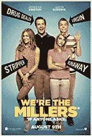
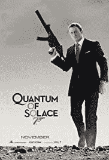
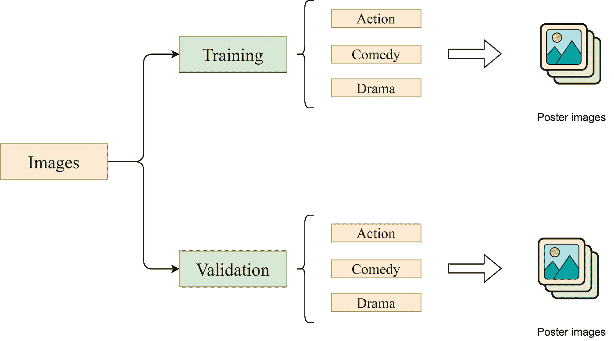
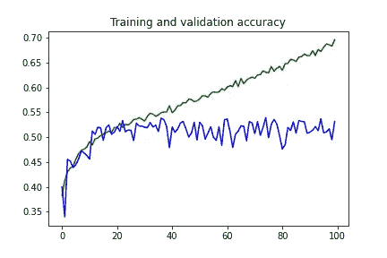
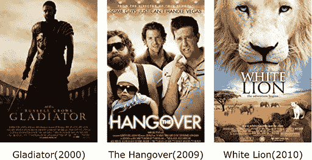
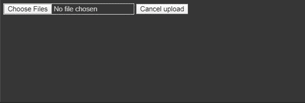
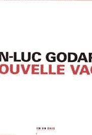

# 从海报预测电影类型的 CNN 方法！

> 原文：<https://towardsdatascience.com/cnn-approach-for-predicting-movie-genre-from-posters-95f122f88bc2?source=collection_archive---------35----------------------->

## 深度学习

## 卷积神经网络是一类深度神经网络，用于图像或视频识别和分类任务。


图片由[天鬃](https://pixabay.com/users/Sky_Mane-8294708/?utm_source=link-attribution&utm_medium=referral&utm_campaign=image&utm_content=3706529)发自 [Pixabay](https://pixabay.com/?utm_source=link-attribution&utm_medium=referral&utm_campaign=image&utm_content=3706529)

我们能建立一个模型来了解是什么让一种类型的电影海报与其他类型的不同吗？电影海报描绘了关于这部电影的许多事情。它对激发观众对电影的兴趣起着至关重要的作用。在上面的例子中，颜色主要是红色和黑色，因此在训练时，我们的模型可以学习将这种类型的图像分类为“恐怖”或“惊悚”。这将是一项有趣的任务。当你看不同类型的海报时，你会注意到它们在某些方面是不同的。比如看下面的海报。*本文使用的所有电影海报图片均收集自* [*IMDB*](https://www.imdb.com) *。*



[我们是米勒夫妇(2013)](https://www.imdb.com/title/tt1723121/mediaviewer/rm1869129472)

它代表了一部喜剧电影。现在看看下面的动作片海报。我们可以看到海报代表了电影类型的一个重要方面。



[量子的慰藉(2008)](https://www.imdb.com/title/tt0830515/)

在这个项目中，我们将建立一个神经模型，可以区分三种电影类型的海报，并预测任何随机海报的类型。我们将从零开始一步一步建立这个模型！本项目使用的数据集是在 [IMDB](https://www.imdb.com) 的帮助下自行创建的。它包含超过 3900 张各种类型的海报图片——动作片、喜剧片、戏剧片。

让我们进入编码部分。

# 1.使用数据集

我们的数据集结构如下所示。我们将训练图像和测试图像保存在不同的目录中。每个目录包含三个子目录——动作、喜剧和戏剧。这些子目录进一步包含我们的电影海报的图像。



数据集的目录组织

我们将使用 ImageDataGenerator 进行标记。来自 *Keras API* 的 ImageDataGenerator 通过自动标记数据来帮助我们。在代码中实现数据扩充时，这也很有用。让我们看看这是如何在编码中实现的。

```
import tensorflow as tf
import keras_preprocessing
from keras_preprocessing import image
from keras_preprocessing.image import ImageDataGeneratorTRAINING_DIR = "/images2/Training"training_datagen = ImageDataGenerator(rescale = 1./255,
    width_shift_range=0.2,
    height_shift_range=0.2,
    zoom_range=0.2,
    horizontal_flip=True,
    fill_mode='nearest')VALIDATION_DIR = "/images2/Validation"validation_datagen = ImageDataGenerator(rescale = 1./255)train_generator = training_datagen.flow_from_directory(
    TRAINING_DIR,
    target_size=(150,150),
    class_mode='categorical',
    batch_size = 256
)validation_generator = validation_datagen.flow_from_directory(
    VALIDATION_DIR,
    target_size=(150,150),
    class_mode='categorical',
    batch_size= 64
)
```

我们将首先创建一个 ImageDataGenerator 实例，用于训练和验证目的。由于像素值的范围是从 0 到 255，我们将在 0 到 1 的范围内对它们进行归一化。为此，我们将传入参数( *rescale = 1)。/255)* 创建 ImageDataGenerator 的实例时。在这之后，我们将使用*。实例的 flow_from_directory()* 方法来标记两个目录的图像，并将结果存储在 *train_generator* 和 *validation_generator* 中，用于训练和验证目的。调用该方法时，我们将传入 *target_size* 属性，以确保数据集中的图像大小相同。这里我们有 3 个类，所以我们必须传入 *class_mode* 参数作为*分类。*训练和验证的批量大小取决于我们数据集中的图像数量。

我们将数据分为三类——动作片、喜剧片和剧情片。现在我们可以继续创建我们的 CNN 模型。

# 2.创建 CNN 模型

我们将使用 Keras 的序列模型来构建我们的模型。我们将添加 3 对 Conv2D 和 MaxPooling2D 层。然后我们将添加扁平化层，使我们有我们的数据在一个维度。最后，我们将添加一个具有 1024 个隐藏单元的完全连接的密集层，后跟一个 softmax 层。下面是实现这一点的代码。

```
from tensorflow.keras.optimizers import RMSpropmodel = tf.keras.models.Sequential([
    tf.keras.layers.Conv2D(16, (3,3), activation='relu', input_shape=(150, 150, 3)),
    tf.keras.layers.MaxPooling2D(2,2),
    tf.keras.layers.Conv2D(32, (3,3), activation='relu'),
    tf.keras.layers.MaxPooling2D(2,2),
    tf.keras.layers.Conv2D(64, (3,3), activation='relu'),
    tf.keras.layers.MaxPooling2D(2,2),
    tf.keras.layers.Flatten(),
    tf.keras.layers.Dense(1024, activation='relu'),
    tf.keras.layers.Dense(3, activation='softmax')
])model.compile(loss='categorical_crossentropy',
    optimizer=RMSprop(lr=0.001),
    metrics=['acc'])
```

创建模型后，我们将在编译模型时使用 RMSprop 优化器，它允许我们根据需要调整学习速率。这里，学习率是在用模型进行多次测试之后选择的。我们需要传递*分类交叉熵*作为我们的损失函数，因为我们有两个以上的类。

我们的模型可以开始训练了。让我们用之前标注的数据来训练它。

# 3.训练模型

我们将传入我们之前创建的带有正确值的 *train_generator* 和 *validation_generator* 变量。

```
history = model.fit(
    train_generator,
    steps_per_epoch = 36,
    epochs = 100,
    validation_data = validation_generator,
    validation_steps = 36
)
```

在 100 个时期之后，我们的模型给出了 69.8%的训练准确度，而验证准确度仍然是 53.3%。下面是为两个准确性指标绘制的图表。



正如我们可以看到的，最高验证精度约为 0.53，训练精度约为 0.70。现在让我们在一些图像上尝试我们的模型。

# 4.测试我们的模型

我们将使用 Google Colab 的内置库来上传图像，然后我们将它们传递给我们的模型，看看是否可以获得正确的类型。

```
# predicting for random images
import numpy as np
from google.colab import files
from keras.preprocessing import imageuploaded = files.upload()for fn in uploaded.keys():
    path = '/content/' + fn
    img = image.load_img(path, target_size=(150, 150))
    x = image.img_to_array(img)
    x = np.expand_dims(x, axis=0)
    images = np.vstack([x])
    classes = model.predict(images, batch_size=256)
    print(classes)
```

我们将传递三种不同类型的电影海报—动作片、喜剧片和剧情片。



上面代码的输出如下所示。



我们正在对这三种情况进行正确分类，但这不会每次都发生。请记住，我们的验证准确率仍然在 53%左右，所以在一半的情况下，我们的预测可能会出错。

你可以在 GitHub 的这里找到所有的代码[，在 LinkedIn 的这里](https://github.com/jackfrost1411/Genre-prediction-from-posters)找到我[。](https://www.linkedin.com/in/dhruvilshah28/)

# 未来的范围和限制

这里使用了非常小的数据集，因此精度较低。在未来，一个更大的数据集可能被用来提高准确性，甚至预测同一部电影的多个流派。这里，该模型仅预测 3 种类型的流派，但在未来，可以使用 ResNet 建立一个更复杂的模型，预测超过 10 或 20 种类型的流派。机器学习算法 K-最近邻也可以用于此目的。

# 结论

上面我们看到了如何建立一个模型，从海报中预测电影类型。还有一些海报会很难归类。比如下面这个。下面展示的海报是一部剧情片。我们可以看到它只包含文本。因此，我们的模型很难预测正确的类型。



类型预测领域还没有被完全探索。使用 CNN 进行图像识别任务可以证明对于从电影海报的图像中预测类型是有用的。CNN 可能会发现喜剧电影海报与动作电影海报的不同之处。