# CNN 方法:利用聚合物图像预测其玻璃化转变温度

> 原文：<https://towardsdatascience.com/cnn-approach-using-image-of-the-polymer-to-predict-its-glass-transition-temperature-4a64ee450450?source=collection_archive---------23----------------------->

在本文中，我们将使用聚合物结构的图像来预测其玻璃化转变温度。这篇文章采用了与西班牙材料物理中心和 Donostia 国际物理中心的 Luis.A. Miccio 最近发表的一篇研究论文相似的方法。

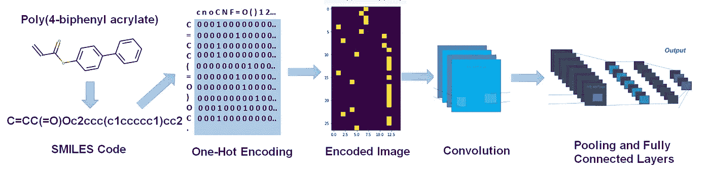

# **简介:**

玻璃化转变温度是聚合物的重要性质之一。它标志着过冷液体的原子在冷却时暂时冻结(不结晶)的温度范围。预测玻璃化转变温度(Tg)提供了对聚合物性质的有价值的见解，否则其合成可能是昂贵和耗时的。科学家总是更热衷于定性地开发机器学习模型(例如，使用其他几个属性来预测其拉伸强度)。在过去的几年里，主要的重点已经放在定量结构-性质的关系。这使得仅用分子(即仅图像)化合物的结构预测各种性质成为可能，避免了任何额外的实验性质或繁琐的计算。在本文中，我们将使用卷积神经网络，利用聚合物的图像来预测未知聚合物化合物的 Tg。这听起来很酷，这实际上意味着如果你在白板上画出单体单元的图像，就足以预测它的 Tg。我们不需要聚合物的任何其他外部信息或性质。

# **导入相关包**

# **数据集**

我们研究中使用的数据集来自一个流行的聚合物数据库。这项研究的数据集包括 351 种聚合物及其 smiles 代码，分子名称作为输入属性，玻璃化转变温度作为输出变量。300 种聚合物及其 Tg 值的子集用于训练验证数据集，而其余 51 种未知聚合物用于测试模型、CNN 和提议的 ANN 的结果。下图显示了数据集的前 5 行。这项研究的数据集可以在[这里](https://github.com/Saket-Uoft/Artificial-Intelligence-for-Predicting-Materials-Properties/blob/master/molecules.csv)找到。

读取和清理数据集

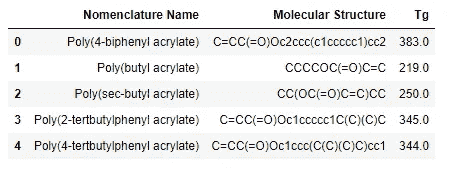

数据框的前 5 行

# **聚合物分类**

该数据集使用 python 中的 Pandas 库进行手动探索，并被分类为八种不同类别的聚合物——丙烯酸酯、苯乙烯、酰胺、烯烃、醚、酰胺、碳酸酯等。

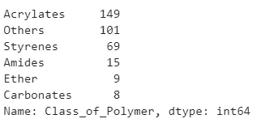

# 探索性数据分析

**饼图:**图中的饼图显示了数据集的确切组成，其中丙烯酸酯和苯乙烯的贡献最大

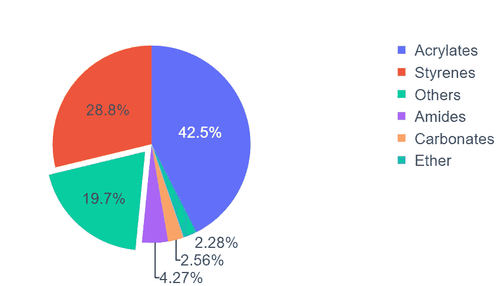

**箱线图:**箱线图用于显示各类聚合物的基本 Tg 分布散点图。可以看出，苯乙烯倾向于具有较高的 Tg，而丙烯酸酯具有相当混合的分布。

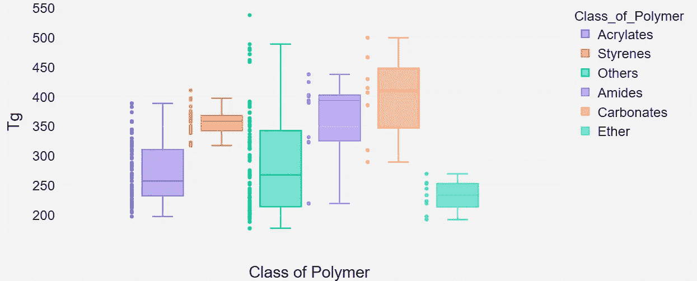

## 单体中的电荷分布

开源的 RDKit [1] python 包用于将聚合物的分子结构从数据集可视化到绘图中。RDKit[1]模块中的一个这样的函数用于计算单体单元的 Gasteiger 部分电荷。

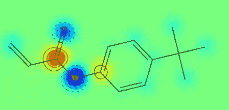

# **特色工程**

工程特征在为建模准备数据和以机器可读的形式呈现属性方面至关重要。根据问题陈述，Tg 预测是基于使用微笑线符号以编码形式输入 CNN 架构的聚合物化学结构的图像。这个问题的特征工程的主要目的是结合单体单元的化学结构和化学组成来预测 Tg。这是通过使用微笑线符号[2]实现的。

**SMILES 符号介绍:** SMILES 代表简化的分子输入行输入系统。这基本上是一种用不同的字符以线符号的形式描述化学结构的方法。下图显示了给定化学结构的 SMILES 符号。

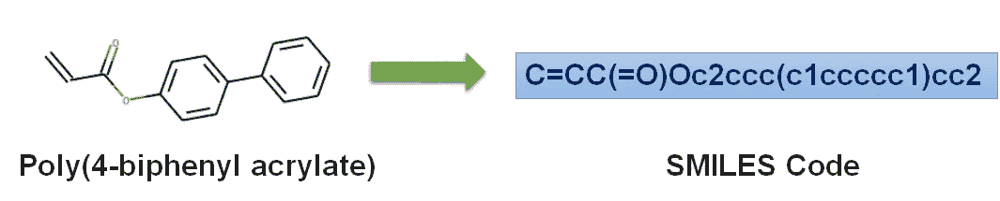

**分子结构到图像编码:**我们首先定义了一个列表，该列表包含了可以出现在聚合物的任何给定 SMILES 线性串中的所有独特字符。

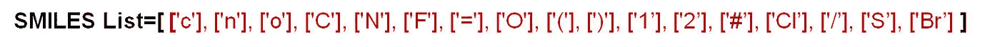

此外，作为第二步，通过使用该独特微笑字符列表，通过二进制图像以机器可读形式对线符号形式的聚合物线性串进行 1-hot 编码。最终的转换是一个由二进制图像组成的 n 维矩阵，可以输入 CNN 架构。每个二进制图像是 m × n 维的矩阵，其中 n 表示唯一微笑列表中的字符数，m 是具有最长微笑代码的聚合物中存在的字符数。下图直观地描述了一个聚合物实例-聚(4-联苯丙烯酸酯)的编码过程。

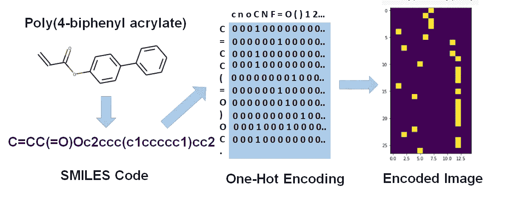

分子结构到图像编码过程

生成的一个热编码图像考虑了**化学结构和单体单元的组成。**我们可以看到，编码图像告诉我们以二进制形式存在于单体结构中的每种原子的数量，以及聚合物链中原子相对于彼此的排列结构。

下图生成了数据框中前五种聚合物的编码图像。

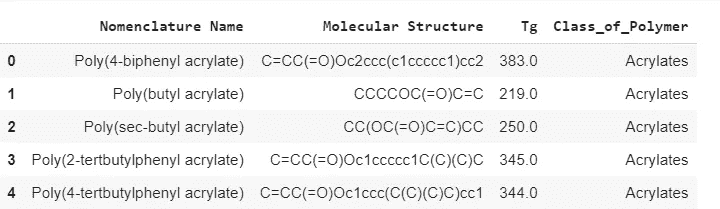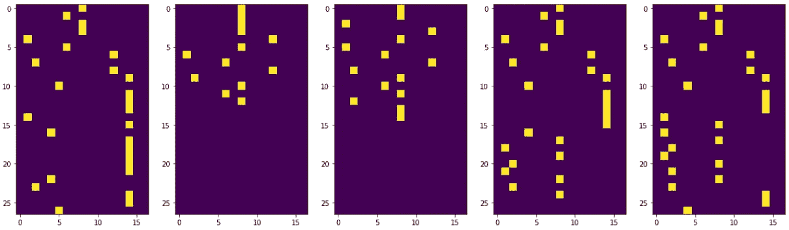

数据框中前五种聚合物的编码图像

# **模型实现**

图像编码的分子结构作为输入输入到 CNN，目标变量是给定聚合物的 Tg，这是一个连续变量。这个模型是使用 Keras 库实现的，Keras 库是 Tensorflow 的应用程序编程接口(API)。

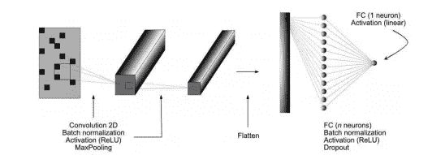

CNN 示意图[2]

**提议的架构:**通过整合所有不同超参数的各种组合，选择了最终超参数。最佳观察配置在第一层中使用大小为 64 的滤波器，窗口大小为(5，5)，在第二层中使用大小为(3，3)的 32 个滤波器。接下来是窗口大小为(3，3)的 max-pooling 层。在最大池层之后，我们有三个密集层，分别具有 32、10 和 1 个神经元，最终的密集层是我们提出的 ANN 模型的输出。ReLu 激活函数由具有 l2 正则化的所有层使用。该模型通过训练多达 180 个时期达到其最佳泛化能力，批次大小为 64，学习率为 0.03。0.1 的验证分割和 0.1 的退出概率用于训练网络以执行交叉验证。

# **结果**

下面给出的图显示了训练集和未知测试集的玻璃化转变温度的实验值和预测值。对于一个理想的模型，我们期望真实值完全等于预测的 Tg 值。这将导致一条直线穿过原点。

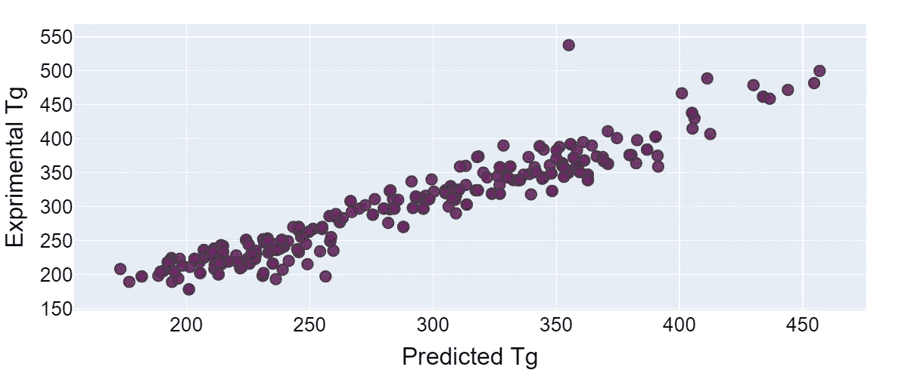

训练集的实际与预测 Tg 值

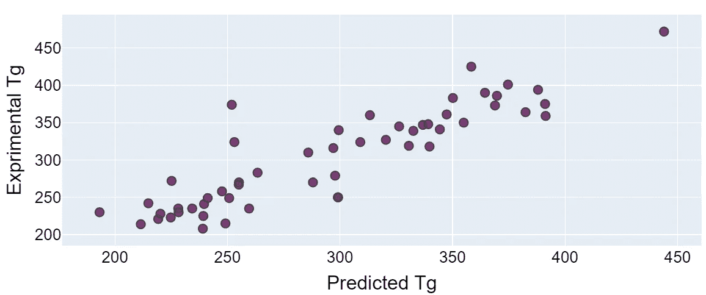

看不见的测试集的实际与预测 Tg 值

可以看出，与真实的 Tg 值相比，大多数实施例显示出非常精确的预测。然而，由于缺乏足够的训练数据，有一些聚合物在预测中造成了很大程度的不确定性。这些聚合物属于酯类和醚类的少数类别，由于对这两类聚合物的培训不足，这些聚合物的 Tg 没有得到有效的了解。

**损失度量:**我们在训练神经网络时使用了平均绝对损失函数。但是对于我们的最终评估，我们使用平均相对误差%作为我们模型的评估标准。这可以表示如下-

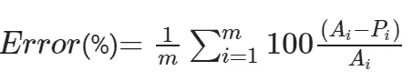

其中 Ai 是实际的 Tg 值，Pi 是预测的 Tg 值。这一相对%误差的平均值取自 m 聚合物的全部数据集。在训练过程之后，我们计算各自的训练和测试平均相对误差。

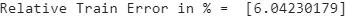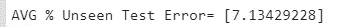

下表显示了 4 种未知聚合物的真实和预测 Tg 值。我们可以看到，我们的预测非常接近实验 Tg 值，表明所提出的模型显示出优异的泛化能力。

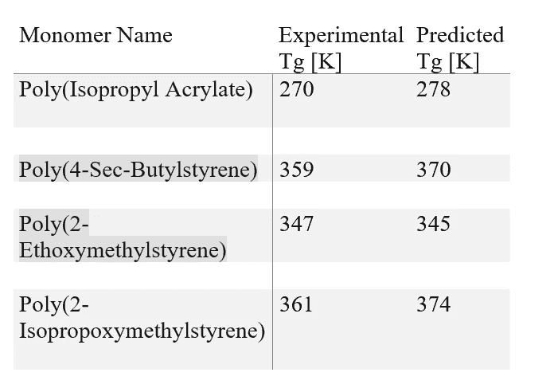

# **结论**

在这项研究中，我们通过考虑聚合物中单体单元的分子结构和化学组成，证明了 CNN 预测聚合物 Tg 的可行性。我们能够分别实现 6%和 7%的训练和测试集的相对误差。在我的下一篇文章中，我将使用完全连接的神经网络来预测玻璃化转变温度。这个新模型将结合所有种类的分子内相互作用以及化学组成和分子结构来预测 Tg。

# **学分**

特别感谢[丹麦](http://Special Thanks to Danish for contributing in this project')对这个项目的贡献。

# **参考文献:**

1-G. Landrum 等人，“Rdkit:化学信息学和机器学习软件”。ORG，2013。

2-Luis A. Miccio，Gustavo A. Schwartz，“通过卷积神经网络从化学结构到定量聚合物性质预测”，聚合物，2018 年

# 感谢您的阅读！！！！

如果你喜欢我的工作并想支持我:

1-支持我的最好方式是跟随我上 [**中**](https://medium.com/@saketthavananilindan) **。**

2-在[**LinkedIn**](https://www.linkedin.com/in/saket-thavanani-b1a149a0/)**上关注我。**