# 卷积神经网络——概要

> 原文：<https://towardsdatascience.com/cnn-cheat-sheet-the-essential-summary-for-a-quick-start-58820a14d3b4?source=collection_archive---------24----------------------->

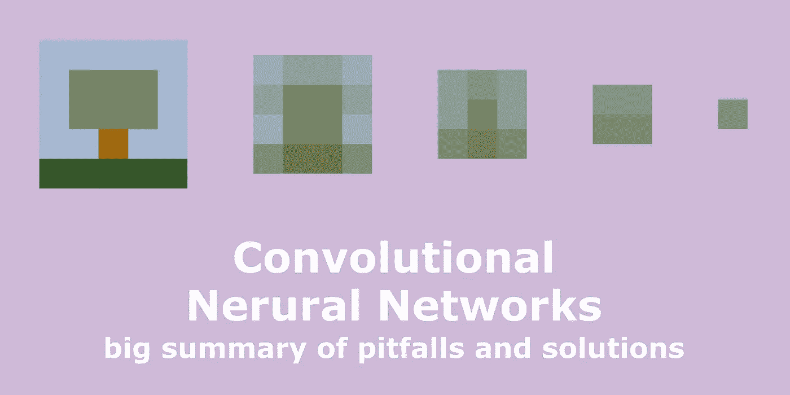

图片作者。

每年都有成千上万的新论文在顶级计算机视觉会议上发表，如 ECCV、CVPR、ICCV 等。跟随每一项新技术和方法真的会让人不知所措。然而，当新技术被放到一个环境中时，消化它们要容易得多。本文重点关注卷积神经网络(CNN)，它构成了图像和视频处理的深度模型的主干。

很多时候，我的学生问我:“从哪里开始？”。类似地，有各种各样的方法可用，许多从那些更有经验的人的头脑中溜走。由于上述原因，这篇文章是 CNN 学生的快速入门指南，希望也是那些有更多专业知识的人的参考点。我还把它做成一个 CNN 备忘单，让未来的自己在需要的时候回去修改。

我确实错过了一些宝贵的东西，所以请让我知道，我们可以把这篇文章做得更好！

# 概观

CNN 的成功和广泛采用始于 [AlexNet](https://papers.nips.cc/paper/4824-imagenet-classification-with-deep-convolutional-neural-networks.pdf) 在 ImageNet 竞赛中的惊人成绩。与第二好的方法 74.9%的分数相比，提出的 CNN 有 84.7%的准确率。性能随后被更深层次的模型(如[盗梦空间](https://arxiv.org/pdf/1409.4842.pdf)、[谷歌网](https://static.googleusercontent.com/media/research.google.com/en//pubs/archive/43022.pdf)、 [VGG](https://arxiv.org/abs/1409.1556) 等)提升。).

CNN 在计算机视觉任务上的优异表现可以归因于其针对图像数据定制的结构。最近一篇名为[深度图像先验](https://arxiv.org/abs/1711.10925)的论文显示，CNN 的架构已经整合了自然场景统计的先验。与全连接网络不同，CNN 能够利用这样一个事实，即相邻像素之间的关系比相距较远的像素之间的关系更重要。

在全连接网络中，每个输入都与下一层中的每个神经元相连，与此相反，CNN 使用卷积作为基本运算。只有被卷积核覆盖的像素被传递到下一层中的神经元。因此，CNN 捕捉图像内的局部空间关系。对图像数据使用 CNN 允许较少数量的权重，因此，对于基于图像的任务，使用与完全连接的网络相同或更好的预测能力，训练模型是轻量级的和更容易的。

然而，尽管专门针对图像数据的架构考虑显著改善了结果，但 CNN 仍然会遇到问题，这是深度模型的典型问题。其中一些是消失梯度、缺乏稳健性、收敛缓慢、内部协方差漂移等等。更具体的问题也出现了:如果本地关系假设不成立呢？如果用 CNN 生成图像，如何保证生成的结果在感知上令人愉悦？使用 CNN 进行分类或回归时，如何处理大小不一的图像？

在这篇文章中，我将谈论:

*   消失梯度问题
*   收敛速度
*   如何实现不变性和等方差
*   去除由去卷积引起的伪像
*   图像到图像转换的损失函数
*   不同尺寸图像的进给方式
*   如何考虑遥远的空间关系
*   CNN 更复杂的模型扩展

如果你想重温卷积如何应用于机器学习的一般知识，请查看这篇文章。

# 消失梯度

随着网络的规模增大，训练难度也随之增加。在训练期间，任何权重的更新都与偏导数的大小成比例。由于隐藏层中存在饱和非线性(例如，sigmoid ),梯度在向网络的早期层传播时会变得无限小。在极端情况下，网络完全停止训练。这个问题被称为消失梯度。

这可以通过跳过连接来弥补。总体思路是将通过非线性的信号与旁路非线性的信号相结合。一篇更深入解释这些的优秀文章是[这里](https://theaisummer.com/skip-connections/)。在这里，我给出了两个最常用的使用跳过连接的架构的例子。我还谈到了一个更好的替代 ReLU 激活的方法，它也会影响性能。

## [**残留层**](https://arxiv.org/pdf/1512.03385.pdf)

残留块。图片由[明凯何](https://arxiv.org/pdf/1512.03385.pdf)

正如 ResNet 的成功所显示的，剩余层是相对简单的修改，然而它显著地改进了训练和性能。对于每个残差层，输入 **x** 通过该层(如同对于标准层一样)，产生输出(F( **x** )，然后将该输出与原始输入 x 相加。在反向传播期间，梯度因此经由非线性 F( **x** )和原始 **x** 通过网络反向传播，从而产生更高效的更新。

## [**U 网**](https://arxiv.org/pdf/1505.04597.pdf)

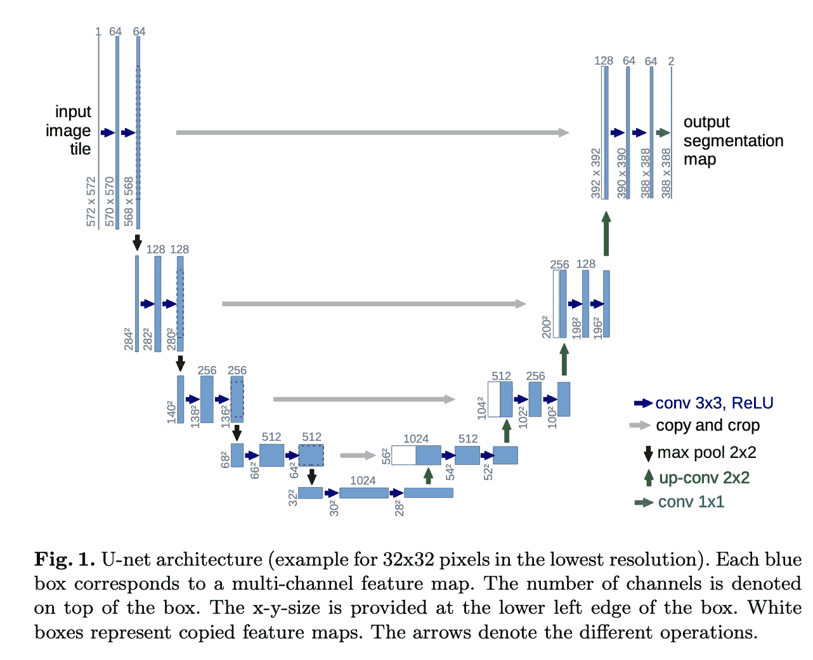

图片由 [Olaf Ronneberger](https://arxiv.org/pdf/1505.04597.pdf) 提供。

U-NET 是一个完全卷积的网络，最初是为图像分割而设计的。该架构由一个捕获上下文的收缩路径和一个支持精确定位的对称扩展路径组成。U-NET 背后的想法类似于剩余层。然而，来自网络中较早层的信号在信号扩展部分被链接到对称层，而不是绕过单个层。

## **激活功能**

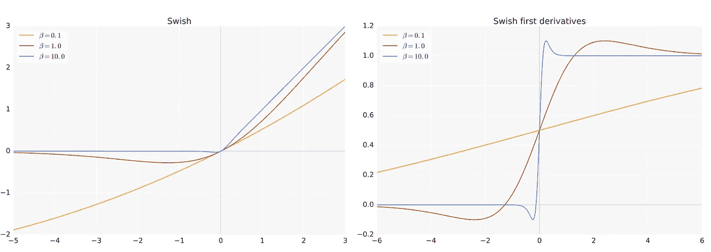

具有不同参数的 Swish 激活功能示例。图片由 Prajit Ramachandran 提供。

另一种改善反向传播的方法是改变激活函数。在 CNN 中，sigmoid 或 softmax 的使用已被 ReLU 广泛取代，但还有更好的选项可用— [SWISH](https://arxiv.org/pdf/1710.05941v1.pdf) 。Swish 修复了 ReLU 激活中的不连续性，显著改善了梯度更新。

# 趋同；聚集

网络的收敛(达到预期精度所需的迭代)会受到许多因素的影响。其中之一是内部协方差偏移。由于训练是一个动态过程，对于给定的隐藏层，随着训练的进行，其输出的分布随时间而变化。反过来，后续层必须在学习其权重的同时适应变化的分布。通过标准化每一层的输出，训练可以得到显著改善，因为消除了内部协方差偏移的问题。这里我给出了两个常用的归一化方法的例子。在这里可以找到一篇关于内部协方差转变补救措施的优秀文章。

## **批量归一化**

**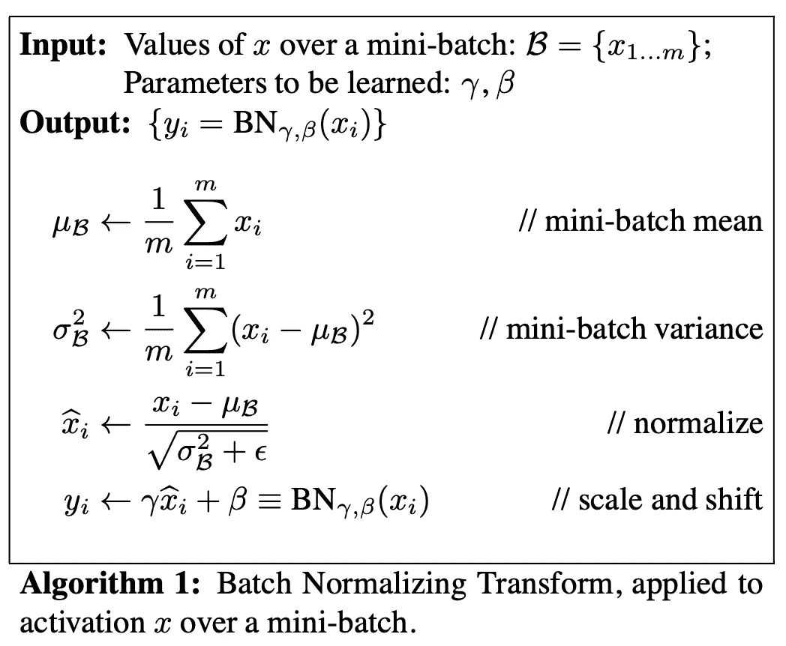**

**算法 1:应用于小批量激活 x 的批量规范化转换。**

**在批量标准化中，除了网络中的权重之外，我们还针对比例和移位参数(γ和β)进行训练。**

**训练的稳定性是通过用批次的平均值和标准偏差标准化每次激活的层输出来实现的。为了确保模型也捕获输入的比例，还为 a 层训练了两个全局参数γ和β。无论批次如何，这些都可以稳定活化程度。由于我们无法访问测试时间内的每批统计数据，因此我们可以使用训练数据集中的层输入的平均值和标准差来标准化测试期间的层输出。**

**按照原始论文的步骤，对于卷积图层，我们还希望归一化遵循卷积属性-因此，相同要素地图中不同位置的不同元素将以相同的方式进行归一化。为了实现这一点，小批量中的所有激活在所有位置上被联合标准化。在上面的算法中，参数对γ和β是根据特征图学习的，而不是根据激活学习的。**

**平滑梯度更新还允许使用大得多的学习率。**

## **[**层规格化**](https://arxiv.org/pdf/1607.06450.pdf)**

**像批量归一化一样，我们也给每个神经元它自己的自适应偏置和增益，在归一化之后但在非线性之前应用。与批处理规范化不同，层规范化在训练和测试时执行完全相同的计算。**

# **不变性和等方差**

********

**反射不变性:我们期望网络将该图像分类为猫的图像，而不管其方向如何。图片作者。**

**不变性和等方差经常被混淆和互换使用，然而，两者定义了不同的性质。**

**简单来说，*不变性*是一个函数的属性，其中对于扰动的输入，输出保持不变。例如，我们希望分类网络是输入旋转不变的，其中，无论输入倾斜如何变化，预测的类都不会改变。不变性通常还与去噪鲁棒性相关，即模型即使在输入被破坏的情况下也能保持高性能的能力。**

***另一方面，*等方差意味着函数以输出的类似变化来响应输入的变化。这个属性对于图像转换任务是理想的，例如，考虑图像分割，其中，如果我们旋转图像，该图像的分割图也将旋转。我发现 StackExchange 上的这个[答案](https://datascience.stackexchange.com/questions/16060/what-is-the-difference-between-equivariant-to-translation-and-invariant-to-tr)对于理解不变性和等方差特别有用。**

## ****统筹****

****

**最大池操作。图片由[计算机科学维基](https://computersciencewiki.org/index.php/Max-pooling_/_Pooling)提供。**

**在 CNN 中实现不变性的方法之一是池化。预测对要素的局部位置很敏感。通过汇总各个层中的局部信息，可以实现局部不变性或对局部扰动的鲁棒性。例如，考虑对图像中的像素进行平均，如果一个像素改变，则所有像素的平均值不会经历显著的变化。类似的操作可以在隐藏层中完成，并通过池化来实现。通常，使用加权和最大池。一个独立的研究方向与改进的池操作有关，因为这是[学习池操作。](http://proceedings.mlr.press/v51/lee16a.pdf)**

**这个想法是总结当地的信息。当在每一层中汇总信息时，影像中相距较远的要素会在网络的更深层中靠拢。因此，在隐藏层中，表示被压缩，并且在后续层上的卷积是在信息上完成的，该信息先前是全局的，但是由于汇集而变得局部化。汇总本地特征的优势也是它的弱点，因为大部分信息丢失了。**

**它提供不变性(丢弃位置信息)而不是等方差(解开信息)。**

## ****胶囊网络****

**池丢弃了大量的信息，并提供了不变性而不是等价性。此外，CNN 有一个显著的缺点，即不能在图像特征之间建立关系。这种失败的一个例子是“毕加索问题”，一张脸的嘴和眼睛交换后仍然会被归类为一张脸。**

**胶囊网络是 CNN 的替代方案，并且也可以作为其架构的一部分并入更深的层中，这弥补了上述局限性。胶囊是一组神经元，对特征的方向及其概率进行编码。这些通常需要更少的数据来训练；然而，不同于标准反向传播的训练过程要耗时得多。胶囊网络是一个单独的话题，在[博客](https://medium.com/ai%C2%B3-theory-practice-business/understanding-hintons-capsule-networks-part-i-intuition-b4b559d1159b)、[论文 1](https://arxiv.org/pdf/1710.09829.pdf) 和[论文 2](https://openreview.net/pdf?id=HJWLfGWRb) 中有很好的解释。**

## **[**谐波网络**](http://visual.cs.ucl.ac.uk/pubs/harmonicNets/pdfs/worrallEtAl2017.pdf)**

**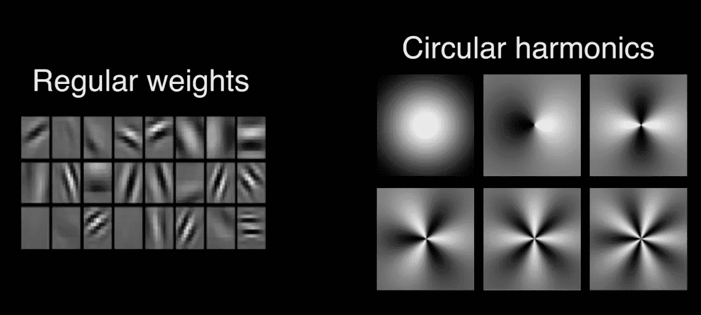**

**CNN 滤波器被径向重新加权和相移的圆形谐波所取代。这使得每个滤波器响应对于 m 阶输入旋转是等变的。丹尼尔·沃拉尔[。](http://visual.cs.ucl.ac.uk/pubs/harmonicNets/pdfs/worrallEtAl2017.pdf)**

**谐波网络通过将滤波器限制为圆形谐波族，将逐片 360°旋转等变设计成深度图像表示。圆形谐波是[可操纵滤波器](https://en.wikipedia.org/wiki/Steerable_filter)，这意味着我们可以表示滤波器的所有旋转版本，只需使用操纵基底的有限线性组合。这克服了在 CNN 中学习多个滤波器副本的问题，保证了旋转等方差，并产生了在输入旋转下可预测地变换的特征图。**

**每一层都是不同旋转阶数的特征映射的集合，这些特征映射在网络输入的旋转下可预测地变换，并且 360°旋转等方差通过有限的计算来实现。**

# **解决去卷积问题**

**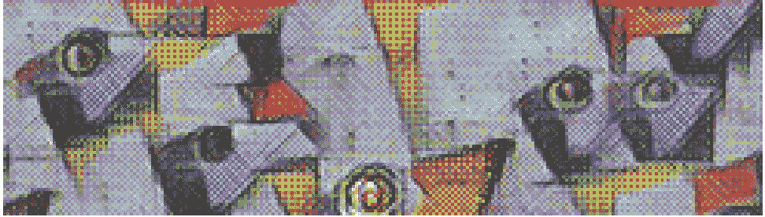**

**去卷积导致棋盘图案的一个例子。**

**通过全卷积网络的瓶颈后，信号通过解卷积逐渐扩展到其原始维度。应用去卷积通常会产生棋盘图案，即步幅小于滤波器大小，导致滤波器重叠。**

**对于棋盘模式有几个标准和直观的解决方法:使用除以步幅的内核大小，避免重叠问题；或者例如通过使用双线性或最近邻上采样，从卷积中分离出较高分辨率的上采样来计算特征。更多解决问题的方法，请看这篇文章。**

# **损失函数**

**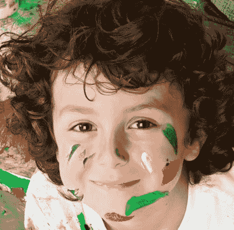****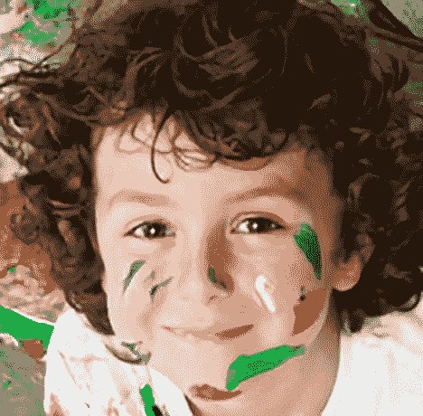******

**图像超分辨率与 [EDSR](https://arxiv.org/abs/1707.02921) 网络训练有素。从左到右:地面真相，输出的模型训练与 SSIM 作为一个损失，输出的模型训练与 L2 作为一个损失。图片来自 [DIV2K 数据集](https://data.vision.ee.ethz.ch/cvl/DIV2K/)**

**当针对 L2 损失(即，所生成的图像和地面真实情况之间的均方差)进行优化时，所得到的图像通常是模糊的，因此在视觉上不是很令人愉快。相反，我们想要一个感知损失函数，为它进行优化我们可能不会获得最低的 PSNR，但产生的图像将是清晰的和在感知上令人愉快的。**

**对于地面真实图像可用的情况，与主观人类评分高度相关的图像质量度量，例如 FSIM 和 SSIM，[可以用作损失函数](https://arxiv.org/pdf/1511.08861.pdf)。通过优化来最大化他们的分数，我们正在学习生成高质量的图像。另一种方法依赖于预先训练的深度架构在深度表示中学习图像统计的假设。**

**这样，在分类或[图像质量(LPIPS)](https://arxiv.org/pdf/1801.03924.pdf) 上预先训练的 VGG 网络[可以被用作损失。这里，地面真实图像和生成的图像通过预先训练的网络，并且基于某种距离度量(例如 L2)来比较生成的网络特征。当不需要图像之间的精确匹配时，可以使用](https://arxiv.org/pdf/1603.08155.pdf)[上下文丢失。](https://arxiv.org/pdf/1803.02077.pdf)**

**训练仅仅依赖于从深度网络中提取的特征，因为丢失是不稳定的。由于实现该函数的网络通常不是双射的，由于隐藏层中的汇集操作，对该函数的不同输入可能导致相同的潜在表示。因此，损失通常是 VGG 和 MSE 或 L1 的组合。**

**对于图像生成，或者在参考图像不可用的情况下，常见的方法是使用生成模型，最先进的方法是生成对抗网络( [GANs](https://papers.nips.cc/paper/5423-generative-adversarial-nets.pdf) )。目标是训练一个生成器，一个用于图像任务的 CNN，它将生成复制那些在预先指定的分布中的图像。这里的鉴别者充当了法官的角色。**

# **允许不同尺寸的图像**

**在不同大小的图像上使用相同的 CNN 是可取的。然而，当使用 CNN 作为分类器时，卷积层之后通常是全连接层。虽然卷积层的大小不变，但全连接层是在预先指定的输入数上运行的。**

**[**空间金字塔汇集**](https://arxiv.org/pdf/1406.4729.pdf)**

**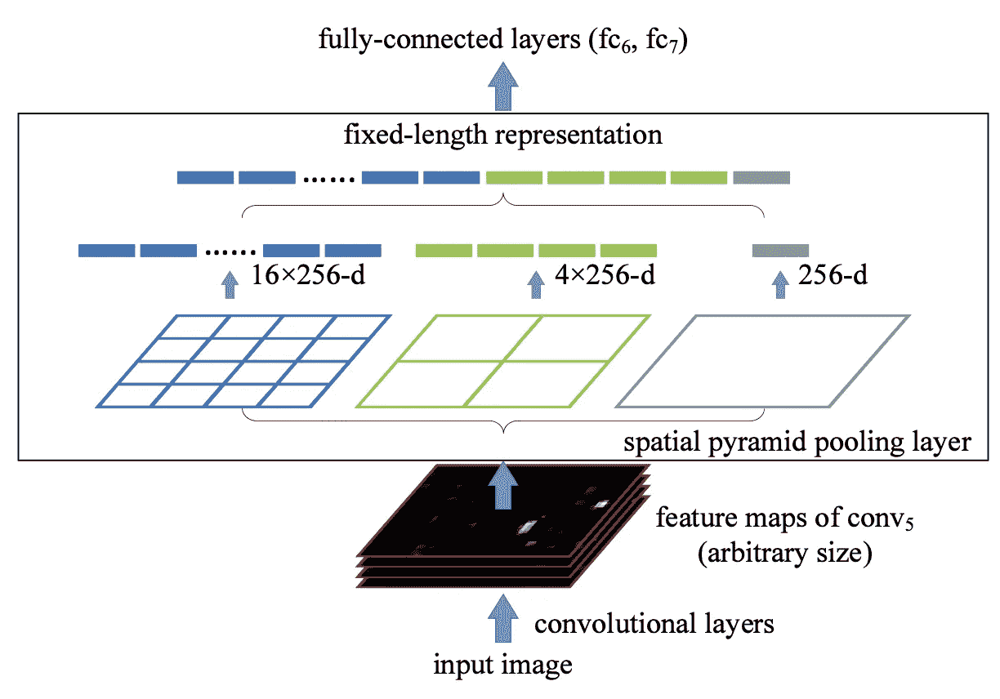**

**图片由[明凯何](https://arxiv.org/pdf/1406.4729.pdf)提供。**

**在全连接层之前，我们使用一个固定的池层，它只从卷积层中选择预定义数量的元素，而不考虑其大小。关键思想是从不同分辨率的图像中提取特征，并使用自适应池，其中我们调整池元素的数量，以实现固定数量的总输出神经元。**

**建造“金字塔”的想法对成像来说并不新奇。众所周知的 [SIFT](https://www.cs.ubc.ca/~lowe/papers/ijcv04.pdf) 算法可以说是其应用中最成功的例子之一。实现比例不变性的另一种方法是将图像的表示改变为点云，并使用平移和比例不变的点网或变体。点云的更多细节可以在[这里](https://arxiv.org/abs/1612.00593)找到。**

# **考虑到空间关系**

**典型的 CNN 能够提取图像中相距很远的部分之间的关系。由于卷积和汇集层，通过网络传播的输入信号在其宽度和高度上被压缩，并且通常在深度上被扩展。这样，信号的高级上下文被学习。然而，由于更深层的网络压缩了信息，弱关系可能会丢失。**

**因此，当图像内的关系更复杂时，基于局部像素关系假设的 CNN 的预测能力会大大降低。例如，在一场足球比赛中，将球从图像中移除，训练网络根据球员的目光来预测球的位置。这是一个局部假设不再成立的问题的例子。为了解决这种问题，卷积运算可以扩展到具有更大感受野的核。**

## **[扩张的脑回](https://arxiv.org/pdf/1511.07122.pdf)**

**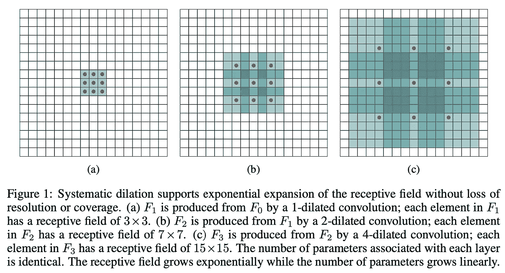**

**图片由 [Fisher Yu](https://arxiv.org/pdf/1511.07122.pdf)**

**在一个简单的卷积中，我们会有一个 3×3 的核，现在让我们假设这个核的所有 9 个元素都是非零的。在 2-扩张卷积(下图中的 b)中，我们将对一个大小为 5x5 的稀疏内核进行操作，该内核包含九个非零元素。**

## **[可变形卷积](https://arxiv.org/pdf/1703.06211.pdf)**

**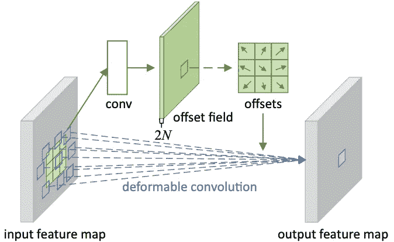**

**图片由[季枫戴](https://arxiv.org/pdf/1703.06211.pdf)提供。**

**可变形卷积背后的思想与膨胀卷积背后的思想相同，然而这里我们让网络在训练期间学习偏移方向和幅度。**

**[**非局部神经网络**](https://arxiv.org/pdf/1711.07971.pdf)**

**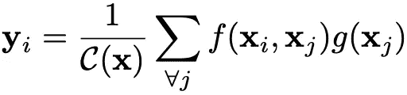**

**非局部块中的计算。I 是要计算其响应的输出位置(在空间、时间或时空中)的索引，j 是枚举所有可能位置的索引。x 是输入信号(图像、序列、视频；通常是它们的特征),而 y 是与 x 大小相同的输出信号。成对函数 f 计算 I 和所有 j 之间的标量(表示关系，例如亲和力)。一元函数 g 计算位置 j 处输入信号的表示。响应由因子 C(x)归一化。**

**考虑空间关系的另一种机制是学习图像中位置之间关系的重要性。在非局部神经网络中，非局部块被注入网络的深层。2018 年，该模型在静态图像识别方面取得了最先进的成果。非局部模型也改进了对象检测/分割和姿态估计。**

**这种方法的缺点是计算复杂度高。妨碍了早期(网络的较浅层)非本地块的使用，降低了空间关系的精度。**

# **学习复杂关系**

**卷积是底层数据块上的线性操作符，只允许学习低级别的抽象。用更具表达性的非线性函数代替简单卷积可以增强局部模型的抽象能力。当潜在概念的样本是线性可分的，即概念的变体都位于由卷积滤波器定义的分离平面的一侧时，线性算子可以实现良好程度的抽象。**

**传统的 CNN 隐含地假设潜在的概念是线性可分的。然而，相同概念的数据通常存在于非线性流形上，因此捕捉这些概念的表示通常是输入的高度非线性函数。在“网络中的网络”中，卷积被一个“微型网络”——一种非线性多层感知器——所取代。**

## **[网络中的网络](https://arxiv.org/pdf/1312.4400.pdf)**

**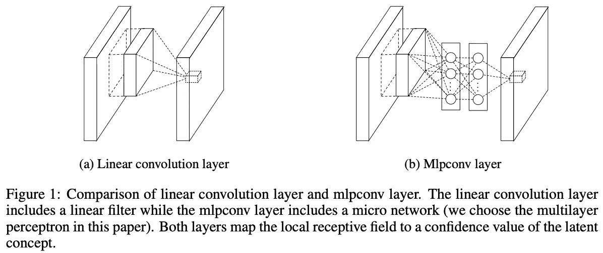**

**图片由[林敏](https://arxiv.org/pdf/1312.4400.pdf)**

**线性卷积层和 mlpconv 层都将局部感受野映射到输出特征向量。mlpconv 使用多层感知器将输入局部面片映射到输出特征向量，该感知器由具有非线性激活函数的多个全连接层组成。多层感知器在所有局部感受野之间共享。特征映射是通过滑动感知器获得的。这种架构的训练要慢得多，但是效果更好。**

# **摘要**

**在这篇短文中，我介绍了提高 CNN 性能的常用策略。我已经谈到了消失梯度问题，改善收敛、不变性和等方差特性的方法，考虑了空间关系，谈到了将不同大小的图像馈送到 CNN 的方法，还谈到了图像转换算法的损失，这些算法用于实现感觉上令人满意的结果。**

**本文旨在缩短篇幅，省略了许多技术。如果你认为我错过了一些重要的东西，请不要犹豫给我留言或留下评论。**

# **进一步阅读**

**为了进一步阅读，我推荐这篇综述[文章](https://arxiv.org/pdf/1512.07108.pdf)，并且一定要仔细看看提出这些总结想法的原始论文。**

**由于深度学习方法越来越多地部署在移动设备上，因此出现了不同的技术来使这些设备变得更小，例如[深度方向可分离卷积](/a-basic-introduction-to-separable-convolutions-b99ec3102728)。**

***附:非常感谢* [*帕拉姆·韩吉*](https://www.cl.cam.ac.uk/~pmh64/) *和* [*阿利亚克桑德拉·什谢亚*](https://scholar.google.com/citations?user=Zm8hNeUAAAAJ&hl=en) *的反馈:)***

## **喜欢作者？保持联系！**

**我错过了什么吗？不要犹豫，直接在 [LinkedIn](https://www.linkedin.com/in/aliakseimikhailiuk/) 或 [Twitter](https://twitter.com/mikhailiuka) 上给我留言、评论或发消息吧！**

** [## 深度图像恢复的感知损失

### 从均方误差到 GANs——什么是好的感知损失函数？

towardsdatascience.com](/perceptual-losses-for-image-restoration-dd3c9de4113)  [## 深度图像质量评估

### 深入研究全参考图像质量评估。从主观画质实验到深层客观…

towardsdatascience.com](/deep-image-quality-assessment-30ad71641fac)  [## 深度视频修复

### 用深度神经网络去除视频中不需要的对象。问题设置和最先进的审查。

towardsdatascience.com](/deep-video-inpainting-756e60ddcaaf)**