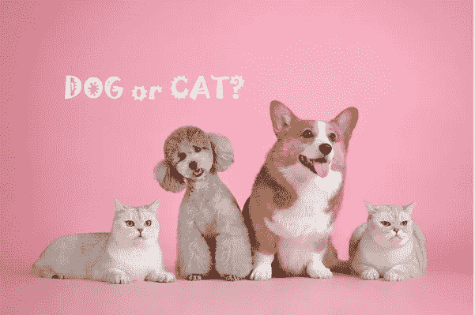
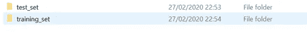
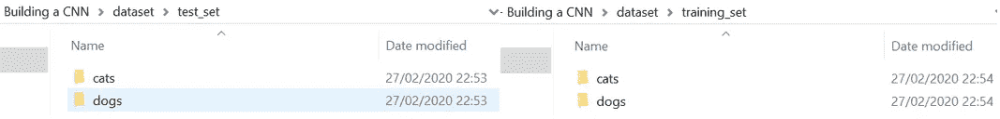
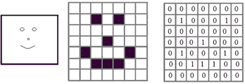
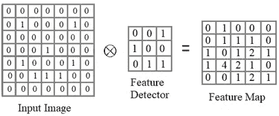
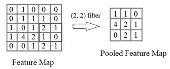
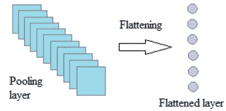
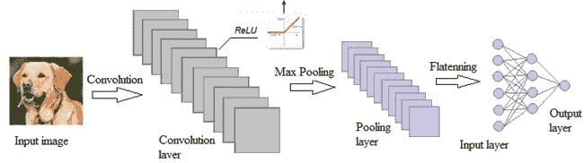
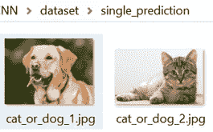

# CNN 图像分类:猫还是狗

> 原文：<https://towardsdatascience.com/cnn-classification-a-cat-or-a-dog-568e6a135602?source=collection_archive---------17----------------------->

## 基于 Keras 的卷积神经网络在图像分类中的应用



Img 改编自 pixabay 通过[链接](https://pixabay.com/photos/pets-cute-cat-dog-3715734/)

在本文中，我将一步一步地介绍如何创建一个基于卷积神经网络(CNN)的图像分类模型。它分为 7 个部分。

1.  问题陈述
2.  数据概述
3.  模型结构
4.  模型编译
5.  模型拟合
6.  模型改进
7.  示例预测

让我们开始旅程吧🏃‍♂️🏃‍♀️.

**1。问题陈述**

我们得到了一组狗和猫的图片。任务是建立一个模型来预测一种动物的类别:狗还是猫？

**2。数据概述**

我们收集的数据是 Kaggle 狗/猫数据集的子集([链接](https://www.kaggle.com/c/dogs-vs-cats/overview))。总共有 10，000 幅图像，80%用于训练集，20%用于测试集。在训练集中，有 4000 张狗的图像，而测试集有 1000 张狗的图像，剩下的都是猫。

所有图片都保存在专门的文件夹结构中，便于 ***Keras*** 理解和区分每张图片的动物类别，如图 1 所示。



图 1.1 创建培训/测试文件夹



图 1.2 分别在训练/测试文件夹中创建狗/猫文件夹

不需要对变量进行编码，因为独立变量是像素值。

**3。模型构建**

**一般来说，构建 CNN 需要 4 个步骤:卷积、最大池化、扁平化和全连接。让我们详细了解一下每一个。**

3.1 卷积

从概念上讲，卷积是在输入图像上应用特征检测器。为了简化概念，取一张笑脸作为输入图像，在图 2 中表示为 0 和 1 的数组。



图 2 Simile face——输入图像(作者创建的 Img)

特征检测器也是一个数字数组。对于每个特征检测器，我们在图像上滑动它，产生一个新的数字数组，代表图像的一个特征。**因此，输入图像和产生特征图的特征检测器之间的操作是卷积**，如下图 3 所示



图 3 卷积图(作者创建的 Img)

如果用不同的特征检测器重复上述卷积，我们产生与特征检测器一样多的特征图，获得卷积层。

具体来说，我们使用***【Conv2D()****函数从 ***Keras*** 构建第一个卷积层。*

```
*classifier = Sequential()
classifier.add(Conv2D(32, (3, 3), input_shape = (64, 64, 3), activation = 'relu'))*
```

*注意，*特征检测器的数量设置为 32，其维数为(3，3)。在大多数 CNN 架构中，通常的做法是从 32 个特征检测器开始，如果需要，增加到 64 或 128 个。**

***input_shape* 是我们通过卷积对其应用特征检测器的输入图像的形状。问题是图像可能有不同的格式和图像大小。所以，我们需要将图像转换成相同的格式和固定的大小。我们稍后将处理图像，现在让我们设置它为 *(64，64，3)。*这里，3 是彩色图像的通道数，(64，64)是每个通道的图像维数，这足以获得良好的精度。如果你在一个像样的 GPU 上工作，请随意尝试(128，128)。**

**最后一个参数是激活函数。我们使用 ***ReLU*** 去除特征图中的任何负像素值。这是因为根据卷积中使用的参数，我们可能会在特征图中获得负像素。移除负像素增加了非线性分类问题的非线性。**

**3.2 最大池化**

**最大池化是通过滑动表格，例如(2，2)，并取表格中的最大值，来减小特征图的大小。如果我们在(5，5)的 1 个特征映射上滑动一个跨度为 2 的表，我们会得到一个大小为(3，3)的特征映射，如图 5 所示。**

****

**图 5 最大汇集图(作者创建的 Img)**

**在每个要素地图上重复最大池化会产生一个池化图层。从根本上说，max pooling 是为了减少完全连接的图层中的节点数量，而不会丢失图像中的关键特征和空间结构信息。具体来说，我们使用***MaxPooling2D()****函数来添加池层。一般来说，我们使用 2x2 过滤器进行合并。***

```
***classifier.add(MaxPooling2D(pool_size = (2, 2)))***
```

***3.3 扁平化***

***如图 7 所示，展平是将所有汇集的特征地图作为完全连接的图层的输入，放入单个矢量中。***

******

***图 7 展平图(作者创建的 Img)***

***现在**问题** : *为什么不直接将输入图像展平成单一矢量*🤔？答案是这样做只会保留图像的像素值，而不会保留空间结构。换句话说，它将丢失每个像素与其周围像素的空间连接方式。但是用卷积，我们得到很多特征图，每个特征图代表图像的一个特定特征。因此，展平向量中的每个节点将表示输入图像的特定细节。***

**具体来说，**

```
**classifier.add(Flatten())**
```

**3.4 完全连接**

**通过以上操作，我们将图像转换为一维向量。现在我们将使用这个向量作为输入层来构建一个分类器。首先，创建一个隐藏层。 *output_dim* 是隐藏层的节点数。作为惯例，我们选择 128 开始，并使用 *ReLU* 作为激活函数。**

```
**classifier.add(Dense(output_dim = 128, activation = ‘relu’))**
```

**然后添加一个输出层。对于二元分类， *output_dim* 为 1，激活函数为 *Sigmoid* 。**

```
**classifier.add(Dense(output_dim =1, activation = ‘sigmoid’))**
```

**我们最终的模型结构如下所示🎉🎉。**

****

**图 8 CNN 架构(作者创建的 Img)**

****4。模型编译****

**添加完所有层后，让我们通过选择一个 *SGD* 算法、一个损失函数和性能指标来编译 CNN。我们使用*二元交叉熵*进行二元分类，使用*分类交叉熵*进行多重分类问题。**

```
**classifier.compile(optimizer = ‘adam’, loss = ‘binary_crossentropy’, metrics =’accuracy’)**
```

****5。** **模型拟合****

**这里我们有 8000 幅图像用于训练集，这不足以避免过度拟合。因此，我们执行图像增强，如旋转、翻转或剪切，以增加图像的数量。它将训练图像分成几批，每批将对随机选择的图像应用随机图像变换，以创建更多不同的图像。**

**具体来说，我们将使用来自 [Keras 官网](https://keras.io/preprocessing/image/)的 ***flow_from_directory(目录)*** 方法加载图片并应用增强。这就是我们以特定方式构建数据文件夹的原因，这样就可以根据文件夹名称来识别每个图像的类别。下面的代码片段允许我们放大图像，并适合和测试 CNN。**

```
**train_datagen = ImageDataGenerator(rescale=1./255, 
     shear_range=0.2, zoom_range=0.2, horizontal_flip=True)test_datagen = ImageDataGenerator(rescale=1./255)train_set = train_datagen.flow_from_directory(‘dataset/training_set’, target_size=(64, 64), batch_size=32, class_mode=’binary’)test_set = 
test_datagen.flow_from_directory(‘dataset/test_set’, target_size=(64, 64), batch_size=32, class_mode=’binary’)classifier.fit_generator(train_set, steps_per_epoch=8000/32, epochs=25, validation_data=test_set, validation_steps=2000/32)**
```

**上面，目标尺寸设置为(64，64)，与我们创建卷积层时的形状相同。现在，让我们来拟合和测试模型。**

**最终，我们获得了 86% 的训练精度和 76% 的测试精度，✨✨.有轻微的过拟合**

**6。型号改进**

**显然，还有提高精度和减少过拟合的空间。**有两种选择，要么增加更多的卷积层，要么增加更多的密集层**。我们再加一个卷积层。**

```
**classifier.add(Conv2D(32, 3, 3, activation = ‘relu’))
classifier.add(MaxPooling2D(pool_size = (2, 2)))**
```

**根据上面的内容，再次在训练集和测试集上运行模型。最终，我们获得了提高后的测试精度 **91%** 和测试精度 **82% 🧨🧨** ！**

**7.**示例预测****

**首先，我们为要预测的图像创建一个文件夹' *single_prediction* ，如图 9 所示。**

****

**图 9 待预测图像**

**其次，我们使用*中的*图像*模块来加载测试图像。注意，将图像的 target_size 设置为(64，64)。***

```
**import numpy as np
from keras.preprocessing import imagetest_image = image.load_img(‘dataset/single_prediction/cat_or_dog_1.jpg’, target_size = (64, 64))**
```

**记住 CNN 需要一个三维的输入图像。因此，我们需要为通道添加一个维度，从 2D 阵列到 3D 阵列。**

```
**test_image = image.img_to_array(test_image)**
```

**然而，这还不够，因为 CNN 期望第**批**有另一个维度。Axis 用于指定我们正在添加的维度的位置。因此在索引 0 处添加了批次维度。**

```
**test_image = np.expand_dims(test_image, axis = 0)**
```

**太好了，该预测了。**

```
**result = classifier.predict(test_image)**
```

**我们得到的结果是 1。要了解动物及其相关数值之间的映射，我们使用:**

```
**training_set.class_indices**
```

**这样，我们知道 0 是猫，1 是狗。太好了。我们 CNN 做了一个正确的预测！**

****太好了！如果你觉得这篇文章有帮助，请随意点击👏s！如果需要源代码，请访问我的** [**Github**](https://github.com/luke4u/CNN-Image-Classification) **页面🤞🤞。****