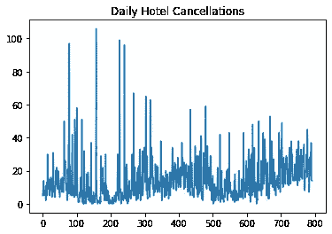
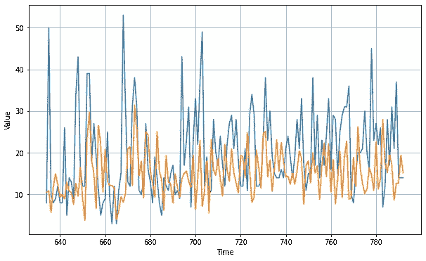
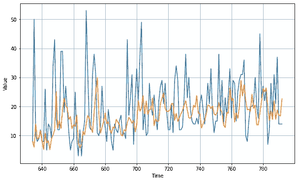

# CNN-LSTM:预测每日酒店取消

> 原文：<https://towardsdatascience.com/cnn-lstm-predicting-daily-hotel-cancellations-e1c75697f124?source=collection_archive---------9----------------------->

## 用 LSTM 和 CNN 进行时间序列预测


来源:图片由 [GDJ](https://pixabay.com/users/gdj-1086657/) 从 [Pixabay](https://pixabay.com/vectors/neural-network-thought-mind-mental-3816319/) 拍摄

# 背景:LSTMs 与 CNN

LSTM(长短期记忆网络)是一种递归神经网络，允许对时间序列中的顺序依赖性进行核算。

假设给定时间序列中的观察值之间存在相关性(一种称为自相关的现象)，标准神经网络会将所有观察值视为独立的，这是错误的，会产生误导性结果。

卷积神经网络是一种应用称为 [**卷积**](https://mathworld.wolfram.com/Convolution.html) 的过程来确定两个函数之间的关系的网络。例如，给定两个函数 *f a* 和 *g，*卷积积分表示一个函数的形状如何被另一个函数修改。这种网络传统上用于图像分类，并且不像递归神经网络那样考虑顺序依赖性。

然而，使其适合预测时间序列的 CNN 的主要优势是 [**扩张卷积**](https://www.inference.vc/dilated-convolutions-and-kronecker-factorisation/)**——或使用过滤器计算每个细胞之间扩张的能力。也就是说，每个细胞之间的空间大小，这反过来允许神经网络更好地理解时间序列中不同观察值之间的关系。**

**因此，在预测时间序列时，LSTM 层和 CNN 层经常会结合在一起。这允许 LSTM 层考虑时间序列中的顺序依赖性，而 CNN 层通过使用扩张卷积进一步通知该过程。**

**也就是说，独立的 CNN 正越来越多地用于时间序列预测，几个 Conv1D 层的组合实际上可以产生非常令人印象深刻的结果-与同时使用 CNN 和 LSTM 层的模型相媲美。**

**这怎么可能呢？让我们来了解一下！**

**下面的例子是使用来自 Udacity 的深度学习课程 TensorFlow 简介[中的 CNN 模板设计的——这个特定的主题可以在 Aurélien Géron 的第 8 课:时间序列预测中找到。](https://www.udacity.com/course/intro-to-tensorflow-for-deep-learning--ud187)**

# **我们的时间序列问题**

**以下分析基于来自 [Antonio、Almeida 和 Nunes (2019)的数据:酒店预订需求数据集](https://www.sciencedirect.com/science/article/pii/S2352340918315191)。**

**想象一下这个场景。一家酒店很难预测每天的酒店预订取消情况。这给预测收入和有效分配酒店房间带来了困难。**

**该酒店希望通过构建一个时间序列模型来解决这个问题，该模型可以以相当高的准确度预测酒店每日取消预订的波动。**

**以下是每日酒店取消预订量波动的时间序列图:**

****

**来源:Jupyter 笔记本输出**

# **模型配置**

**神经网络的结构如下:**

****

**来源:图片由作者创建**

**以下是必须考虑的重要模型参数。**

## **内核大小**

**内核大小设置为 3，这意味着每个输出都是基于前面的三个时间步长计算的。**

**下面是一个粗略的例子:**

****

**来源:图片由作者创作。采用自 Udacity 的模板—深度学习 TensorFlow 简介:时间序列预测**

**设置正确的内核大小是一个实验问题，因为低内核大小会降低模型性能，而高内核大小会有过度拟合的风险。**

**从图中可以看出，采用了三个输入时间步长来产生单独的输出。**

## **填料**

**在这种情况下，使用因果填充以确保输出序列具有与输入序列相同的长度。换句话说，这确保了网络从序列的左侧“填充”时间步长，以确保序列右侧的未来值不会用于生成预测-这显然会导致错误的结果，最终我们会高估模型的准确性。**

## **大步**

**步长设置为 1，这意味着在预测未来值时，过滤器一次向前滑动一个时间步长。**

**然而，这可以设置得更高。例如，将步长设置为 2 意味着输出序列的长度大约是输入序列的一半。**

**较长的步长意味着模型在生成预测时可能会丢弃有价值的数据，但在捕捉长期趋势和消除序列中的噪声时，增加步长会很有用。**

**以下是模型配置:**

```
model = keras.models.Sequential([
  keras.layers.Conv1D(filters=32, kernel_size=3,
                      strides=1, padding="causal",
                      activation="relu",
                      input_shape=[None, 1]),
  keras.layers.LSTM(32, return_sequences=True),
  keras.layers.Dense(1),
  keras.layers.Lambda(lambda x: x * 200)
])
lr_schedule = keras.callbacks.LearningRateScheduler(
    lambda epoch: 1e-8 * 10**(epoch / 20))
optimizer = keras.optimizers.SGD(lr=1e-8, momentum=0.9)
model.compile(loss=keras.losses.Huber(),
              optimizer=optimizer,
              metrics=["mae"])
```

# **结果**

**首先，让我们使用上述模型对不同的窗口大小进行预测。**

**重要的是，窗口大小要足够大，以考虑跨时间步长的波动性。**

**假设我们从窗口大小为 5 开始。**

## **window_size = 5**

**培训损失如下:**

```
plt.semilogx(history.history["lr"], history.history["loss"])
plt.axis([1e-8, 1e-4, 0, 30])
```

****

**来源:Jupyter 笔记本输出**

**以下是预测值与实际每日取消值的对比图:**

```
rnn_forecast = model_forecast(model, series[:,  np.newaxis], window_size)
rnn_forecast = rnn_forecast[split_time - window_size:-1, -1, 0]
plt.figure(figsize=(10, 6))
plot_series(time_valid, x_valid)
plot_series(time_valid, rnn_forecast)
```

****

**来源:Jupyter 笔记本输出**

**平均绝对误差计算如下:**

```
>>> keras.metrics.mean_absolute_error(x_valid, rnn_forecast).numpy()
9.113908
```

**整个验证集的平均值为 19.89，模型的准确性是合理的。然而，我们确实从上图中看到，该模型在预测更多极值方面存在不足。**

## **窗口大小= 30**

**如果窗口大小增加到 30 会怎样？**

**平均绝对误差略有下降:**

```
>>> keras.metrics.mean_absolute_error(x_valid, rnn_forecast).numpy()
7.377962
```

**如前所述，如果我们希望平滑预测，可以将步长设置得更高—注意，这样的预测(输出序列)将比输入序列具有更少的数据点。**

# **无 LSTM 层预测**

**与 LSTM 不同，CNN 不是递归的，这意味着它不保留以前的时间序列模式的记忆。相反，它只能根据模型在特定时间步长输入的数据进行训练。**

**然而，通过将几个 Conv1D 层堆叠在一起，卷积神经网络实际上可以有效地学习时间序列中的长期相关性。**

**这可以使用 **WaveNet** 架构来完成。本质上，这意味着该模型将每一层定义为 1D 卷积层，步长为 1，核大小为 2。第二个卷积层使用的膨胀率为 2，这意味着系列中的每第二个输入时间步长都会被跳过。第三层使用的膨胀率为 4，第四层使用的膨胀率为 8，依此类推。**

**其原因是，它允许较低层学习时间序列中的短期模式，而较高层学习较长期的模式。**

**波网模型定义如下:**

```
model = keras.models.Sequential()
model.add(keras.layers.InputLayer(input_shape=[None, 1]))
for dilation_rate in (1, 2, 4, 8, 16, 32):
    model.add(
      keras.layers.Conv1D(filters=32,
                          kernel_size=2,
                          strides=1,
                          dilation_rate=dilation_rate,
                          padding="causal",
                          activation="relu")
    )
model.add(keras.layers.Conv1D(filters=1, kernel_size=1))
optimizer = keras.optimizers.Adam(lr=3e-4)
model.compile(loss=keras.losses.Huber(),
              optimizer=optimizer,
              metrics=["mae"])model_checkpoint = keras.callbacks.ModelCheckpoint(
    "my_checkpoint.h6", save_best_only=True)
early_stopping = keras.callbacks.EarlyStopping(patience=50)
history = model.fit(train_set, epochs=500,
                    validation_data=valid_set,
                    callbacks=[early_stopping, model_checkpoint])
```

**窗口大小 64 用于训练模型。在这种情况下，我们使用比 CNN-LSTM 模型更大的窗口大小，以确保 CNN 模型拾取更长期的相关性。**

**注意 [**提前停止**](https://machinelearningmastery.com/how-to-stop-training-deep-neural-networks-at-the-right-time-using-early-stopping/) 是在训练神经网络时使用的。这样做的目的是确保神经网络在进一步训练会导致过度拟合的点上停止训练。手动确定这是一个相当随意的过程，因此尽早停止会对此有很大帮助。**

**现在，让我们使用刚刚构建的独立 CNN 模型来生成预测。**

```
cnn_forecast = model_forecast(model, series[..., np.newaxis], window_size)
cnn_forecast = cnn_forecast[split_time - window_size:-1, -1, 0]
```

**这是预测数据与实际数据的对比图。**

****

**来源:Jupyter 笔记本输出**

**平均绝对误差略高，为 7.49。**

**注意，对于这两个模型， [Huber 损失](https://www.analyticsvidhya.com/blog/2019/08/detailed-guide-7-loss-functions-machine-learning-python-code/)被用作损失函数。这种类型的损失往往对异常值更稳健，因为它对较小的误差是二次的，对较大的误差是线性的。**

**这种类型的损失适合这种情况，因为我们可以看到数据中存在一些异常值。使用 MSE(均方误差)会过度夸大模型产生的预测误差，而 MAE 本身可能会低估误差的大小，因为它没有考虑这些异常值。Huber 损失函数的使用允许一个满意的中间值。**

```
>>> keras.metrics.mean_absolute_error(x_valid, cnn_forecast).numpy()
7.490844
```

**即使具有稍高的 MAE，CNN 模型在预测每日酒店取消方面表现得相当好，而不必为了学习长期依赖性而与 LSTM 层结合。**

# **限制**

**当然，任何模式都有局限性，CNN 也不例外。**

**假设模型正在进行单步预测，这意味着需要相关窗口中直到时间 *t* 的所有观察来预测时间 *t+1* 的值。在这方面，一步到位的 CNN 不能用来做长期预测。虽然多步 CNN 可以用于此目的，但是这种模型是否优于 ARIMA 模型是有争议的。**

**此外，CNN(或任何神经网络模型)需要大量数据来有效训练。虽然许多时间序列模型都带有预先构建的参数来模拟一系列时间序列，但 CNN 完全是从零开始学习。在这方面，研究人员可能会花费大量时间来配置 CNN 模型，并最终获得相对于其他标准时间序列模型而言较低的精度，或者仅获得与所需的额外训练时间和数据资源不相称的边际精度。**

**在此特定示例中，使用 80%的数据作为训练数据来训练模型，然后根据 20%的验证数据来筛选预测准确性。但是，对模型是否有效的真正测试包括将预测准确性与测试数据或模型完全看不到的数据进行比较。这里没有这样做，因为本文只讨论了模型训练组件。**

**然而，神经网络很容易过度拟合——即模型在它以前见过的数据上表现良好——而在预测看不见的数据上表现不佳。**

# **结论**

**在本例中，我们看到:**

*   **CNN 和 LSTMs 在时间序列预测中的异同**
*   **膨胀卷积如何帮助 CNN 预测时间序列**
*   **用 CNN 预测时间序列时核大小、填充和步长的修正**
*   **使用 WaveNet 架构使用独立 CNN 层进行时间序列预报**

**具体来说，我们看到了通过使用膨胀，与 CNN-LSTM 模型相比，CNN 如何能够产生同样强的结果。**

**非常感谢您的宝贵时间，非常感谢您的任何问题、建议或反馈。**

**如前所述，这个主题在 Udacity 课程的深度学习课程 TensorFlow 简介[中也有涉及，我强烈推荐关于时间序列预测的章节，以了解关于这个主题的更多详细信息。通常免责声明适用—这只是个人建议，我与本课程的作者没有任何关系。](https://www.udacity.com/course/intro-to-tensorflow-for-deep-learning--ud187)**

**你也可以在这里找到我用来运行酒店取消[这个例子的全部 Jupyter 笔记本。](https://github.com/MGCodesandStats/hotel-cancellations)**

**原 Jupyter 笔记本(版权 2018，TensorFlow 作者)也可以在[这里](https://colab.research.google.com/github/tensorflow/examples/blob/master/courses/udacity_intro_to_tensorflow_for_deep_learning/l08c09_forecasting_with_cnn.ipynb#scrollTo=PgYwn9VM8OJi)找到。**

***免责声明:本文是在“原样”的基础上编写的，没有任何担保。本文旨在提供数据科学概念的概述，不应以任何方式解释为专业建议。这些发现和解释是作者的，不被本文中提到的任何第三方认可或附属于任何第三方。***