# CNN 迁移学习和微调

> 原文：<https://towardsdatascience.com/cnn-transfer-learning-fine-tuning-9f3e7c5806b2?source=collection_archive---------0----------------------->

了解如何应用这些强大的技术，将您的深度学习模型提升到一个全新的水平！


图片来自 [Unsplash](https://unsplash.com/photos/WE_Kv_ZB1l0)

# 介绍

正如我们在[之前的文章](/convolutional-neural-networks-most-common-architectures-6a2b5d22479d)中看到的，我们可以使用研究团队开发的架构，并利用他们的力量进行预测，并在我们的深度学习模型中获得更好的结果。

训练一个神经网络需要时间，幸运的是现在有一些方法可以避免:

*   定义神经网络的架构
*   从一开始就训练她

我们已经看到了避免定义架构[的方法，这里是](/convolutional-neural-networks-most-common-architectures-6a2b5d22479d)，它包括使用已知工作良好的预定义架构:ResNet、AlexNet、VGG、Inception、DenseNet 等。

那如何避免从头开始训练它呢？我这么说是什么意思？

神经网络用随机权重初始化(通常),在一系列时期后达到一些值，允许我们正确地分类我们的输入图像。

如果我们可以将这些权重初始化为我们事先知道的某些值，这些值已经可以很好地对某个数据集进行分类，会发生什么？

通过这种方式，我们不需要像我们从零开始训练网络一样大的数据集(从几十万甚至几百万的图像，我们可以到几千个)，也不需要等待大量的历元来获得分类的好值，由于它们的初始化，它们会更容易。

让我们探索如何利用迁移学习和微调技术来实现这一点:

# 迁移学习

我们以在 ImageNet 数据集上训练的 VGG16 网络为例。让我们看看它的架构:


按作者分列的数字

我们知道，ImageNet 由大约 120 万幅图像组成的数据集用于训练，5 万幅用于验证，10 万幅用于测试，属于 1000 个类别。

现在假设我们想要将 ImageNet 上训练的 VGG16 应用到另一个数据集，假设我们选择了 [CIFAR-10](https://www.cs.toronto.edu/~kriz/cifar.html) 。我们怎么做呢？

记住 CNN 的一般方案，我们在第一阶段有一个特征提取器，然后是一个分类器:

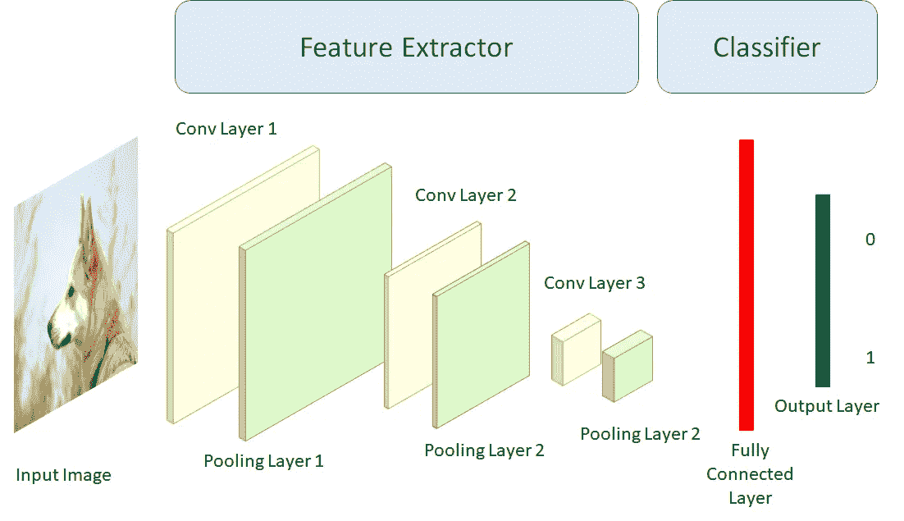

按作者分列的数字

如果我们删除 VGG16 的最后一层，它只是为 ImageNet 中的 1000 个类中的每一个类取一个概率，并用一个取 10 个概率的层来替换它，会怎么样？这样，我们可以利用 VGG16 在 ImageNet 上训练的所有知识，并将其应用于我们的问题！

正如我们所看到的，我们要做的是改变分类阶段，以便最后一层是 10 个神经元之一(我们的 CIFAR 10 有 10 个类)，然后我们将重新训练网络，允许完全连接的层的权重被改变，即分类阶段。

为此，我们将使用来自 ImageNet 的权重初始化我们的网络，然后冻结所有卷积层和最大池层，以便它们不会修改自己的权重，只留下完全连接的层空闲。

一旦完成，我们将开始重新训练。通过这种方式，我们设法利用我们网络的特征提取阶段，并且只调整最终的分类器来更好地与我们的数据集一起工作。这就是所谓的迁移学习，因为我们利用另一个问题的知识来解决我们正在处理的问题。

这种方法也可以通过保存最大池最后一层给出的特征，然后将该数据放入任何分类器(SVM、logreg 等)来实现。

让我们看看我们该如何做:

## Keras 实施

```
**# We first load the necessary libraries, the dataset and reshape its dimensons to the minimum allowed by the VGG16 --> (48,48,3)**
import tensorflow as tf
from keras import callbacks
from keras import optimizers
from keras.engine import Model
from keras.layers import Dropout, Flatten, Dense
from keras.optimizers import Adam
from keras.applications import VGG16
from keras.datasets import cifar10
from keras.utils import to_categorical
import numpy as npinput_shape = (48, 48, 3)(X_train, y_train), (X_test, y_test) = cifar10.load_data()
Y_train = to_categorical(y_train)
Y_test = to_categorical(y_test)**# resize train set**
X_train_resized = []
for img in X_train:
  X_train_resized.append(np.resize(img, input_shape) / 255)

X_train_resized = np.array(X_train_resized)
print(X_train_resized.shape)**# resize test set**
X_test_resized = []
for img in X_test:
  X_test_resized.append(np.resize(img, input_shape) / 255)

X_test_resized = np.array(X_test_resized)
print(X_test_resized.shape)
```

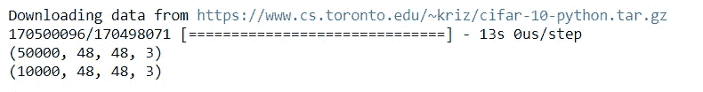

```
**# We build the base model**
base_model = VGG16(weights='imagenet', include_top=False, input_shape=input_shape)
base_model.summary()
```

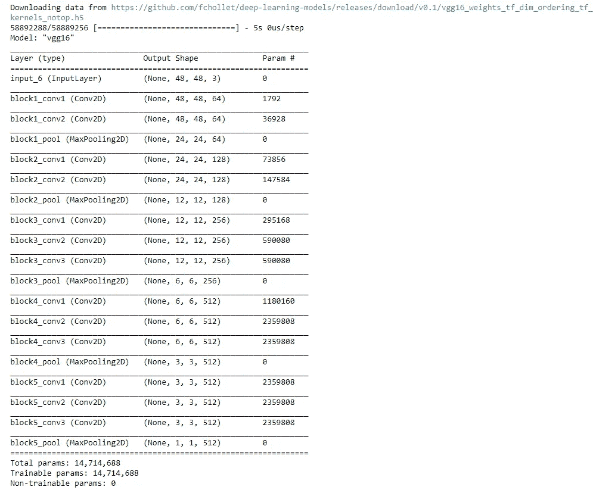

```
**# We freeze every layer in our base model so that they do not train, we want that our feature extractor stays as before --> transfer learning**
for layer in base_model.layers: 
  layer.trainable = False
  print('Layer ' + layer.name + ' frozen.')**# We take the last layer of our the model and add it to our classifier**
last = base_model.layers[-1].output
x = Flatten()(last)
x = Dense(1000, activation='relu', name='fc1')(x)
x = Dropout(0.3)(x)
x = Dense(10, activation='softmax', name='predictions')(x)
model = Model(base_model.input, x)**# We compile the model**
model.compile(optimizer=Adam(lr=0.001), loss='categorical_crossentropy', metrics=['accuracy'])**-**
model.summary()
```

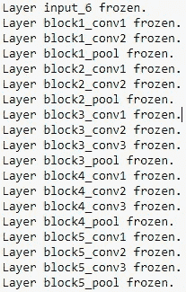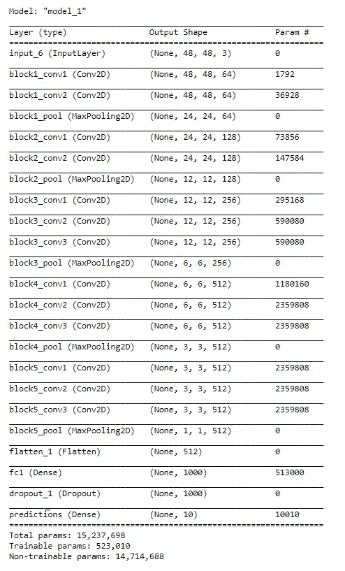

```
**# We start the training**
epochs = 10
batch_size = 256**# We train it**
model.fit(X_train_resized, Y_train,
          batch_size=batch_size,
          validation_data=(X_test_resized, Y_test),
          epochs=epochs)
```

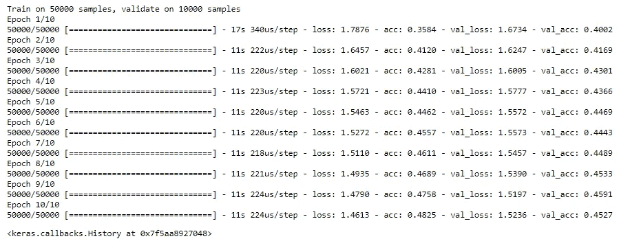

```
**# We evaluate the accuracy and the loss in the test set**
scores = model.evaluate(X_test_resized, Y_test, verbose=1)
print('Test loss:', scores[0])
print('Test accuracy:', scores[1])
```

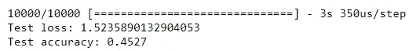

我们根本不需要训练，而且我们取得了不错的成绩！请记住，如果我们随机进行，正确的概率将是 1/10=0.1 或 10%，因为我们有 10 个类。

最初训练网络的数据集和我们的问题的数据集越相似，我们得到的结果就越好。

如果我们的数据集与 ImageNet 的无关，或者我们想进一步改善结果呢？

为此，我们使用微调。

# 微调

通过微调，我们首先改变最后一层以匹配我们数据集中的类，就像我们之前对迁移学习所做的那样。但是除此之外，我们也重新训练我们想要的网络层次。

请记住 VGG16 的架构:


按作者分列的数字

我们在前面的示例中所做的只是改变分类阶段的层，保留网络在前面的任务中提取特征(模式)时获得的知识，我们从该任务中加载权重(ImageNet)。

通过微调，我们不局限于只重新训练分类器阶段(即完全连接的层)，我们还将重新训练特征提取阶段，即卷积和汇集层。

重要的是要记住，在神经网络中，第一层检测更简单和更通用的模式，我们在体系结构中发展得越快，就越针对数据集，它们检测的模式就越复杂。

因此，我们可以允许卷积和池层的最后一个块被重新训练。

**我什么时候做微调和迁移学习？我如何选择从哪一层重新培训？**

一般来说，我们要做的第一件事是转移学习，也就是说，我们不会重新培训我们的网络。这将为我们提供一个必须克服的底线。然后，我们将只重新训练分类阶段，然后我们也可以尝试重新训练一些卷积块。

## 摘要

*   进行迁移学习，即只修改最后一层，使其输出数量与我们的类(基线)相同
*   尝试重新训练分类阶段，即密集层
*   试图重新训练一些卷积阶段

大多数情况下，遵循这些步骤，你会得到适合你的问题的结果

这也取决于你遇到的问题的类型。如果:

*   **新的数据集很小，和原来的相似**:微调的时候要小心，也许选择卷积阶段最后一层的特征，使用 SVM 或者线性分类器更好。
*   **新的数据集很大，与原来的**相似:拥有更多数据我们可能不会过度适应，所以我们可以更有信心地进行微调。
*   **新的数据集很小，与原来的**非常不同:最好使用卷积阶段早期层的特征，因为这将被设置为比后期层更通用的模式，然后使用线性分类器。
*   新的数据集很大，与原来的大不相同:我们将从头开始训练它！但是，仍然建议您使用 ImageNet 的权重来初始化权重。

## 注意

使用这些技术时，您必须考虑预训练模型的可能限制。例如，它们可能需要最小的图像尺寸。

此外，当重新训练网络时，我们通常选择比从头开始更低的学习速率，因为我们从假设为好的权重的初始化开始。

## 微调 Keras 实现

```
**# Fine Tuning Example, classification VGG16 with CIFAR 10, we import the necessary libraries**
import tensorflow as tf
from keras import callbacks
from keras import optimizers
from keras.engine import Model
from keras.layers import Dropout, Flatten, Dense
from keras.optimizers import Adam
from keras.preprocessing.image import ImageDataGenerator
from keras.applications import VGG16
from keras.datasets import cifar10
from keras.utils import to_categorical
import numpy as np**# We first load the dataset and reshape its dimensions to the minimum allowed by VGG16 --> (48, 48, 3)**input_shape = (48, 48, 3)(X_train, y_train), (X_test, y_test) = cifar10.load_data()
Y_train = to_categorical(y_train)
Y_test = to_categorical(y_test)# resize train set
X_train_resized = []
for img in X_train:
  X_train_resized.append(np.resize(img, input_shape) / 255)

X_train_resized = np.array(X_train_resized)
print(X_train_resized.shape)# resize test set
X_test_resized = []
for img in X_test:
  X_test_resized.append(np.resize(img, input_shape) / 255)

X_test_resized = np.array(X_test_resized)
print(X_test_resized.shape)
```

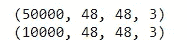

```
**# We build the base model** base_model = VGG16(weights='imagenet', include_top=False, input_shape=input_shape)
base_model.summary()
```

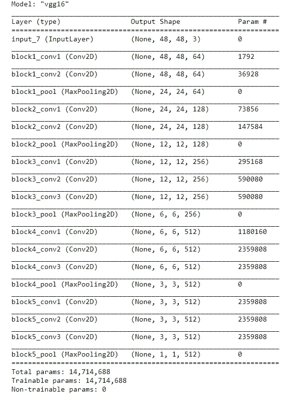

```
**# We allow to the last convolutional andthe classification stages  to train**
for layer in base_model.layers:
  if layer.name == 'block5_conv1':
    break
  layer.trainable = False
  print('Layer ' + layer.name + ' frozen.')**# We add our classificator (top_model) to the last layer of the model**
last = base_model.layers[-1].output
x = Flatten()(last)
x = Dense(1000, activation='relu', name='fc1')(x)
x = Dropout(0.3)(x)
x = Dense(10, activation='softmax', name='predictions')(x)
model = Model(base_model.input, x)**# We compile the model**
model.compile(optimizer=Adam(lr=0.001), loss='categorical_crossentropy', metrics=['accuracy'])**# We see the new structure of the model**
model.summary()
```

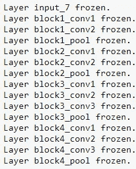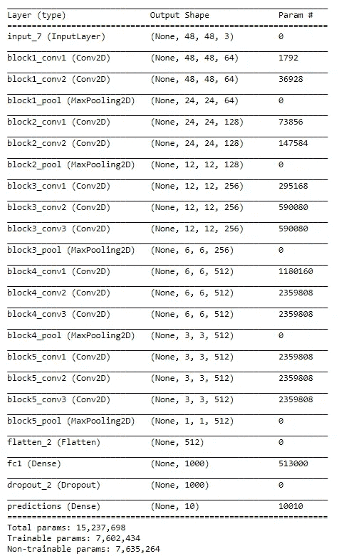

```
**# We start the training**
epochs = 15
batch_size = 256**# We train the model**
model.fit(X_train_resized, Y_train,
          batch_size=batch_size,
          validation_data=(X_test_resized, Y_test),
          epochs=epochs)
```

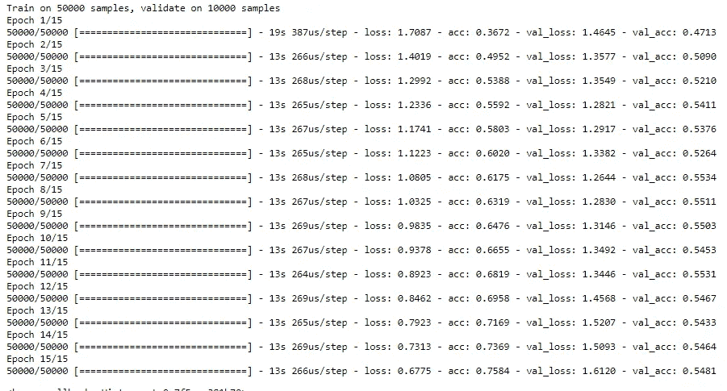

```
**# We evaluate the accuracy and the loss in the test set**
scores = model.evaluate(X_test_resized, Y_test, verbose=1)
print('Test loss:', scores[0])
print('Test accuracy:', scores[1])
```

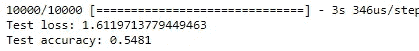

因此，当我们面临深度学习问题时，我们应该总是使用微调并建立一个基线模型，我们稍后会尝试改进它。

# 最后的话

一如既往，我希望你喜欢这篇文章，并且你获得了关于如何实现和开发具有迁移学习和微调的卷积神经网络的直觉！

*如果你喜欢这篇文章，那么你可以看看我关于数据科学和机器学习的其他文章* [*这里*](https://medium.com/@rromanss23) *。*

*如果你想了解更多关于机器学习、数据科学和人工智能的知识* ***请在 Medium*** *上关注我，敬请关注我的下一篇帖子！*