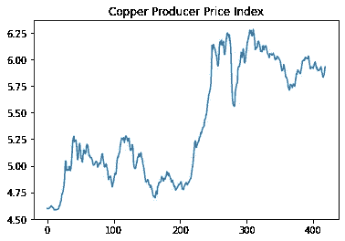
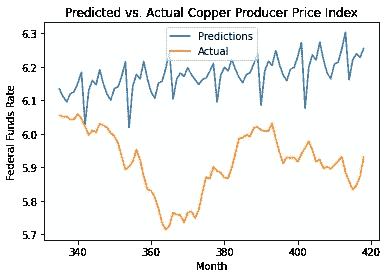
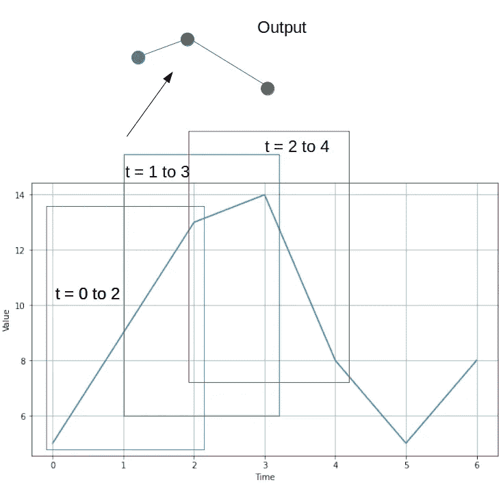
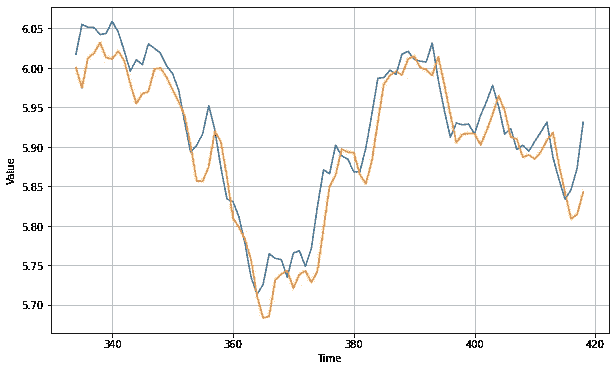
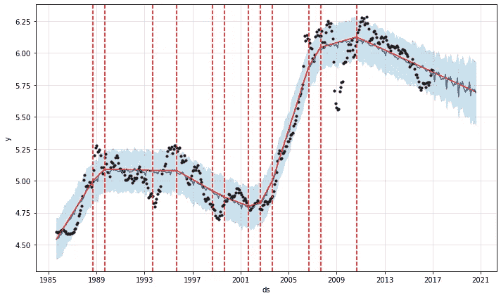

# CNN vs. Prophet:预测铜生产者价格指数

> 原文：<https://towardsdatascience.com/cnn-vs-prophet-forecasting-the-copper-producer-price-index-af4da63bd93d?source=collection_archive---------44----------------------->

## 哪个模型在预测铜价方面做得更好？


来源:图片由 [3844328](https://pixabay.com/users/3844328-3844328/) 发自 [Pixabay](https://pixabay.com/photos/stock-trading-monitor-business-1863880/)

*免责声明:本文是在“原样”的基础上编写的，没有担保。它旨在提供数据科学概念的概述，不应被解释为投资建议或任何其他类型的专业建议。*

在之前关于数据科学的文章中，我试图使用 Prophet 模型来预测铜生产者价格指数。数据来源于[弗雷德经济数据](https://fred.stlouisfed.org/series/WPUSI019011)使用 Quandl。

以下是数据图(请注意，在本练习中，所有价格均以对数表示):



资料来源:弗雷德经济数据

所讨论的时间序列从 1985 年 9 月到 2020 年 7 月，平均绝对误差为 0.257(相比之下，整个测试集的平均值为 5.917)。

以下是预测值与实际值的对比图:



来源:Jupyter 笔记本输出

虽然 Prophet 模型在检测季节性和趋势成分方面很有效，并且还提供了通过适当修改变化点来改进预测的能力，但在捕捉一个时间段到下一个时间段的波动性时，这种模型不一定做得特别好。

在这方面，我决定使用卷积神经网络(以下简称为 CNN)模型对这些数据进行建模，以研究该模型是否能更有效地预测这一时间序列。

作为一个警告，下面的例子更多的是一个学术练习，而不是预测资产价格的真实尝试。鉴于我们正在处理月度数据，神经网络更容易捕捉到不同时间段的波动。

在现实生活场景中，时间序列是在更短的时间间隔(小时、分钟甚至秒)内预测的，数据集中存在更多的随机性(或随机性)。这可能会显著影响预测的准确性。此外，多变量时间序列可能证明在更普遍地预测经济时间序列方面更有效——假设这种时间序列受到许多干预。

然而，使用 CNN 来模拟月度数据将被用作这一目的的起点。

请注意，下面的示例使用了来自 Udacity 的深度学习课程 TensorFlow 简介[中的模型模板——这一特定主题可在 Aurélien Géron 的第 8 课:时间序列预测中找到。](https://www.udacity.com/course/intro-to-tensorflow-for-deep-learning--ud187)

此外，原 Jupyter 笔记本(版权 2018，TensorFlow 作者)也可以在[这里](https://colab.research.google.com/github/tensorflow/examples/blob/master/courses/udacity_intro_to_tensorflow_for_deep_learning/l08c09_forecasting_with_cnn.ipynb#scrollTo=PgYwn9VM8OJi)找到。

# CNN 模型的背景

我之前在我的上一篇文章中详细阐述了 CNN 模型的构建模块，标题是[“CNN-LSTM:预测每天的酒店取消量”](/cnn-lstm-predicting-daily-hotel-cancellations-e1c75697f124)。因此，我在此不再赘述，但可以说，CNN 通过使用先前的时间步长(基于特定的窗口大小)来产生数据点输出，如下所示:



来源:图片由作者创作。采用自 Udacity 的模板—深度学习 TensorFlow 简介:时间序列预测

CNN 具有通过 **WaveNet** 架构学习时间序列中短期和长期相关性的内在能力，其中几个 Conv1D(一维卷积)层堆叠在一起。这允许较低层学习短期依赖性，而较高层学习长期依赖性。在我们试图预测的时间序列的背景下，这个模型似乎适合这个目的。

# 模型配置

对数据执行 80/20 分割，时间序列中的前 334 个数据点用于训练 CNN 模型，其余的点用于验证目的。

```
split_time = 334
time_train = time[:split_time]
x_train = series[:split_time]
time_valid = time[split_time:]
x_valid = series[split_time:]
```

选择窗口大小为 64，批量大小为 128，训练超过 500 个时期。使用 [Huber 损失](https://www.analyticsvidhya.com/blog/2019/08/detailed-guide-7-loss-functions-machine-learning-python-code/)作为损失函数，以确保模型精度读数不受异常值的影响。

```
keras.backend.clear_session()
tf.random.set_seed(42)
np.random.seed(42)window_size = 64
train_set = seq2seq_window_dataset(x_train, window_size,
                                   batch_size=128)
valid_set = seq2seq_window_dataset(x_valid, window_size,
                                   batch_size=128)model = keras.models.Sequential()
model.add(keras.layers.InputLayer(input_shape=[None, 1]))
for dilation_rate in (1, 2, 4, 8, 16, 32):
    model.add(
      keras.layers.Conv1D(filters=32,
                          kernel_size=2,
                          strides=1,
                          dilation_rate=dilation_rate,
                          padding="causal",
                          activation="relu")
    )
model.add(keras.layers.Conv1D(filters=1, kernel_size=1))
optimizer = keras.optimizers.Adam(lr=3e-4)
model.compile(loss=keras.losses.Huber(),
              optimizer=optimizer,
              metrics=["mae"])model_checkpoint = keras.callbacks.ModelCheckpoint(
    "my_checkpoint.h6", save_best_only=True)
early_stopping = keras.callbacks.EarlyStopping(patience=50)
history = model.fit(train_set, epochs=500,
                    validation_data=valid_set,
                    callbacks=[early_stopping, model_checkpoint])
```

请注意，在上述示例中，训练模型时使用了双倍膨胀率。如上所述，这样做的原因是为了让网络学习时间序列中的短期和长期模式。

```
cnn_forecast = model_forecast(model, series[..., np.newaxis], window_size)
cnn_forecast = cnn_forecast[split_time - window_size:-1, -1, 0]
plt.figure(figsize=(10, 6))
plot_series(time_valid, x_valid)
plot_series(time_valid, cnn_forecast)
```



来源:Jupyter 笔记本输出

平均绝对误差计算如下:

```
>>> keras.metrics.mean_absolute_error(x_valid, cnn_forecast).numpy()
0.027838342
```

# 先知

脸书的 [Prophet 时间序列模型](https://facebook.github.io/prophet/docs/trend_changepoints.html)的一个有用特性是能够识别**变点**，或者时间序列中重大结构变化的时期。准确识别这些点反过来可以改进时间序列预测。

如上所述，先知模型的 MAE 值为 **0.257** ，与 CNN 得出的结果相比，这个值要高得多。

**12** 在 Prophet 模型中定义了变化点(或趋势的显著偏差)。

```
pro_change= Prophet(n_changepoints=12)
forecast = pro_change.fit(train_dataset).predict(future)
fig= pro_change.plot(forecast);
a = add_changepoints_to_plot(fig.gca(), pro_change, forecast)future_data = pro_change.make_future_dataframe(periods=43, freq = 'm')

#forecast the data for future data
forecast_data = pro_change.predict(future_data)
pro_change.plot(forecast_data);
```



来源:Jupyter 笔记本输出

也就是说，让我们再次看看预测值与实际值的对比图:


来源:Jupyter 笔记本输出

显然，CNN 在预测铜价的月度波动方面表现得更好——尽管 Prophet 模型的 MAE 相对于平均值仍然较低——我们看到实际时间序列中的波动性明显更大，而预测的时间序列没有显示出来。

# 结论

如前所述，预测这样的时间序列确实存在固有的局限性，因为不知道 CNN 是否会在更短的时间内表现得更好，具有更大的随机性。此外，这种时间序列受到各种干预的影响，而这些干预是过去的值所不能解释的。

然而，在这种情况下，CNN 在捕捉铜价的月度波动方面做得相当好。

在本文中，我们介绍了:

*   如何配置 CNN 来预测时间序列
*   CNN 和 Prophet 模型之间的差异
*   这种模型在预测经济时间序列中的局限性

非常感谢您的宝贵时间，非常感谢您的任何问题或反馈。

*免责声明:本文是在“原样”的基础上编写的，没有任何担保。它旨在提供数据科学概念的概述，不应被解释为投资建议或任何其他类型的专业建议。*