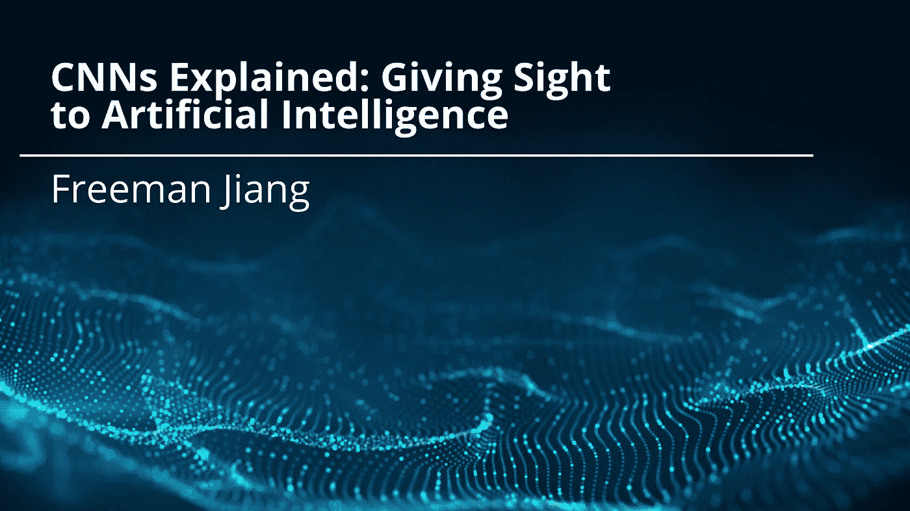
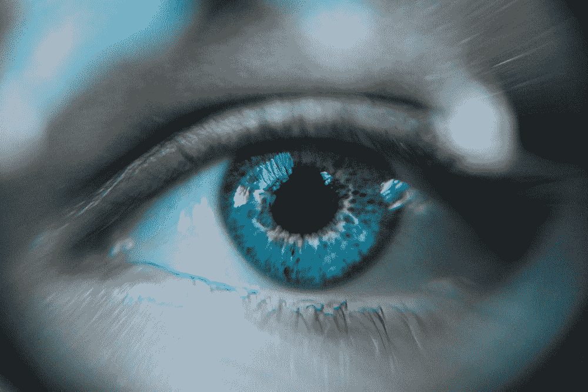
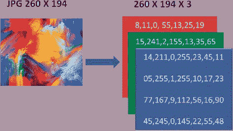
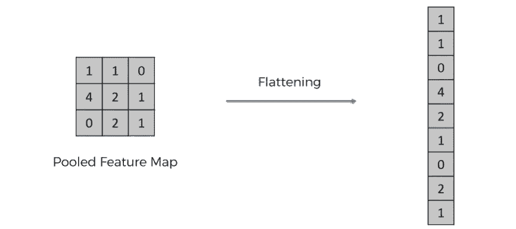
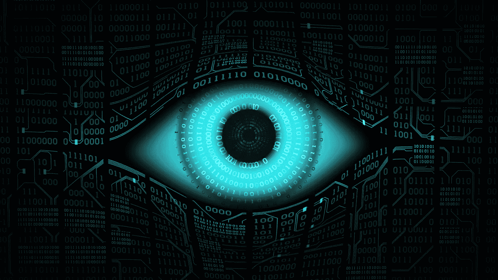

# 美国有线电视新闻网解释说:给予人工智能视觉

> 原文：<https://towardsdatascience.com/cnns-explained-giving-sight-to-artificial-intelligence-304f252346bc?source=collection_archive---------33----------------------->

# 视觉——这很复杂

现在在房间里四处看看。你看到的一切，所有的颜色、阴影、你能认出的物体——所有这些都是可能的，因为我们人类可以 ***看到*** 。事实证明，我们很擅长这个。人类的视力清晰、专注、远视，是地球上最好的视力之一，只有像猎鹰这样的食肉鸟类才能与之匹敌。我们真的很擅长观察，这是因为能够准确快速地识别物体对我们来说极其重要——比如说草原上的那个小身影是另一个人还是一头饥饿的狮子。

照片由[丹尼尔·库切列夫](https://unsplash.com/@kuzelevdaniil?utm_source=unsplash&utm_medium=referral&utm_content=creditCopyText)在 [Unsplash](https://unsplash.com/s/photos/eye?utm_source=unsplash&utm_medium=referral&utm_content=creditCopyText) 拍摄

然而，我们从来没有真正想过如何理解不断涌入我们眼睛的光子。简单地说，眼睛实际上不做任何事情。视网膜收集流入它的光线，并简单地将这些信息作为电化学信号传输到大脑。另一方面，大脑负责所有的工作。它处理这些信号，并理解眼睛实际看到的东西。你能从正在阅读的信件中分辨出一团光子的原因是因为你的大脑🧠.

计算机以类似的方式工作。这就是为什么你不能把一台电脑和一台相机连接起来，然后期望它知道它在看什么。计算机首先需要学习如何 ***理解*** 它看到的东西。为此，我们需要卷积神经网络或 CNN。

# 但首先，计算机实际上是如何看到图像的？

计算机看图像的方式与人类(或任何其他生物)不同。计算机将图像视为数字矩阵，每个数字代表一个特定像素的强度。因此，对于[灰度](https://en.wikipedia.org/wiki/Grayscale)图像，低数值意味着更多的黑色，高数值意味着更多的白色。

用数字矩阵表示的亚伯拉罕·林肯的简化图像

然而，如果只有黑和白，这个世界会很无聊，对吗？所以它变得更辣。 通过混合使用红色、绿色和蓝色，计算机可以创造出几乎所有人眼可以感知的颜色。因此，当计算机查看彩色图像或 RGB 图像时，这些图像不是以二维数字矩阵表示，而是以三维数字矩阵表示🤯，每种颜色一个通道:红色、绿色和蓝色。

计算机抽象艺术。嗯，是的…看看这些数字

# CNN 中的“卷积”

因此，现在我们有了一种可以量化的方法来定义计算机图像，我们可以深入研究 CNN 实际上是如何工作的。细胞神经网络包括两个主要部分:特征学习和分类。

CNN 的一般形式

在特征学习中，**卷积层**用于从给定图像中提取特征。每个卷积层使用一个滤波器或内核来滑过输入图像。在每个位置，执行矩阵乘法，并将结果加到新的特征图上——卷积原始图像。新的特征图本质上告诉计算机内核中的特征也在图像的同一部分的可能性有多大。

卷积层在三个不同的 RGB 通道上传递三个不同的内核，以创建新的特征图

对于不同的过滤器，这种操作被反复重复，最终产生许多不同的特征图。然后将卷积层应用于已经卷积的特征地图。这个想法是，卷积层数越多，计算机可以识别的高级特征就越多。因此，如果网络接收到一张狗的图像，在最初几层，CNN 只会检测边缘，然后在下一层，可能是耳朵，然后是整个头部，最后它将能够对狗进行整体分类。

# 使用池层降低计算能力

虽然卷积神经网络的核心是卷积层，但它并不仅仅由它们组成。有了所有这些特征地图，并且必须在每个地图上滑动内核，网络在能够准确提取特征之前可能需要大量的计算能力。这就是为什么大多数 CNN 使用**池层**来减少这些特征地图的大小。

max-pooling 层将 4x4 图像缩小为 2x2 图像。

这些池图层获取输入影像的一部分，并获取这些部分的平均、最大或最小像素值，以创建更小的要素地图。由于这些地图更小，它们不需要太多的计算能力来处理。尽管如此，它们仍然准确地再现了原始图像。

# 人工神经网络分类

在特征学习中，每个卷积层之后是另一个池层，并且这被多次进行以从图像中提取所有必要的更高级特征。下一步包括将特征图发送到完全连接的层或人工神经网络(ANN)中。然而，这一层只能接受一维数据，正如我们之前所说，计算机将图像视为三维形状。

因此，CNN 获取特征地图，并将其展平成一维数字数组(实际上只是一个列表)，然后将其发送到人工神经网络。人工神经网络中的神经元是完全连接的，这意味着它们都与前一层神经元的激活相关联。每个连接都有一个特定的权重，这个权重精确地决定了该连接会对下一个神经元产生多大的兴奋。

这些连接最终都汇聚到几个神经元，最兴奋的神经元作为 CNN 的输出给出——这是 CNN 对给定图像的分类。通过将 CNN 的给定答案与实际答案进行比较来训练 CNN，调整全连接层中的所有权重和偏差，以使输出更接近实际答案。这被重复数千次，直到该模型能够准确地分类，即使是新的图像。

# CNN 的力量

卷积神经网络已被证明在理解图像方面极其有效和高效。CNN 现在被用于无数的应用中，从无人驾驶汽车到面部识别。他们分析和分类图像的能力甚至已经超过了人类，世界各地的人们越来越认识到人工智能的力量。酝酿了很长时间，但毫无疑问，现在人工智能终于睁开了眼睛。由我们来决定这是好是坏。

[来源](http://www.valinor.co.il/big_brother_is_watching_you/)