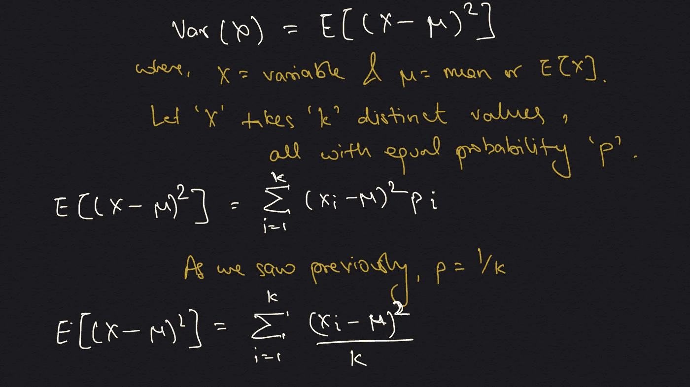
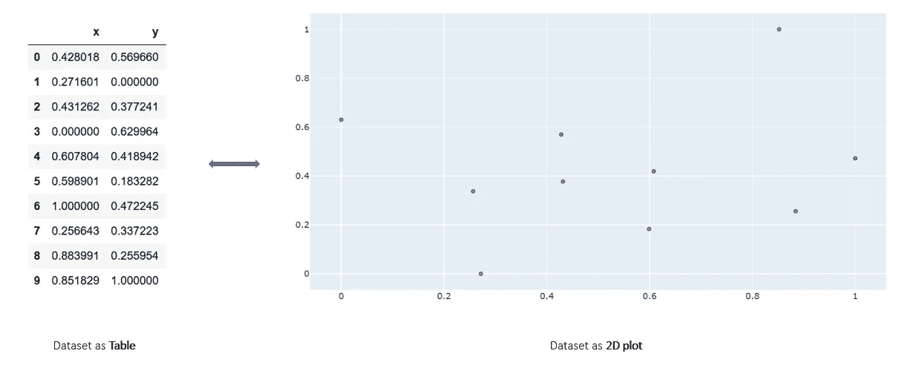

# 协变:直观的解释！

> 原文：<https://towardsdatascience.com/co-variance-an-intuitive-explanation-a67f6c80674d?source=collection_archive---------26----------------------->

## **一个全面而简单的指南，更侧重于公式背后的思想，而不是数学本身——开始用期望值、均值、方差构建模块，最终理解大图，即协方差**

共方差计算的所有荣耀！

## 介绍

与普遍的看法相反，公式不仅仅是数学符号。它试图表达一种想法，这种想法隐藏在数学之下，除非你真正去寻找，否则是不明显的。这种表述的主要问题(正如我经常遇到的那样)是，过一段时间后，你会忘记这个公式。因此，这里是我试图解释一个话题，使它坚持与观众。在深入讨论之前，我将尝试解释一些先决话题。如果您已经熟悉它们，请随意跳过。如果没有，一起骑:)

## 期望和均值

让我们从一个相对简单的主题开始，这是理解协方差所需的一个基本块。概率论中，期望代表*“一个* [*离散随机变量*](https://en.wikipedia.org/wiki/Discrete_random_variable) *的期望值，它是其所有可能值的***的概率加权平均值，并形式化为，**

****

**对 X 的所有值及其概率 p_i 的期望**

**这里的“X”是一个变量，它可以有多种形式——“X _ I”，每种形式都有自己的出现概率“p_i”。请注意，期望值是一个变量在考虑概率时可以取的所有值的单一数字表示。要记住的一个特例是当所有‘p _ I’相等时，即所有值出现的概率相等。在这种情况下，期望值转换为平均值。举个例子，假设一个变量模拟一个无偏骰子的滚动，那么它可能取的值可以是 1 到 6。这些数字出现的概率也是相等的。回到概括上来，下面展示了期望值到平均值的转换，**

****

**期望意味着——如何使概率常数成为可能**

**请注意，由于所有变量值的权重相等，平均值与值本身成比例，因此它倾向于更密集的点。请参见下面的点(蓝点)分布模拟，以及它们位置的变化如何导致平均值(红点)本身的变化。**

****

**换分追贱！**

**也有各种各样的实际模拟，因为大多数时候它们不同于理论模拟。考虑掷骰子的例子，我们很容易地说它们有相等的概率，但是编程模拟可能显示一些变化。下面，我模拟了一万次不偏不倚的掷骰子。看骰子面的出现分布。**

****

**模拟一个无偏的骰子滚动一万次！**

**现在比较一下理论计算和实际计算的平均通知是有差别的，尽管很小，但在实际情况下这就行了。**

****

**比较理论和实际平均值计算**

## **差异**

**观察下面的情节，你能发现其中的共同点吗？**

****

**换点然后…等一下！？**

**答案是——所有的都是一样的意思！但是他们看起来很不一样，对吧？它们之间有什么不同呢？似乎他们有不同的“传播”或“宽度”。方差基本上是对数据分布或宽度的度量。在统计学中，*方差是* [*期望*](https://en.wikipedia.org/wiki/Expected_value) *的平方* [*偏差*](https://en.wikipedia.org/wiki/Deviation_(statistics)) *中的一个***[*的意思是*](https://en.wikipedia.org/wiki/Expected_value) *让我们试着用这个定义来解释我们对期望的理解，*****

****

**差异-公式的定义**

**就这样，我们有了方差公式！请注意，我们首先计算所有“X”值的平均值。然后我们找到分子，它是每个值与平均值之差的平方。需要正方形部分，因为我们不关心传播的方向，因此我们不希望相反方向的传播，即具有不同的极性，彼此抵消。有人可能会说，如果我们求平方来求分子，为什么不后来求平方根呢？而这种想法恰恰是用标准差来表示的。换句话说，方差是标准差的平方。考虑到这一点，让我们来看看与之前相同的图(现在是分离的和静态的)，但是现在计算了方差和标准差。**

****

**变点，静态均值但是变方差和标准差！**

**现在我们已经准备好讨论主要话题，但在此之前，还有一个更有趣的方差推导。这不是理解协变所必需的，但好奇的读者可能无论如何都想看到它。它代表了一种思想，*“变量的方差是变量的期望的平方减去期望本身的平方”。*是下面推导出来的，**

****

**又一个有趣的方差推导！**

**现在，让我们计算之前掷骰子模拟的方差。同样，让我们用三种不同的方法计算相同的方差，一种方法代表懒惰 python 方法，剩下的两种方法代表我们讨论过的公式。**

****

**用 python 计算方差——很抱歉我的 python 一线性代码:)**

**请注意，方差与某个十进制值相同，微小的差异是由于浮点误差造成的。此外，在 Python 偏好方式 1 中，我编写了方式 2 和方式 3，只是为了展示我们讨论过的公式。**

## **协方差**

**到目前为止，我们一次只研究一个变量，即我们的数据是 1D 或一维的。共方差是为高维数据定义的。因此，顾名思义，它不是只考虑一个变量，而是考虑多个(正好 2 个)变量并计算方差。在进一步讨论之前，我们先讨论一下数据。当我说 2D 时，我的意思是每个数据实例都由两个数字表示。在基本的平面几何中，我们知道两个数字可以与一个点相关联，因此每个实例由一个点表示。具有 10 个实例的样本数据及其在 2D 平面上的可视化如下所示，**

****

**现在回到它，更正式的协变是*“两个* [*随机变量*](https://en.wikipedia.org/wiki/Random_variable) *的联合变异性的度量”。这个想法是，如果两个变量遵循相同的增长行为，我们有很高的协方差。我的意思是，如果一个变量增加，另一个也会增加。在所有其他情况下，比如一个增加(或减少)而另一个减少(或增加)，我们会有负的协方差。作为方差的扩展，我们可以将方差公式表示为:***

****

**方差到共方差**

**请注意微妙的第二行，它说同一个变量的协方差等于该变量的方差。后来我们所做的就是把分子第二部分中与 x 相关的项替换为 y，这样我们就有了协方差公式！还要注意,‘UX’和‘uy’分别是变量‘X’和‘Y’的平均值。**

**如果我们仔细观察分子，就会发现一个有趣的直觉。但是为了概括这一点，假设我们计算两个变量的平均值(‘UX’和‘uy’)，并从 dateset 中选取任意一个点(‘x _ I’和‘y _ I’)，并将它们都绘制为 2D 平面中的点。然后，我们可以用这两个位置完全相反的点形成一个矩形。朝这个方向走会导致，**

****

**协方差是所有矩形区域的平均和**

**所以，它基本上代表了一个矩形的面积，绘制在平均值和数据点之间。因此，数据集的每个点将构成一个具有平均点的矩形。但是当我们为整个数据集绘制矩形并使用上面的公式找到它们的面积时，我们观察到一些矩形有负的面积！没什么好担心的，因为它只是展示了这个数据点(我们得到-ve 区域)的变量有不同的行为，即一个是高的，而另一个是低的，这违背了协变的思想。现在，当我们对所有数据点的矩形面积求和时，我们要做的是加上+ve 面积，减去-ve 面积。最后，平均后的结果值表示协方差的大小。下面显示了一个样本数据集的例子，其中我们展示了数据集的不同点以及由它们的面积形成的矩形。**

****

**由中点和其余点形成的矩形。负区域用红色表示，正区域用绿色表示。**

**让我们看看不同的数据集和形成的矩形。另请注意，图 1 代表面积最大的情况，因此协方差也最大(我们讨论了它们是如何成比例的)。如前所述，此处显示的行为是理想的，即当一个变量增加时，另一个变量也会增加。随着点开始偏离该直线行为，如随后的图中所示，红色矩形的数量增加，因此协变的幅度减小。**

****

**从图 1 到图 4 的面积减少，因为“两个变量应该显示相似的行为”的预期发生了变化**

## **结论**

**当我们以一种易于理解的形式，如图表或绘图来表示公式时，它变得更容易理解，也更容易抓住隐藏的洞察力。例如，如果我们以矩形及其面积的形式表示协方差，我们可以快速回答这样的问题:哪个协方差更高，是指数衰减图还是增长图？或者说如果均值附近有很多+ve 点，但是远离均值有一个-ve 点会怎么样？(阅读，离群值)。试着用矩形和面积的形式来思考这些问题，答案很快就会出来。希望如此:)**

## **参考**

**[1][https://en.wikipedia.org/wiki/Expected_value](https://en.wikipedia.org/wiki/Expected_value)**

**[2][https://en.wikipedia.org/wiki/Standard_deviation](https://en.wikipedia.org/wiki/Standard_deviation)**

**[3]https://en.wikipedia.org/wiki/Variance**

**[4]https://en.wikipedia.org/wiki/Covariance**

**[5][https://stats . stack exchange . com/questions/18058/how-would-you-explain-co variance-to-someone-who-only-understand-the-mean](https://stats.stackexchange.com/questions/18058/how-would-you-explain-covariance-to-someone-who-understands-only-the-mean)**

**如有任何问题，请随时在 LinkedIn[上与我联系，或者在我的网站 T10 上访问更多类似的文章。](https://www.linkedin.com/in/imohitmayank/)**

**干杯。**