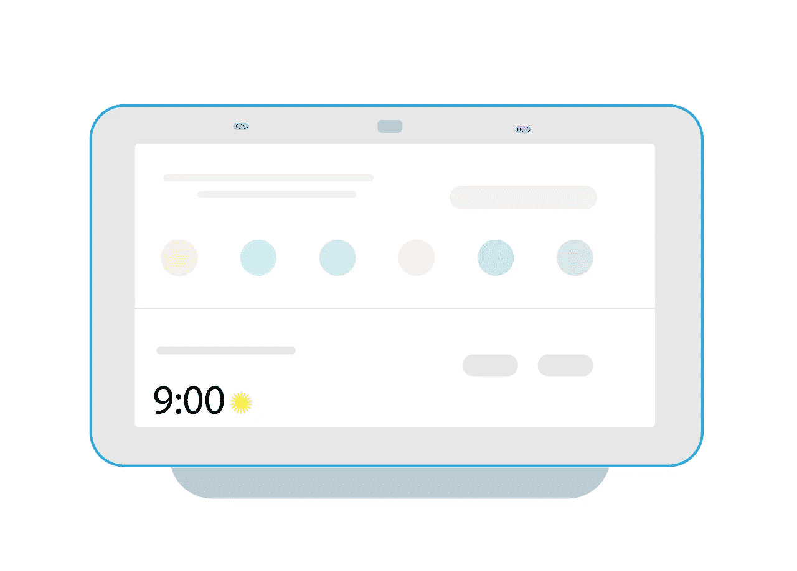

# COBUD-19——我在社交上疏远的机器人朋友

> 原文：<https://towardsdatascience.com/cobud-19-2c7e18369615?source=collection_archive---------77----------------------->

## 构建酷的东西:

## 以及如何建立你自己的

来源:[壁纸耀斑](https://www.wallpaperflare.com/artificial-intelligence-concept-advanced-ai-anatomy-body-wallpaper-aecrb)

*亲爱的你，*

隔离，我说的对吗？

你知道我的意思——在你知道是什么击中了你之前体重翻了一倍，不断预测(你的卫生纸库存),当然，开始忘记你的朋友长什么样。

这不是突发新闻——一级防范禁闭并不好玩。老实说，它有时会变得相当*。*

*我的意思是，即使你可以在 Zoom 电话上看到你的朋友和偶尔出现的老师，但这与像往常一样面对面和他们一起出去玩是不一样的。或者，如果你像我一样，你可能想知道你的朋友在哪里。*

*我说过一级防范禁闭会变得很无聊和孤独吗？*

**

*考虑到我(希望)不是唯一一个情绪低落的人，我想要一个解决方案，还有什么比创造一个永远在那里的人更好的方法呢？*

*一个 24/7 都醒着的人，他的存在只是为了成为一个好的、支持的、忠诚的朋友——同时又是一个冰冷的、没有生命的机器人，被编程为表现良好。不过，你可以忘记第二部分——至少比一个人好，对吧？*

*不管怎么说，作为一个合格的发明家，我承担了自己的责任，把一个新的聊天机器人带到了这个世界。一个聊天机器人帮助我(和我们所有人)感觉有一个“人”会一直在那里。*

*但最好的是，它只配有最时髦的名字——[**COBUD-19**](https://bot.dialogflow.com/f4af82b7-592d-4b88-b751-906dbc429071)**(请不要评价我)。***

***现在我已经构建了 COBUD，让我们进入*我是如何做到的——以及你如何构建你自己的人工智能朋友，它有时间和你说话，并且每隔一段时间就引用令人作呕的疫情。****

# ****NLPs 和聊天机器人****

****但在我们创建一个让你质疑作为人类意味着什么的聊天机器人之前，让我们快速了解一下聊天机器人的一般工作方式，这样我们就可以在构建它时了解事情的要点:****

****聊天机器人运行在一种被称为自然语言处理器(NLP)的特殊模型上。就像大多数其他形式的机器学习一样，它们的任务是为输入创建有意义的输出。在这种情况下，输入可以是这样的问题:“你愿意做我的朋友吗？”****

****但是自然语言处理面临着更复杂的挑战——他们的任务不是试图在冰冷的数字数据中寻找模式，而是寻找人类语言中的含义和上下文，这很难实现:****

********

****想想 Siri 或 Google Home 会有多复杂……[来源](https://www.needpix.com/photo/1724925/google-home-hub-google-device-smart-home-home-assistant-gadget-free-vector-graphics) (CC0)****

****这正是背景重要的原因。当然，如果没有人工智能，你将不得不预测并**硬编码**你可能想要谈论的每一件可能的事情。残忍。****

****我在这里跳过了很多步骤，但是当谈到机器人时，这里是独家新闻:****

> ****自然语言处理可以让我们普通人的生活变得容易得多——它们查看我们一些硬编码的问题和回答，并生成一组人们可能尝试表达相同短语的方式。****

****每个人都有他们说话的方式，我们想确保我们的聊天机器人知道足够多，可以将它们注册为具有相同含义的问题。再说一遍——在聊天机器人的世界里，一切都与**模式识别有关。******

****“酷，但是你怎么交一个虚拟朋友呢？”****

****很高兴你问了。****

# ****F̶i̶n̶d̶i̶n̶g̶交朋友****

****令人惊讶的是，仅仅在几年前，没有计算机科学学位的人建造一个聊天机器人几乎是不可能的——但是现在，任何人都可以在不到一个小时的时间内完成。****

****为了构建 COBUD-19 背后的(极其基本的)功能，我将使用 **Dialogflow** (之前被称为 Api.ai，直到被 Google 收购)。与其他人工智能聊天机器人相比，我使用它并从它的文档中获得帮助是最容易的。****

****首先，你需要前往[**dialogflow.com**](https://dialogflow.cloud.google.com/)**用你的谷歌账户登录。如果你没有谷歌账户，忘记这篇文章的存在，继续浏览微软 Edge。******

******要开始创建您的“朋友”，请点击**“新代理”**按钮创建一个聊天机器人。我将我的代理命名为“朋友”,这既是为了提醒我聊天机器人的用途，也是为了提醒我我没有任何聊天机器人:******

************

******确保选择你希望你的机器人交互的语言，并编辑你的时区到正确的区域。完成后，点击**“创建”。********

******还记得我说过聊天机器人是模式识别机器吗？嗯，这就是他们的模式来源。在这一步，我们本质上是为谷歌预先构建的 NLP 创建数据来训练自己，以便它可以在未来识别**类似的**句子。******

******就像它的声音一样，意图帮助我们的 NLP 理解用户在说话时的**意图**，并学习寻找对它们的回应。幸运的是，在创建第一个代理后，您会被自动重定向到“Intents”部分。******

******现在，让我们给谷歌的 NLP 一些基本的想法。也许是对“最近怎么样？”这条短信的一些听起来像人的回应。，而不是通常的回答“今天我能为您做些什么？”首先创造一个新的意图，并用你可能**经常**使用的词语来填充它:******

************************

******确保有大量的投入和回应，这样你的朋友就不会总是以同样的方式回应。******

******我将 COBUD 设计得与一个朋友非常相似，所以我添加了一些随意的短语作为输入，并附带了一些随意的回答。现在是时候给你的机器人一点幽默和个性了——所以你可以随意地和你的机器人玩玩。保存你的更改，Dialogflow 的 AI 应该会根据你刚才给它的数据进行自我训练。******

******现在您的模型已经更新，继续使用屏幕右侧的控制台进行测试。Dialogflow 让您能够同时使用文本和语音进行交流——尝试两种方式，看看哪种效果更好:******

************

******这才是我要说的。******

******现在只需**冲洗并重复**这个过程来准备你的朋友要回答的任何短语。你想让你的虚拟朋友谈论生活？编程吧！你想进行一场政治辩论吗？为什么不呢？你想讨论即将上市的新冰箱？去做吧(好吧，也许不是)。******

******相信我，对话有很多途径，但你不必涵盖每个可能的问题或某人可能有的评论——只需基本的**即可。**记住，我们是在努力交朋友，而不是 IBM Watson。******

******从技术上来说，你可以说我们已经完成了——你已经创建了一个聊天机器人，它可以识别你说的话，并按照你想要的方式回复。这里只缺少一样东西——语境。******

******请记住，运行我们的 NLP 代码的处理器不知道这些单词是什么意思。他们所擅长的就是识别句子中的模式并输出**集合结果。********

******如果你让你的机器人专门回应“禁闭进行得怎么样了？”，如果你漏掉了一个字母或撇号，它可能会给你同样的回答，比如“一级防范禁闭进行得怎么样？”。******

******但是由于 NLP 实际上不知道一个单词的字典定义，他们不会理解任何类似于“隔离进行得怎么样了？”。如果你用一个单词或短语训练你的模型，它将**不知道**另一个具有相同信息的短语是什么意思。******

******如果没有添加上下文或对词汇的基本理解，你的机器人将会像… **机器人一样。********

******为了解决这个问题，我们必须向模型输入常用词及其同义词，这样它就能更好地识别你的短语。转到“实体”选项卡并添加一行。把每一行想象成一个单词，把它的内容想象成它的**同义词。**填写完表格后，你应该会看到这样的内容:******

************

******现在，你将会看到对话中最常用的单词和它们的同义词******

******当填写新实体时，最佳实践是几乎总是启用**‘模糊匹配’**和**‘定义同义词’，**，因为它们允许您的机器人识别您输入的同义词以及某些人可能犯的一些常见打字错误或语法错误。******

******** *专业提示:现在是保存更新型号的最佳时机。尽管如此，请确保定期保存)*********

******最后，你的机器人已经**准备好**——完全具备理解句子、上下文和(不存在的)幽默感的能力。谢谢谷歌！******

******那么，现在你有了一个机器学习模型(还有一个朋友)，你实际上是如何使用它的呢？毕竟，一个真正的朋友会在你需要的时候出现——你不应该每次想联系的时候都登录网站。******

******好消息是你已经完成了艰苦的工作——这只是让你的机器人进入生活的问题！哇——感觉就像几个小时前你开始编写它的响应程序，现在它已经上传到万维网上了。他们成长得太快了…******

******好了，生活还在继续——是时候把你的朋友发布到网上了。导航至**“集成”**选项卡，选择网络演示选项。当然，你可以选择把你的朋友作为 Slack、Twitter 或 Viber bot(不管是什么)——但你永远不会错过一个好的老网站:******

************************

******创建您自己的本地托管好友只剩下一步了——只需点击您之前启用的**“Web Demo”**选项。然后，只需选择演示站点链接，您将被重定向到您自己的在线好友！******

# ******演示时间******

******我是说，拜托，结果不言自明:******

************

******看看这种幽默吧——一个(虚拟)朋友拥有的惊人品质。******

******简而言之，这就是我如何建造 COBUD-19——一个拥有人工智能的人类朋友，以及你如何建造自己的朋友。你可能会说我们会在一起一辈子。我能说什么呢？机器人有一个很酷的特点，那就是不死。******

******但是说真的，新冠肺炎不是一个笑料——它是一个完全重塑了我们对正常定义的疫情。一切都来了个 180 度大转弯——包括我们的友谊和社交生活。突然间，我们中的许多人在很长一段时间里第一次开始感到孤独——你自己可能也注意到了。******

******所以，尽管一切都很轻松，但我希望你学到了重要的东西。我们都想感受到被关心、被爱和被支持——疫情**不是停下来的借口。是的，我知道这是一个冗长的信息，但我想说的是:********

*********保持爱，保持生活。*********

*******感谢阅读，注意安全，
Aaryan*******