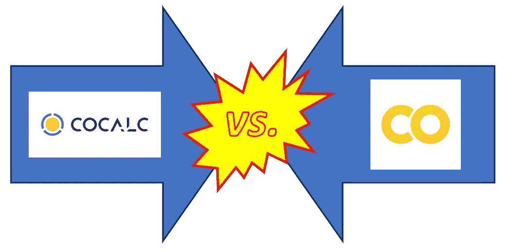
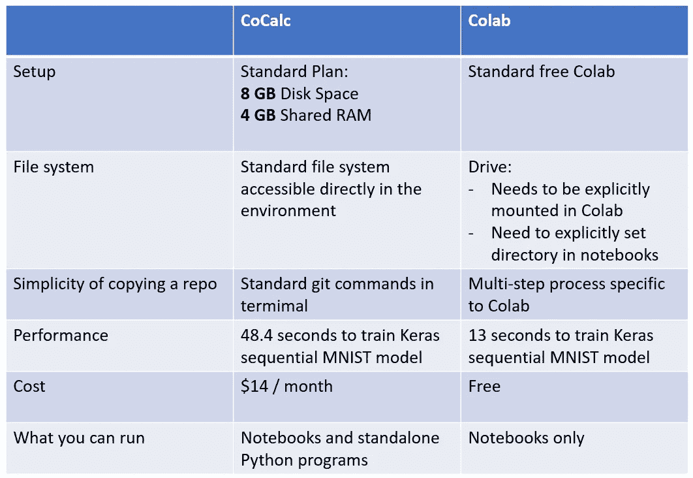

# CoCalc 与 Colab——哪一个更适合实践研讨会？

> 原文：<https://towardsdatascience.com/cocalc-vs-colab-which-is-better-for-a-hands-on-workshop-bb6261e2498?source=collection_archive---------44----------------------->


作者照片

我最近有机会举办了一个关于培训 Keras 深度学习模型的实践研讨会。这个研讨会是我为当地会议[所做的一个会议的后续，该会议回顾了我即将为曼宁出版社出版的书](https://aigeeks.org/home)[中的内容](https://www.manning.com/books/deep-learning-with-structured-data)。在介绍性会议之后，与会者有兴趣参加实践会议，在实践会议上，与会者将能够通过培训培训书中介绍的深度学习模型之一的过程进行工作。

## 深度学习模型培训研讨会的选项

我对交付一个关于培训深度学习模型的实践研讨会的前景感到兴奋。我曾参与在 [2018](https://dl.acm.org/doi/10.5555/3291291.3291358) 和 [2019](https://www.idug.org/e/in/eid=87&s=4615&print=1&req=info) 举办介绍性机器学习训练营，但我从未举办过以深度学习为特色的研讨会。我需要一个让研讨会参与者用来训练深度学习模型的环境，我看到有三个选项:

1.  在本地安装的 Python 实例上运行
2.  使用 [**CoCalc**](https://cocalc.com/) ，这是一个专门为数据科学培训设计的基于云的环境
3.  使用[**Colab**](https://colab.research.google.com/notebooks/intro.ipynb)(Google co laboratory)，一个功能齐全的笔记本环境

我的深度学习研讨会的参与者将处于各种不同的水平，其中一些人迈出了机器学习的第一步，另一些人已经训练了深度学习模型。研讨会计划进行 3 个小时，我希望参与者将大部分时间花在深度学习模型训练的实验上，所以我需要一个可以在最少摆弄的情况下设置的环境。考虑到这一点，我放弃了选项 1。要让所有参与者都在本地安装了适当级别的 Python 实例，并设置了所有适当的库，这需要的时间太长了。



## CoCalc 和 Colab 的比较

我要考虑两个竞争者:CoCalc 和 Colab。我选了哪一个参加研讨会？我会在文末透露我的选择。首先，让我们看看本次研讨会最重要的标准中竞争者的优缺点:

**成本**:因为实践研讨会是由 meetup 赞助的，对参与者只收取象征性的费用，这意味着成本是一个考虑因素。虽然 CoCalc 提供免费试用，但这种服务不适用于 workshop，因为它不允许从项目内部访问互联网，因此 workshop 参与者不可能方便地将 workshop repo 复制到他们的环境中。适用于研讨会的最低 CoCalc 环境是 14 美元/用户/月。相比之下，Colab 的标准免费访问拥有研讨会所需的一切。

**整体的简单性**:除了下一个要点中描述的文件系统的不同，Colab 与 CoCalc 相比还有一些额外的特点。例如，将 repo 复制到 CoCalc 中就像在 CoCalc 提供的标准终端中运行这些 git 命令一样简单:

```
git init
git remote add origin [https://github.com/ryanmark1867/dl_structured_data_hands_on](https://github.com/ryanmark1867/dl_structured_data_hands_on)
git pull origin master
```

相比之下，要将回购复制到 Colab 中，需要以下步骤:

1.  通过运行以下命令在笔记本中安装 [Google Drive](https://www.google.com/drive/using-drive/) ，然后按照步骤获取 Drive 的访问代码，然后将访问代码粘贴到该单元格生成的输入字段中。

```
from google.colab import drive
drive.mount('/content/gdrive')
```

2.将您要复制的目录存储到您的当前目录中:

```
%cd gdrive/My Drive/dl_june_17
```

3.克隆回购:

```
! git clone https://github.com/ryanmark1867/dl_structured_data_hands_on.git
```

为研讨会克隆回购是研讨会的关键先决条件，因此 Colab 在这一步的复杂性无疑是对它的一个打击。

**文件系统** : CoCalc 有一个完全集成到开发环境中的简单文件系统。Colab 奇怪的文件系统设置是它的致命弱点。Google Drive 充当了 Colab 的文件系统，虽然它是一个像 Colab 一样的 Google 产品，但它与 Colab 的集成很弱。一旦我将 workshop repo 复制到 Drive 中，我发现在 Drive 中导航到我想要的笔记本并从那里在 Colab 中打开它是最容易的。从 Colab 开始，如何导航到驱动器中的特定文件并不直观。

**性能**:在 MNIST 的一个简单的 Keras 模型上运行 5 个时期的训练，在 Colab 上运行需要 12 到 13 秒。在 CoCalc，同样的训练要花三倍多的时间。CoCalc 在 MNIST 模型训练中的较慢性能并不是一个大问题，但对于研讨会的主要部分(根据我的书训练街车延迟预测模型)，一个典型的 50 个时期的运行在 Colab 中需要 6 分钟，在 CoCalc 中需要 30 分钟或更长时间，假设 CoCalc 没有因内存不足而崩溃。

**访问 GPU**:CoCalc 不提供对 GPU 的访问。Colab 在先到先得的基础上提供对 GPU 和 TPU 的访问。事实证明，我的研讨会中的模型训练练习并没有从 GPU 中受益，但让参与者选择在深度学习训练运行中尝试 GPU 仍然是有用的。

**你能运行什么** : Colab 是严格针对笔记本的。事实上,《回购》一书中的 MNIST 模型训练示例是普通的 Python 文件。我需要将这些例子转换成笔记本，然后才能在 Colab 中运行它们。相比之下，CoCalc 允许您运行普通的 Python 文件以及笔记本。

下表总结了 Cocalc 和 Colab 之间的比较:



CoCalc 与 Colab 对比摘要

## 结论

考虑到 CoCalc 和 Colab 的利弊，我应该选择哪一个来参加研讨会呢？我最终选择了 **Colab** 有两个原因:

1.  虽然 CoCalc 在简单性方面比 Colab 有优势，但它在训练电车延迟预测模型(研讨会的一个关键目标)方面的较慢性能是一个阻碍。由于整个研讨会只有 3 个小时，我无法负担参与者花费半个小时或更多的时间用 CoCalc 进行一次 50 时代的训练。
2.  尽管 Colab 有些古怪，但它是一个标准环境，我希望研讨会参与者在研讨会结束后会反复使用它。因此，他们在研讨会期间为解决 Colab 的怪癖而投入的时间是值得的，因为他们可以在将来将这一经验应用到其他项目中。另一方面，CoCalc 实际上是为培训用例优化的，我不期望任何人在正在进行的项目工作中使用它。

虽然我为这个深度学习研讨会选择了 Colab，但 CoCalc 提供了不错的性价比，我会考虑将其用于不需要深度学习的机器学习研讨会。

我在 2020 年 6 月中旬交付了工作坊，进行得很顺利。参与者能够对深度学习模型进行训练运行，并对各种超参数进行实验，以观察它们对训练运行的影响。感谢[人工智能极客](https://aigeeks.org/home)聚会的组织者，特别是 Dragos Ionel，给我这个机会来举办这个研讨会。

以下是与本文相关的一些附加资源:

*   [研讨会视频](https://www.youtube.com/watch?v=86EIoRlQgOE&feature=youtu.be)
*   [车间回购](https://github.com/ryanmark1867/dl_structured_data_hands_on)
*   [针对深度学习模型培训研讨会参与者的 Colab 设置说明](https://github.com/ryanmark1867/dl_structured_data_hands_on/blob/master/docs/Prep%20Instructions%20for%20June%2017th%202002%20AIGeeks%20Hands-on%20Session.pdf)
*   [2020 年 4 月原始深度学习结构化数据演示视频](https://www.youtube.com/watch?v=Jhz88pac7Cg&feature=youtu.be)
*   [CoCalc 现场环境对比](https://cocalc.com/doc/compare.html)
*   更多[细节](https://www.manning.com/books/deep-learning-with-structured-data)关于作为研讨会基础的结构化数据深度学习的书籍